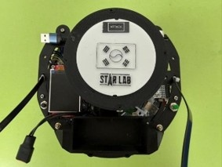
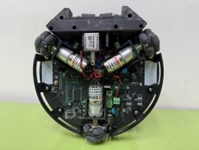
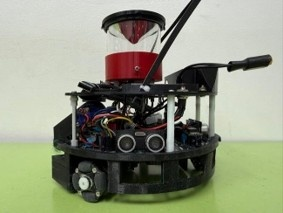
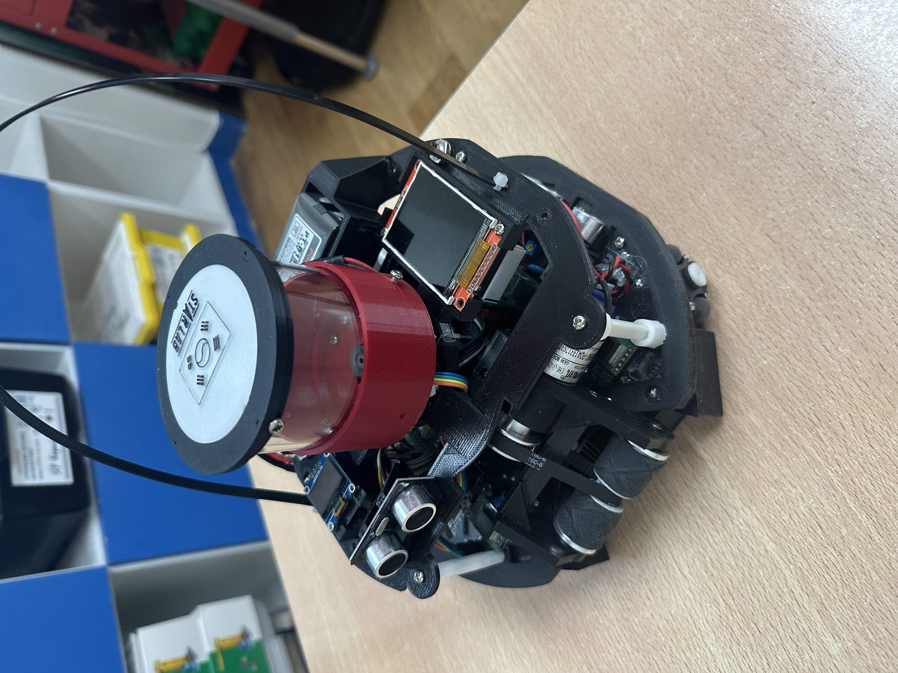
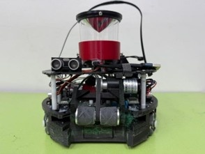
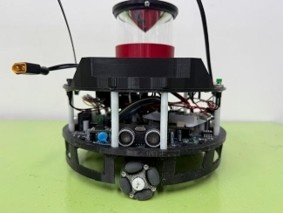
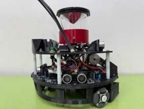
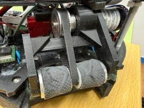
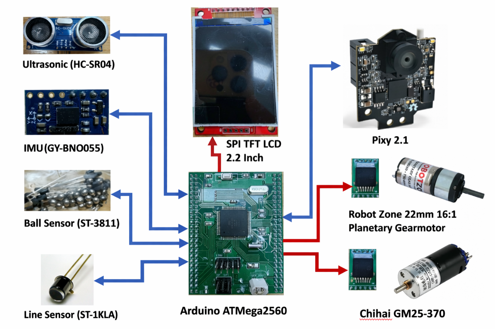
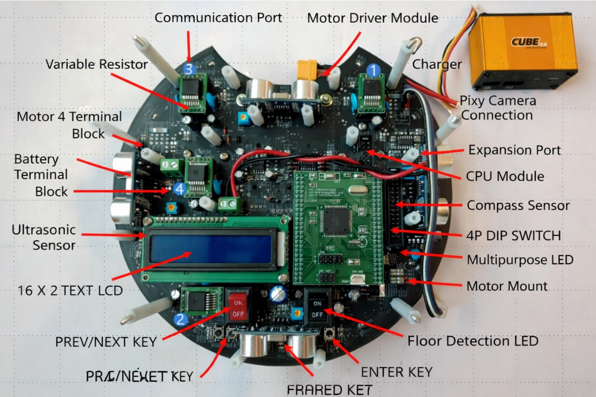

## Timestamp

*Tijdstempel*

7-6-2026 11:25:38

## Email Address

*E-mailadres*

ckhpie@gmail.com

## TDP File

*TDP File Upload (Not required)*

[https://drive.google.com/open?id=1ABKYA8OdLLYhVLWwdhcZxtWaexe5EUAy](https://drive.google.com/open?id=1ABKYA8OdLLYhVLWwdhcZxtWaexe5EUAy)

## Team Name

*What is your team's name?*

ARK

## League

*What league do you participate in?*

IR League

## Country

*Where are you from?*

Republic of Korea

## Contact

*If other teams have questions about your robot, now or in the future, what email address(es) can we publish along with this document for people to reach you?

(You can put in multiple email addresses, like multiple team members, an email for the whole team or both. Feel free to share other ways of communication like Discord handles)*

teamarksoccerlw@gmail.com

## Social Media

*Team Social Media Links (if you have any)*

team_ark_kr(instargram)

## Team Photo

*Upload a photo of your whole team with your mentor and robots

Note: This is not mandatory and will be published along with your TDP if you choose to upload something*

## Members & Roles

*What are the names of the team members and their role(s)?*

Hong Siwoo: Team Leader and Schedule Management
Choi Kyuhyun: Team Strategic Planning
Yeo Injun: Creation of Various Documents

## Meeting Frequency

*How often did your team meet?
(e.g. 90 minutes once per week or a day every weekend.)*

5 hours once a month

## Meeting Place

*Where did you meet to work on your robot?
(e.g. a robotics room at school, at some other place, one of your homes, school library etc.)*

Starlab Yongin Programming Academy

## Start Date

*When did your team start working on this year's robot?*

Second week of January

## Past Competitions

*Which RoboCupJunior competitions have you competed in and in which leagues?*

Robocup Junior Asia Pacific 2023 In PyeongChang : Soccer Lightweight
Robocup Junior 2024 Korea Open : Soccer Lightweight
Robocup Junior 2024 Australia Open : Soccer Lightweight
Robocup Junior 2025 Korea Open : Soccer Lightweight
Robocup Junior Asia Pacific 2025 In Abu Dhabi : Soccer Infrared

## Mentor Contribution

*Which parts of your work received the most contribution from your mentor?*

We had difficulty devising an algorithm for defensive neutrals, and our mentor helped us with this.

## Workload Management

*How did you manage the workload?*

We communicated using KakaoTalk, and divided roles and provided feedback together through GitHub and code reviews.

## AI Tools

*Which AI tools did you use?*

None

## Robot1 Overall

*Robot 1 Overall View*

## Robot1 Front

*Robot 1 Front view*

## Robot1 Back

*Robot 1 Back view*

## Robot1 Top

*Robot 1 Top View*

## Robot1 Bottom

*Robot 1 Bottom View*

## Robot1 Right

*Robot 1 Right View*

## Robot1 Left

*Robot 1 Left View*

## Robot2 Overall

*Robot 2 Overall View*

## Robot2 Front

*Robot 2 Front view*

## Robot2 Back

*Robot 2 Back view*

## Robot2 Top

*Robot 2 Top View*

## Robot2 Bottom

*Robot 2 Bottom View*

## Robot2 Right

*Robot 2 Right View*

## Robot2 Left

*Robot 2 Left View*

## Mechanical Design

*How did you design the mechanical parts of your robots?*

Most of the design for the machine structure was done on “thinkercad.com,” and a lot of time and effort was required to manufacture it using a 3D printer, test it, identify problems, and then modify and remanufacture it.

## Build Method

*How did you build your design?*

모든 장치는 "크리에이티브 엔더 3 SE" 3D 프린터를 사용하여 제작되었으며, 장착 위치와 용도에 따라 PLA, ABS, TPU 등 다양한 필라멘트를 사용했습니다. 또한, 3D 프린터로 제작할 수 없는 부품은 주로 "알리익스프레스"에서 구매했습니다.

## Motors & Reason

*How many motors have you used and why?*

We used three “Robot Zone 22mm 16:1 Planetary Gearmotor 730rpm” motors for each robot to enable movement. When four motors are used on uneven ground, one wheel may fail to make full contact with the floor, causing unstable operation. By using three motors, however, all wheels remain in contact with the surface, allowing the robot to move smoothly and reliably.

## Kicker Design

*If your robot has a kicker, explain how you designed and built the mechanics of the kicker*

We installed a “TAU-0826B 6V” solenoid and designed it to operate at 12V, enabling it to strike the ball with greater force. This setup allows for stronger and more effective performance compared to running it at the nominal 6V.

## Dribbler Design

*If your robot has a dribbler, explain how you designed and built the mechanics of the dribbler.*

We used a “Chihai GM25-370 4.4:1 5000rpm” motor and built it with a 2:1 belt drive system, allowing the ball to spin at approximately 10,000rpm. This design enables higher rotational speed and more effective ball control

## CAD Files

*CAD design files*

## Mechanical Innovation

*Mechanical Innovation*

드리블러 제작 과정에서 2:1 벨트 구동 시스템이 사용되었으며, 회전 마찰을 최소화하기 위해 회전축에 베어링이 장착되었습니다.

## Mechanical Photos

*Photos of your mechanical designs highlights*

## Electronics Block Diagram

*Provide us with a block diagram of your robot's electronics*

## Power Circuit

*How does your power circuits work?*

The system was configured with 3.3V, 5V, and 12V to supply appropriate voltage to each component.

## Motor Drive Circuit

*How do you drive your motors? Explain the circuits you use for that*

“Robot Zone 22mm 14:1 Planetary Gear motor 730rpm” motors were placed at the 2 o'clock, 6 o'clock, and 10 o'clock positions.

## Microcontroller & Reason

*What kind of micro controller or board do you use for your robot? Why did you decide to use this part for your robot? If you have more than 1 processor, explain each one separately.*

We used an Arduino ATMega2560 because it has many port

## Motor Control

*How do you use your processor to move your motors?*

We controlled the motor using two GPIO pins of the processor, applying forward rotation, reverse rotation, and braking.

## Ball Detection

*How does your ball detection sensors and/or camera[s] work?*

The location of the sensor with the largest value among the 12 IR Seeker values was recognized as the location of the ball, and the ball was moved to that area.

## Line Detection

*How does your line detection circuits work?*

Four phototransistors (ST-1KLA) (at the 0, 3, 6, and 9 o'clock positions) were placed on the floor so that even if only one of the four is detected, it is determined that the line has been detected and the line is avoided.

## Navigation/Position Sensors

*What sensors do you use for navigation and how are these sensors connected to your processor? What sensors do you use to find your position in the field? What about the direction your robot faces?*

The robot's current position was determined using camera coordinates, and its speed was controlled according to the position.

## Kicker Circuit

*How do you drive your kicker system? How does the circuit make the kicker work?*

We installed a “TAU-0826B 6V” solenoid and designed it to operate at 12V, enabling it to strike the ball with greater force. This setup allows for stronger and more effective performance compared to running it at the nominal 6V.

## Dribbler Circuit

*How does your dribbler system work? What components and circuits did you use to drive it?*

We used a “Chihai GM25-370 4.4:1 5000rpm” motor and built it with a 2:1 belt drive system, allowing the ball to spin at approximately 10,000rpm. This design enables higher rotational speed and more effective ball control

## Schematics

*Schematics of your robot*

## PCB

*PCB of your robot*

## Electronics Innovation

*Electronics Innovations*

The robot's position was determined using a camera, and the arena was divided into 12 zones so that the robot would operate differently depending on which zone it was in.

## Circuit Photos

*Photo of your circuit boards highlights*

## Ball Detection Method

*How do you find where the ball is? How do you read the data from the ball detection sensors and/or camera?*

IR Seeker (ST-3811) was placed in 12 directions, and it was determined that the ball was located in the direction where the largest value was detected.

## Ball Catch Algorithm

*How does your algorithm work to catch the ball? Is there a difference between your robots in how they move towards the ball? Explain the differences.*

When the ball is located behind, it is made to rotate around the ball, and when it is in front, the distance to the ball is determined based on the IR value. As the ball approaches, the speed is decelerated to prevent the ball from bouncing out of the capturing zone.

## Positioning Algorithm

*How do you use your sensors in your algorithm to find your position inside the field and how do you use that position to move your robots around?*

Using a camera, the ground was divided into 12 zones, and the movement speed and movement method were implemented separately depending on the current zone.

## Line Algorithm

*How does your robot find the lines to stay inside the field? What algorithms do you use to avoid going out of bounds?*

In addition, it automatically controls the speed based on the location detected by the camera to minimize collisions with walls, and ensures that it does not go outside the playing field by moving to the center of the field when a line is detected.

## Goal Algorithm

*What algorithms do you use to score goals? How do you use your kicker and dribbler to handle the ball?*

When the ball is within the capturing zone and in our territory, the robot is made to move quickly toward the opponent's goal and attempt a shot at a specific location and time using a Solenoid. Additionally, if the opposing robot interferes with the robot's movement and there is no movement for more than 3 seconds, a turning shot is performed.

## Defense Algorithm

*What algorithms do you use to avoid the opponent team scoring? How do your robots defend your own goal?*

A separate function was implemented for the goalkeeper to find an appropriate position based on the distance from the ball and obstruct the goal, and to quickly knock the ball away when it is close to the goalkeeper or to block the path so that the opposing robot cannot approach.

## Robot Communication

*Do your robots communicate with each other? How do you use this communication to your advantage?*

Each robot moves independently without communication with other robots.

## Software Innovation

*Software Innovations*

1.	The robot's position was determined using a camera, and the arena was divided into 12 zones so that the robot would operate differently depending on which zone it was in.

## GitHub Link

*GitHub link*

https://github.com/ScienInStarlab/TeamARK

## BOM

*Bill of Materials (BOM)*

[https://drive.google.com/open?id=1LRY6qJkhcjrt3dTEF3q6m0hB_XUKq60W](https://drive.google.com/open?id=1LRY6qJkhcjrt3dTEF3q6m0hB_XUKq60W)

## Cost

*How much did it cost you to build your robots?*

Robots : 552.82 Euro each
Experiments : 1658.45 Euro
Environment : 221.13 Euro

## Funding

*How did you gathered the funds to build the robots?*

About 20% sponsors
About 80% parents

## Affordability

*How affordable was it to compete in RoboCupJunior Soccer?*

5

## Answer Check

*Have you checked all of your answers?*

Yes!

## Publication Consent

*We publish TDPs and posters during or after the competition as described in the beginning*

Yes, we acknowledge everything submitted in the above form can be published.

