## Timestamp

*Tijdstempel*

29-6-2026 13:44:28

## Email Address

*E-mailadres*

holtomy12@gmail.com

## TDP File

*TDP File Upload (Not required)*

## Team Name

*What is your team's name?*

Bodensee Adler

## League

*What league do you participate in?*

Vision League

## Country

*Where are you from?*

Germany

## Contact

*If other teams have questions about your robot, now or in the future, what email address(es) can we publish along with this document for people to reach you?

(You can put in multiple email addresses, like multiple team members, an email for the whole team or both. Feel free to share other ways of communication like Discord handles)*

tim.haider@markdorf-robotics.de
nils.jager@markdorf-robotics.de
bodensee.adler.rag@gmail.com

## Social Media

*Team Social Media Links (if you have any)*

instagram.com/bodensee_adler/
markdorf-robotics.de

## Team Photo

*Upload a photo of your whole team with your mentor and robots

Note: This is not mandatory and will be published along with your TDP if you choose to upload something*

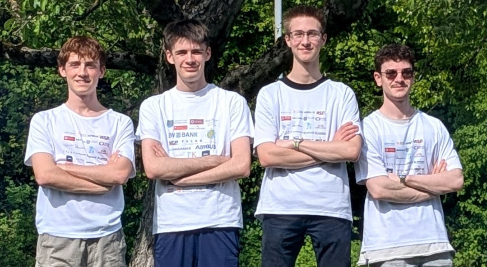

## Members & Roles

*What are the names of the team members and their role(s)?*

Nils Jager: Software, Electronics & Mechanics
Pascal Gärtner: Camera Recognition & Positioning
Niklas Wolpert: 3D Design & Mechanics
Tim Haider: Software & Strategy

## Meeting Frequency

*How often did your team meet?
(e.g. 90 minutes once per week or a day every weekend.)*

6h every week, plus 8h per day during holidays and as much as possible before competitions.

## Meeting Place

*Where did you meet to work on your robot?
(e.g. a robotics room at school, at some other place, one of your homes, school library etc.)*

Mostly in our robotics club rooms and on weekends or holidays at the homes of Nils Jager or Pascal Gärtner.

## Start Date

*When did your team start working on this year's robot?*

In august 2025

## Past Competitions

*Which RoboCupJunior competitions have you competed in and in which leagues?*

South German Open 2024: Rescue Line
German Open 2025: Rescue Line
South German Open 2025: 1v1 Soccer Lightweight League
German Open 2025: 1v1 Soccer Lightweight League
European Championship 2025 (Bari, Italy): 1v1 Soccer Lightweight League
South German Open 2026: 2v2 Soccer Vision League
German Open 2026: 2v2 Soccer Vision League

## Mentor Contribution

*Which parts of your work received the most contribution from your mentor?*

Dr. Heinzel organized the trips to competitions and took care of the paperwork.

## Workload Management

*How did you manage the workload?*

We use Whatsapp and Discord for comunication, YouTrack and a Discord server for assigning tasks and a self hosted Gitlab server for version control.

## AI Tools

*Which AI tools did you use?*

We used ChatGPT and Claude Code for debugging and research.

## Robot1 Overall

*Robot 1 Overall View*

## Robot1 Front

*Robot 1 Front view*

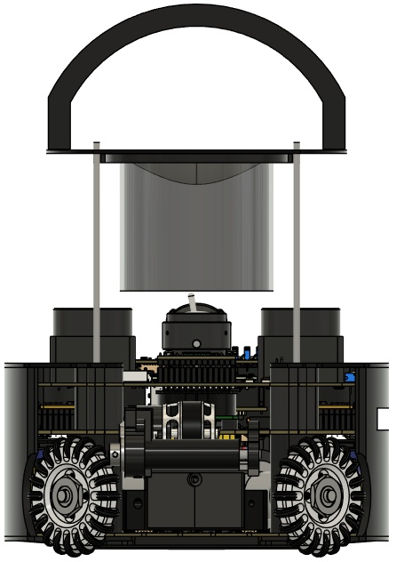

## Robot1 Back

*Robot 1 Back view*

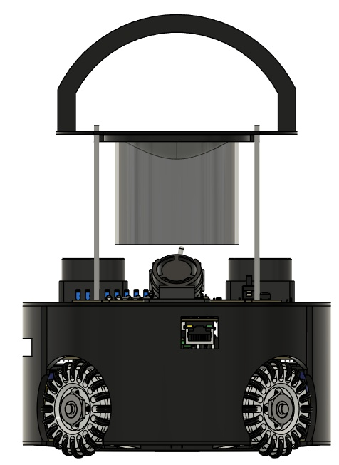

## Robot1 Top

*Robot 1 Top View*

## Robot1 Bottom

*Robot 1 Bottom View*

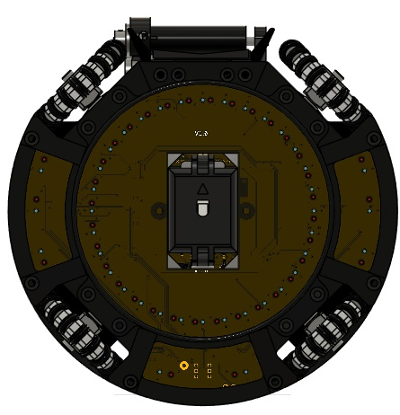

## Robot1 Right

*Robot 1 Right View*

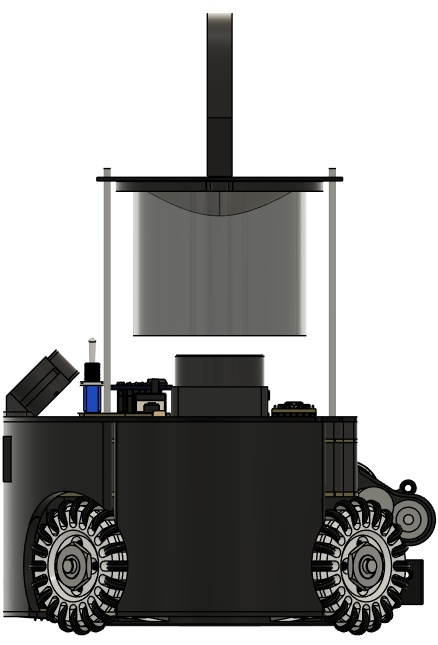

## Robot1 Left

*Robot 1 Left View*

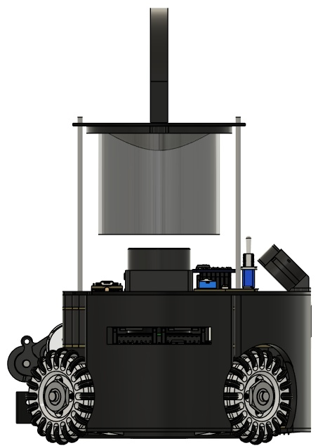

## Robot2 Overall

*Robot 2 Overall View*

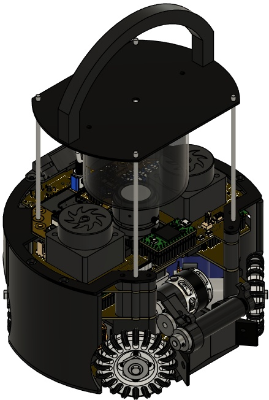

## Robot2 Front

*Robot 2 Front view*

## Robot2 Back

*Robot 2 Back view*

## Robot2 Top

*Robot 2 Top View*

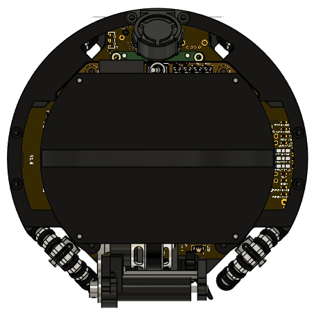

## Robot2 Bottom

*Robot 2 Bottom View*

## Robot2 Right

*Robot 2 Right View*

## Robot2 Left

*Robot 2 Left View*

## Mechanical Design

*How did you design the mechanical parts of your robots?*

For designing our robot we use Fusion360 and Eagle. During the development we tried to make the assembly as easy and fast as possible so we can swap broken components between matches. Another choice related to time efficiency is using two batteries so we can hotswap them without restarting the Raspi every single time. Furthermore we used several types of filament for different requirements, e.g. the dribbler gears produced enough heat to melt their mount printed with PETG so we switched to PC.

## Build Method

*How did you build your design?*

Structural parts: 3D-printed with either TPU, PETG or PC
Omniwheels: CNC-milled by a local partner
360° hyperbolic mirror: custom-made externally
PCBs: manufactured by JLCPCB
silicone dribbler rollers: cast in 3D-printed moulds and cured under vacuum

## Motors & Reason

*How many motors have you used and why?*

We use 4 Faulhaber 3216BXTH BLDC motors with planetary gearboxes, as an optimal balance between space and grip: 5 motors wouldn't fit and 3 couldn't provide enough grip. To improve the grip even further we sitched from O-profile to X-profile wheels for more contact area.

## Kicker Design

*If your robot has a kicker, explain how you designed and built the mechanics of the kicker*

First we bought several Solenoids from Tremba and tested the power to size ratio at different voltages. Then we took the best one and rewound it, using orthocyclic windings and a thinner wire. This allowed us to maximize the total amount of windings and therefore increase the power.

## Dribbler Design

*If your robot has a dribbler, explain how you designed and built the mechanics of the dribbler.*

We use gears which cause a lot of concentrated heat. To prevent the mount from melting we use PC filament. For achieving an optimal compromise between grip and durability we tested several types of silicone from Silikonfabrik with different stiffness. The motor is a AT208 drone motor from T-motor.

## CAD Files

*CAD design files*

https://github.com/jagersefriz/Bodensee-Adler-2vs2-Vision-2026-CAD

## Mechanical Innovation

*Mechanical Innovation*

We use a double LiDAR system to minimize our blind-spots so we can get an accurate position of the robot. With a mouse sensor we double check the position to reduce our margin of errors. To save us some time during testing we use two batteries which we can swap individually so we don't have to restart he Raspi and re-calibrate our sensors every single time.

## Mechanical Photos

*Photos of your mechanical designs highlights*

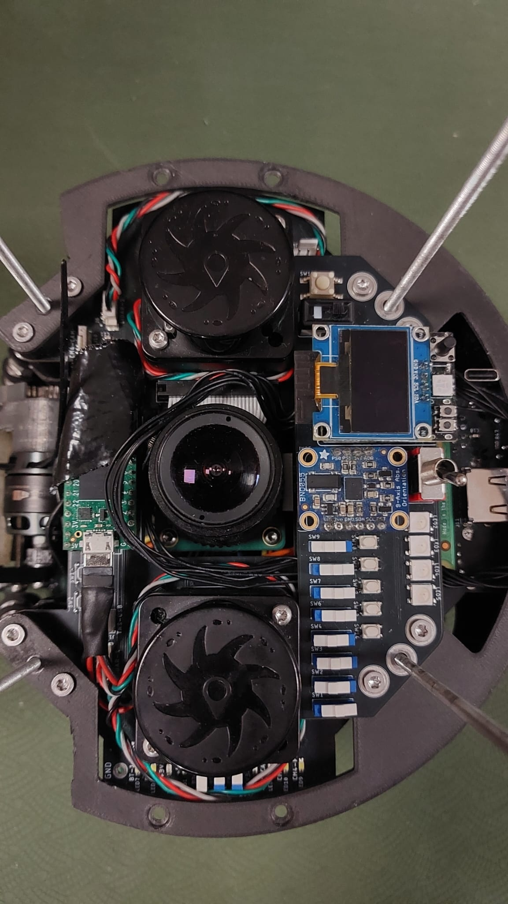

## Electronics Block Diagram

*Provide us with a block diagram of your robot's electronics*

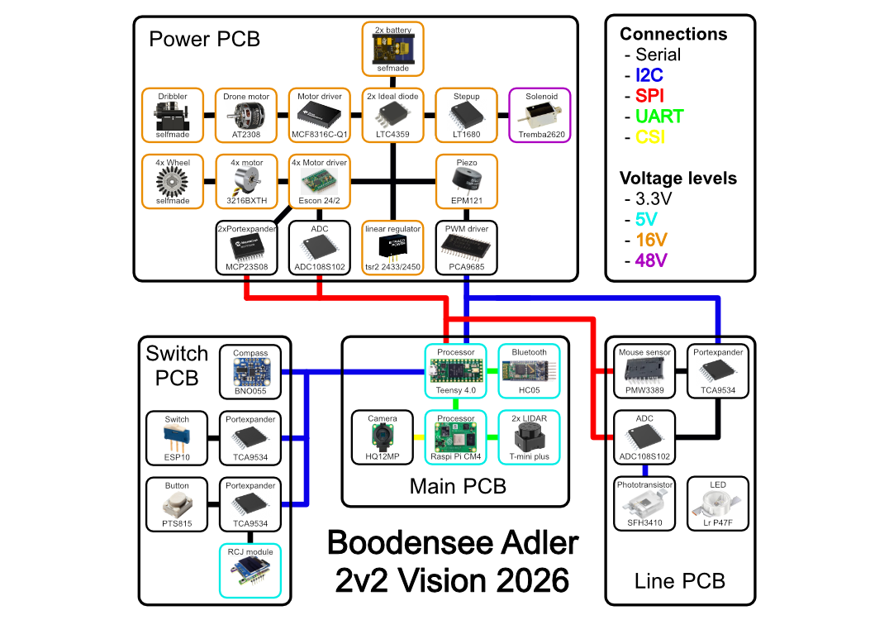

## Power Circuit

*How does your power circuits work?*

The robot is powered by two 14.8V batteries. Their outputs are combined through ideal diodes before reaching the regulation stage. Three linear regulators provide 3.3 V and two 5 V rails: one for the Raspberry Pi, and one for miscellaneous sensors. The kicker uses a boost converter to generate 48 V.

## Motor Drive Circuit

*How do you drive your motors? Explain the circuits you use for that*

Our Teensy outputs a digital signal for direction and a PWM signal for speed that gets converted to an analog signal via a series of resistors and capacitors. Both get measured by our Escon-24/2 motor drivers which then generates the necessary waveforms to drive our brushless motors.

## Microcontroller & Reason

*What kind of micro controller or board do you use for your robot? Why did you decide to use this part for your robot? If you have more than 1 processor, explain each one separately.*

For camera data processing we use a Raspberry Pi CM4, because it is rather cheap and has a small form factor. The main micro controller we use for converting sensor data into drive instructions is the teensy 4.0. It is really fast especially for its price and size, featuring an ARM Cortex-M7 at 600MHZ.

## Motor Control

*How do you use your processor to move your motors?*

We calculate the direction and speed for each motor depending on the drive angle and speed that we want to drive. Then we add a PID controller to maintain our desired orientation. The resulting speed and direction get sent to the motor drivers through a digital and a PWM signal.

## Ball Detection

*How does your ball detection sensors and/or camera[s] work?*

A raspiCam HQ 12mp is connected to our raspi CM4. The camera looks upwards into a hyperbolic mirror to get a 360° view. We use a python script with openCV to detect the ball. This data is sent to the teensy, where it is further processed.

## Line Detection

*How does your line detection circuits work?*

We power 40 LEDs and measure the reflected light using photo transistors. Their signal is filtered by a capacitor and then measured by an ADC unit from which we read the signal voltage with our Teensy. The white line tape reflects more light, causing a higher voltage, allowing us to detect the line.

## Navigation/Position Sensors

*What sensors do you use for navigation and how are these sensors connected to your processor? What sensors do you use to find your position in the field? What about the direction your robot faces?*

We determine our direction using a BNO055 IMU. Our position on the field is calculated by the Raspberry Pi, which processes the distance measurements from our two LiDAR sensors. Since the LiDARs have a relatively low update rate, we fill in the gaps using the PMW3389 mouse sensor. The PMW3389 is connected to the Teensy via SPI, while the LiDARs and Raspberry Pi communicate over UART.

## Kicker Circuit

*How do you drive your kicker system? How does the circuit make the kicker work?*

A boost converter charges multiple capacitors to 48V. The kicker is activated through an N-channel MOSFET. A flyback diode protects the circuit from voltage spikes generated when the kicker is switched off while a timer prevents the solenoid from being activated for extended periods.

## Dribbler Circuit

*How does your dribbler system work? What components and circuits did you use to drive it?*

We use a MCF8316C-Q1 BLDC motor driver to run our AT2308 drone motor that turns our silicone drum via three gears. In case the driver overheats we also have connectors for a common drone ESC.

## Schematics

*Schematics of your robot*

[https://drive.google.com/open?id=130DOFNU7VFP791uHSwNM1C-VMqczGkM-](https://drive.google.com/open?id=130DOFNU7VFP791uHSwNM1C-VMqczGkM-)
[https://drive.google.com/open?id=1cPAizJJ1KKEu9vHu2k1URiUJWz-3omOf](https://drive.google.com/open?id=1cPAizJJ1KKEu9vHu2k1URiUJWz-3omOf)
[https://drive.google.com/open?id=10r8JrqCyL_XXpkG3HoPZBzgUfY1l511r](https://drive.google.com/open?id=10r8JrqCyL_XXpkG3HoPZBzgUfY1l511r)
[https://drive.google.com/open?id=1ccQc4cQHzLbaEmv9sHu1tx38TA5CMANe](https://drive.google.com/open?id=1ccQc4cQHzLbaEmv9sHu1tx38TA5CMANe)

## PCB

*PCB of your robot*

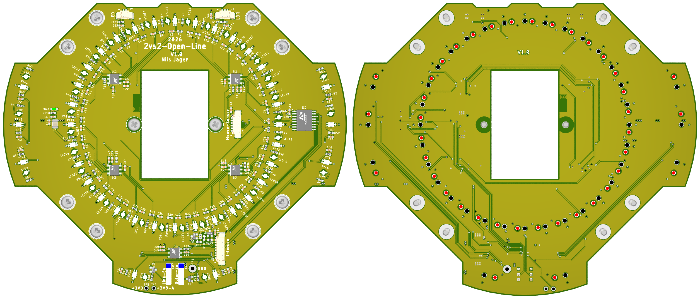
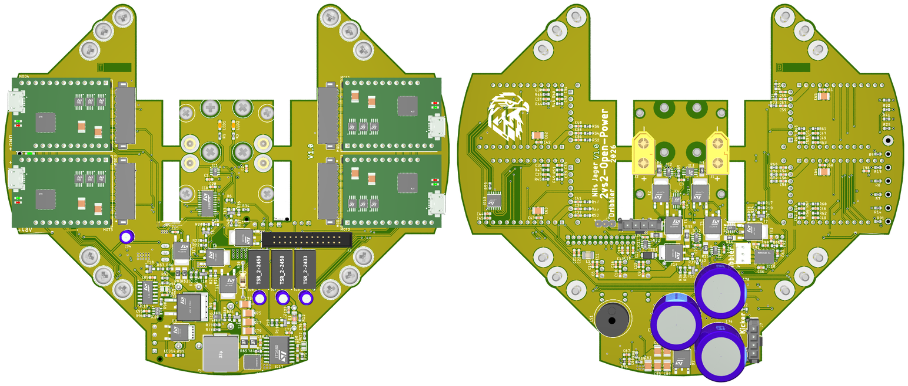
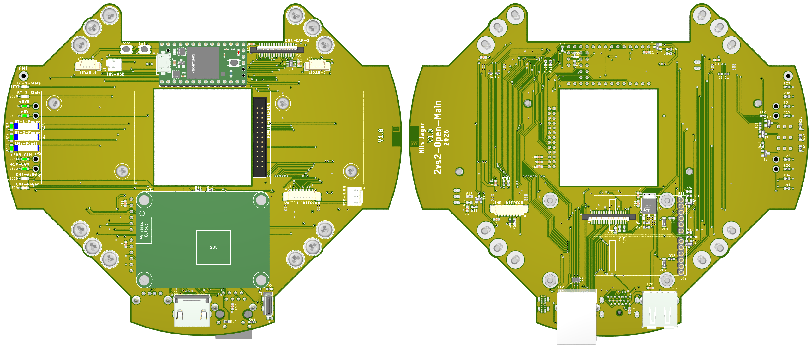
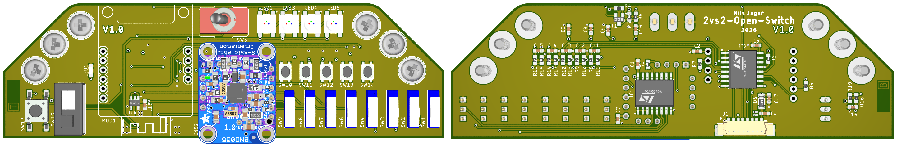

## Electronics Innovation

*Electronics Innovations*

Due to the limited available space, we designed a 6-layer PCB to fit all required electronics. The additional layers allow better power distribution, cleaner signal paths, and a more compact design. We also implemented an ideal diode circuit for our two-battery system, enabling efficient power switching while preventing current flow between the batteries.

## Circuit Photos

*Photo of your circuit boards highlights*

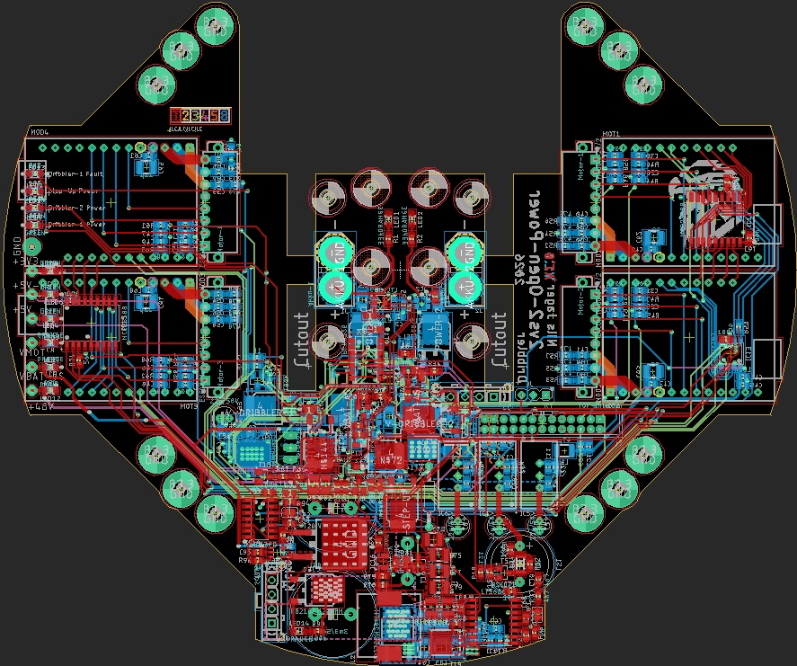

## Ball Detection Method

*How do you find where the ball is? How do you read the data from the ball detection sensors and/or camera?*

We use OpenCV to search for contours in a binary image filtered by hsv thresholds. We use a function that's fitted to the curvature of the mirror to calculate the distance to the robot. Since the center of the Robot is in the center of the image we can simply use atan2 to get the corresponding angle.

## Ball Catch Algorithm

*How does your algorithm work to catch the ball? Is there a difference between your robots in how they move towards the ball? Explain the differences.*

The robot steers toward the ball using its camera angle, adding a offset that grows as the ball nears, so it curves in to scoop it rather than kicking it away, all while a PID keeps it facing the goal and the dribbler holds the ball. 
Both robots share identical firmware; the only difference is role: the attacker chases the ball, the defender stays on its goal line and intercepts.

## Positioning Algorithm

*How do you use your sensors in your algorithm to find your position inside the field and how do you use that position to move your robots around?*

Using the BNO's heading we rotate the LiDAR scan to be axis-aligned, then measure the distance to all four walls. For each axis we check whether the two opposite distances sum up to the known field size within a small tolerance. With that information we can now drive to any given position on the field, by calculating the angle to that point using atan2, aswell as a distance for speed.

## Line Algorithm

*How does your robot find the lines to stay inside the field? What algorithms do you use to avoid going out of bounds?*

We compare the values of 40 sensors to their calibrated detection threshold. Then, we add the sine and cosine values of each active sensor and calculate the line angle using atan2(). Once a line is detected, we use the calculated angle to drive away from it. When driving over the line, the calculated angle points in the wrong direction, so we need to correct it to keep driving back into the field.

## Goal Algorithm

*What algorithms do you use to score goals? How do you use your kicker and dribbler to handle the ball?*

The robot always tracks the direction to the opponent's goal. When it reaches the ball it runs the dribbler to pull it into the front opening and hold it, then turns to face the goal using a PID. It fires the kicker only once the ball is secured and its heading is locked on the goal, so the shot goes off the instant it has a clean line; otherwise the kicker stays idle.

## Defense Algorithm

*What algorithms do you use to avoid the opponent team scoring? How do your robots defend your own goal?*

We use a dynamic role-switching system that assigns one robot the role of defender. The defender positions itself between the ball and the center of the goal. Additionally, we designed the defender to move away from the goal rather than remain directly in front of it. This allows the robot to obscure a larger portion of the goal, making it more difficult for the opponent to score.

## Robot Communication

*Do your robots communicate with each other? How do you use this communication to your advantage?*

Our robots communicate using an HC05 Bluetooth Module with a Bluetooth Classic connection. We send the positions of the robots, ball, and enemy to the other robot. This allows the use of a dynamic role switch based on both robots' and the ball's positions, allowing the best-positioned robot to attack. It also lets the defender defend the ball without seeing it, as long as its partner detects it.

## Software Innovation

*Software Innovations*

We are most proud of our dual LiDAR setup. We use two LiDAR sensors and fuse their data in our code to achieve more accurate position detection with less interference and fewer blind spots. This makes our positioning on the field more reliable.
Our most recent advancement is sharing the ball position via Bluetooth, which enables the defending robot to defend the goal even when the ball is not visible, as long as the other robot can see it.

## GitHub Link

*GitHub link*

https://github.com/jagersefriz/Bodensee-Adler-2vs2-Vision-2026-Software

## BOM

*Bill of Materials (BOM)*

[https://drive.google.com/open?id=1JIqYaoJZ72Kkg4TLzj7TRhmgjiltlYyu](https://drive.google.com/open?id=1JIqYaoJZ72Kkg4TLzj7TRhmgjiltlYyu)

## Cost

*How much did it cost you to build your robots?*

Robots: 6330€ together
Experiments: 50€
Environment: 10000€ including school equipment
1€ EUR = 1.16$ USD

## Funding

*How did you gathered the funds to build the robots?*

school: provides the rooms
sponsors: 80%
members: 20%

## Affordability

*How affordable was it to compete in RoboCupJunior Soccer?*

2

## Answer Check

*Have you checked all of your answers?*

Yes!

## Publication Consent

*We publish TDPs and posters during or after the competition as described in the beginning*

Yes, we acknowledge everything submitted in the above form can be published.

