## Timestamp

*Tijdstempel*

28-6-2026 11:02:40

## Email Address

*E-mailadres*

bohlebots.atlantis@gmail.com

## TDP File

*TDP File Upload (Not required)*

[https://drive.google.com/open?id=1Jqn4GvuFV6EPMjsVhCyGlh0tmtioHgJO](https://drive.google.com/open?id=1Jqn4GvuFV6EPMjsVhCyGlh0tmtioHgJO)

## Team Name

*What is your team's name?*

Bohlebots Atlantis

## League

*What league do you participate in?*

Vision League

## Country

*Where are you from?*

Haan, Germany

## Contact

*If other teams have questions about your robot, now or in the future, what email address(es) can we publish along with this document for people to reach you?

(You can put in multiple email addresses, like multiple team members, an email for the whole team or both. Feel free to share other ways of communication like Discord handles)*

bohlebots.atlantis@gmail.com

## Social Media

*Team Social Media Links (if you have any)*

bohlebots.atlantis (Instagram)

## Team Photo

*Upload a photo of your whole team with your mentor and robots

Note: This is not mandatory and will be published along with your TDP if you choose to upload something*

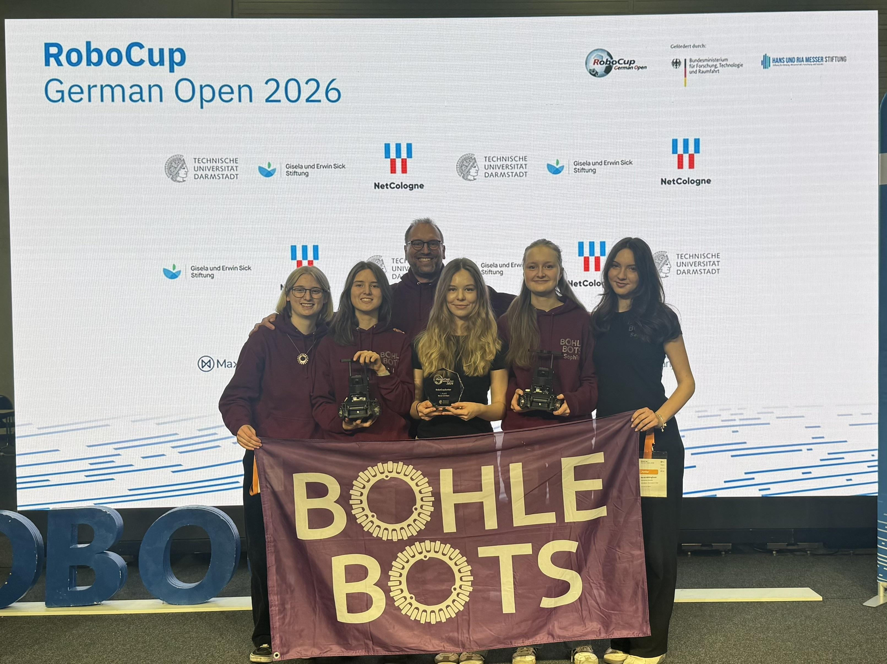

## Members & Roles

*What are the names of the team members and their role(s)?*

Annika Schmidt, software and camera system
Lisa Stiefel, hardware
Jil Hoppenhaus, software engineer and hardware
Sophia Kern, hardware

## Meeting Frequency

*How often did your team meet?
(e.g. 90 minutes once per week or a day every weekend.)*

We met 2–3 times a week for 3–4 hours. Before the championship, we worked almost every day in our workshop in Haan.

## Meeting Place

*Where did you meet to work on your robot?
(e.g. a robotics room at school, at some other place, one of your homes, school library etc.)*

We work in our workshop in Haan, provided by Bohle. AI image annotation was mainly done at home or at school.

## Start Date

*When did your team start working on this year's robot?*

Since Summer 2025, improved using past experience.

## Past Competitions

*Which RoboCupJunior competitions have you competed in and in which leagues?*

German Open 2024: 2vs2 Open League
European Championship 2024: 2vs2 Open League (vice champions)
German Open 2025: 2vs2 Open League (vice champions)
European Championship 2025: 2vs2 Open League
German Open 2026: 2vs2 Vision League (champions)

## Mentor Contribution

*Which parts of your work received the most contribution from your mentor?*

He partly supervised our breakout board PCB design, preventing costly mistakes, and supplied motors and drivers from workshop stock.

## Workload Management

*How did you manage the workload?*

We communicated through our WhatsApp group. We also used GitHub for code.

## AI Tools

*Which AI tools did you use?*

ChatGPT, Claude

## Robot1 Overall

*Robot 1 Overall View*

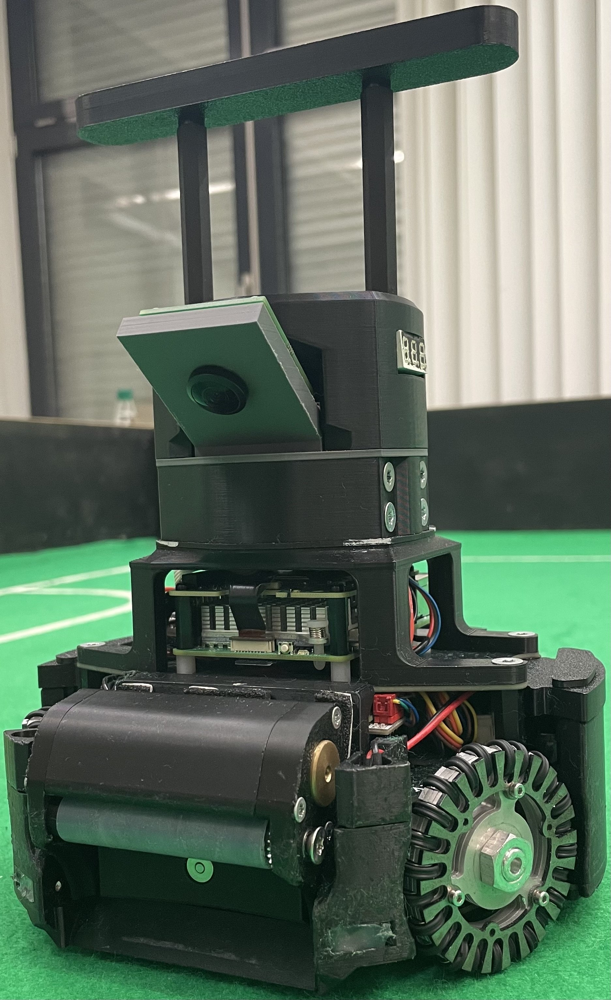

## Robot1 Front

*Robot 1 Front view*

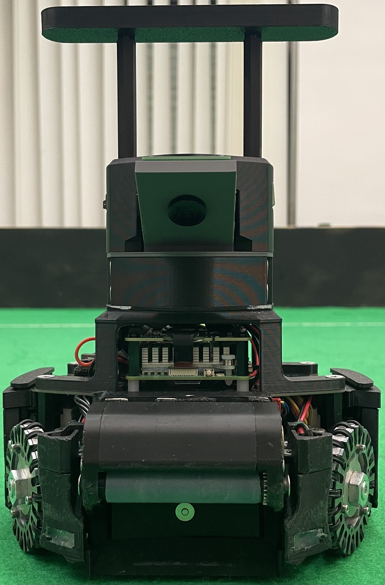

## Robot1 Back

*Robot 1 Back view*

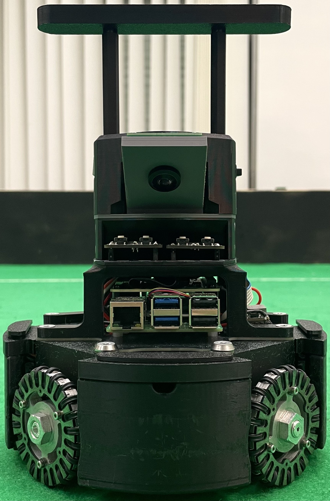

## Robot1 Top

*Robot 1 Top View*

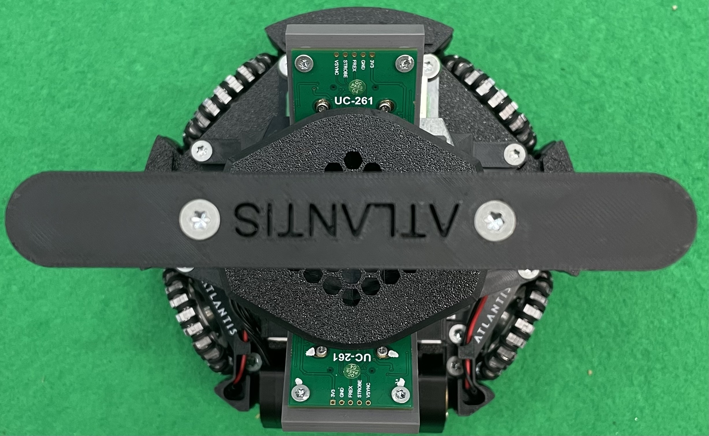

## Robot1 Bottom

*Robot 1 Bottom View*

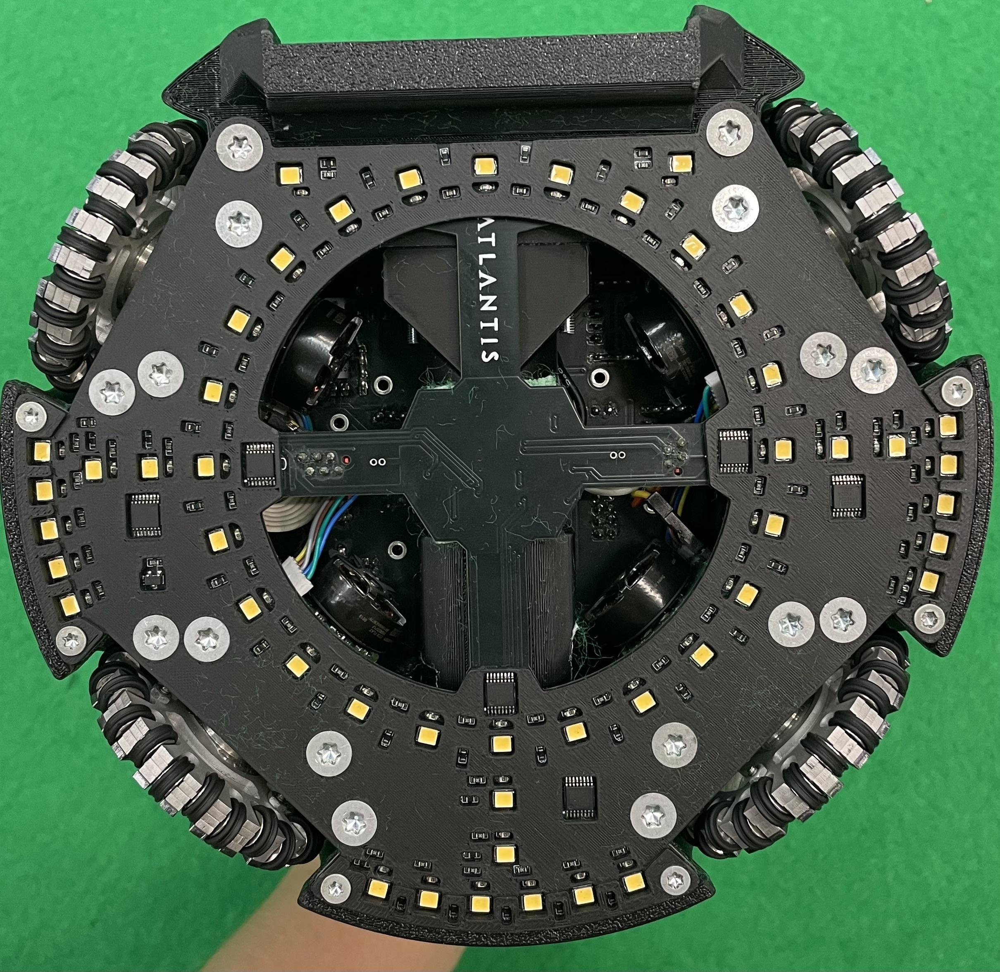

## Robot1 Right

*Robot 1 Right View*

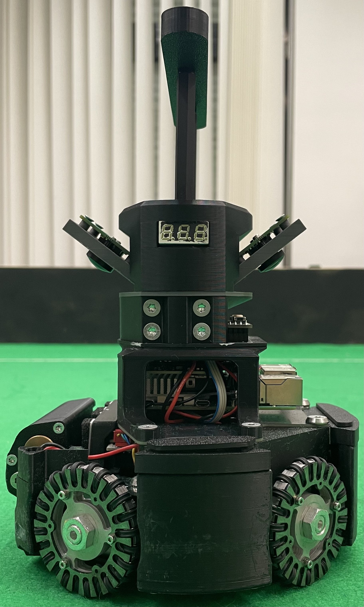

## Robot1 Left

*Robot 1 Left View*

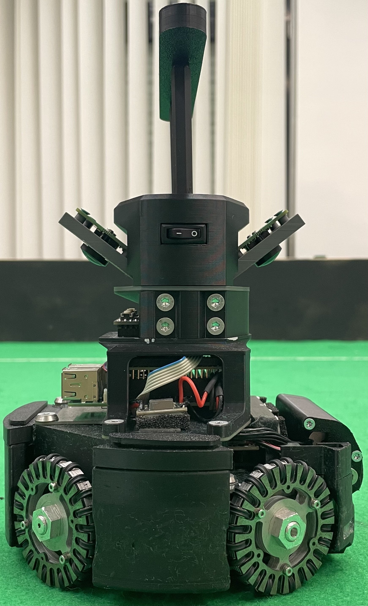

## Robot2 Overall

*Robot 2 Overall View*

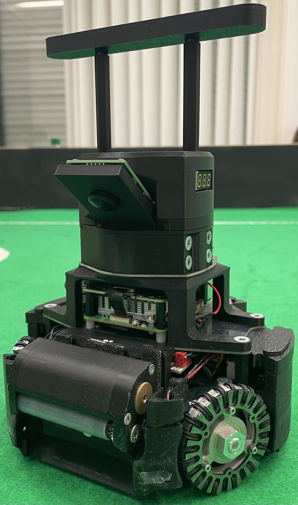

## Robot2 Front

*Robot 2 Front view*

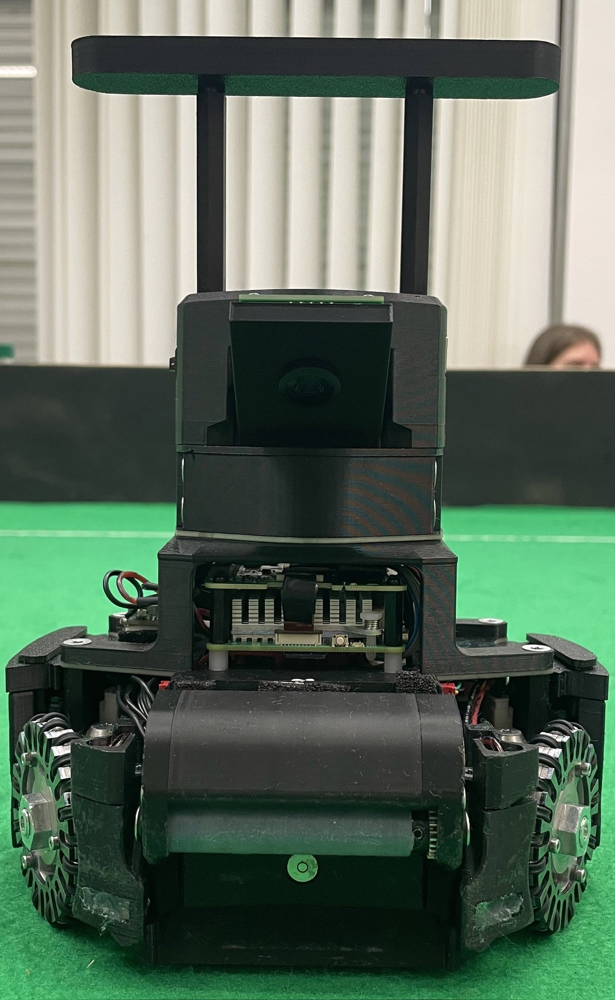

## Robot2 Back

*Robot 2 Back view*

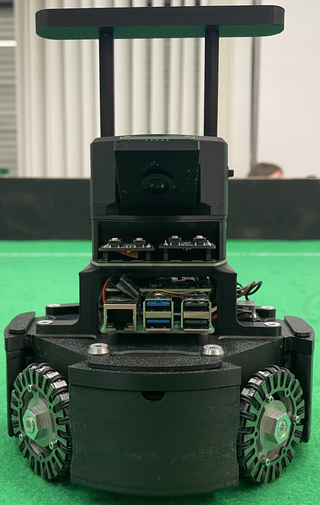

## Robot2 Top

*Robot 2 Top View*

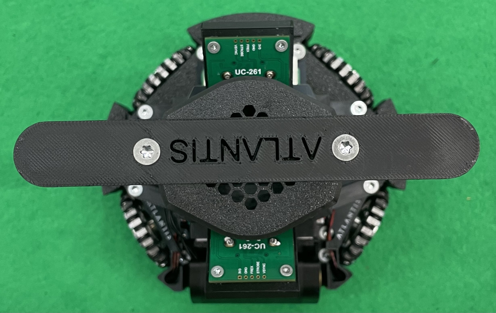

## Robot2 Bottom

*Robot 2 Bottom View*

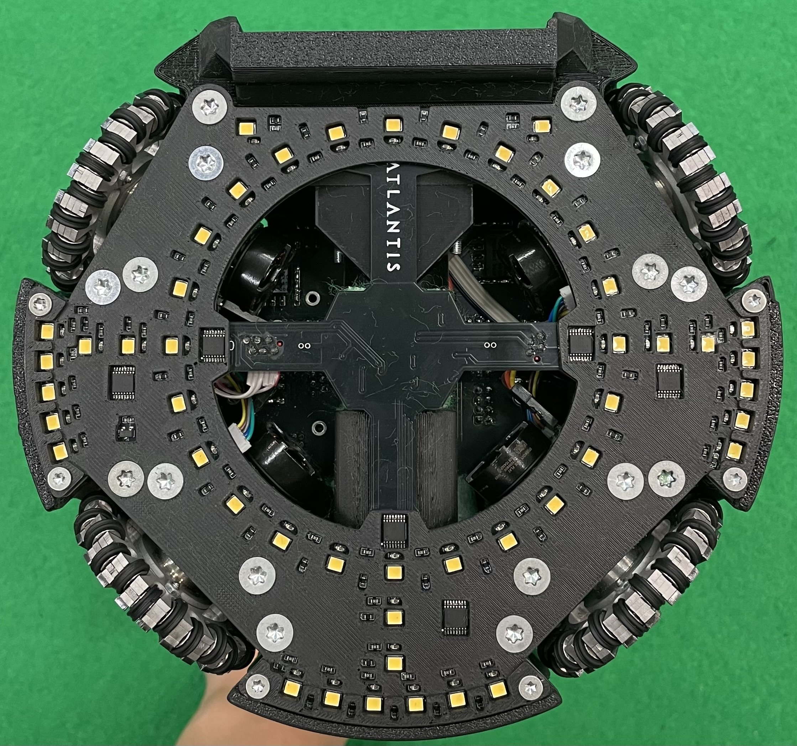

## Robot2 Right

*Robot 2 Right View*

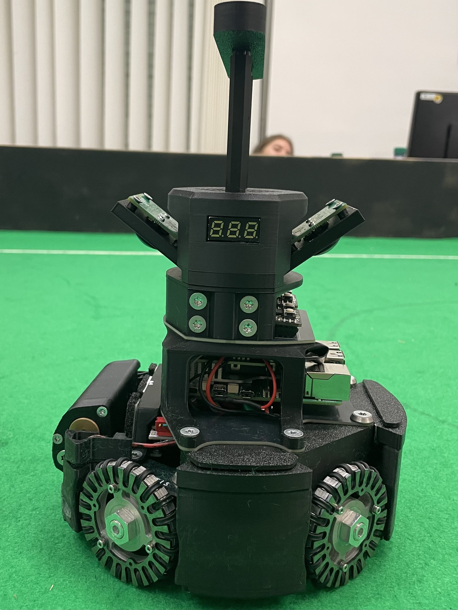

## Robot2 Left

*Robot 2 Left View*

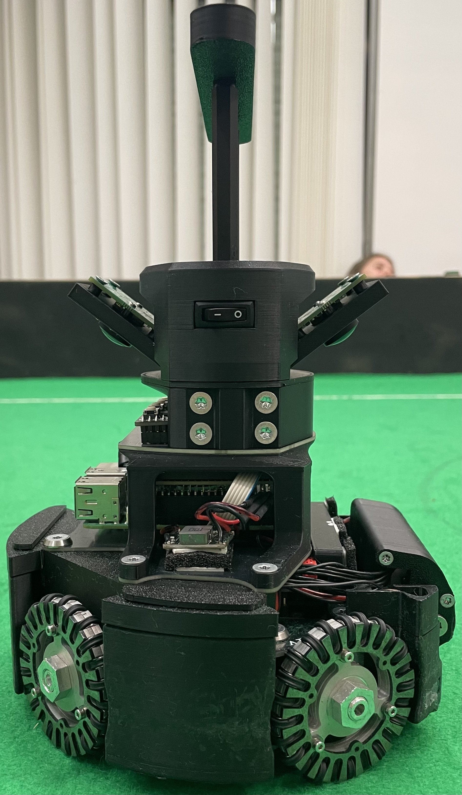

## Mechanical Design

*How did you design the mechanical parts of your robots?*

Most mechanical parts were designed in Autodesk Fusion 360. PCBs were designed in Fusion and finalized in KiCad. Our iterative design focused on precision, robustness, speed, maneuverability, and intelligence, using brushless motors, an effective dribbler, a powerful kicker, and a 360° vision system with two 220° lenses and AI. The dribbler underwent the most iterations, testing different rollers, damping, rotation axes, capture zones, materials, and 3D-printed parts.

## Build Method

*How did you build your design?*

Built mainly by 3D printing with Bambu Lab A1/A1 mini. PCBs by JLCPCB. Omniwheels developed with EK Haan and made by ACROSS Tooling. This season: 2 cameras replaced the mirror, new motor layout, wider dribbler, new line sensor PCB.

## Motors & Reason

*How many motors have you used and why?*

Our drive system uses four axially symmetric motors, with front motors at 60° and rear motors at 135°, inspired by SSL robots to improve forward power and create more space for a wider dribbler. The omnidirectional wheels feature four aluminum plates, one spring steel plate, and 24 offset rubber rollers with notches for better traction. A fifth motor drives the dribbler.

## Kicker Design

*If your robot has a kicker, explain how you designed and built the mechanics of the kicker*

A custom-wound 24 V solenoid with a 10 mm nominal stroke serves as the kicker. It uses 6 layers of 0.5 mm copper wire. A 24 V capacitor stabilizes the power supply during kicks. The enlarged, curved contact surface centers the ball and improves accuracy.

## Dribbler Design

*If your robot has a dribbler, explain how you designed and built the mechanics of the dribbler.*

Our dribbler uses a 16:1 geared motor and a brass to steel 1.6:1 gear stage. Weight distribution and a rear-bottom bearing create cushioned natural suspension. A 12.8 mm OD silicone tube, bottom slope, and floor contact guide the ball via three contact points, minimizing bounce and ball loss.

## CAD Files

*CAD design files*

https://github.com/rstiebel/Bohlebots_Atlantis

## Mechanical Innovation

*Mechanical Innovation*

Our standout feature is our dribbler. It allows us to control the ball much better and keep hold of it more effectively. As a result, we can score significantly more goals and lose possession less often.

## Mechanical Photos

*Photos of your mechanical designs highlights*

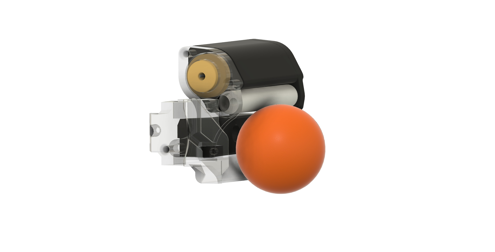

## Electronics Block Diagram

*Provide us with a block diagram of your robot's electronics*

[https://drive.google.com/open?id=1bu2rPadUc8Wr0ou4LXhDvqDATY0VN5Xp](https://drive.google.com/open?id=1bu2rPadUc8Wr0ou4LXhDvqDATY0VN5Xp)

## Power Circuit

*How does your power circuits work?*

Three 8.2V battery packs provide 24.6V, stabilized by a capacitor during kicks. Motors and drivers use 24V, while converters supply 3.3V and 5V. The 3.3V rail powers ESPs, light barrier, buttons, floor sensors, and communication; 5V powers the Raspberry Pi, fans, and cameras.

## Motor Drive Circuit

*How do you drive your motors? Explain the circuits you use for that*

We use the Maxon ECX Flat 22S motor with the planetary gear of the GMP22-180SH motor. Those are controlled by ESCON2 Nano 24/2 motor drivers which are mounted on our main PCB and powered with 24V.

## Microcontroller & Reason

*What kind of micro controller or board do you use for your robot? Why did you decide to use this part for your robot? If you have more than 1 processor, explain each one separately.*

The robot is controlled by two microprocessors and a Raspberry Pi.
The Pi handles the vision system, specifically reading and processing data from the cameras.
The first microprocessor (ESP32-WROOM-32) is responsible for processing input from the ground sensor, while the second, acting as the main processor (ESP32 Dev Module), coordinates all other components and sensors and determines the direction of travel based on the available information.

## Motor Control

*How do you use your processor to move your motors?*

We move our motors using the ESP32 dev Module on our Main PCB. Each ESCON2 Nano 24/2 motor driver receives a PWM, direction and enable signal from our ESP32 which allows us to control the speed and direction of the motors.

## Ball Detection

*How does your ball detection sensors and/or camera[s] work?*

We are using two ArduCams B0428 with a wide-angle lens (220°) in combination with a Raspberry Pi 5 and a Hailo-8L accelerator.
To detect the ball, we trained our own YOLOv8n-seg model, which predicts which pixels in the image represent the ball.
After that, we calculate the center of the blob and undistort these coordinates. From this, we determine the angle (using arctan2) and the distance to the ball.

## Line Detection

*How does your line detection circuits work?*

Our floor sensor board uses 48 sensors and 48 white LEDs, connected via six multiplexers to a 3.3V ESP32-WROOM. The ESP32 processes the data to calculate the exact line direction as a vector and transmits it to the main controller via I2C.

## Navigation/Position Sensors

*What sensors do you use for navigation and how are these sensors connected to your processor? What sensors do you use to find your position in the field? What about the direction your robot faces?*

Navigation relies solely on our camera system running on a Raspberry Pi 5, connected to the ESP32 via UART. The ESP32 calculates vectors to both goals and derives the robot’s heading from them. As all objects are detected relative to the robot, it has no absolute position on the field.

## Kicker Circuit

*How do you drive your kicker system? How does the circuit make the kicker work?*

Our custom-wound kicker uses thick wire to handle currents above 50 A. A high-current FET and an Infineon BTN8982 half-bridge with integrated driver enable direct ESP32 control. A 22,000 µF capacitor supplies the required current for the 12 ms kick.

## Dribbler Circuit

*How does your dribbler system work? What components and circuits did you use to drive it?*

We use a motor with a 16:1 gearbox. The 3D-printed dribbler has two gears (1.6:1). Weight distribution and a rear-bottom bearing create cushioned suspension stopped by the upper wall. A 12.8 mm silicone tube and slope ensure 3-point guidance. Driven by an ESCON2 Nano 24/2 via custom PCB.

## Schematics

*Schematics of your robot*

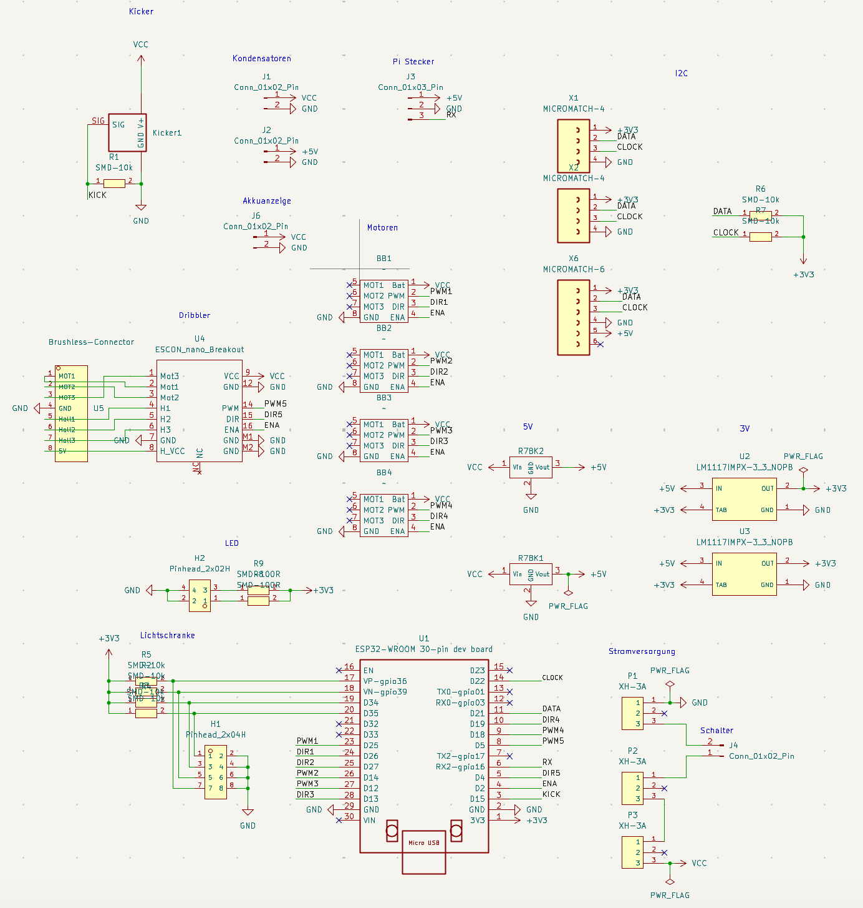
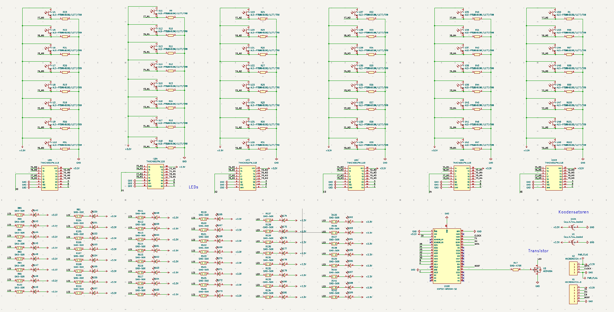
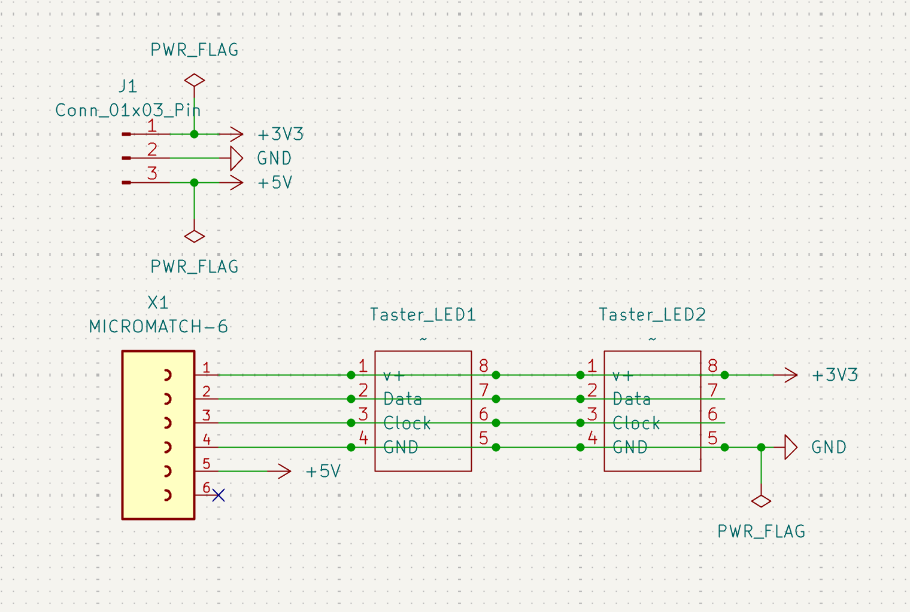

## PCB

*PCB of your robot*

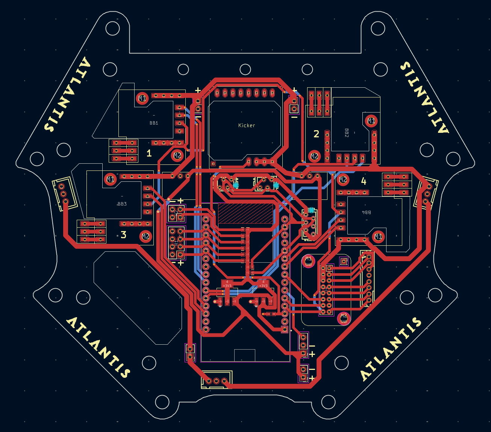
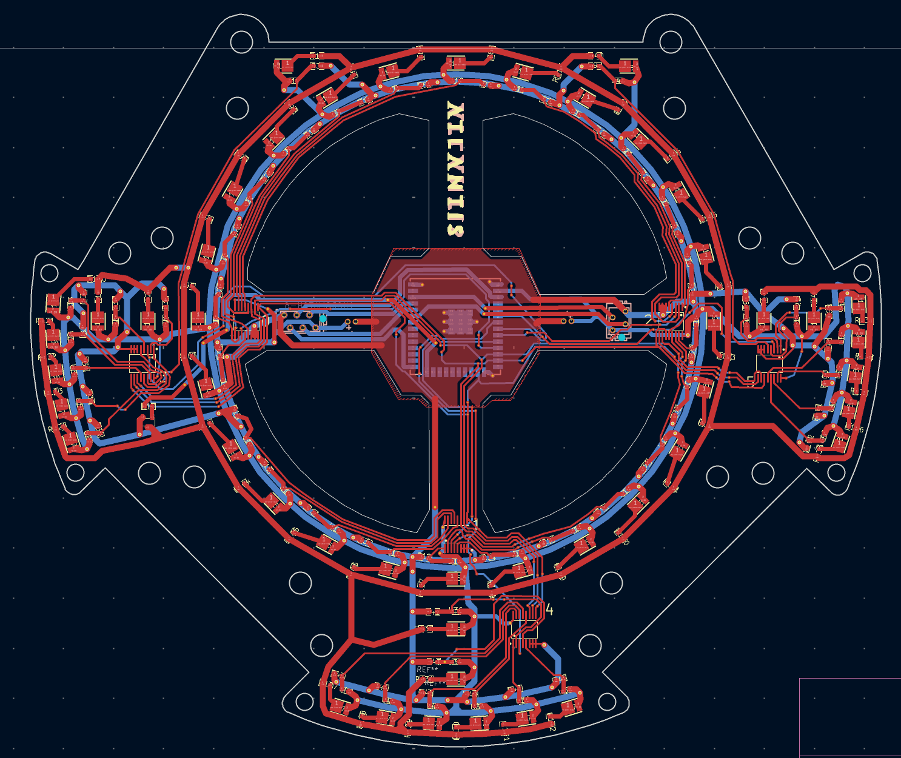
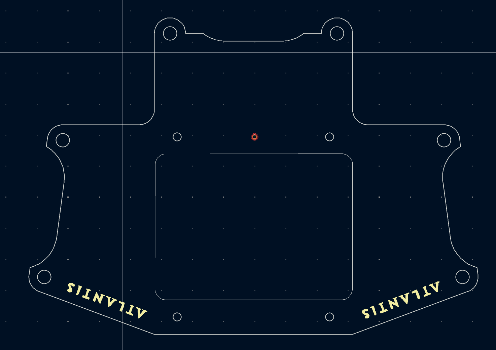
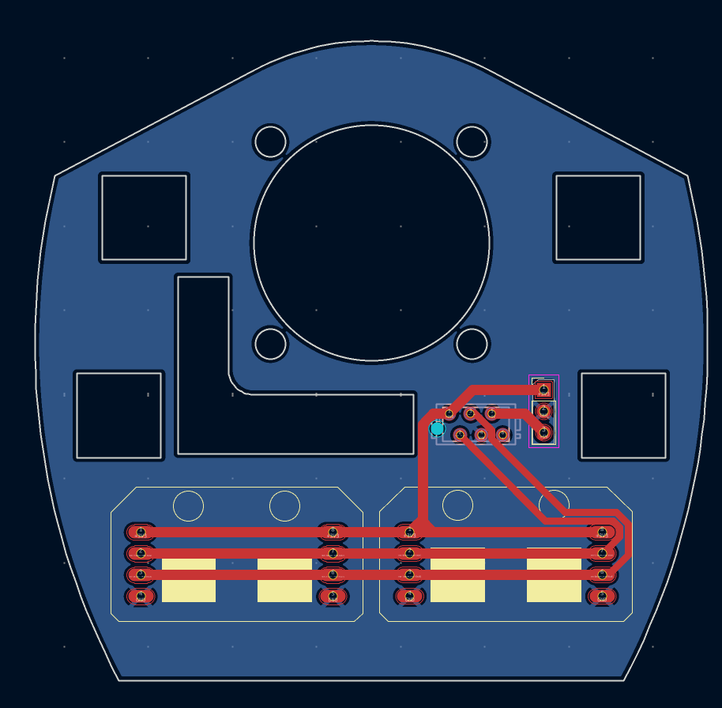

## Electronics Innovation

*Electronics Innovations*

We are most proud of designing a new line detection sensor. This board is equipped with 48 sensors and 48 white LEDs, instead of 32 like last year, connected to an ESP32-WROOM via six multiplexers and powered by 3.3V.
All data is processed on the ESP32 to calculate a vector indicating the exact direction of the line. This information is then transmitted to our main controller via I2C.

## Circuit Photos

*Photo of your circuit boards highlights*

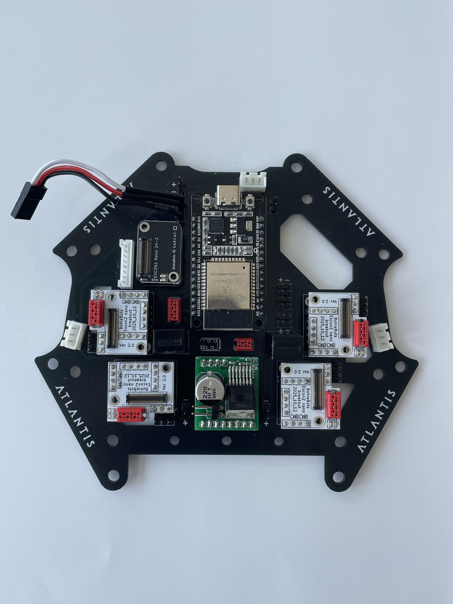
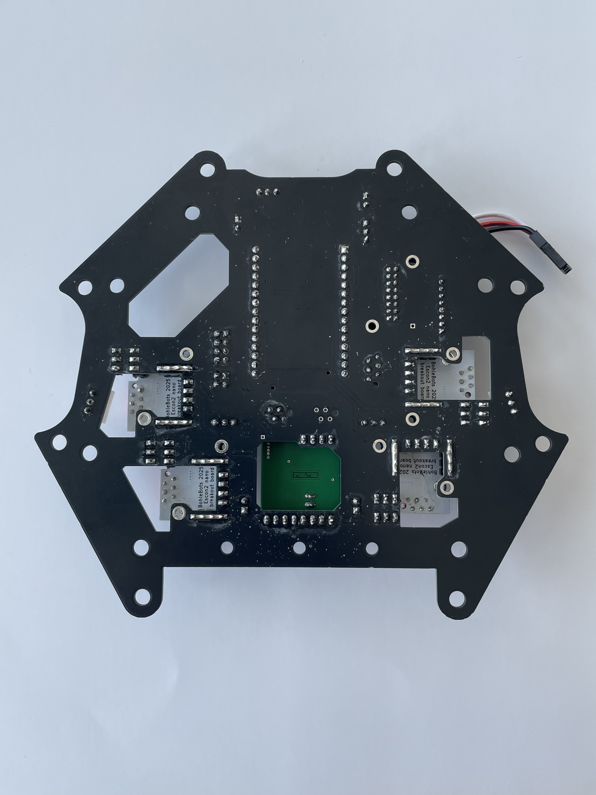
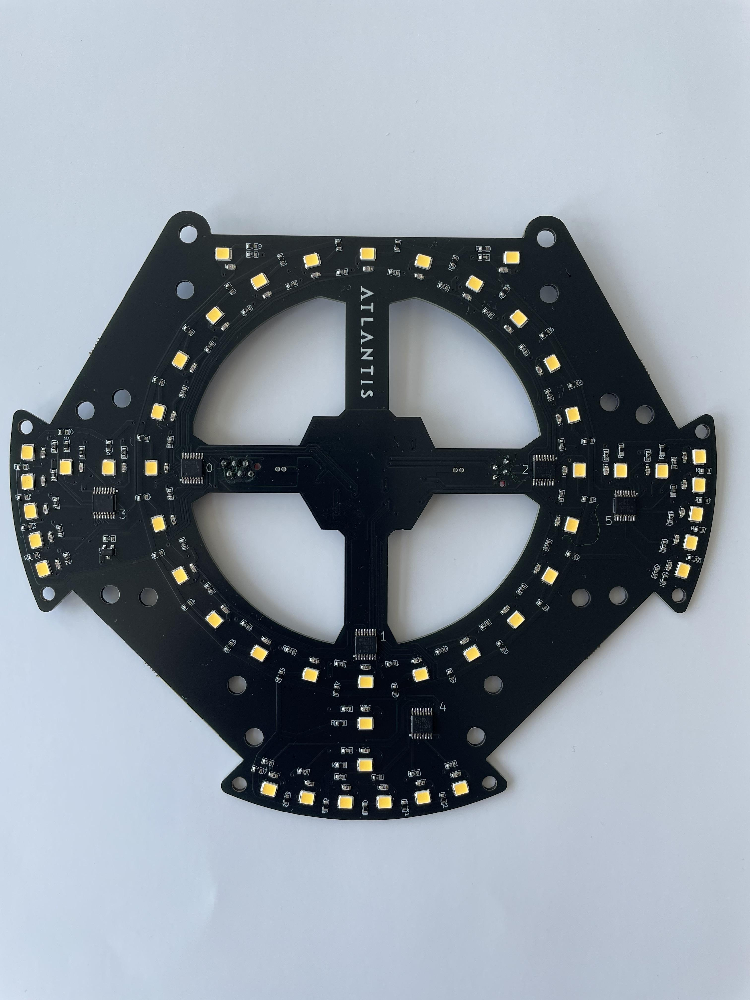
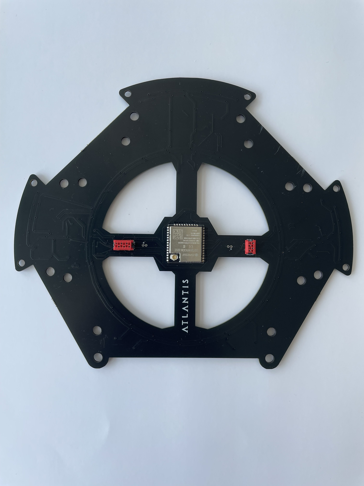

## Ball Detection Method

*How do you find where the ball is? How do you read the data from the ball detection sensors and/or camera?*

We trained our own YOLOv8n-seg model, which predicts which pixels in the image are presenting the ball. After we calculate the center of the blob and undistort those coordinates, we can determine an angle and a distance to the ball which is then send via UART to our main ESP32.

## Ball Catch Algorithm

*How does your algorithm work to catch the ball? Is there a difference between your robots in how they move towards the ball? Explain the differences.*

We use two ball-catching algorithms. The striker approaches the ball along an arc using an angle- and distance-dependent offset vector that shrinks as alignment improves. The keeper drives between ball and goal on an elliptical path, preventing it from getting stuck on the goal line while maintaining fast reactions to block shots.

## Positioning Algorithm

*How do you use your sensors in your algorithm to find your position inside the field and how do you use that position to move your robots around?*

We only use the cameras for navigation and positioning. For each goal, we created a vector which allows us to calculate a midpoint of the field and an orientation of the robot. All those vectors are relative to the robot, so we do not have an absolute position on the field. But through angles and distances, we can assume where the robot should be and act accordingly.

## Line Algorithm

*How does your robot find the lines to stay inside the field? What algorithms do you use to avoid going out of bounds?*

Our custom PCB uses 48 line sensors. Sensor values are grouped into consecutive “clouds”, whose average angles are calculated before determining the final line angle. This approach is more robust against noise and detects line crossings reliably. To prevent overshooting, robot speed is reduced based on its distance from the field center, giving the motors enough time to react.

## Goal Algorithm

*What algorithms do you use to score goals? How do you use your kicker and dribbler to handle the ball?*

We have different algorithms which are all triggered when the ball is detected by our light barrier and depending on the angle of the ball. We use the dribbler mostly to get the ball out of the corners and to prevent losing it during rotations towards the goal. If the angle to the midpoint of the goal is small enough, the robot kicks the ball, which is much quicker than driving.

## Defense Algorithm

*What algorithms do you use to avoid the opponent team scoring? How do your robots defend your own goal?*

Our keeper moves on an elliptical path between the ball and our goal, maximizing goal coverage. Its rear camera always faces the goal center, ensuring the best attacking position when the ball approaches. Driving speed is adapted to the ball’s velocity and the distance to the next target point on the ellipse.

## Robot Communication

*Do your robots communicate with each other? How do you use this communication to your advantage?*

We use a striker and a keeper communicating via ESP-NOW on the ESP32 (2.4 GHz, 100 mW EIRP). They switch roles dynamically: if one robot leaves the field, the other becomes the striker. The keeper also switches when it has a better chance to score. This communication ensures reliable coordination throughout the game.

## Software Innovation

*Software Innovations*

This year, we are most proud of our camera system. We changed from object detection to instance segmentation, which allows us to detect other robots on the field. Due to that, we can block our own goal much better and also kick more precisely into the biggest open gap in the goal.

## GitHub Link

*GitHub link*

https://github.com/rstiebel/Bohlebots_Atlantis

## BOM

*Bill of Materials (BOM)*

[https://drive.google.com/open?id=146KeHf5Zgz41gCXorzN9kuuSapIRM1He](https://drive.google.com/open?id=146KeHf5Zgz41gCXorzN9kuuSapIRM1He)

## Cost

*How much did it cost you to build your robots?*

Robots (cost of components that are in your robots right now): 3276 Euro each
Experiments (failed builds, broken hardware etc.): 1000 Euro
Environment (fields, balls, etc.) : 500 Euro
1 Euro= 1.14 USD

## Funding

*How did you gathered the funds to build the robots?*

95% sponsors
5% family

## Affordability

*How affordable was it to compete in RoboCupJunior Soccer?*

9

## Answer Check

*Have you checked all of your answers?*

Yes!

## Publication Consent

*We publish TDPs and posters during or after the competition as described in the beginning*

Yes, we acknowledge everything submitted in the above form can be published.

