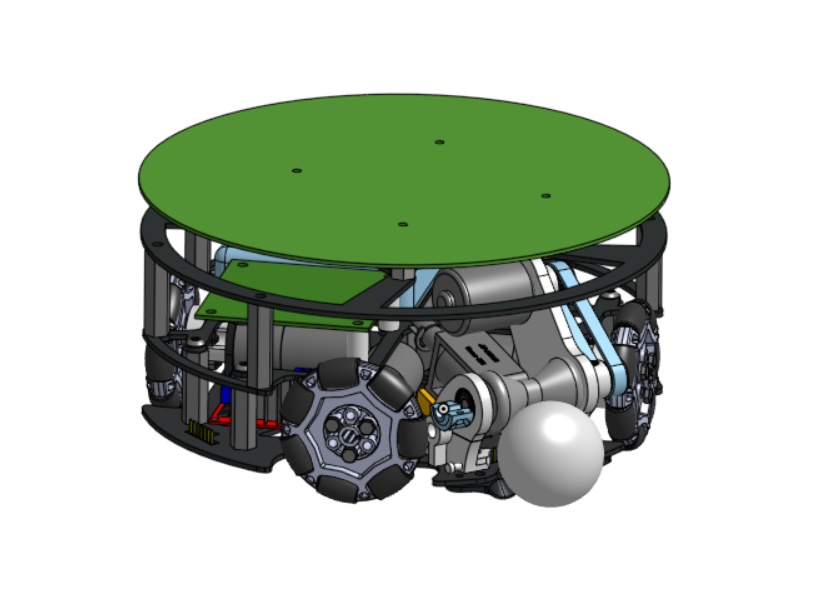
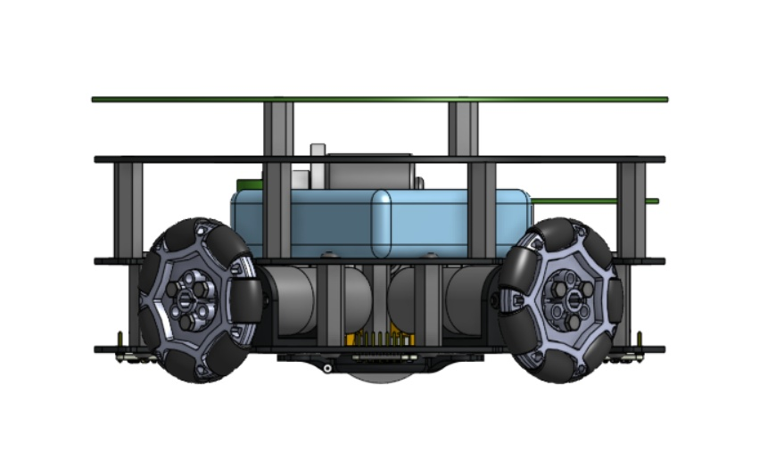
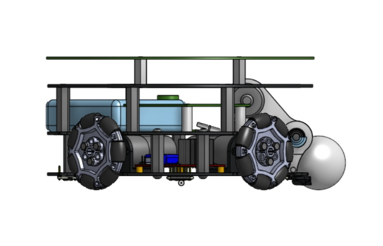
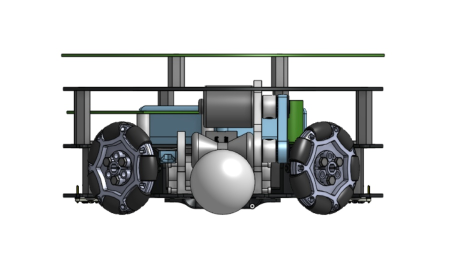
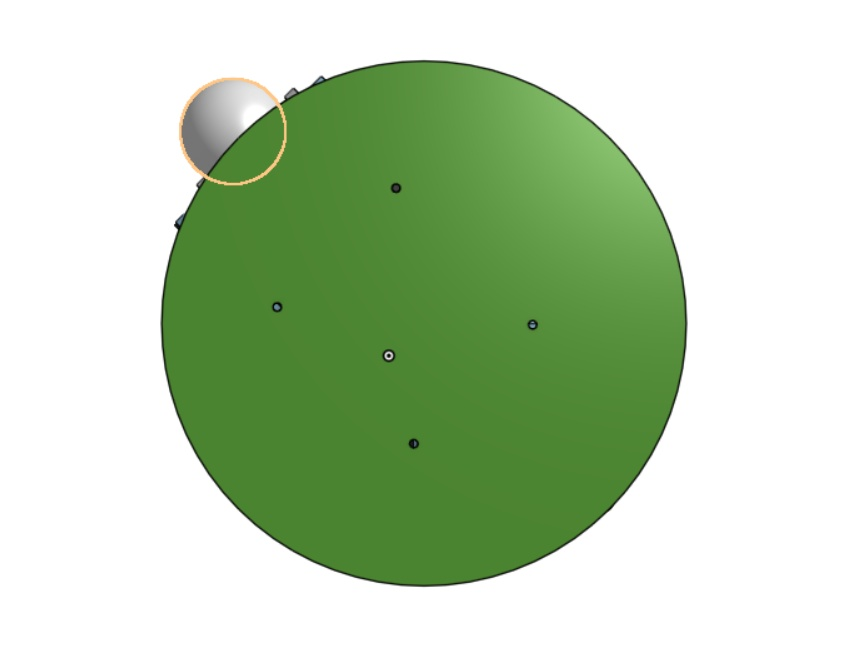
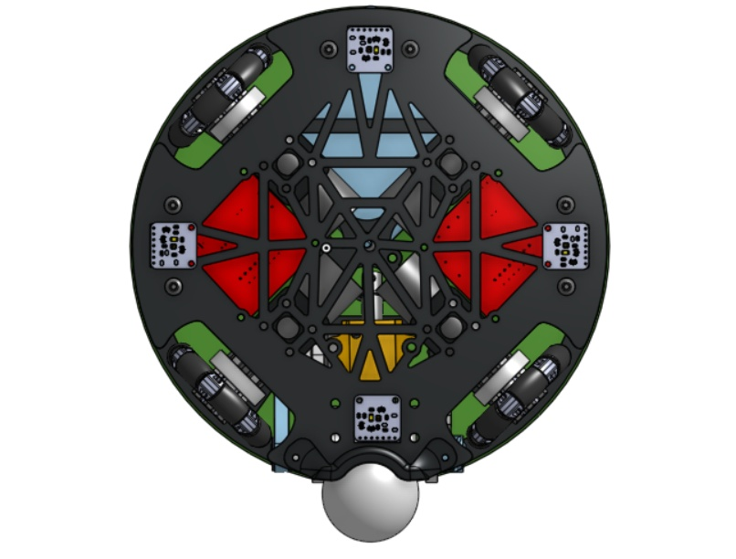
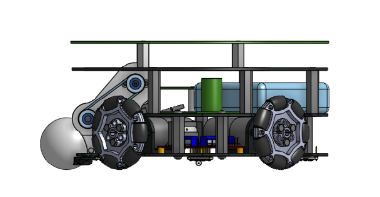
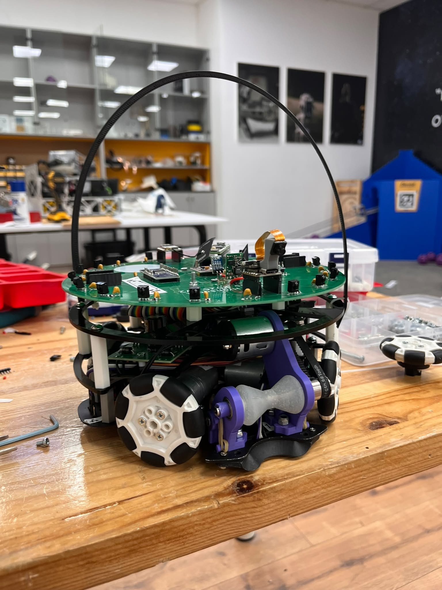
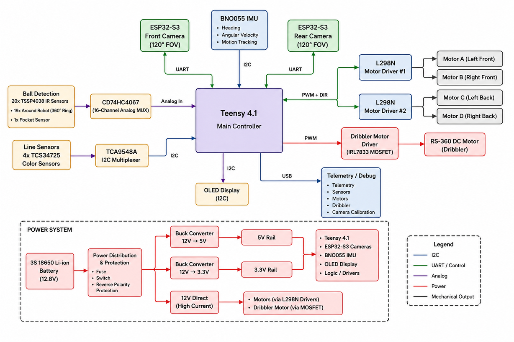
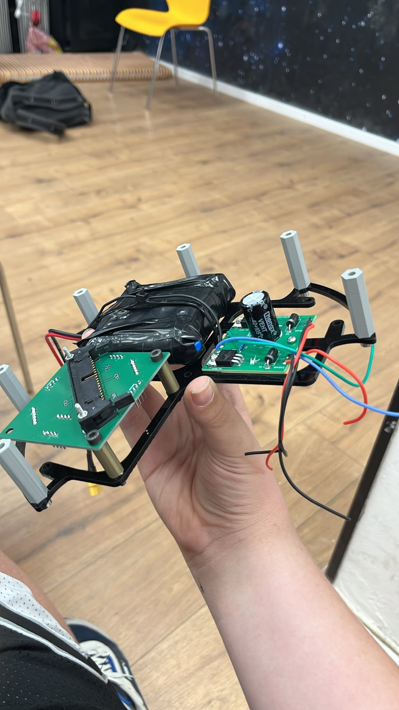

## Timestamp

*Tijdstempel*

27-6-2026 11:18:59

## Email Address

*E-mailadres*

berkovich.bar@gmail.com

## TDP File

*TDP File Upload (Not required)*

## Team Name

*What is your team's name?*

BurnerBALL

## League

*What league do you participate in?*

IR League

## Country

*Where are you from?*

ISREAL

## Contact

*If other teams have questions about your robot, now or in the future, what email address(es) can we publish along with this document for people to reach you?

(You can put in multiple email addresses, like multiple team members, an email for the whole team or both. Feel free to share other ways of communication like Discord handles)*

berkovich.bar@gmail.com

## Social Media

*Team Social Media Links (if you have any)*

https://www.instagram.com/burnerball2026

## Team Photo

*Upload a photo of your whole team with your mentor and robots

Note: This is not mandatory and will be published along with your TDP if you choose to upload something*

## Members & Roles

*What are the names of the team members and their role(s)?*

Bar Berkovich - Captain, Software
Yarden Elkan - Software
Yarden Shlomovich- Electronics, PCB Design
Ben Ashkenazy - Mechanical
Ofir Salomon - Mechanical Design 
Evyatar Nassie, Nimrod Segev -Mentors

## Meeting Frequency

*How often did your team meet?
(e.g. 90 minutes once per week or a day every weekend.)*

5-6 days between 3.5 hours to 10 hours

## Meeting Place

*Where did you meet to work on your robot?
(e.g. a robotics room at school, at some other place, one of your homes, school library etc.)*

robotics room at school

## Start Date

*When did your team start working on this year's robot?*

aruond december

## Past Competitions

*Which RoboCupJunior competitions have you competed in and in which leagues?*

as a team its our first year:
Isreal Open 2026: 2vs2 Infrared League(in the past Lightweight League)
world Championship 2026: 2vs2 Infrared League(in the past Lightweight League)

## Mentor Contribution

*Which parts of your work received the most contribution from your mentor?*

electronics, our mentor expanded our knowledge on the basics of electronics and helped us find some way to find solutions to our problems.

## Workload Management

*How did you manage the workload?*

We communicated through a WhatsApp group and assigned the tasks each day to each team member and goals for each day to hit. We also used GitHub for issues and code and communicated in discord

## AI Tools

*Which AI tools did you use?*

mainly we used chatgpt to help us

## Robot1 Overall

*Robot 1 Overall View*

## Robot1 Front

*Robot 1 Front view*

## Robot1 Back

*Robot 1 Back view*

## Robot1 Top

*Robot 1 Top View*

## Robot1 Bottom

*Robot 1 Bottom View*

## Robot1 Right

*Robot 1 Right View*

## Robot1 Left

*Robot 1 Left View*

## Robot2 Overall

*Robot 2 Overall View*

## Robot2 Front

*Robot 2 Front view*

## Robot2 Back

*Robot 2 Back view*

## Robot2 Top

*Robot 2 Top View*

## Robot2 Bottom

*Robot 2 Bottom View*

## Robot2 Right

*Robot 2 Right View*

## Robot2 Left

*Robot 2 Left View*

## Mechanical Design

*How did you design the mechanical parts of your robots?*

First-year team, so everything was designed from scratch in Onshape, driven by the 2026 rules (1500 g, 22 cm, 1.5 cm capture zone, 42 mm ball). High-stress parts are printed in Loctite 3172/Dura 56 resin on a Stratasys P3 DLP; low-stress parts in PLA on FDM; base plates laser-cut from 2 mm 6061 aluminum. Our key part is the dribbler: an RS-360 motor spins a 40A silicone hourglass bar at ~12,000 RPM that grips and centers the ball, bounded by the 1.5 cm capture zone.

## Build Method

*How did you build your design?*

We built the robot using in-house and sponsor manufacturing. PLA parts were printed on our Bambu Lab P1S/P2S printers, and we cast the dribbler silicone. Stratasys printed resin parts, while NTNTech cut the 2 mm 6061 aluminum plates.

## Motors & Reason

*How many motors have you used and why?*

We use 5 motors: four JGB37-520B gearmotors with encoders for a four-wheel omnidirectional X-drive, and one RS-360 motor for the dribbler. We chose four drive motors because soccer requires stable holonomic movement, allowing the robot to move toward the ball while rotating toward the goal. The RS-360 powers the dribbler independently, maintaining speeds of about 12,000 RPM.

## Kicker Design

*If your robot has a kicker, explain how you designed and built the mechanics of the kicker*

## Dribbler Design

*If your robot has a dribbler, explain how you designed and built the mechanics of the dribbler.*

The dribbler is powered by an RS360 motor through a GT2 belt spinning at 12000 RPM An hourglasshaped Shore 40A silicone roller cast in-house grips and centers the ball The axle floats on rubber band tension for impact absorption while a concave 3D printed seat below provides a second centering point

## CAD Files

*CAD design files*

https://cad.onshape.com/documents/2f0e7f453b59952b783a3f1c/w/35df6064ab94ddd4e6cae6fe/e/85a9f70d04d4329cd5464c7e?renderMode=0&uiState=6a37998cbea4a1fb562726a7

## Mechanical Innovation

*Mechanical Innovation*

Our main mechanical innovation is the floating dribbler system. An RS-360 motor drives an hourglass-shaped Shore 40A silicone roller through a GT2 belt. The roller continuously centers the ball, while a floating axle suspended by rubber-band tension absorbs impacts and maintains contact. A concave 3D-printed seat beneath the ball provides a second centering point. This creates a stable, self-aligning ball control system that improves possession and handling during collisions.

## Mechanical Photos

*Photos of your mechanical designs highlights*

## Electronics Block Diagram

*Provide us with a block diagram of your robot's electronics*

## Power Circuit

*How does your power circuits work?*

Our robot uses a 3 cell 18650 lithium battery 12.8V. The battery powers the motors and dribbler directly, while a buck converter provides 5V for the Teensy, ESP32-S3 cameras, and IMU. A 3.3V regulator powers the sensors. Custom PCBs distribute power and connect all systems.

## Motor Drive Circuit

*How do you drive your motors? Explain the circuits you use for that*

We use four DC gearmotors in an omnidirectional X-drive. Two L298N dual H-bridge drivers control the motors, while a Teensy 4.1 provides PWM speed control and direction signals. Each wheel is driven independently, allowing the robot to move and rotate freely in any direction. (283 characters)

## Microcontroller & Reason

*What kind of micro controller or board do you use for your robot? Why did you decide to use this part for your robot? If you have more than 1 processor, explain each one separately.*

We use a Teensy 4.1 as the main controller because of its fast 600 MHz processor and ability to handle many sensors simultaneously. It manages ball and line detection, navigation, motor and dribbler control, robot strategy, and communication. Two ESP32-S3 modules, each connected to a camera facing a different direction, provide 240° vision. Each ESP32 processes images locally and sends object data to the Teensy via UART, enabling fast vision without overloading the main processor.

## Motor Control

*How do you use your processor to move your motors?*

The Teensy continuously reads sensor data, calculates the robot and ball positions, determines the desired movement and rotation, converts them into wheel speeds using omnidirectional kinematics, and sends PWM commands to the motor drivers. This enables smooth and responsive movement.

## Ball Detection

*How does your ball detection sensors and/or camera[s] work?*

The robot detects the ball using 20 TSSP4038 infrared sensors arranged around its perimeter. The Teensy scans the sensors and calculates the ball's direction based on the strongest signals. Two ESP32-S3 camera modules, one facing forward and one backward, provide a combined 240° field of view. The cameras detect goals and field landmarks, while each ESP32 processes images locally and sends only relevant data to the Teensy, reducing processing load and improving navigation.

## Line Detection

*How does your line detection circuits work?*

We use four TCS34725 color sensors to detect the white field lines. A TCA9548A I²C multiplexer allows multiple sensors with the same address to operate on one bus. The Teensy reads each sensor and uses its position to determine where the line is and respond appropriately.

## Navigation/Position Sensors

*What sensors do you use for navigation and how are these sensors connected to your processor? What sensors do you use to find your position in the field? What about the direction your robot faces?*

We use a BNO055 IMU for heading, angular velocity, and motion tracking, helping the robot maintain its orientation while moving. Two ESP32-S3 cameras (front and rear) detect goals and field features for localization. Line sensors provide additional positional information and help keep the robot inside the field.

## Kicker Circuit

*How do you drive your kicker system? How does the circuit make the kicker work?*

we dont have a kicker

## Dribbler Circuit

*How does your dribbler system work? What components and circuits did you use to drive it?*

The dribbler uses an RS-360 motor controlled by a PWM-driven MOSFET circuit. Power is transferred through a GT2 timing belt to an hourglass-shaped silicone roller that grips and centers the ball. A floating axle with rubber-band suspension maintains contact, improving ball control and possession.

## Schematics

*Schematics of your robot*

[https://drive.google.com/open?id=1Q5Nc169OkagRncCWQ0c7-DRis3Ns-jm-](https://drive.google.com/open?id=1Q5Nc169OkagRncCWQ0c7-DRis3Ns-jm-)
[https://drive.google.com/open?id=17OOcZpY95aHakacEcVj-sqsATQgVkPZc](https://drive.google.com/open?id=17OOcZpY95aHakacEcVj-sqsATQgVkPZc)
[https://drive.google.com/open?id=1kUoID_jh5We9IIj8oF6TQpkyuWqTn3ME](https://drive.google.com/open?id=1kUoID_jh5We9IIj8oF6TQpkyuWqTn3ME)

## PCB

*PCB of your robot*

[https://drive.google.com/open?id=1h5y8S_mHfOr7Zoj-IikyiNe_NM77QtFY](https://drive.google.com/open?id=1h5y8S_mHfOr7Zoj-IikyiNe_NM77QtFY)
[https://drive.google.com/open?id=13lCASc2DEYfFw14OPcMVy0ygtp7WeuNY](https://drive.google.com/open?id=13lCASc2DEYfFw14OPcMVy0ygtp7WeuNY)
[https://drive.google.com/open?id=1vPQYp65ylzKlfKsGv41YsQNV6Ip7vZ-w](https://drive.google.com/open?id=1vPQYp65ylzKlfKsGv41YsQNV6Ip7vZ-w)

## Electronics Innovation

*Electronics Innovations*

One electronics innovation we are most proud of is our modular PCB design. We use dedicated board-to-board connectors between the upper, middle, and lower PCBs, allowing the robot to be assembled, serviced, and repaired quickly. This reduces wiring complexity, improves reliability, and makes replacing damaged components much easier during competitions. The modular design also simplifies future upgrades without requiring a complete redesign of the electronics.

## Circuit Photos

*Photo of your circuit boards highlights*

## Ball Detection Method

*How do you find where the ball is? How do you read the data from the ball detection sensors and/or camera?*

Our robot detects the ball with a 360° IR ring: 19 sensors around the robot plus one pocket sensor in the dribbler. Each sensor is sampled quickly, and LOW readings mean the IR ball signal was detected. We count these hits as strength, use a weighted vector sum to calculate the ball angle, and use the pocket sensor to know when the ball is captured

## Ball Catch Algorithm

*How does your algorithm work to catch the ball? Is there a difference between your robots in how they move towards the ball? Explain the differences.*

The IR ring gives the ball angle and strength. If the ball is far, the robot drives fast toward it; when it is close, it slows down, centers the ball in front of the dribbler, turns the dribbler on, and pulls it into the pocket. Both robots use the same code, but the one with the better ball reading attacks, while the other moves to support/rebound.

## Positioning Algorithm

*How do you use your sensors in your algorithm to find your position inside the field and how do you use that position to move your robots around?*

We do not calculate exact X/Y position. Instead, we use relative field awareness. The compass keeps our heading stable, the cameras detect the goals and field features, and the color sensors detect white boundary lines. The robot uses this information to know if it is facing the correct goal, if it is near the edge, and which direction to drive using omni-wheel movement.

## Line Algorithm

*How does your robot find the lines to stay inside the field? What algorithms do you use to avoid going out of bounds?*

Our robot detects the field lines with four bottom color sensors and also with the cameras. The color sensors identify white by checking high brightness and similar RGB values. If a line is detected, line avoidance becomes the highest priority. The robot immediately drives away from the line, turns back toward the field, enters a short recovery state, and only then returns to chasing the ball.

## Goal Algorithm

*What algorithms do you use to score goals? How do you use your kicker and dribbler to handle the ball?*

To score, the robot first captures the ball with the dribbler and uses the pocket IR sensor to confirm control. Then the cameras find the target goal and the robot aligns toward it. The dribbler keeps the ball stable until release. We mainly use a push-shot/spinback shot: the robot spins or drives forward, releases the dribbler, and pushes the ball toward the goal.

## Defense Algorithm

*What algorithms do you use to avoid the opponent team scoring? How do your robots defend your own goal?*

We do not use a fixed goalie. Both robots are active attackers, but they communicate and choose roles. The robot with the better ball reading pressures and captures the ball, while the second robot moves to a support/rebound position. This helps block attacks early, reduce opponent control, and cover more of the field without the robots colliding.

## Robot Communication

*Do your robots communicate with each other? How do you use this communication to your advantage?*

Yes. The robots communicate with each other through the ESP32 system and share ball visibility, ball angle, ball strength, if they have the ball, and role data. This helps them decide which robot attacks and which robot supports/rebounds, reducing collisions and covering more of the field.

## Software Innovation

*Software Innovations*

Our software innovation combines a pre-match testing app, a clear state machine, and a spinback shot. The app is only for testing before the match: telemetry, sensors, motors, dribbler, camera calibration, and goal color lock. During the match it has no control. The state machine organizes behaviors, and the spinback shot holds the ball, spins, then releases it toward the goal.

## GitHub Link

*GitHub link*

## BOM

*Bill of Materials (BOM)*

[https://drive.google.com/open?id=1SzvM2m-KOt9bffYwtvw271XQiQtXJZmt](https://drive.google.com/open?id=1SzvM2m-KOt9bffYwtvw271XQiQtXJZmt)

## Cost

*How much did it cost you to build your robots?*

Robots: estimated 6,500-7,000 NIS total
Experiments/broken parts: estimated 1,500-2,000 NIS.
Environment: estimated 1000 NIS 
1 USD = 2.96 NIS.

## Funding

*How did you gathered the funds to build the robots?*

school + regional councils 90%
sponsers 10%

## Affordability

*How affordable was it to compete in RoboCupJunior Soccer?*

7

## Answer Check

*Have you checked all of your answers?*

Yes!

## Publication Consent

*We publish TDPs and posters during or after the competition as described in the beginning*

Yes, we acknowledge everything submitted in the above form can be published.

