## Timestamp

*Tijdstempel*

28-6-2026 7:16:36

## Email Address

*E-mailadres*

superdevil04655@gmail.com

## TDP File

*TDP File Upload (Not required)*

[https://drive.google.com/open?id=1nTPtmTyXk9wql_N6CCZNTGHbjK4U8LIa](https://drive.google.com/open?id=1nTPtmTyXk9wql_N6CCZNTGHbjK4U8LIa)

## Team Name

*What is your team's name?*

CMOS

## League

*What league do you participate in?*

Vision League

## Country

*Where are you from?*

Egypt

## Contact

*If other teams have questions about your robot, now or in the future, what email address(es) can we publish along with this document for people to reach you?

(You can put in multiple email addresses, like multiple team members, an email for the whole team or both. Feel free to share other ways of communication like Discord handles)*

mohamedaiet@gmail.com

## Social Media

*Team Social Media Links (if you have any)*

https://www.youtube.com/@CMOSsoccer

## Team Photo

*Upload a photo of your whole team with your mentor and robots

Note: This is not mandatory and will be published along with your TDP if you choose to upload something*

## Members & Roles

*What are the names of the team members and their role(s)?*

Youssef Shaalan: Electrical Design
Yassin Tarek : Mechanical Design
Rana Ashraf: Computer Vision
Ziad Abdelhalim: Arduino Programming

## Meeting Frequency

*How often did your team meet?
(e.g. 90 minutes once per week or a day every weekend.)*

8 hours a week every day except Friday

## Meeting Place

*Where did you meet to work on your robot?
(e.g. a robotics room at school, at some other place, one of your homes, school library etc.)*

Young Leaders Robotics Centre

## Start Date

*When did your team start working on this year's robot?*

November 2025

## Past Competitions

*Which RoboCupJunior competitions have you competed in and in which leagues?*

Robocup Egypt Soccer Open 2v2 2024: 1st Place
Robocup Eindhoven Soccer Open 2v2
Robocup Egypt Soccer Open 2v2 2025: 1st Place
Robocup Egypt Soccer Vision 2v2 2026: 1st Place

## Mentor Contribution

*Which parts of your work received the most contribution from your mentor?*

We got help in the EEPROM calibration saving code for the line sensors due to addressing issues

## Workload Management

*How did you manage the workload?*

We used GitHub for version control and a WhatsApp group with our mentors to track progress and assign tasks

## AI Tools

*Which AI tools did you use?*

Google Gemini

## Robot1 Overall

*Robot 1 Overall View*

## Robot1 Front

*Robot 1 Front view*

## Robot1 Back

*Robot 1 Back view*

## Robot1 Top

*Robot 1 Top View*

## Robot1 Bottom

*Robot 1 Bottom View*

## Robot1 Right

*Robot 1 Right View*

## Robot1 Left

*Robot 1 Left View*

## Robot2 Overall

*Robot 2 Overall View*

## Robot2 Front

*Robot 2 Front view*

## Robot2 Back

*Robot 2 Back view*

## Robot2 Top

*Robot 2 Top View*

## Robot2 Bottom

*Robot 2 Bottom View*

## Robot2 Right

*Robot 2 Right View*

## Robot2 Left

*Robot 2 Left View*

## Mechanical Design

*How did you design the mechanical parts of your robots?*

Autodesk Fusion 360

## Build Method

*How did you build your design?*

We 3d printed on a Bambu Lab H1S
PCBs manufactured at JLCPCB
Mirror cut and polished at a local machine shop

## Motors & Reason

*How many motors have you used and why?*

4, because they provide the highest torque and speed of all configurations

## Kicker Design

*If your robot has a kicker, explain how you designed and built the mechanics of the kicker*

The solenoid is an off the shelf JF0826B with a re-wound core with thicker 0.5mm wire

## Dribbler Design

*If your robot has a dribbler, explain how you designed and built the mechanics of the dribbler.*

the dribbler is an SSL inspired wide dribbler with a PLA roller drum covered with A20 resin silicone

## CAD Files

*CAD design files*

## Mechanical Innovation

*Mechanical Innovation*

We designed multiple dribbler rollers that can be switched to suit different strategies

## Mechanical Photos

*Photos of your mechanical designs highlights*

## Electronics Block Diagram

*Provide us with a block diagram of your robot's electronics*

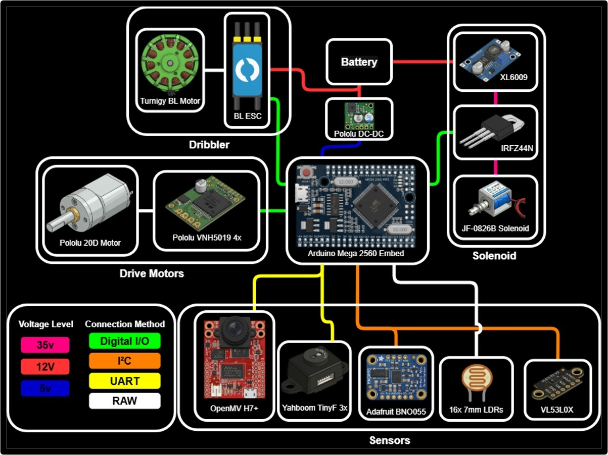

## Power Circuit

*How does your power circuits work?*

We use a 12.6v 3s Li-Po battery regulated to 5v for logic and to 3.3v for the OpenMV camera

## Motor Drive Circuit

*How do you drive your motors? Explain the circuits you use for that*

Pololu VNH5019 motor driver carriers

## Microcontroller & Reason

*What kind of micro controller or board do you use for your robot? Why did you decide to use this part for your robot? If you have more than 1 processor, explain each one separately.*

Arduino Mega Pro 2560 Embed : Main Controller
OpenMV Cam H7+ : Main Camera

## Motor Control

*How do you use your processor to move your motors?*

Using inverse kinematics equations for the holonomic X drive

## Ball Detection

*How does your ball detection sensors and/or camera[s] work?*

Through an hyperbolic omni vision mirror we designed and fabricated from aluminum. We detect largest ball blob and calculatye angle and distance from center of mirror.

## Line Detection

*How does your line detection circuits work?*

Using 16 GL7537 7mm LDRs and 16 3mm LEDs divided into 4 per side. Analog voltage is detected and calibrated by the arduino

## Navigation/Position Sensors

*What sensors do you use for navigation and how are these sensors connected to your processor? What sensors do you use to find your position in the field? What about the direction your robot faces?*

Adafruit BNO055 IMU for oreantation
Yahboom TinyF 4m TOF sensors for positioning in field

## Kicker Circuit

*How do you drive your kicker system? How does the circuit make the kicker work?*

Using an IRFZ44N for switching and an XL6009 boost converter with 8800uF capacitor bank for the initial current surge

## Dribbler Circuit

*How does your dribbler system work? What components and circuits did you use to drive it?*

Bluerobotics Basic ESC R3 and Turnigy MultiStar 2212 BLDC motor

## Schematics

*Schematics of your robot*

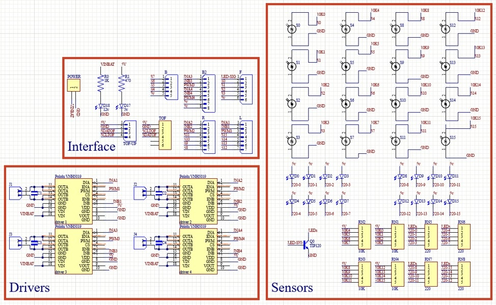
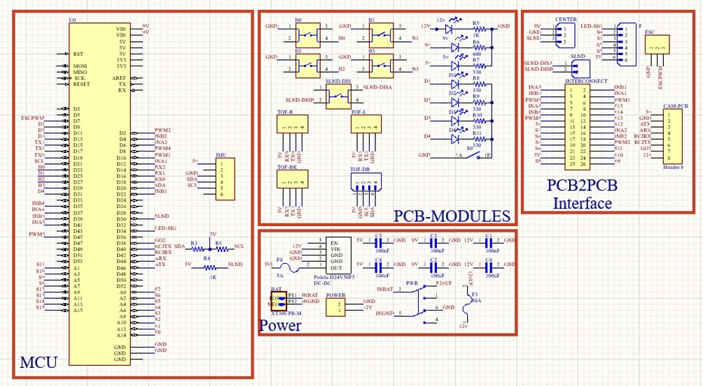
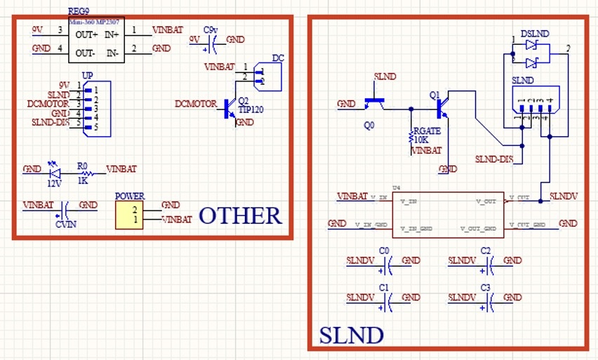
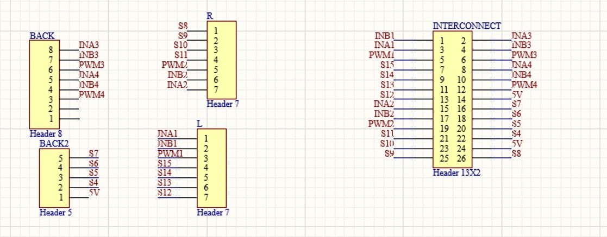
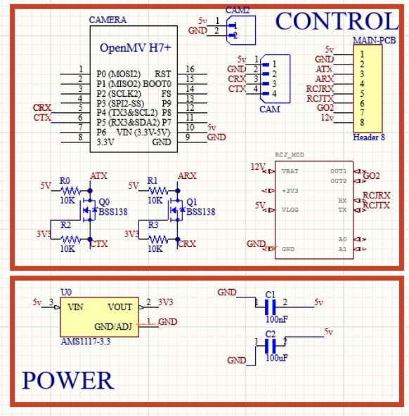

## PCB

*PCB of your robot*

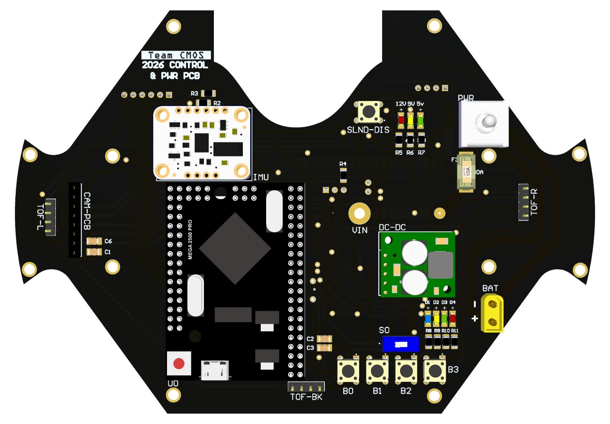
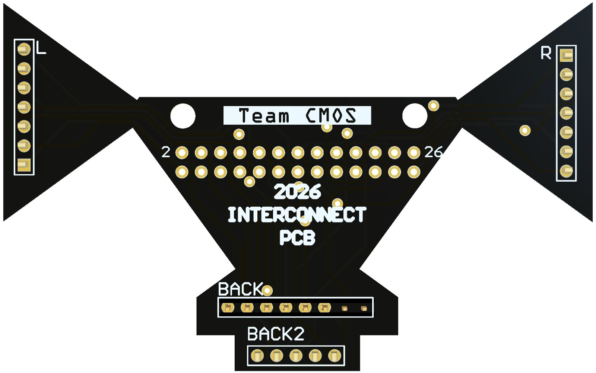
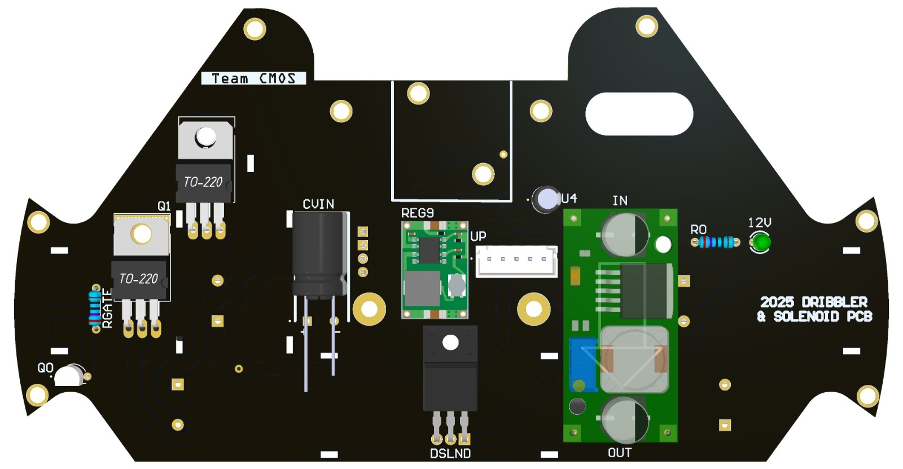

## Electronics Innovation

*Electronics Innovations*

We designed a fully modular system where a robot can effortlessly donate parts to another with no modification

## Circuit Photos

*Photo of your circuit boards highlights*

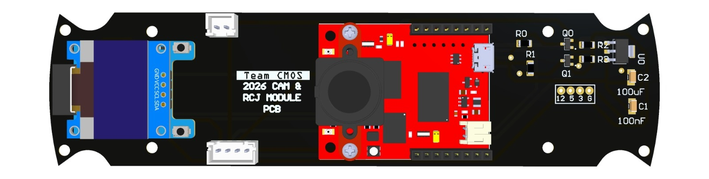

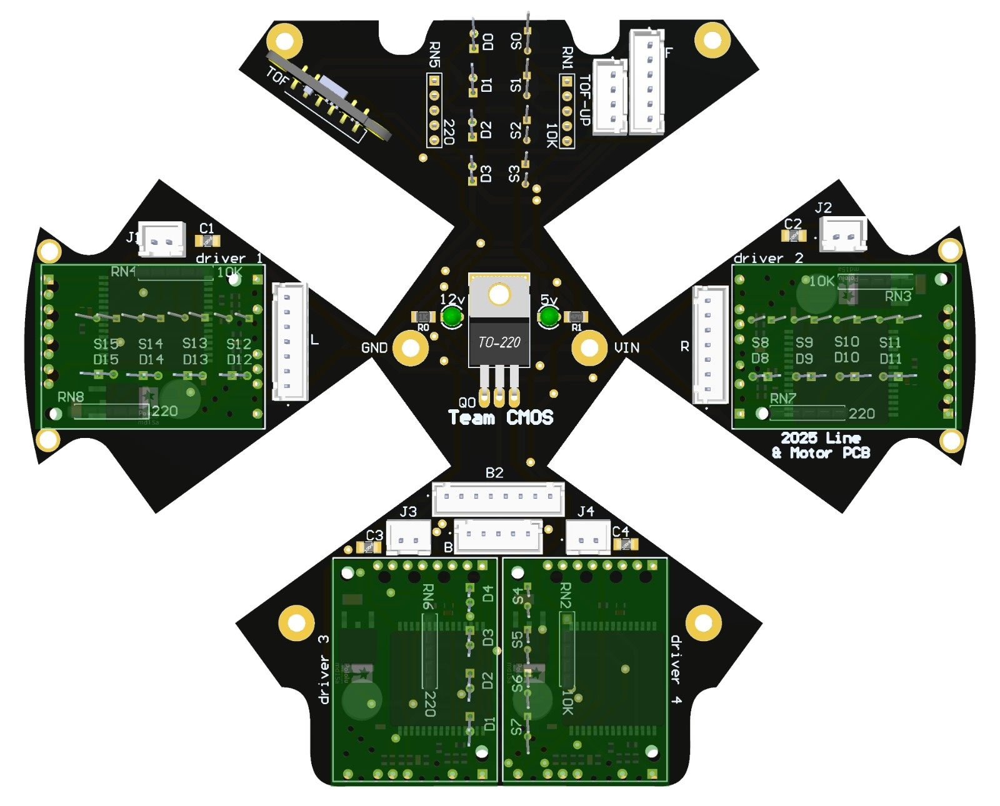

## Ball Detection Method

*How do you find where the ball is? How do you read the data from the ball detection sensors and/or camera?*

Using the omni vision mirror that the camera is faced at, it detects the

## Ball Catch Algorithm

*How does your algorithm work to catch the ball? Is there a difference between your robots in how they move towards the ball? Explain the differences.*

Yes, the attacking robot rotates and uses PID to face the ball then moves towards it. While the keeper moves side to side laterally only, also using PID.

## Positioning Algorithm

*How do you use your sensors in your algorithm to find your position inside the field and how do you use that position to move your robots around?*

We use the IMU to determine heading position and TOF sensors to determine location in field relative to walls

## Line Algorithm

*How does your robot find the lines to stay inside the field? What algorithms do you use to avoid going out of bounds?*

We use a standard acoid method where we check for a line and if it exists we stop all processes and avoid it then continue

## Goal Algorithm

*What algorithms do you use to score goals? How do you use your kicker and dribbler to handle the ball?*

We use a reverse score method, by taking the ball, facing backwards, moving towards goal, then rotating and shooting depending on position in field

## Defense Algorithm

*What algorithms do you use to avoid the opponent team scoring? How do your robots defend your own goal?*

Using lateral movement to block shots

## Robot Communication

*Do your robots communicate with each other? How do you use this communication to your advantage?*

No

## Software Innovation

*Software Innovations*

We used fixed white balance and specific RGB color gains to achieve a very stable camera even in changing lighting conditions

## GitHub Link

*GitHub link*

https://github.com/youssefshalaan/Soccer-2026-Egypt

## BOM

*Bill of Materials (BOM)*

[https://drive.google.com/open?id=1Wdcf0PtL8f2RhzgaSdWYf-tfZjxwBgi0](https://drive.google.com/open?id=1Wdcf0PtL8f2RhzgaSdWYf-tfZjxwBgi0)

## Cost

*How much did it cost you to build your robots?*

Experiments: 300usd
Robots: 2000usd
Environment:100usd

## Funding

*How did you gathered the funds to build the robots?*

Parents
Robotics Centre
Sponsors (OpenMV)

## Affordability

*How affordable was it to compete in RoboCupJunior Soccer?*

5

## Answer Check

*Have you checked all of your answers?*

Yes!

## Publication Consent

*We publish TDPs and posters during or after the competition as described in the beginning*

Yes, we acknowledge everything submitted in the above form can be published.

