## Timestamp

*Tijdstempel*

28-6-2026 16:23:18

## Email Address

*E-mailadres*

aparaj.bogahawatta@gmail.com

## TDP File

*TDP File Upload (Not required)*

## Team Name

*What is your team's name?*

Hyperion

## League

*What league do you participate in?*

IR League

## Country

*Where are you from?*

Brisbane, Queensland, Australia

## Contact

*If other teams have questions about your robot, now or in the future, what email address(es) can we publish along with this document for people to reach you?

(You can put in multiple email addresses, like multiple team members, an email for the whole team or both. Feel free to share other ways of communication like Discord handles)*

Team Hyperion Email: hyperionbbc@gmail.com

## Social Media

*Team Social Media Links (if you have any)*

YT: https://www.youtube.com/@hyperion-bbcrobotics

## Team Photo

*Upload a photo of your whole team with your mentor and robots

Note: This is not mandatory and will be published along with your TDP if you choose to upload something*

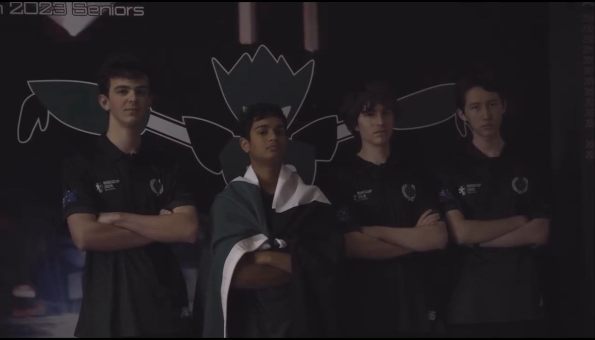

## Members & Roles

*What are the names of the team members and their role(s)?*

Matthew Adams: Electrical
Luke Atherton: Structural
Sam Garg: Software (Strategy)
Thomas McCabe: Software (Vision)

## Meeting Frequency

*How often did your team meet?
(e.g. 90 minutes once per week or a day every weekend.)*

During school term: 2.5 hours twice per week. During holidays: 4 hours three times per week

## Meeting Place

*Where did you meet to work on your robot?
(e.g. a robotics room at school, at some other place, one of your homes, school library etc.)*

We meet at our school’s designated robotics lab, the Brisbane Boys’ College Robotics Lab.

## Start Date

*When did your team start working on this year's robot?*

October 2025, after Australian Nationals

## Past Competitions

*Which RoboCupJunior competitions have you competed in and in which leagues?*

Brisbane Regional Competition 2026: Lightweight Soccer
Australian National Championship 2025: Lightweight Soccer
Queensland State Championship 2025: Lightweight Soccer
International Championship 2025: Lightweight Soccer
Australian National Championship 2024: Lightweight Soccer
Queensland State Championship 2024: Lightweight Soccer
Brisbane Regional Competition 2024: Lightweight Soccer

## Mentor Contribution

*Which parts of your work received the most contribution from your mentor?*

Our mentor assisted to debug electrical issues with the kicker PCB and our Out of bounds algorithm with the light sensors.

## Workload Management

*How did you manage the workload?*

By communicating via Teams, WhatsApp, and Discord, and using to-do lists and work logs, we managed our workload efficiently! This consistent workflow helps track our robot's progress, saves time, and cuts out redundant tasks.

## AI Tools

*Which AI tools did you use?*

We use Gemini for coding practices, field strategies, and docs, and Claude Code to design an aesthetic, secure website.

## Robot1 Overall

*Robot 1 Overall View*

## Robot1 Front

*Robot 1 Front view*

## Robot1 Back

*Robot 1 Back view*

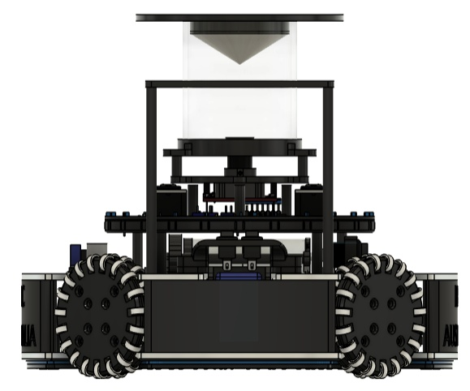

## Robot1 Top

*Robot 1 Top View*

## Robot1 Bottom

*Robot 1 Bottom View*

## Robot1 Right

*Robot 1 Right View*

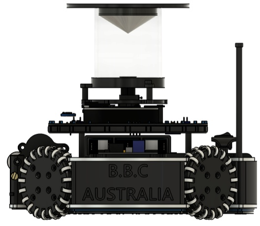

## Robot1 Left

*Robot 1 Left View*

## Robot2 Overall

*Robot 2 Overall View*

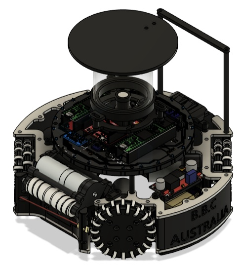

## Robot2 Front

*Robot 2 Front view*

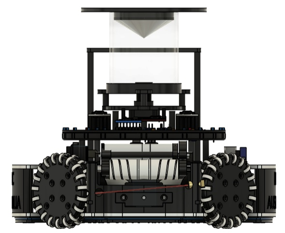

## Robot2 Back

*Robot 2 Back view*

## Robot2 Top

*Robot 2 Top View*

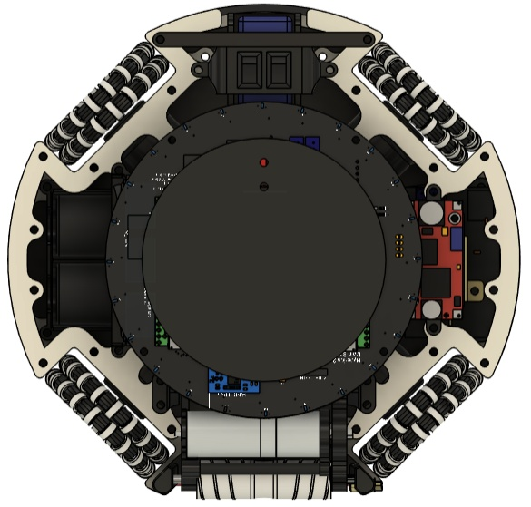

## Robot2 Bottom

*Robot 2 Bottom View*

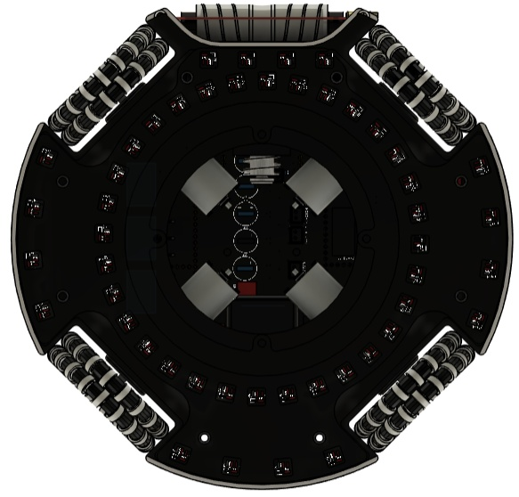

## Robot2 Right

*Robot 2 Right View*

## Robot2 Left

*Robot 2 Left View*

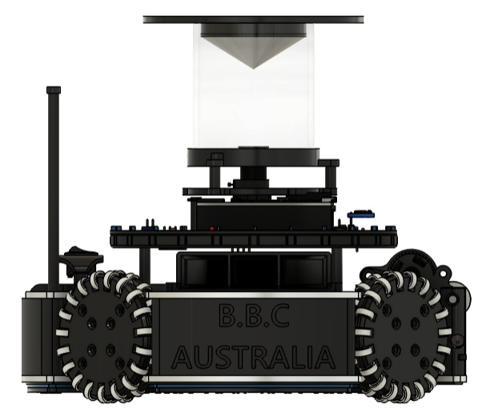

## Mechanical Design

*How did you design the mechanical parts of your robots?*

Using Autodesk Fusion 360, we upgraded our previous robot by adding a kicker, dribbler, and custom dual-layer omni wheels. To offset the added weight, we optimised existing components to minimise mass while ensuring structural strength. Key changes included designing a compact, high-stability wheel hub and heavily modifying the internal layout to fit the new mechanical systems alongside the PCBs and motors.

## Build Method

*How did you build your design?*

We manufacture parts using Bambu Lab 3D printers (PLA/ABS) and a CNC miller for 3mm aluminium plates. PCBs are ordered from JLCPCB, with components mainly sourced via Digikey. PCBs were hand soldered.

## Motors & Reason

*How many motors have you used and why?*

The robot features an X-shaped drive system with four 3D-printed-bracket-mounted Maxon DCX19 motors for omnidirectional movement without rotation. Overvolted at 12V for extra speed and torque, they power custom dual-layer omni wheels. These wheels use durable ABS frames and silicone-moulded rollers on metal cores, maximising traction, surface contact, and stability during competitive play.

## Kicker Design

*If your robot has a kicker, explain how you designed and built the mechanics of the kicker*

Our kicker uses a modified TAKAHA CB1037 solenoid with a custom 250-turn coil and a lightweight 3D-printed casing. The standard tip was replaced with a horizontal bar for reliable ball contact. Powered via a voltage booster that jumps 12V to 48V, it delivers a significantly stronger kick.

## Dribbler Design

*If your robot has a dribbler, explain how you designed and built the mechanics of the dribbler.*

Our dribbler uses a 3D-printed housing with a 1:4 speed-multiplying gear train, running the motor efficiently while spinning the roller at high velocities to save power. The roller features silicone molded around a 3D-printed rod to maximize grip and prevent ball slippage in the capture zone.

## CAD Files

*CAD design files*

https://github.com/Team-Hyperion-BBC-Robotics/Team-Hyperion/tree/main/2026%20(RCJ%20Lightweight%20Soccer%20and%20Open%20Soccer)/Hardware

## Mechanical Innovation

*Mechanical Innovation*

Our most significant innovation was a custom wheel hub, inspired by previous models, designed to attach our dual-layered omni wheels. This integration achieved better traction on the slippery felt field.

The hub directly modifies our existing design by adding a specialised internal groove for a square nut. This allows a bolt to tighten directly onto the motor's D-shaft, ensuring a secure mechanical connection that eliminates the risk of the wheel sliding off the axle.

## Mechanical Photos

*Photos of your mechanical designs highlights*

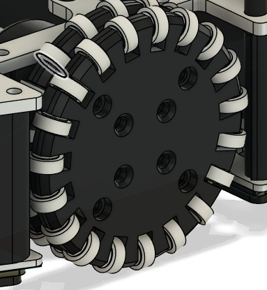
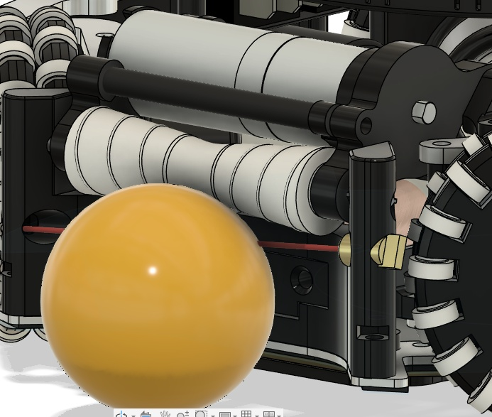

## Electronics Block Diagram

*Provide us with a block diagram of your robot's electronics*

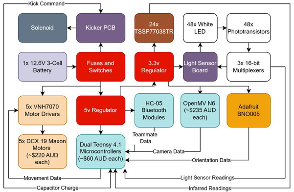

## Power Circuit

*How does your power circuits work?*

A 12.6V LiPo battery powers the motors and kicker directly. Buck converters step this down to 5V (for the Teensys, camera, Bluetooth, and photogate) and 3.3V (for the IMU, IR sensors, and light ring), ensuring a stable, regulated power supply across all components.

## Motor Drive Circuit

*How do you drive your motors? Explain the circuits you use for that*

The robot uses five VNH7070 motor drivers powered directly by the battery. Four drivers control the drive system, receiving PWM commands from dual Teensy 4.1 microcontrollers to regulate each motor's speed and direction, enabling precise and powerful omnidirectional movement.

## Microcontroller & Reason

*What kind of micro controller or board do you use for your robot? Why did you decide to use this part for your robot? If you have more than 1 processor, explain each one separately.*

We use two Teensy 4.1 microcontrollers. One MCU reads the 24 TSSP sensors and communicates the ball data to the primary MCU via UART. The primary MCU reads the light sensors, IMU, receives the ball data and drives the motors and kicker.

## Motor Control

*How do you use your processor to move your motors?*

Exit VNH7070 standby: hold InA and InB HIGH for at least 20us. To drive, set one LOW, the other HIGH, while modulating PWM for speed. Both HIGH locks the motor; both LOW coasts. To coordinate, the processor uses a cosine function to calculate exact speed and direction for each motor.

## Ball Detection

*How does your ball detection sensors and/or camera[s] work?*

Our system detects a 40kHz IR ball using TSSP77038TR sensors. The ball's 24% duty cycle is polled over a 10ms window to locate it. To ensure stability, an Exponential Moving Average (EMA) filter smooths the data and remove high frequency noise on the readings. We then treat each value as a vector and sum them to determine the ball direction and strength.

## Line Detection

*How does your line detection circuits work?*

The robot has 48 LEDs/phototransistors. These are multiplexed using 3x 16 channel multiplexers for the primary MCU to read. 32 sensors are arranged in a ring and the other 16 are placed on the edge of the robot for early line detection.

## Navigation/Position Sensors

*What sensors do you use for navigation and how are these sensors connected to your processor? What sensors do you use to find your position in the field? What about the direction your robot faces?*

Connected to a Teensy processor, our robot uses an OpenMV N6 Camera via UART for absolute positioning, calculating coordinates using trigonometry on blue and yellow goals. For heading, a BNO055 sensor connects via I2C. By setting a baseline orientation upon startup or software reset, it continuously tracks our true direction relative to the field, ensuring dynamically accurate movement.

## Kicker Circuit

*How do you drive your kicker system? How does the circuit make the kicker work?*

A 12V supply is boosted to 48V to charge two parallel 4700μF capacitors. The microcontroller monitors this charge via a voltage divider. Upon a command, two N-channel MOSFETs discharge the energy through the solenoid to kick. A manual button routes power through a 50Ω resistor to safely de-energize.

## Dribbler Circuit

*How does your dribbler system work? What components and circuits did you use to drive it?*

Our dribbler system is a fifth Maxon motor which its circuit is integrated into our main board and is powered the same as the drive motors.

## Schematics

*Schematics of your robot*

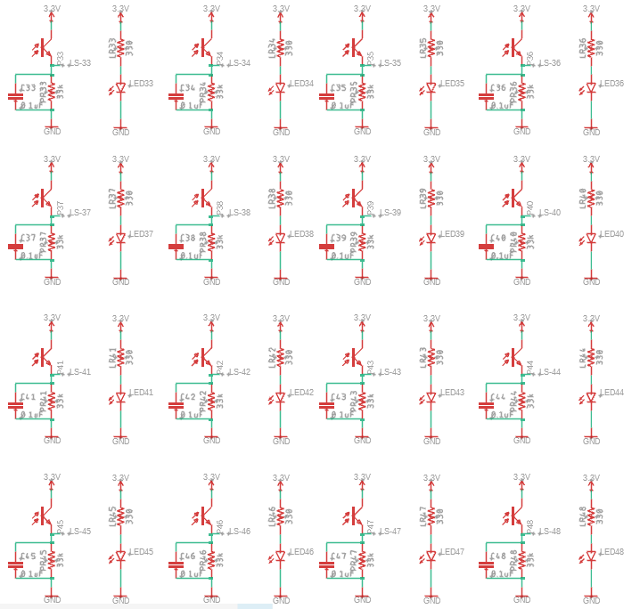
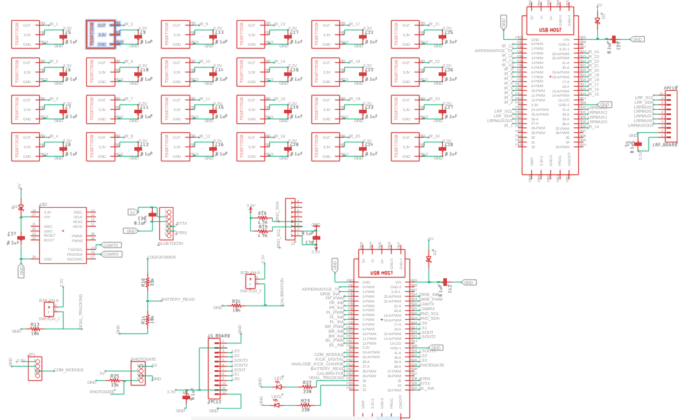
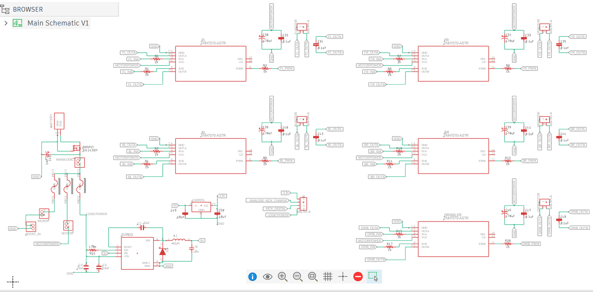
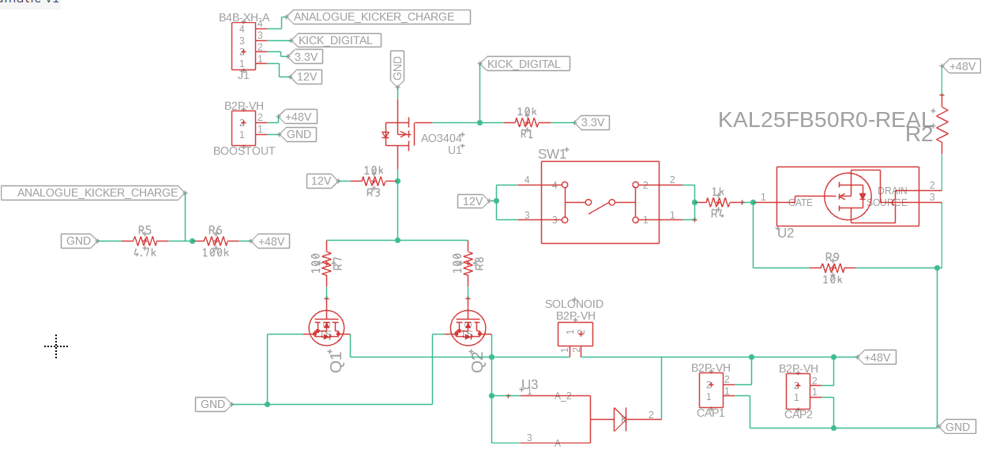
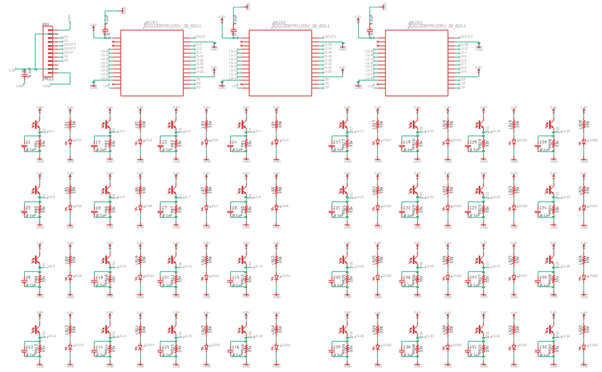

## PCB

*PCB of your robot*

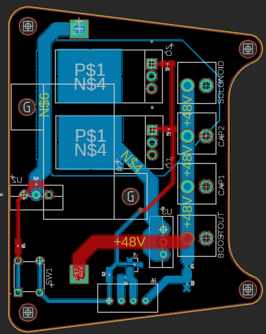
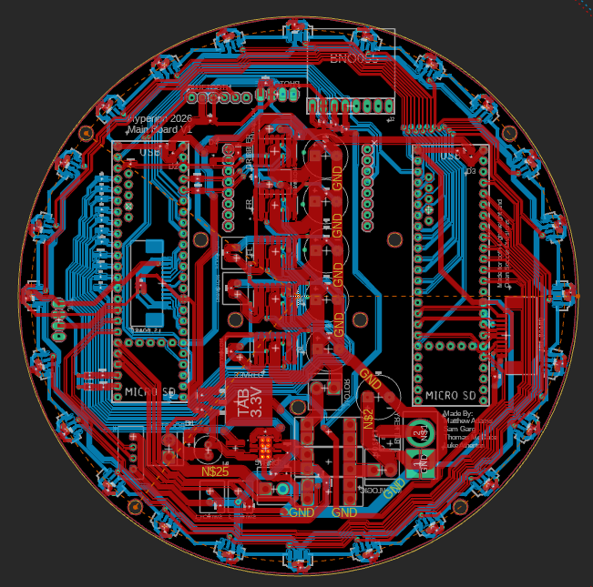
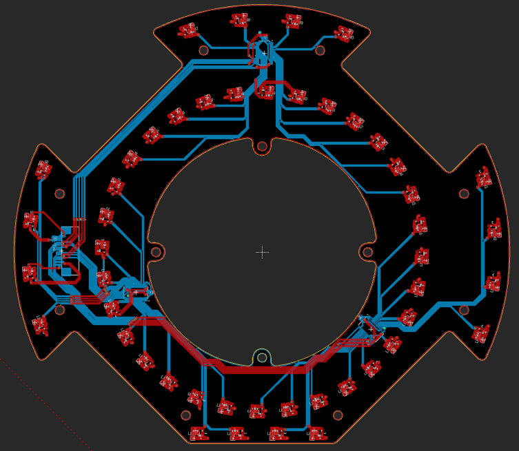

## Electronics Innovation

*Electronics Innovations*

A key innovation in our design is the custom dual-ring light sensor board, which provides a fast and reliable line avoidance system. The board utilizes a total of 48 sensors arranged in two concentric rings: an outer ring of 32 sensors and an inner ring of 16 sensors. 

The 32 sensors on the outer ring are divided into four distinct directional zones (front, back, left, and right) to provide rapid boundary detection and early warning alerts. The inner ring of 16 sensors serves as the primary trigger, signalling the robot to execute immediate corrective manoeuvres to remain within bounds. 

Integrating all 48 sensors into a single, consolidated printed circuit board (PCB) significantly reduces internal wiring. This layout minimizes the risk of loose connections and simplifies troubleshooting by allowing for rapid fault isolation.

## Circuit Photos

*Photo of your circuit boards highlights*

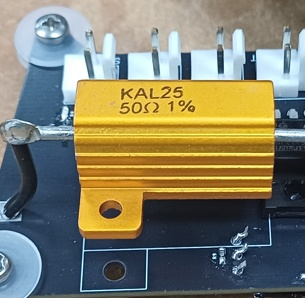
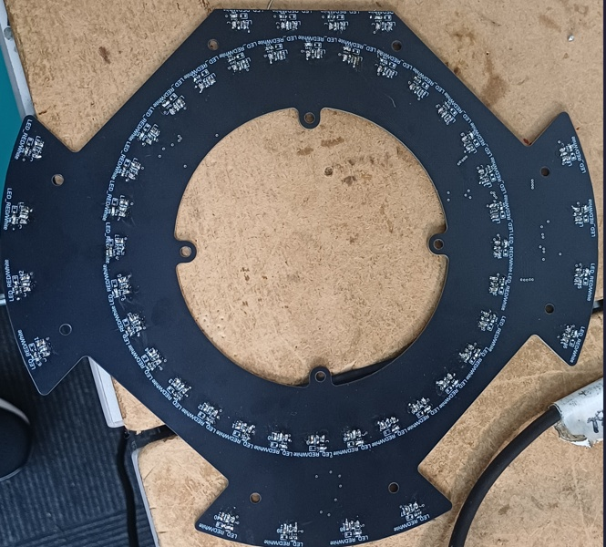
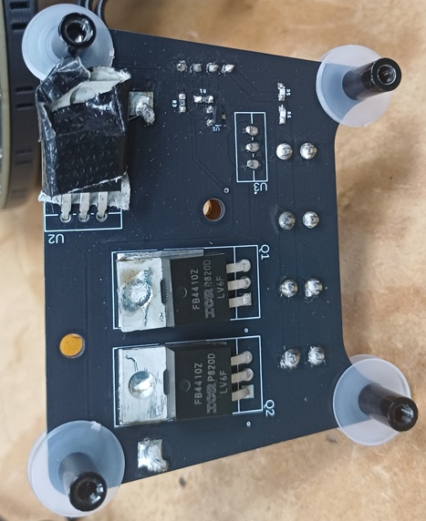
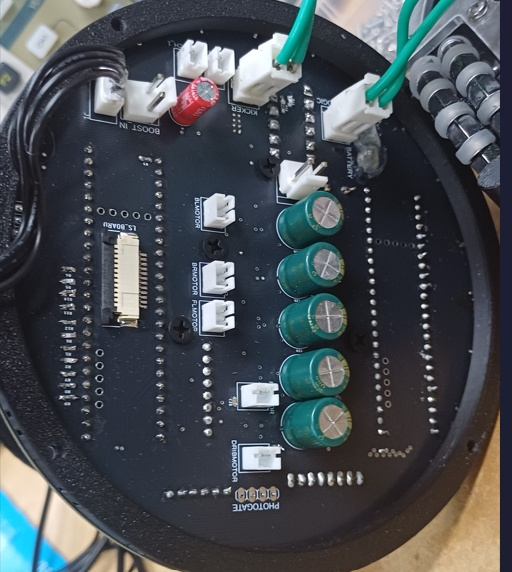
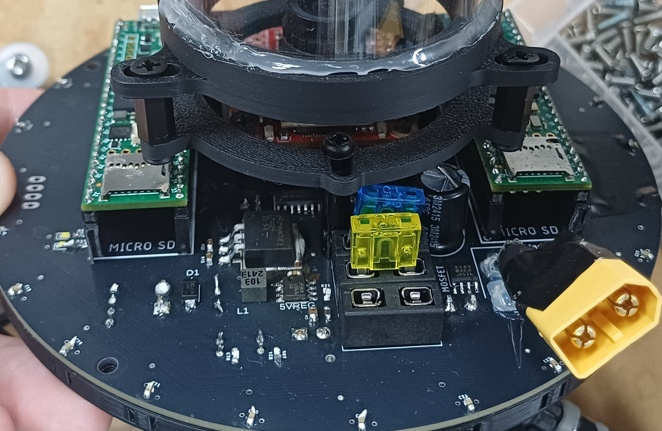

## Ball Detection Method

*How do you find where the ball is? How do you read the data from the ball detection sensors and/or camera?*

To locate the ball, our robot rapidly polls 24 IR sensors over a 20-millisecond window to count detected light pulses. These raw counts are normalised against the ball's duty cycle and smoothed by an EMA filter to prevent erratic spikes. Vector summation then resolves the exact relative angle. The magnitude is scaled to 0-100% for distance and sent via UART to the processor.

## Ball Catch Algorithm

*How does your algorithm work to catch the ball? Is there a difference between your robots in how they move towards the ball? Explain the differences.*

Our two-Teensy system uses a secondary Teensy to read IR sensors, pinpointing the ball's angle and distance without a camera. The primary Teensy uses this data to steer a smooth, curved orbit behind the ball, slowing for sharp turns and surging forward when perfectly aligned. This fluid approach replaces an older, twitchy method that ignored distance and glitched across the center line.

## Positioning Algorithm

*How do you use your sensors in your algorithm to find your position inside the field and how do you use that position to move your robots around?*

Using a camera to spot coloured goals, the robot calculates distance by size and notes the angle. Combining this with a digital compass, it pinpoints exact field coordinates. It navigates by plotting a straight line to the target, smoothly setting speed and direction. When the ball is off-field, this system centers the robot, ensuring the fastest route to the next ball.

## Line Algorithm

*How does your robot find the lines to stay inside the field? What algorithms do you use to avoid going out of bounds?*

Our robot multiplexes 48 light sensors, using dynamic calibration to isolate white lines. A Center of Mass algorithm generates a raw line vector from these active sensors. This vector is compass-corrected for field relativity and processed by a state machine tracking crossing depth. Finally, a PID controller uses this data to dynamically scale recovery speed in the exact opposite direction.

## Goal Algorithm

*What algorithms do you use to score goals? How do you use your kicker and dribbler to handle the ball?*

To score efficiently, our software merges orbit and goal-tracking algorithms using TSSP sensors and a camera. The orbit algorithm calculates an offset to position the robot behind the ball. Upon contact, an active dribbler firmly secures it, preventing wasted kicks and enabling passes. Using camera data, the robot dynamically aligns with the goal and triggers a powerful, calculated kick.

## Defense Algorithm

*What algorithms do you use to avoid the opponent team scoring? How do your robots defend your own goal?*

Our defender uses three PID controllers. A rotational PID keeps the robot facing away from the goal. The vertical PID controls depth via line sensors, using camera distance if the line is lost. The horizontal PID centres the robot, or laterally mirrors the ball to block shots. Combining these outputs into one resultant vector ensures fluid, omnidirectional movement to protect the goal.

## Robot Communication

*Do your robots communicate with each other? How do you use this communication to your advantage?*

The robots communicate via bluetooth assigning roles based on a 100-point score. The ball proximity (40pts), front attack cone (20), goal alignment (15), defensive distance (15), and battery health (10) are the factors the algorithm will consider. The robot with the highest score attacks. If one robot is taken off, then the remaining robot defends the goal.

## Software Innovation

*Software Innovations*

Our proudest innovation is a multi-stage IR sensor pipeline to track a 40kHz pulsed ball. We rapidly poll 24 TSSP77038TR sensors 500 times per 10ms window. To prevent jitter, an EMA filter blends this with historical data, halving standard deviation to 0.47. A vector summation calculates exact relative angles, while raw magnitude (110-130) is scaled to a 0-100% value. This information is sent to the main controller to determine motor movements.

## GitHub Link

*GitHub link*

https://github.com/Team-Hyperion-BBC-Robotics/Team-Hyperion

## BOM

*Bill of Materials (BOM)*

[https://drive.google.com/open?id=1605ioj5zMtxmfVHzTSfSkzvatkaK7vDL](https://drive.google.com/open?id=1605ioj5zMtxmfVHzTSfSkzvatkaK7vDL)

## Cost

*How much did it cost you to build your robots?*

Robots: $3,834 AUD (~$2,530 USD)

Spares & Experiments: $1,550 AUD (~$1,023 USD)

Environment: $0 AUD (Reused)

Total: $5,384 AUD (~$3,553 USD)

Conversion rate: 1 AUD = 0.66 USD

## Funding

*How did you gathered the funds to build the robots?*

100% School

## Affordability

*How affordable was it to compete in RoboCupJunior Soccer?*

5

## Answer Check

*Have you checked all of your answers?*

Yes!

## Publication Consent

*We publish TDPs and posters during or after the competition as described in the beginning*

Yes, we acknowledge everything submitted in the above form can be published.

