## Timestamp

*Tijdstempel*

28-6-2026 11:14:31

## Email Address

*E-mailadres*

jdengxia@gmail.com

## TDP File

*TDP File Upload (Not required)*

## Team Name

*What is your team's name?*

Kavosh Soccer

## League

*What league do you participate in?*

IR League

## Country

*Where are you from?*

Canada

## Contact

*If other teams have questions about your robot, now or in the future, what email address(es) can we publish along with this document for people to reach you?

(You can put in multiple email addresses, like multiple team members, an email for the whole team or both. Feel free to share other ways of communication like Discord handles)*

jdengxia@gmail.com, ssd.satyar@gmail.com, benjihan777@gmail.com

## Social Media

*Team Social Media Links (if you have any)*

N/A

## Team Photo

*Upload a photo of your whole team with your mentor and robots

Note: This is not mandatory and will be published along with your TDP if you choose to upload something*

## Members & Roles

*What are the names of the team members and their role(s)?*

Benjamin: Programming and electronics
Jayden: 3d designer and Electronic designer

## Meeting Frequency

*How often did your team meet?
(e.g. 90 minutes once per week or a day every weekend.)*

3h30mins on Fridays

## Meeting Place

*Where did you meet to work on your robot?
(e.g. a robotics room at school, at some other place, one of your homes, school library etc.)*

Robotics lab

## Start Date

*When did your team start working on this year's robot?*

This year

## Past Competitions

*Which RoboCupJunior competitions have you competed in and in which leagues?*

vancouver west regional canada, light weight league.

## Mentor Contribution

*Which parts of your work received the most contribution from your mentor?*

Designing electroic boards

## Workload Management

*How did you manage the workload?*

We used telegram to communicate, and met every Friday

## AI Tools

*Which AI tools did you use?*

Claude, Chatgpt we used them to help list the the parts in our inventory

## Robot1 Overall

*Robot 1 Overall View*

## Robot1 Front

*Robot 1 Front view*

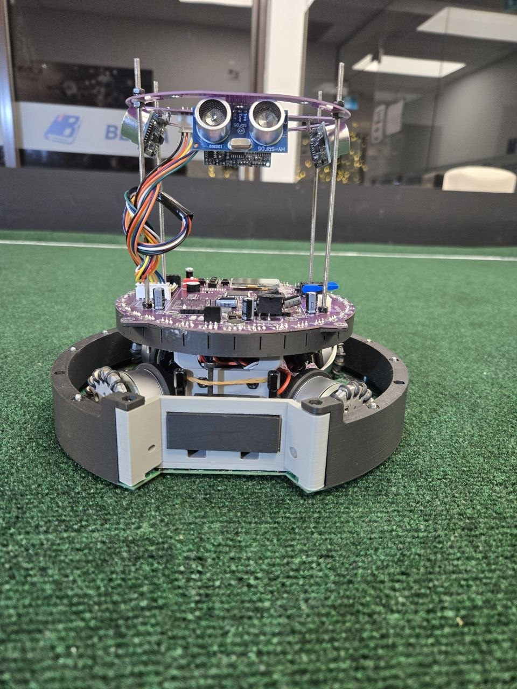

## Robot1 Back

*Robot 1 Back view*

## Robot1 Top

*Robot 1 Top View*

## Robot1 Bottom

*Robot 1 Bottom View*

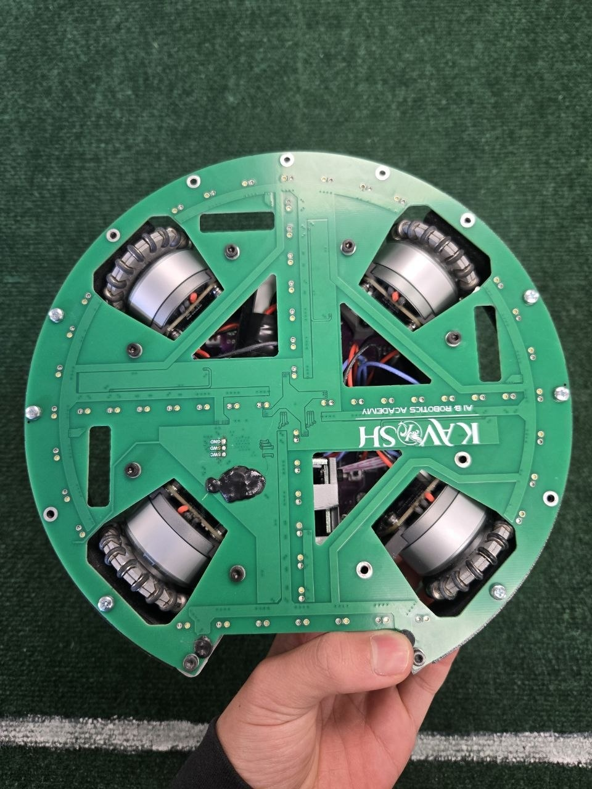

## Robot1 Right

*Robot 1 Right View*

## Robot1 Left

*Robot 1 Left View*

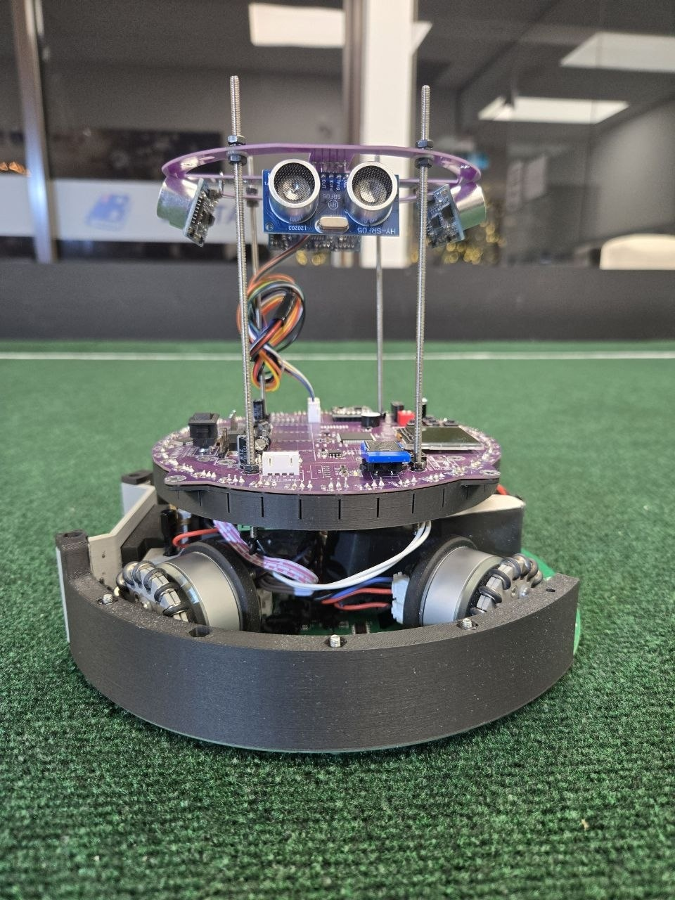

## Robot2 Overall

*Robot 2 Overall View*

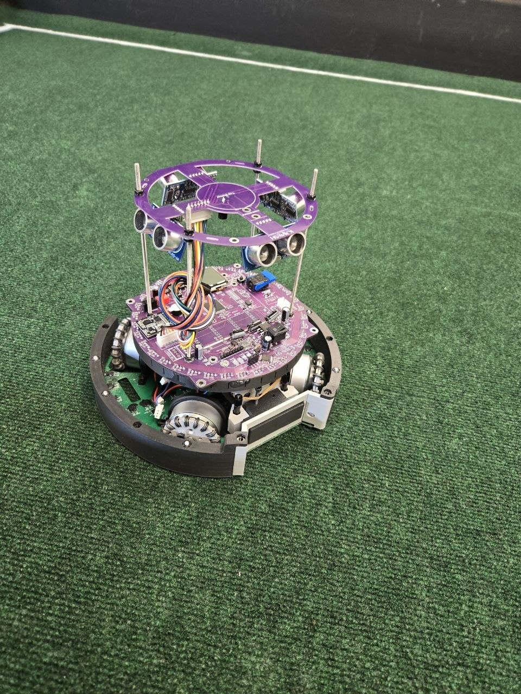

## Robot2 Front

*Robot 2 Front view*

## Robot2 Back

*Robot 2 Back view*

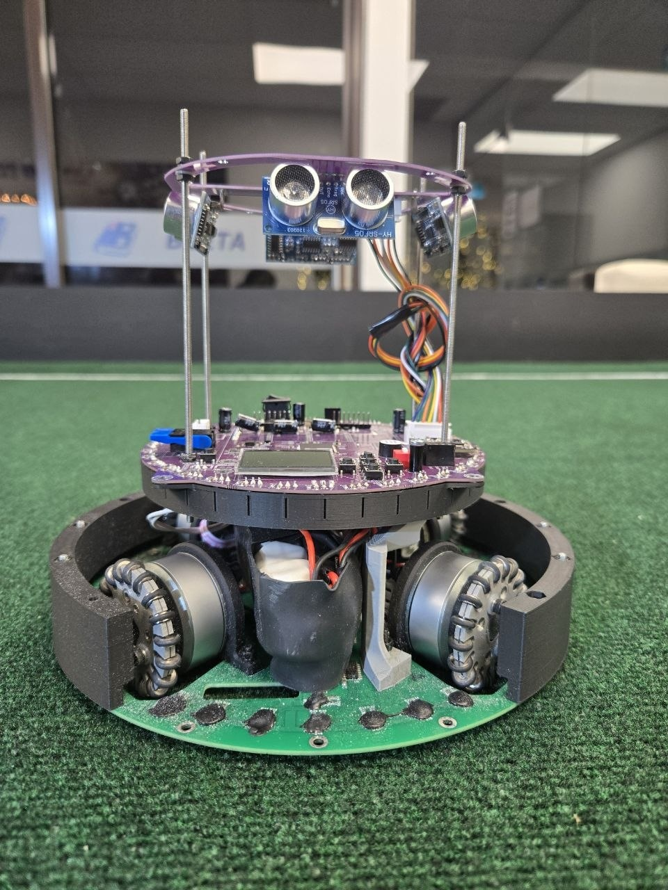

## Robot2 Top

*Robot 2 Top View*

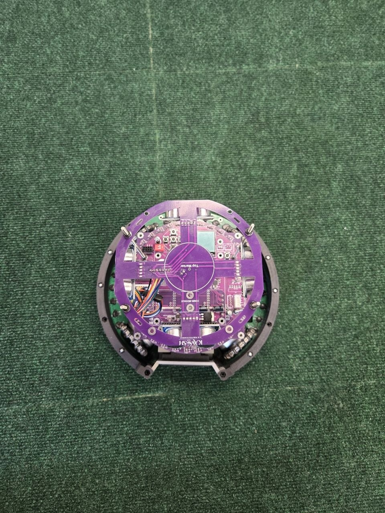

## Robot2 Bottom

*Robot 2 Bottom View*

## Robot2 Right

*Robot 2 Right View*

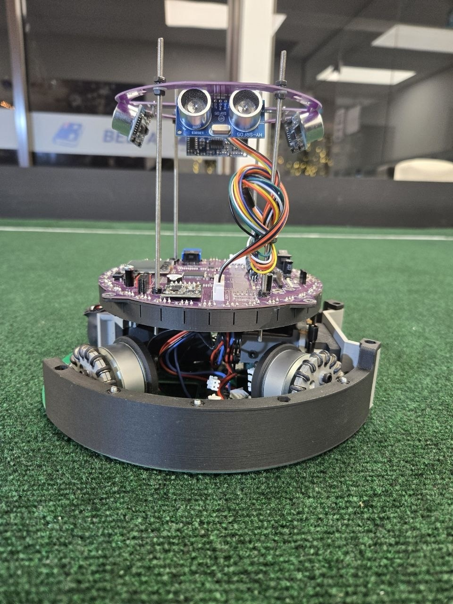

## Robot2 Left

*Robot 2 Left View*

## Mechanical Design

*How did you design the mechanical parts of your robots?*

We used Fusion 360 to design our mechanical parts and modify specific components, such as the omniwheel mounts and TSSP sensor covers. Since many parts connect together and face strong contact during matches, they had to be both strong and lightweight to stay under the weight limit. We also designed parts with multiple purposes; for example, the front guard protects the robot from collisions while also connecting the top and bottom layers.

## Build Method

*How did you build your design?*

We used a A1 3d printer to print the parts we had previously designed. Our PCBs where made externally, the company that made the PCB is JLCPCB.

## Motors & Reason

*How many motors have you used and why?*

Omnidirectional movement. With 4 omni-wheels arranged at 45° angles, the robot can move in any direction instantly without rotating first. 3 or other amounts of wheels can also achieve this, but 4 gives better force distribution, each wheel contributes more evenly when strafing.

## Kicker Design

*If your robot has a kicker, explain how you designed and built the mechanics of the kicker*

Our robot uses a premade solenoid. The specific solenoid is made by Takaha and the model is 10Ω(CB10370100)

## Dribbler Design

*If your robot has a dribbler, explain how you designed and built the mechanics of the dribbler.*

N/A

## CAD Files

*CAD design files*

https://github.com/JDengXia/Kavosh-3d-models

## Mechanical Innovation

*Mechanical Innovation*

Im most proud of the design for connecting our solenoid to the bracket that holds it. This design took along time and many iterations to get right.

## Mechanical Photos

*Photos of your mechanical designs highlights*

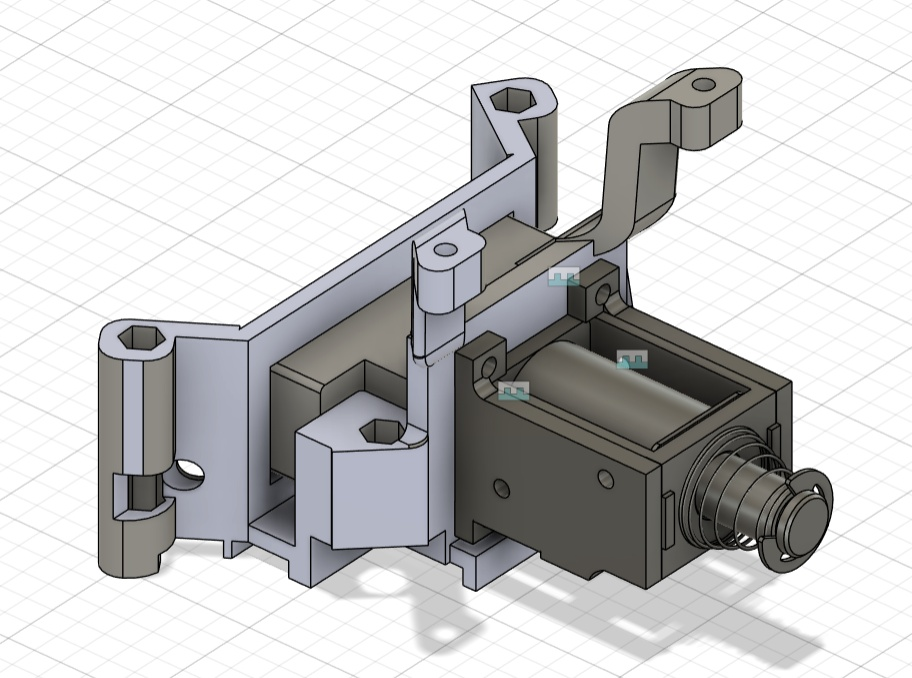
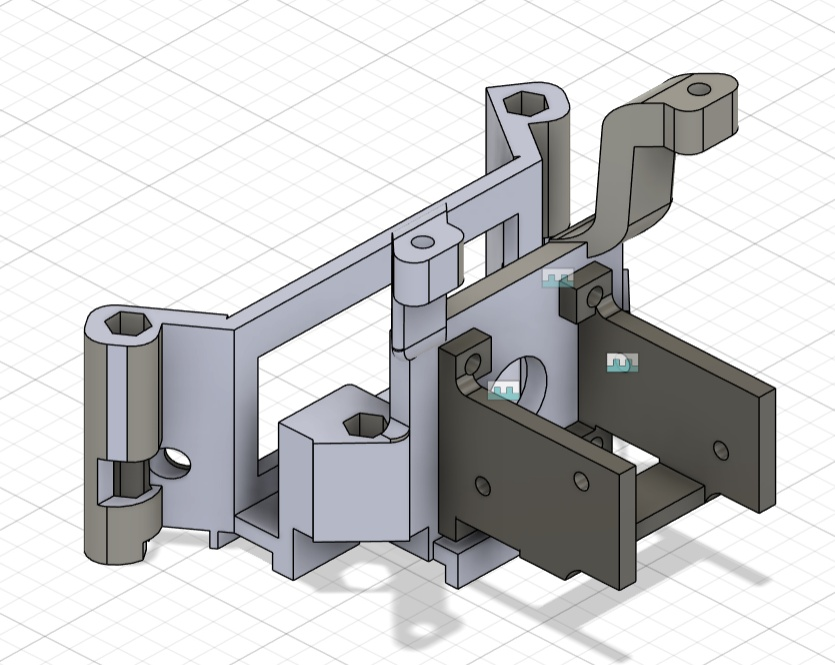

## Electronics Block Diagram

*Provide us with a block diagram of your robot's electronics*

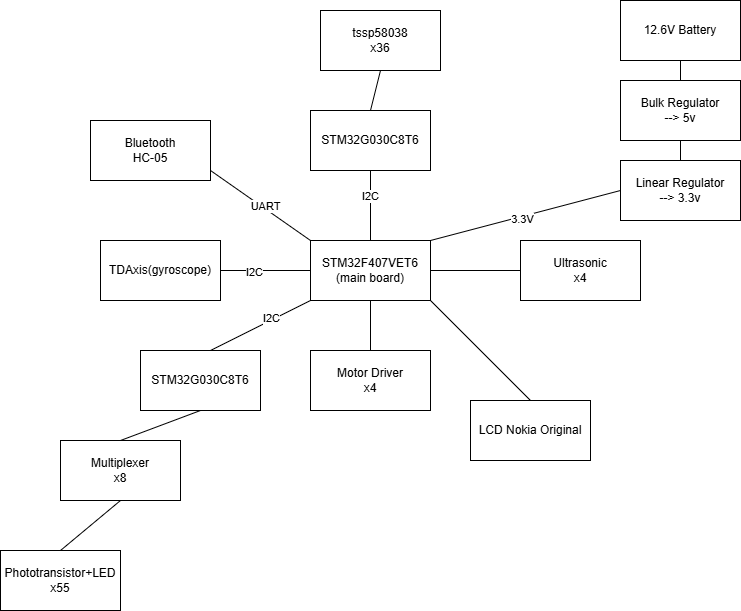

## Power Circuit

*How does your power circuits work?*

Our robot uses a 3-cell lithium-ion battery pack, which provides up to 12.6 V when fully charged. A regulator steps this down to 5 V for the motor drivers, IMU/gyroscope, ultrasonic sensors, and other electronics, while a 3.3 V LDO powers the STM32 microcontrollers.

## Motor Drive Circuit

*How do you drive your motors? Explain the circuits you use for that*

All the motor drivers have a clock line and a data line, this allows the proccesor to send signals to all the drivers.

## Microcontroller & Reason

*What kind of micro controller or board do you use for your robot? Why did you decide to use this part for your robot? If you have more than 1 processor, explain each one separately.*

The STM32G030C8T6 is used on the sensor boards because it is low-cost and has enough GPIO and ADC resources for reading sensors. The STM32F407VET6 is used as the main controller because it has higher speed, more memory, and better communication features for movement and decision-making.

## Motor Control

*How do you use your processor to move your motors?*

The proccessor communictates with the motor driver which then makes the motor spin. All the motors have a clock line and a data line, these are all connected together. When the proccessor wants to talk to a specific motor it will use it's id(0,1,2,3).

## Ball Detection

*How does your ball detection sensors and/or camera[s] work?*

The ball emits a 40Hz square wave, so each sensor only reads 0 if it detects the ball and 1 if not. Since the signal does not show distance, our robot uses 36 sensors spaced 10° apart. The algorithm finds the largest group of sensors reading 1, including wrap-around groups, then calculates the group’s center to find the ball’s angle. The size of the group estimates distance, allowing the robot to locate the ball.

## Line Detection

*How does your line detection circuits work?*

Our robot uses 55 LED-phototransistor boundary sensors. Each LED shines light at the floor, and the phototransistor reads the reflection. A brighter reflection means the sensor sees the white boundary line, so the main board detects which side crossed and moves the robot away.

## Navigation/Position Sensors

*What sensors do you use for navigation and how are these sensors connected to your processor? What sensors do you use to find your position in the field? What about the direction your robot faces?*

Our robot uses TSSP sensors, ultrasonic sensors, a gyroscope, and phototransistors. TSSPs detect the ball and guide movement. Four ultrasonic sensors measure distance to the walls for LocationX and LocationY, helping the goalie stay near the goal. The gyroscope tracks angle changes, while LED and phototransistor pairs detect white boundary lines.

## Kicker Circuit

*How do you drive your kicker system? How does the circuit make the kicker work?*

We have a booster that changes our power output from 12.6V to 47V. It sends the 47V to the kicker driver which then uses the high voltage to power the kicker. The kicker driver connects to the output of the driver to the transistor which allows us to send commands to activate the kicker.

## Dribbler Circuit

*How does your dribbler system work? What components and circuits did you use to drive it?*

N/A

## Schematics

*Schematics of your robot*

[https://drive.google.com/open?id=1RbG5LsTfDVH4Q3fTs7QLu6TelTUFdD76](https://drive.google.com/open?id=1RbG5LsTfDVH4Q3fTs7QLu6TelTUFdD76)

## PCB

*PCB of your robot*

[https://drive.google.com/open?id=1qe4zkkOKHSYA5NI5VfMS93cXZBd6Q5K5](https://drive.google.com/open?id=1qe4zkkOKHSYA5NI5VfMS93cXZBd6Q5K5)

## Electronics Innovation

*Electronics Innovations*

We are most proud of the ball sensor board/main proccessor board because, previously we had two separate boards, one for proccessing and one for sensing the ball. We tried really hard to intergrate these two because combinning these two reduces our weight by quite a bit.

## Circuit Photos

*Photo of your circuit boards highlights*

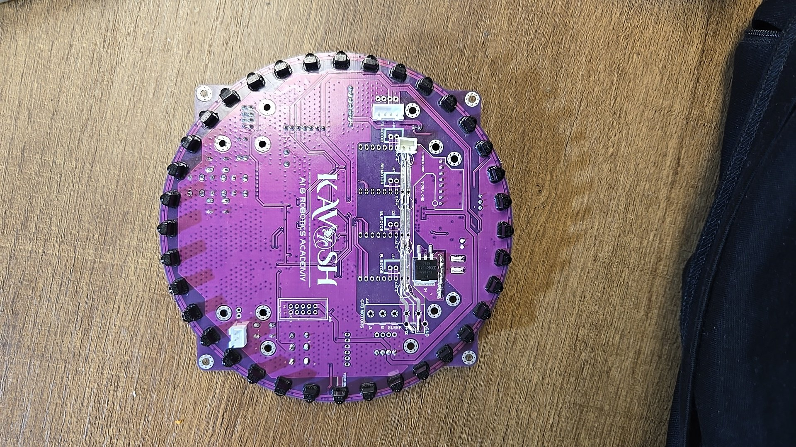

## Ball Detection Method

*How do you find where the ball is? How do you read the data from the ball detection sensors and/or camera?*

We find the ball with 36 TSSP sensors around the robot. Each sensor reads 1 when it detects the ball’s 40Hz signal and 0 when it does not. Since the signal is only on/off, it cannot directly show distance. Instead, we estimate distance from the size of the largest group of sensors reading 1: a wider group usually means the ball is closer.

## Ball Catch Algorithm

*How does your algorithm work to catch the ball? Is there a difference between your robots in how they move towards the ball? Explain the differences.*

We make a projection point behind the ball since we always want to catch the ball facing the opposing team's net. We use the angle of the ball and the robot's coordinates in the field to determine where the projection point is. The robot will then try to move to that projection without hitting the ball

## Positioning Algorithm

*How do you use your sensors in your algorithm to find your position inside the field and how do you use that position to move your robots around?*

We use four ultrasonic sensors to estimate the robot’s position on the field. The left and right sensors calculate LocationX, while the front and back sensors calculate LocationY using distance from the walls. The gyroscope tracks the robot’s angle, keeping movement consistent. Phototransistors detect white boundary lines so the robot can move away and stay inside them.

## Line Algorithm

*How does your robot find the lines to stay inside the field? What algorithms do you use to avoid going out of bounds?*

Our robot uses 55 boundary sensors around the base and center. Each LED shines light at the floor, and the phototransistor picks up the reflected light. A brighter reflection means a white line is detected. The main board finds which where its triggered, then counts the consecutive sensors as the Push value, more sensors means a stronger move away.

## Goal Algorithm

*What algorithms do you use to score goals? How do you use your kicker and dribbler to handle the ball?*

We use ball sensors to detect the ball and move toward it. When the ball is at the front of the robot near 0°, we check if it is inside the front cutout using an LDR sensor. Once the LDR confirms we have the ball, the robot uses ultrasonic sensor data to aim, then activates the kicker to shoot.

## Defense Algorithm

*What algorithms do you use to avoid the opponent team scoring? How do your robots defend your own goal?*

At the start of the game we assign one robot to be the defender, the deffender uses the ball sensors(TSSPs) to detect the ball. After it comes in to a certain distance the deffender will move towards the ball and kick it away. This motion is also to block the opposing team's robot from scoring. After kicking the ball away it uses the data from the ultrasonic sensors to move back infront of the net

## Robot Communication

*Do your robots communicate with each other? How do you use this communication to your advantage?*

To connect with each other we use bluetooth V2, we have a HC05 module on each robot which allows the robots to communicate with each other. The most important part of this connection is so that, when one robot is out side of the boundary line the other will take on the position of that robot e.g. attacker becomes defender and vice versa.

## Software Innovation

*Software Innovations*

We are very proud of our ball detection algorithm(see above for more), after the change we initially were going to cameras to detect the ball. But then we discovered that we could use the cluster method! We are so proud to discover this method since its so much faster and more accurate then using a camera.

## GitHub Link

*GitHub link*

https://github.com/JDengXia/Kavosh-Code

## BOM

*Bill of Materials (BOM)*

[https://drive.google.com/open?id=1WRvFj2dLmnfL_hV4n5z-Z22R3hB4KzF9](https://drive.google.com/open?id=1WRvFj2dLmnfL_hV4n5z-Z22R3hB4KzF9)

## Cost

*How much did it cost you to build your robots?*

It cost us around 3000 per robot but the failures and testing added another 5000 to the total

## Funding

*How did you gathered the funds to build the robots?*

70% parents 
30% company sponsored

## Affordability

*How affordable was it to compete in RoboCupJunior Soccer?*

2

## Answer Check

*Have you checked all of your answers?*

Yes!

## Publication Consent

*We publish TDPs and posters during or after the competition as described in the beginning*

Yes, we acknowledge everything submitted in the above form can be published.

