## Timestamp

*Tijdstempel*

22-6-2026 22:05:12

## Email Address

*E-mailadres*

viollazmariavirginia@gmail.com

## TDP File

*TDP File Upload (Not required)*

[https://drive.google.com/open?id=18JYt5GSOEMuEh0f3a9QRs-n6zobR8VV-](https://drive.google.com/open?id=18JYt5GSOEMuEh0f3a9QRs-n6zobR8VV-)

## Team Name

*What is your team's name?*

Low Baterry Messi

## League

*What league do you participate in?*

Vision League

## Country

*Where are you from?*

Argentina

## Contact

*If other teams have questions about your robot, now or in the future, what email address(es) can we publish along with this document for people to reach you?

(You can put in multiple email addresses, like multiple team members, an email for the whole team or both. Feel free to share other ways of communication like Discord handles)*

teamlowbaterrymessi@gmail.com

## Social Media

*Team Social Media Links (if you have any)*

https://www.instagram.com/robocup_soccer.arg26

## Team Photo

*Upload a photo of your whole team with your mentor and robots

Note: This is not mandatory and will be published along with your TDP if you choose to upload something*

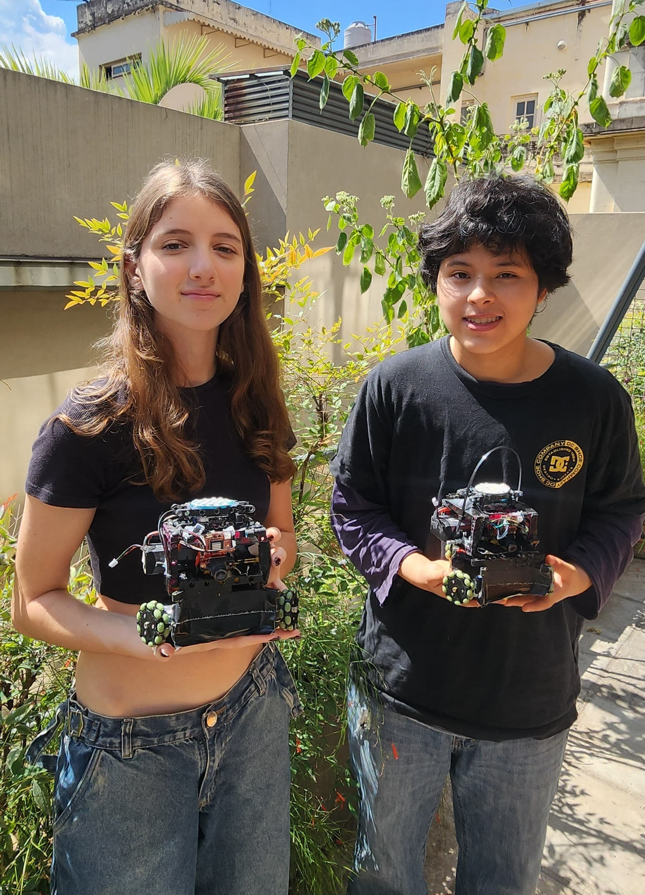

## Members & Roles

*What are the names of the team members and their role(s)?*

María: motors, kinematics, design. Elías: vision/cameras, strategy. Enzo: PCB/electronics coach. Cecilia: team support. Gustavo: integration/project lead.

## Meeting Frequency

*How often did your team meet?
(e.g. 90 minutes once per week or a day every weekend.)*

We met once a week for two hours, on Fridays at 8:00 a.m.

## Meeting Place

*Where did you meet to work on your robot?
(e.g. a robotics room at school, at some other place, one of your homes, school library etc.)*

We worked on our robot at IITA, a private technology and robotics institute that prepared and supported us for this competition.

## Start Date

*When did your team start working on this year's robot?*

We started in March, improving our robots.

## Past Competitions

*Which RoboCupJunior competitions have you competed in and in which leagues?*

María Virginia Viollaz:
Roboliga Junior 2022: Rescue Line League
Roboliga Junior 2023: Rescue Line League
RoboCupJunior 2024: Rescue Line League

Elías Cordero:
Roboliga 2025: Soccer League

## Mentor Contribution

*Which parts of your work received the most contribution from your mentor?*

Mentors helped with PCB design, soldering, hardware fixes, task planning, board integration, and bench tests; we made final decisions.

## Workload Management

*How did you manage the workload?*

We managed the workload during our weekly meetings. We divided the work into tasks that could be done at IITA and tasks that could be continued from home, such as 3D design, documentation, testing, and robot improvements.

## AI Tools

*Which AI tools did you use?*

Claude Code, EasyEDA MCP, Fusion AI, and ChatGPT for PCB, 3D design, documentation, and translation; the team validated all.

## Robot1 Overall

*Robot 1 Overall View*

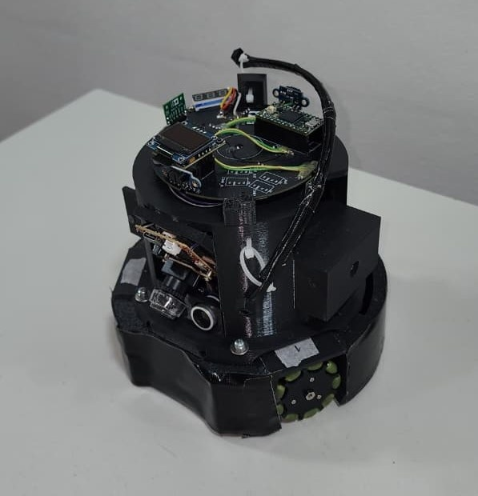

## Robot1 Front

*Robot 1 Front view*

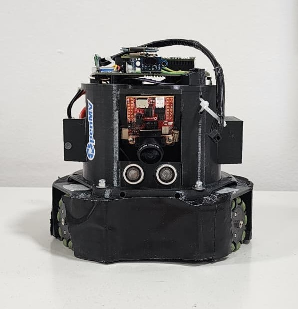

## Robot1 Back

*Robot 1 Back view*

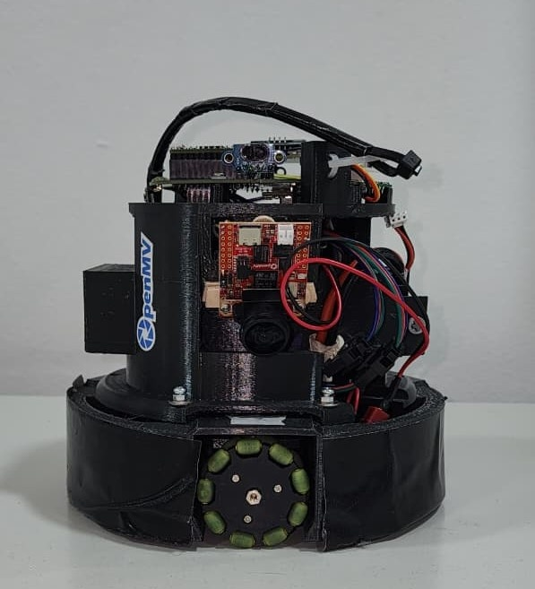

## Robot1 Top

*Robot 1 Top View*

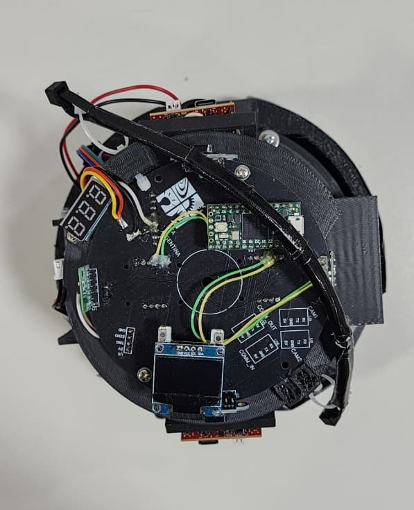

## Robot1 Bottom

*Robot 1 Bottom View*

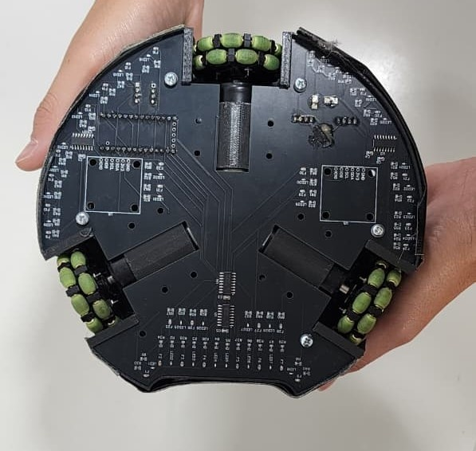

## Robot1 Right

*Robot 1 Right View*

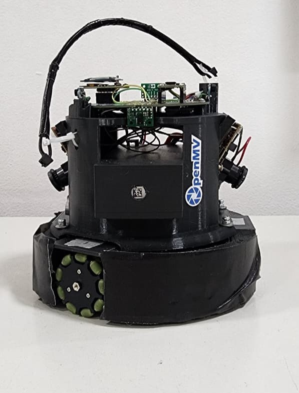

## Robot1 Left

*Robot 1 Left View*

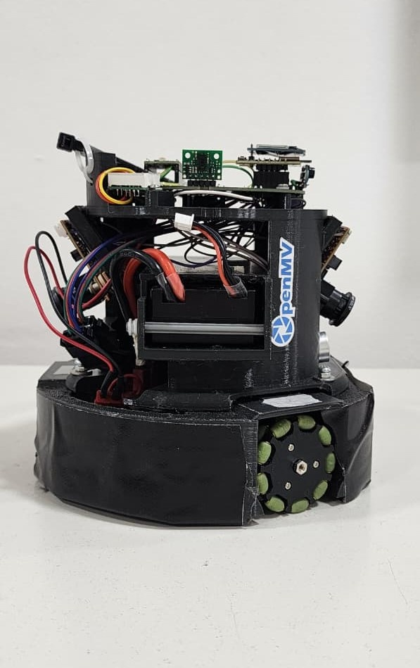

## Robot2 Overall

*Robot 2 Overall View*

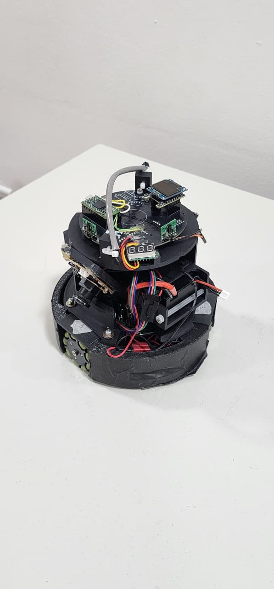

## Robot2 Front

*Robot 2 Front view*

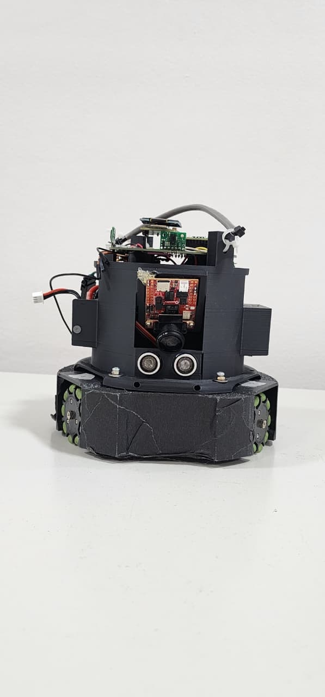

## Robot2 Back

*Robot 2 Back view*

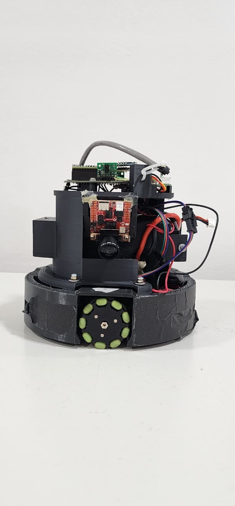

## Robot2 Top

*Robot 2 Top View*

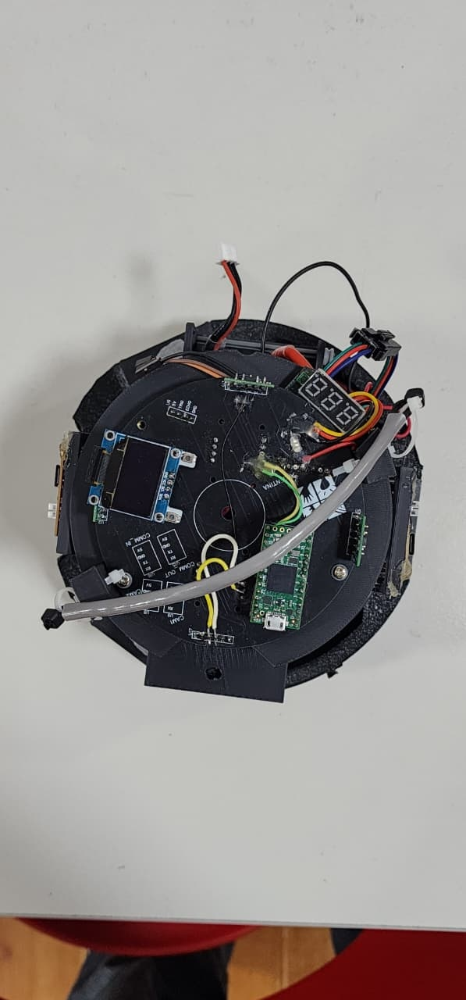

## Robot2 Bottom

*Robot 2 Bottom View*

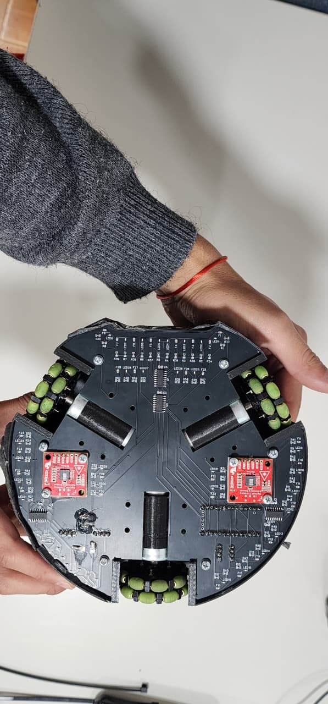

## Robot2 Right

*Robot 2 Right View*

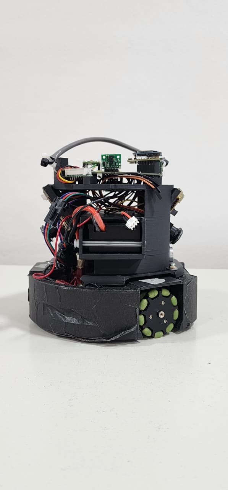

## Robot2 Left

*Robot 2 Left View*

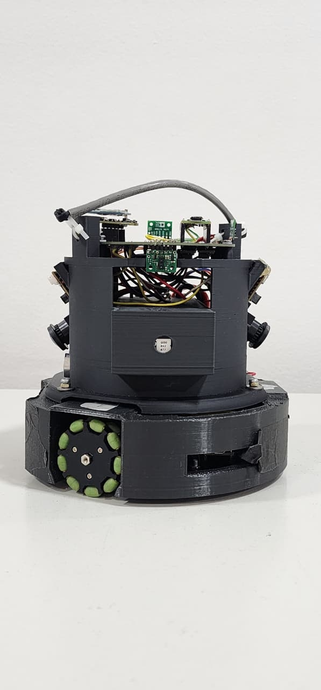

## Mechanical Design

*How did you design the mechanical parts of your robots?*

We designed the mechanical parts using Fusion to model the robot structure, casing, and supports. We considered the internal space, motor position, 120° omni-wheel layout, sensors, cameras, and future upgrades. We also tried using AI for 3D design, but it did not work well for our case, so we improved the design manually.

## Build Method

*How did you build your design?*

We built the robot with custom PCBs designed in EasyEDA and mechanical parts modeled in Fusion. The PCBs were externally manufactured, then soldered and assembled at IITA. During tests, we rewired one motor and fixed sensors.

## Motors & Reason

*How many motors have you used and why?*

We used 3 brushed DC “TT” 5 V motors per robot, 6 in total, with Pololu 30:1 HP #1093 as reference. This matches our KIWI base with 3 omni wheels at 120°, allowing forward, sideways and rotational movement with less weight and complexity than 4 motors. We used commercial omni wheels and no kicker/dribbler motors.

## Kicker Design

*If your robot has a kicker, explain how you designed and built the mechanics of the kicker*

N/A

## Dribbler Design

*If your robot has a dribbler, explain how you designed and built the mechanics of the dribbler.*

N/A

## CAD Files

*CAD design files*

## Mechanical Innovation

*Mechanical Innovation*

Our main mechanical innovation was reducing the robot size so it could fit within the competition limits, decreasing its diameter by about 1.5 cm. We also designed a modular and detachable structure in two parts: an upper perception/communication module and a lower movement/decision module. This makes assembly, repairs, testing, and future upgrades easier.

## Mechanical Photos

*Photos of your mechanical designs highlights*

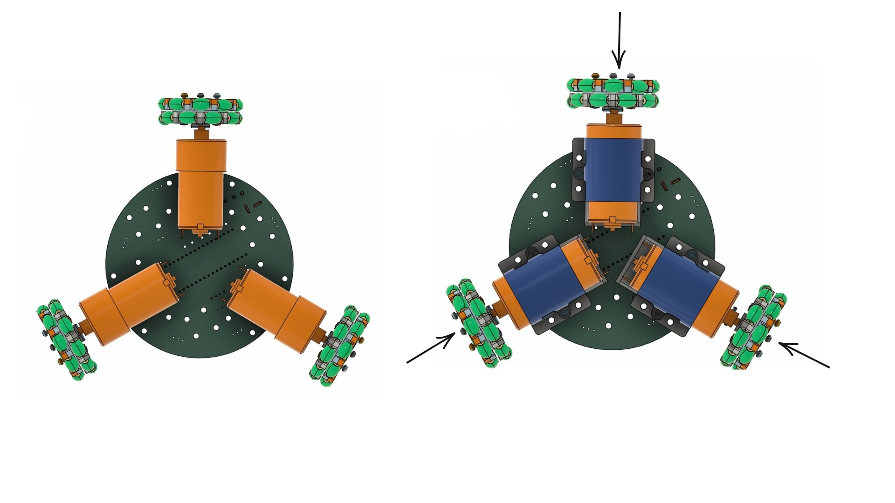
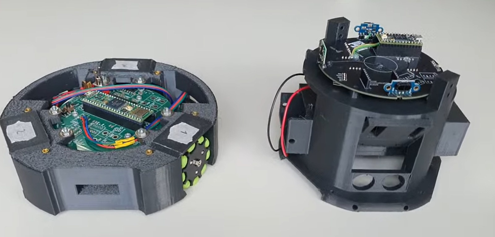
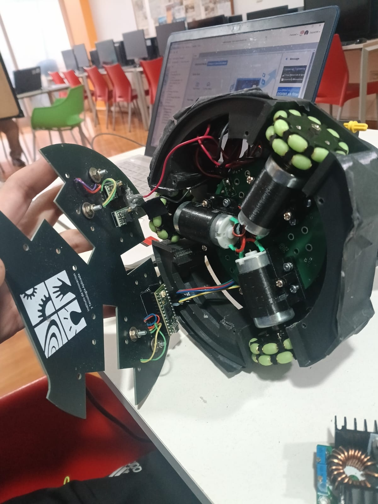
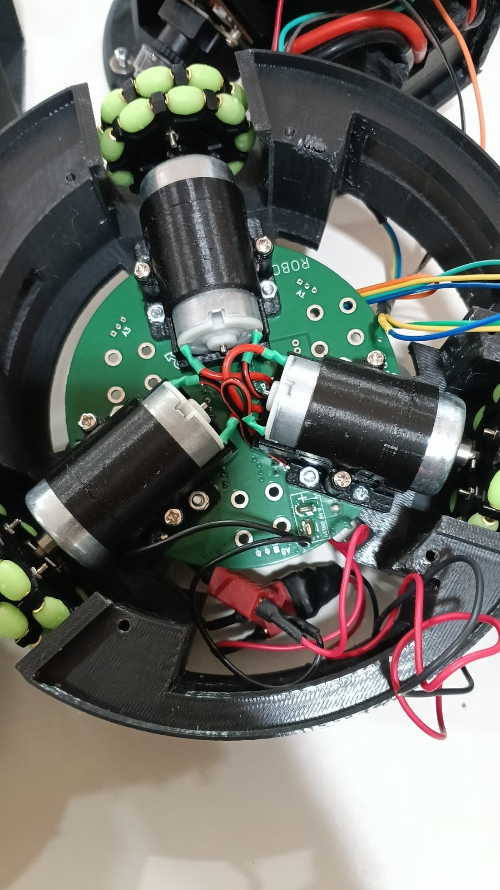

## Electronics Block Diagram

*Provide us with a block diagram of your robot's electronics*

[https://drive.google.com/open?id=1nmNGRtl475EVrjLHDw6BBvzxBiEsuzw_](https://drive.google.com/open?id=1nmNGRtl475EVrjLHDw6BBvzxBiEsuzw_)

## Power Circuit

*How does your power circuits work?*

¿Cómo funcionan sus circuitos de alimentación?
Our robot uses a 2S LiPo battery, 7.4 V nominal and 8.4 V fully charged. TOP and DOWN use Schottky diodes for polarity protection and MP1584 buck converters to generate 5 V for logic and 3.3 V for sensors. CENTRAL uses the Zircon board regulation.

## Motor Drive Circuit

*How do you drive your motors? Explain the circuits you use for that*

The CENTRAL Teensy 4.1 drives 3 H-bridges on the Zircon board. Each motor uses INA/INB pins for direction and an 8-bit PWM signal, 0–255, for speed. PID and omni-3 kinematics control each wheel independently.

## Microcontroller & Reason

*What kind of micro controller or board do you use for your robot? Why did you decide to use this part for your robot? If you have more than 1 processor, explain each one separately.*

We use four processors: TOP has a Teensy 4.0 for cameras, IMUs and distance sensors; CENTRAL has a Teensy 4.1 on the Zircon board for strategy, PID, omni-3 kinematics and motors; DOWN has a Teensy 4.0 for line sensors and odometry; COMM has an ESP32-C6 for the RCJ referee/communication. We chose this to split tasks and process data close to each sensor.

## Motor Control

*How do you use your processor to move your motors?*

The CENTRAL Teensy 4.1 calculates the robot movement using the game strategy, PID controllers and omni-3 kinematics. It converts the desired movement into three wheel speeds, then sends direction signals and PWM values to the Zircon H-bridge drivers, which power each motor independently.

## Ball Detection

*How does your ball detection sensors and/or camera[s] work?*

Our robot uses two OpenMV N6 cameras, one facing forward and one facing backward. Each camera runs a vision script that detects the orange ball using color thresholds and blob detection. The camera sends the ball angle, position, visibility and confidence to the TOP board. TOP filters and combines this data into a WorldSnapshot, which is sent to CENTRAL. Then CENTRAL uses it in the game strategy to search, approach, align with the goal and push the ball.

## Line Detection

*How does your line detection circuits work?*

The DOWN board uses 32 ALS-PT19 phototransistors with 0402 LEDs to detect the white line on the green carpet. Four CD4051 multiplexers send the analog readings to the Teensy 4.0, which filters them and sends line status to CENTRAL.

## Navigation/Position Sensors

*What sensors do you use for navigation and how are these sensors connected to your processor? What sensors do you use to find your position in the field? What about the direction your robot faces?*

We use 4 VL53L7CX ToF sensors, 2 BNO055 IMUs, 2 SparkFun OTOS sensors and 32 line sensors. ToF and IMUs connect to the TOP Teensy 4.0 by I2C. OTOS and line sensors connect to the DOWN Teensy 4.0 through I2C and CD4051 multiplexers. ToF/OTOS help estimate position, and BNO055 IMUs give the robot heading.

## Kicker Circuit

*How do you drive your kicker system? How does the circuit make the kicker work?*

The RCJ referee command arrives by BLE to the COMM ESP32-C6 board. COMM outputs 3.3 V START/STOP GPIO signals through a TXS0102 level shifter. TOP reads pins 5/6 with pulldown; HIGH means play, both LOW means stop or cable fail.

## Dribbler Circuit

*How does your dribbler system work? What components and circuits did you use to drive it?*

N/A

## Schematics

*Schematics of your robot*

[https://drive.google.com/open?id=1ydFRTEbGH8H1jNt-TTAtr-7u5EHR3ao6](https://drive.google.com/open?id=1ydFRTEbGH8H1jNt-TTAtr-7u5EHR3ao6)
[https://drive.google.com/open?id=1MdU1E-nMp1NFEaRsSKKYj2pFFsIOoP75](https://drive.google.com/open?id=1MdU1E-nMp1NFEaRsSKKYj2pFFsIOoP75)
[https://drive.google.com/open?id=1tw7OK3V4lGyCpBBQpoyLArHGh7sWJcWL](https://drive.google.com/open?id=1tw7OK3V4lGyCpBBQpoyLArHGh7sWJcWL)

## PCB

*PCB of your robot*

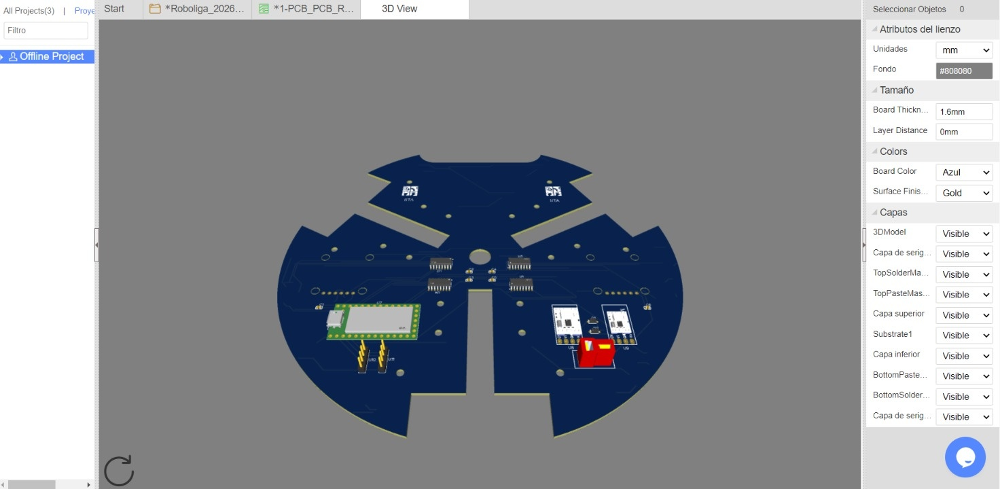
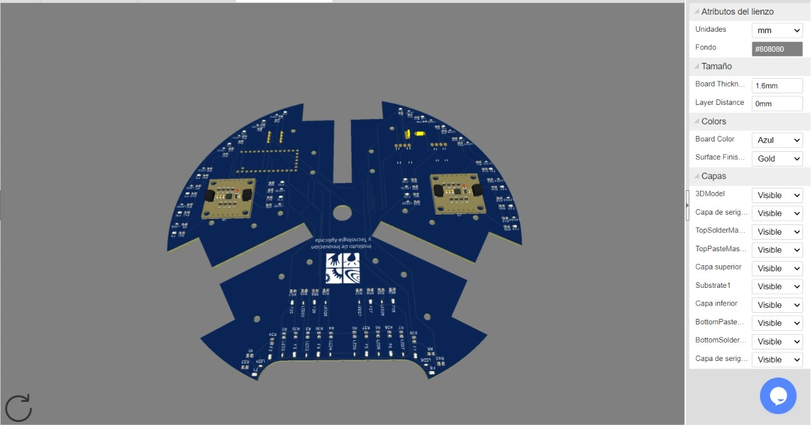
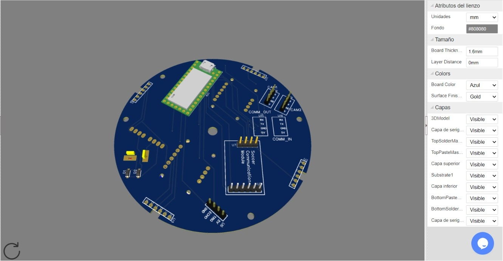
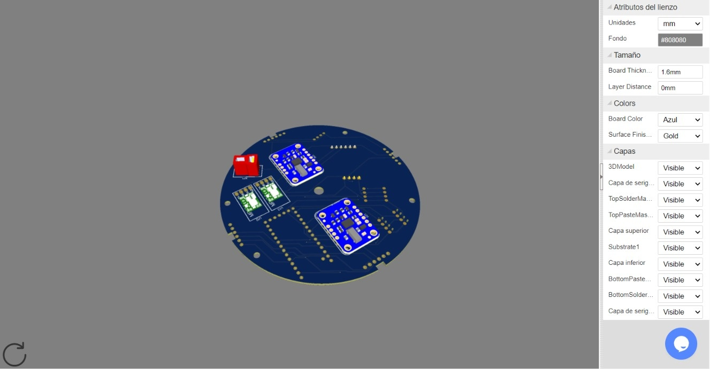

## Electronics Innovation

*Electronics Innovations*

Our main electronic innovation was designing our own TOP and DOWN boards, using AI as a learning tool and EasyEDA for PCB design. The TOP board handles perception: cameras, IMUs, ToF sensors, ultrasonic sensor and referee input. The DOWN board handles line sensors and optical odometry. Both send processed data to the CENTRAL board, which makes decisions and controls the motors.

We are also proud of the distributed architecture: instead of using a single board, we use specialized boards that process data close to each sensor. This reduces data traffic, makes testing easier, and allows us to improve or replace one module without redesigning the whole robot.

Another important part was solving real integration problems: separating I2C buses to avoid conflicts, fixing ToF sensor reading, using multiplexers to read 32 line sensors, and adapting the RCJ referee system through GPIO. It was not just wiring components; we had to measure, test, fix, and validate each part on the bench.

## Circuit Photos

*Photo of your circuit boards highlights*

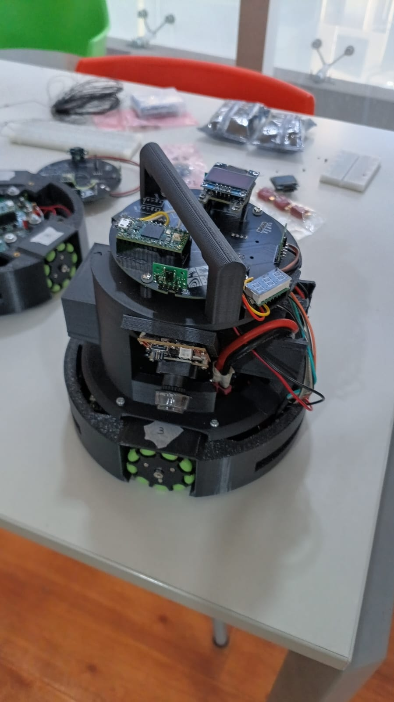
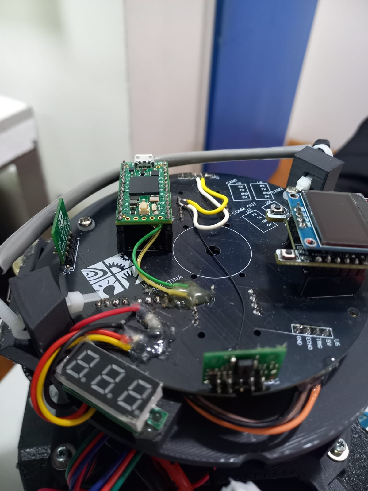
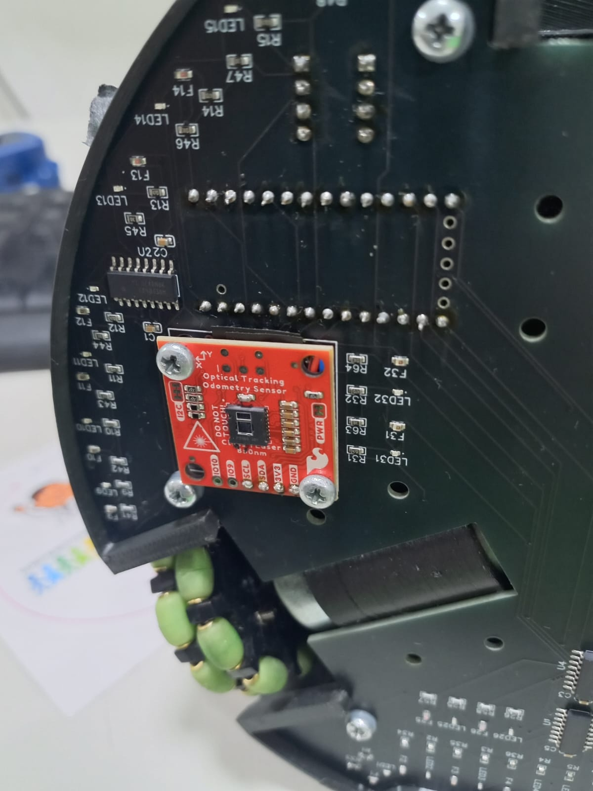
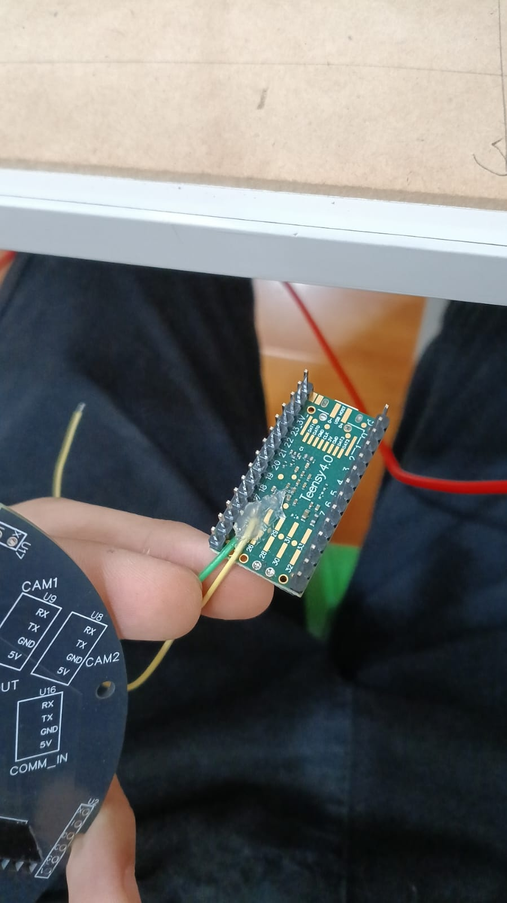

## Ball Detection Method

*How do you find where the ball is? How do you read the data from the ball detection sensors and/or camera?*

The ball is located with two OpenMV N6 cameras, one front and one rear. Each camera detects the orange ball using color thresholds and blob detection, then sends visibility, relative position and confidence by UART to the TOP board. TOP filters and combines the data into the WorldSnapshot, which CENTRAL uses to approach and push the ball.

## Ball Catch Algorithm

*How does your algorithm work to catch the ball? Is there a difference between your robots in how they move towards the ball? Explain the differences.*

Our algorithm depends on the robot role. The attacker searches for the ball, moves behind it, aligns with the opponent goal and pushes it by inertia. The goalkeeper stays near our goal, patrols laterally, follows or predicts the ball position, intercepts shots and clears them. Both use the same WorldSnapshot data, but different strategies.

## Positioning Algorithm

*How do you use your sensors in your algorithm to find your position inside the field and how do you use that position to move your robots around?*

We use BNO055 IMUs for heading, VL53L7CX ToF sensors for wall distance, SparkFun OTOS for optical odometry, and line sensors for boundaries. TOP and DOWN preprocess the data and send it to CENTRAL, which uses position and heading to correct motion, patrol, approach the ball, and avoid lines.

## Line Algorithm

*How does your robot find the lines to stay inside the field? What algorithms do you use to avoid going out of bounds?*

The robot detects field lines with 32 ALS-PT19 phototransistors and LEDs on the DOWN board. Four CD4051 multiplexers send the analog readings to the Teensy 4.0. The software filters the values, detects white-line direction and urgency, then CENTRAL stops or moves away to avoid leaving the field.

## Goal Algorithm

*What algorithms do you use to score goals? How do you use your kicker and dribbler to handle the ball?*

Our scoring algorithm uses camera data to find the ball and opponent goal. The attacker moves behind the ball, aligns itself with the goal, and pushes the ball by inertia. We do not use a kicker or dribbler in this version, so there are no extra motors or driver circuits for them. This reduced weight and complexity.

## Defense Algorithm

*What algorithms do you use to avoid the opponent team scoring? How do your robots defend your own goal?*

Our defense algorithm is used by the goalkeeper. It stays near our goal and patrols laterally instead of chasing the ball everywhere. Using WorldSnapshot data, it follows or predicts the ball position, intercepts shots toward our goal, and clears the ball away. Line avoidance has priority.

## Robot Communication

*Do your robots communicate with each other? How do you use this communication to your advantage?*

Our robots do not currently communicate with each other during the match. However, the system was designed with this feature planned for future development. The idea is to use communication to share information such as ball position, robot role, and game state, so the attacker and goalkeeper can coordinate better.

## Software Innovation

*Software Innovations*

Our software innovations include robust multi-board UART communication with CRC16 and sequence numbers, camera-based ball position/distance estimation, TOP-side sensor fusion with prediction to fill gaps between readings, Claude-assisted programming validated with tests, and monitoring software for bench testing.

## GitHub Link

*GitHub link*

https://github.com/IITA-Proyectos/open-soccer-robocup-team2026/tree/main

## BOM

*Bill of Materials (BOM)*

[https://drive.google.com/open?id=1YW5IBSW_W-GJA4k9pusyKSESjlK_XNdj](https://drive.google.com/open?id=1YW5IBSW_W-GJA4k9pusyKSESjlK_XNdj)

## Cost

*How much did it cost you to build your robots?*

Final robot components: USD 6,000 total, about USD 3,000 per robot. Trial and error: ~USD 6,000. Environment/tools: ~USD 3,000. These are Argentina landed costs, including import taxes, customs and shipping. Rate: 1 USD = 1 USD.

## Funding

*How did you gathered the funds to build the robots?*

100% school

## Affordability

*How affordable was it to compete in RoboCupJunior Soccer?*

7

## Answer Check

*Have you checked all of your answers?*

Yes!

## Publication Consent

*We publish TDPs and posters during or after the competition as described in the beginning*

Yes, we acknowledge everything submitted in the above form can be published.

