## Timestamp

*Tijdstempel*

28-6-2026 16:02:27

## Email Address

*E-mailadres*

jaeminan2008@gmail.com

## TDP File

*TDP File Upload (Not required)*

[https://drive.google.com/open?id=132qt6DVtWK5PV427EJYy3LZ1SIWPvuwU](https://drive.google.com/open?id=132qt6DVtWK5PV427EJYy3LZ1SIWPvuwU)

## Team Name

*What is your team's name?*

Open Legends

## League

*What league do you participate in?*

Vision League

## Country

*Where are you from?*

Australia

## Contact

*If other teams have questions about your robot, now or in the future, what email address(es) can we publish along with this document for people to reach you?

(You can put in multiple email addresses, like multiple team members, an email for the whole team or both. Feel free to share other ways of communication like Discord handles)*

- jaeminan2008@gmail.com
- sujonathan24@gmail.com

## Social Media

*Team Social Media Links (if you have any)*

## Team Photo

*Upload a photo of your whole team with your mentor and robots

Note: This is not mandatory and will be published along with your TDP if you choose to upload something*

## Members & Roles

*What are the names of the team members and their role(s)?*

Angelus An: Structural
Rupert Gooding: Structural
Jonathan Su: Software
Thomas Morrison: Electrical

## Meeting Frequency

*How often did your team meet?
(e.g. 90 minutes once per week or a day every weekend.)*

Monday, Tuesday, Wednesday from 3:15 – 5:30 pm

## Meeting Place

*Where did you meet to work on your robot?
(e.g. a robotics room at school, at some other place, one of your homes, school library etc.)*

A dedicated robotics lab at our school

## Start Date

*When did your team start working on this year's robot?*

At the start of this year

## Past Competitions

*Which RoboCupJunior competitions have you competed in and in which leagues?*

Robocup Junior Australia Nationals Competition: Standard League (2024)
RoboCup Junior Queensland State Competition: Open League (2025)
RoboCup Junior Australia Nationals Competition: Open League (2025)

## Mentor Contribution

*Which parts of your work received the most contribution from your mentor?*

Our mentor guided us through the machining process of the CNC machine to make our mirrors and plates.

## Workload Management

*How did you manage the workload?*

We had a dedicated Microsoft Teams channel to communicate with our mentors and fellow teams, as well as an Instagram group chat to communicate with team members.

## AI Tools

*Which AI tools did you use?*

Editing the grammar and cohesion of our poster.

## Robot1 Overall

*Robot 1 Overall View*

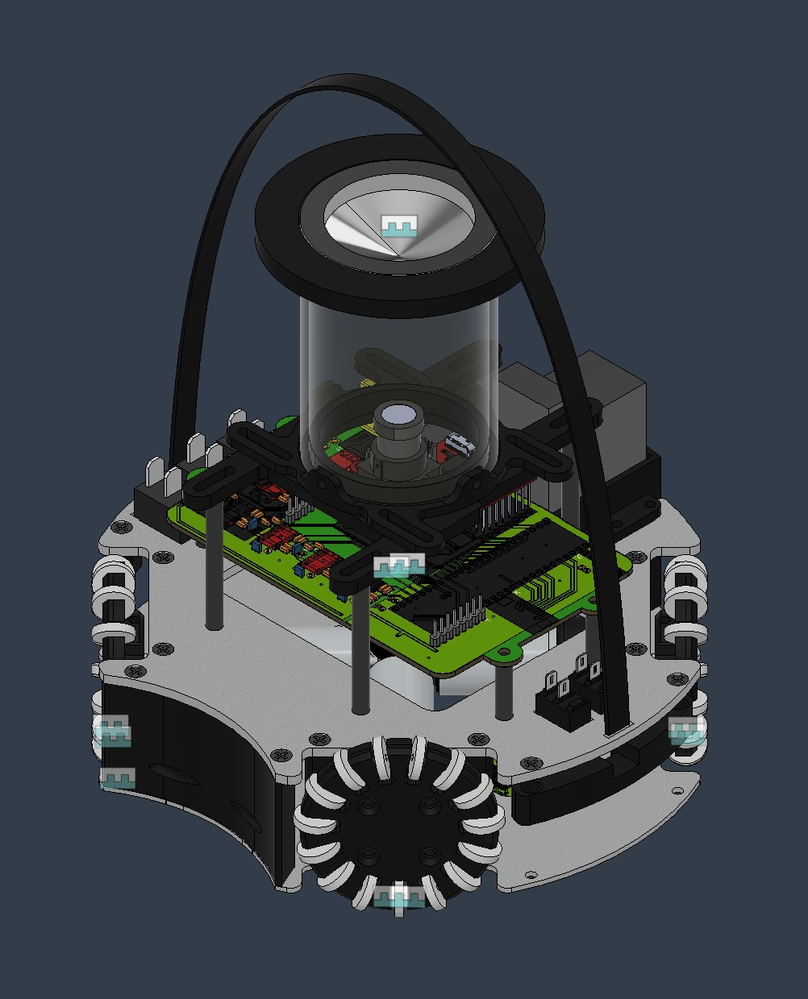

## Robot1 Front

*Robot 1 Front view*

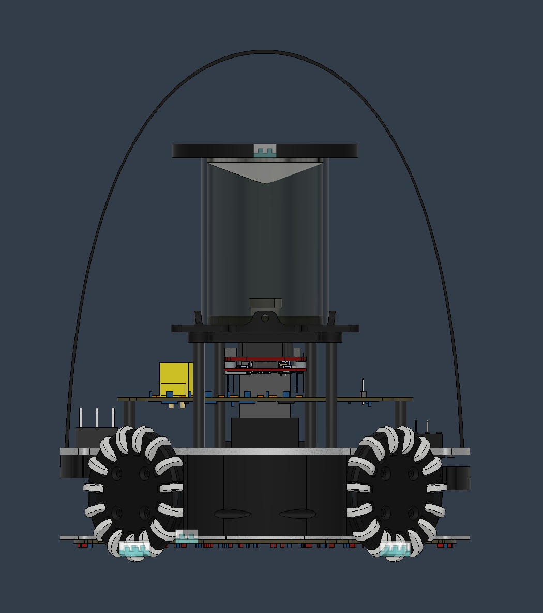

## Robot1 Back

*Robot 1 Back view*

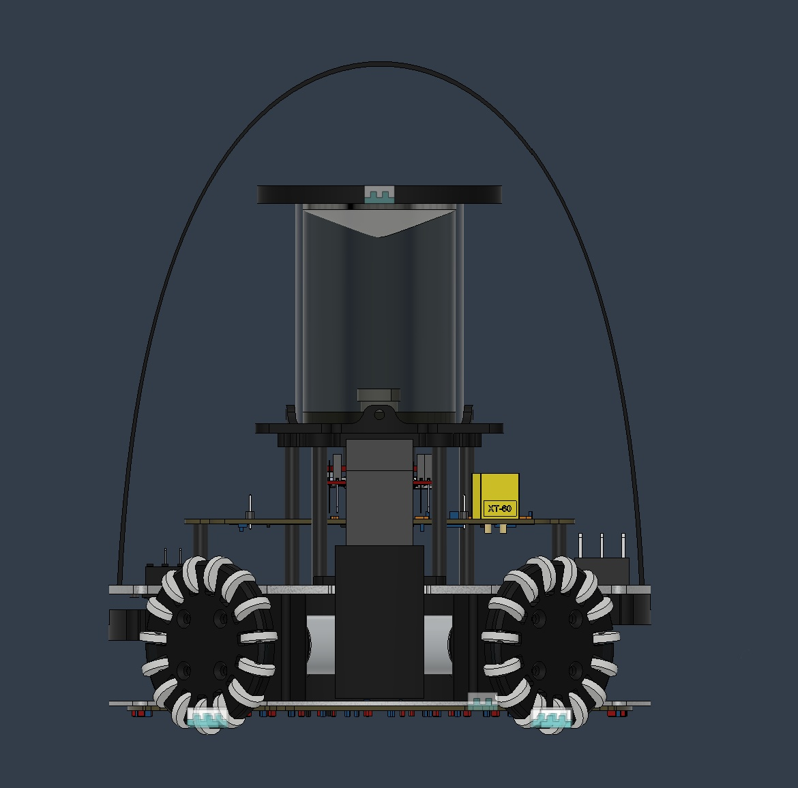

## Robot1 Top

*Robot 1 Top View*

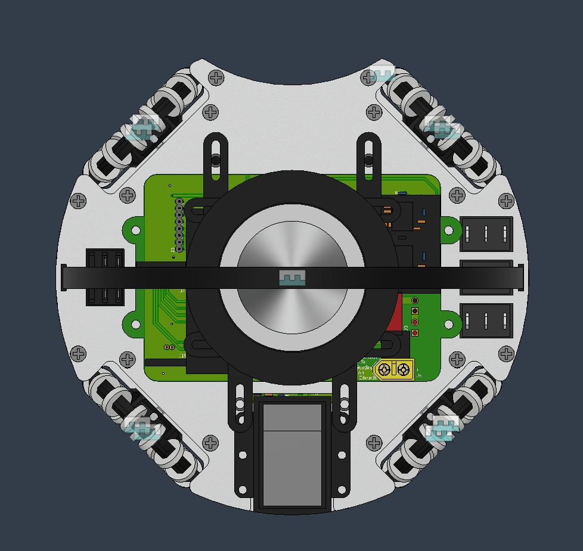

## Robot1 Bottom

*Robot 1 Bottom View*

## Robot1 Right

*Robot 1 Right View*

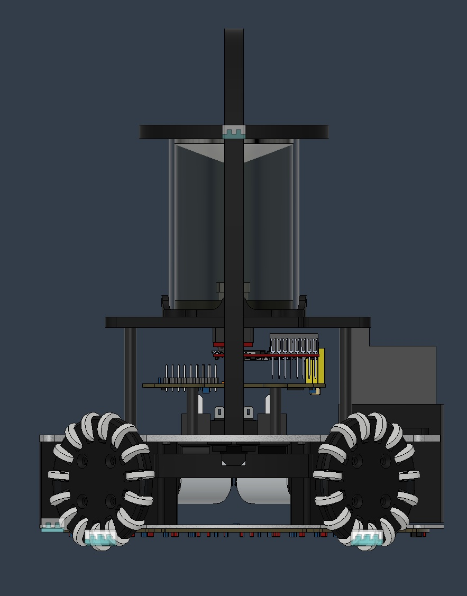

## Robot1 Left

*Robot 1 Left View*

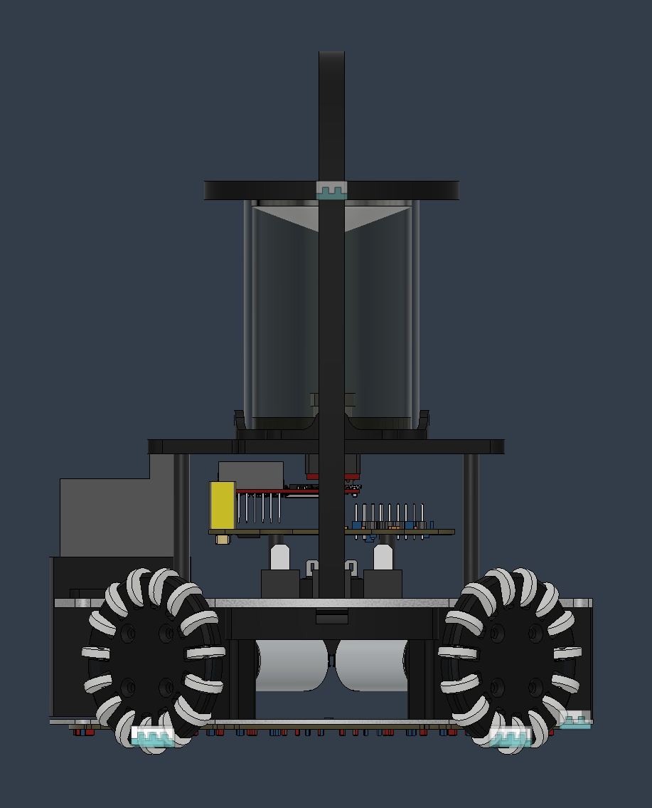

## Robot2 Overall

*Robot 2 Overall View*

## Robot2 Front

*Robot 2 Front view*

## Robot2 Back

*Robot 2 Back view*

## Robot2 Top

*Robot 2 Top View*

## Robot2 Bottom

*Robot 2 Bottom View*

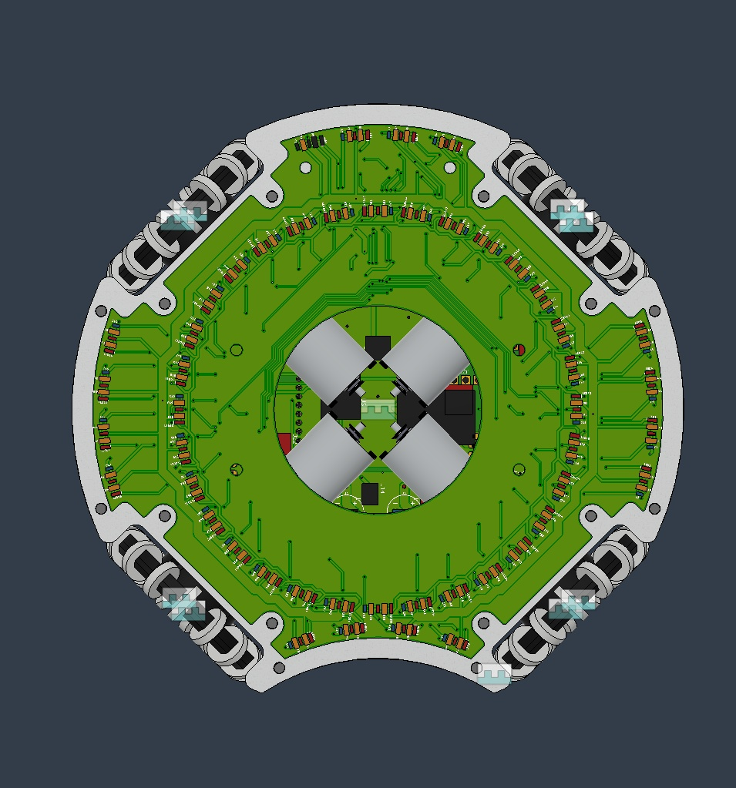

## Robot2 Right

*Robot 2 Right View*

## Robot2 Left

*Robot 2 Left View*

## Mechanical Design

*How did you design the mechanical parts of your robots?*

Mechanical design used Autodesk Fusion, Desmos, and Bambu Studio for modelling, mirror optimisation, and 3D printing. Three prototypes iterated on functionality of primary components, arrangement of key components, and ease of manufacturing and debugging. Key improvements included optimising the robot's vision by designing a custom CNC mirror, implementing a tube instead of standoffs for camera vision, and swapping nuts for standoffs on motor mounts to speed up assembly and part replacement.

## Build Method

*How did you build your design?*

A Bambu Lab P1S 3D printer, Carvera CNC machine were used to build the design. JLCPCB manufactured PCBs designed in Autodesk Fusion, with components hand-soldered in-lab. Motor mounts and other 3D printed components were reprinted due to tolerances.

## Motors & Reason

*How many motors have you used and why?*

Four motors spaced at 90-degree intervals were used to balance force output in all directions and minimise axial rotation. Three motors provided insufficient force; five exceeded size constraints. Omni-wheels were designed in Autodesk Fusion, each housing 15 rollers secured between two PLA plates. Designing our own wheels allowed spare parts to be printed without having to ensure compatibility.

## Kicker Design

*If your robot has a kicker, explain how you designed and built the mechanics of the kicker*

A Tahaka CB1037 push-solenoid was used within our kicker assembly. We designed the capture zone of the robot around this solenoid such that the solenoid was screwed onto two walls on either side of the capture zone. However, we were not able to develop the kicker by Internationals.

## Dribbler Design

*If your robot has a dribbler, explain how you designed and built the mechanics of the dribbler.*

A two-piece semi-hyperbolic roller dribbler was designed with a Maxon DCX 19 motor at a 1:2.833 gear ratio for speed. The roller was split into two sections to negate differential surface speeds and lateral drift from varying radii. The dribbler was not completed in time for Internationals.

## CAD Files

*CAD design files*

https://github.com/jonathansu-bbc/Open_Legends_2026

## Mechanical Innovation

*Mechanical Innovation*

Physics and math principles alongside Desmos' regression function were used to derive a continuous tangent function for the mirror curve using angle of incidence/reflection and differentiation. Anti-differentiation yielded the final curve expression, with points exported at 0.01 mm increments matching the Carvera CNC's accuracy into Fusion as an SVG. The mirror was polished with liquid sandpaper and WD40. This eliminated all field blind spots, increasing the robot's competitive edge.

## Mechanical Photos

*Photos of your mechanical designs highlights*

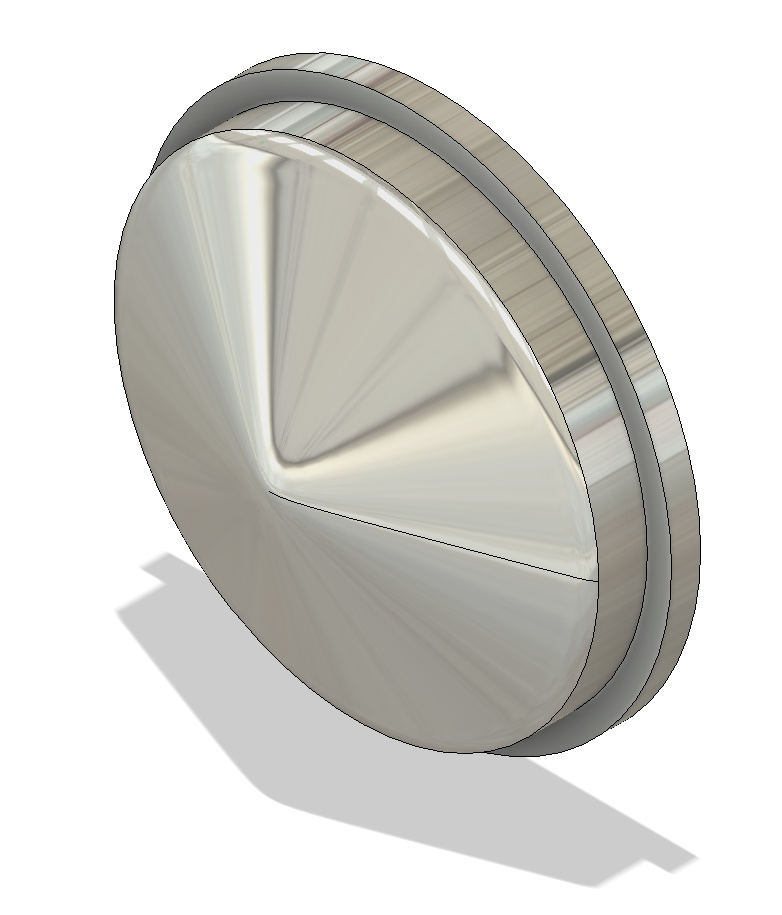
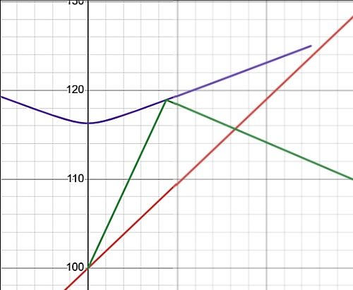
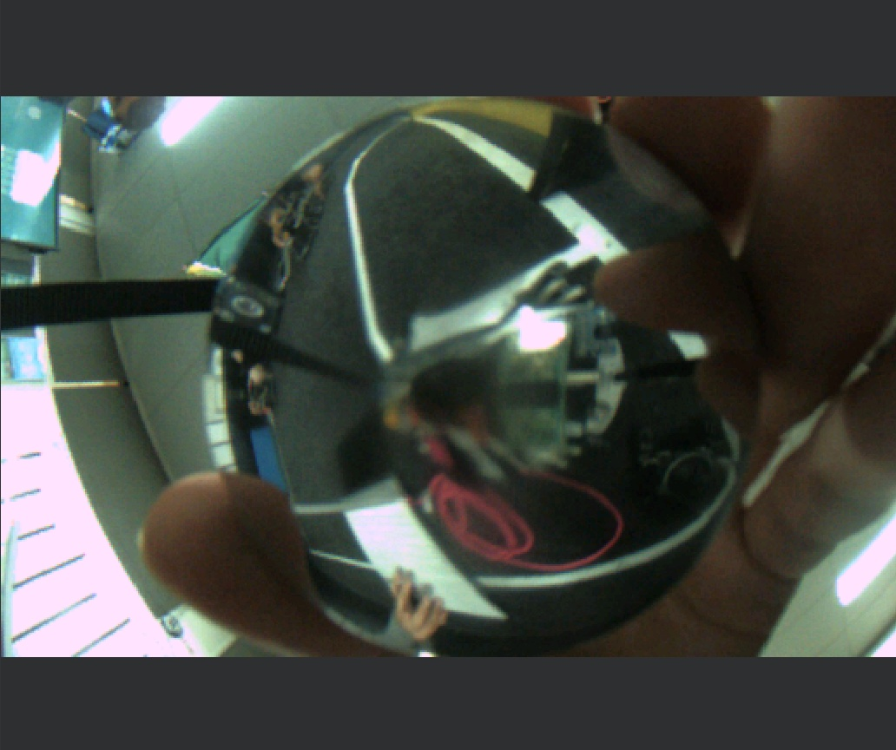
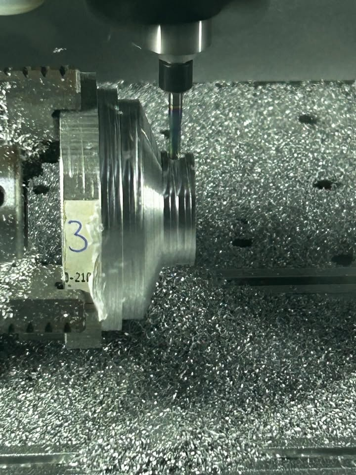
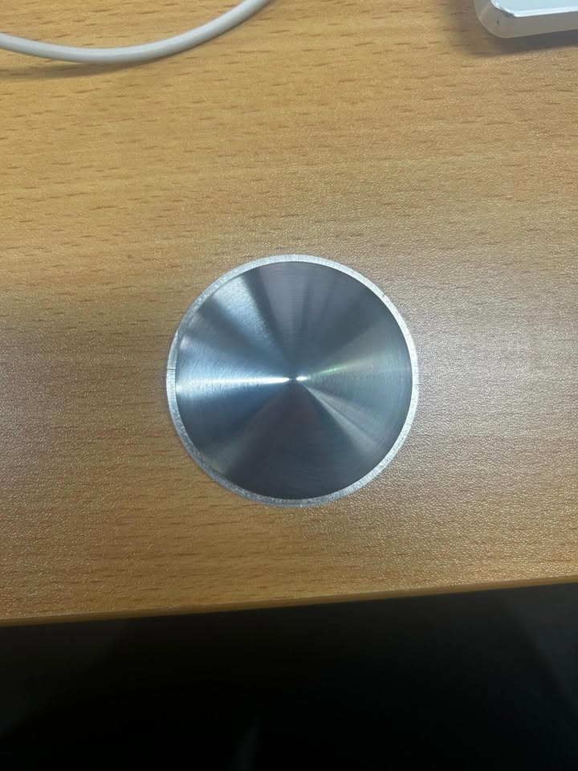

## Electronics Block Diagram

*Provide us with a block diagram of your robot's electronics*

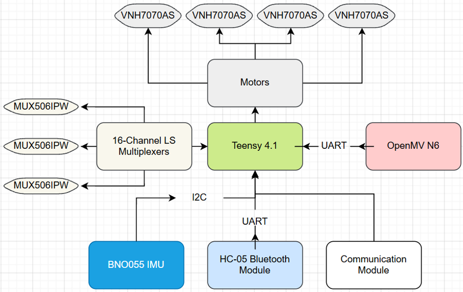

## Power Circuit

*How does your power circuits work?*

Powered by a 3S (12.6V) battery, the circuit includes a smoothing capacitor, reverse-polarity MOSFET protection, a main switch, logic/motor fuses and switches, and 5V/3.3V regulators. To maintain voltage above 11.5V, the Teensy is connected to a voltage divider, removing external indicator use.

## Motor Drive Circuit

*How do you drive your motors? Explain the circuits you use for that*

Four DC motors are driven by individual VNH7070AS controllers, receiving INA, INB and PWM signals from the Teensy. Early latch-up issues caused by back-powering were resolved by adding pull-down resistors, software switches, and initialising controllers in brake mode before enabling PWM.

## Microcontroller & Reason

*What kind of micro controller or board do you use for your robot? Why did you decide to use this part for your robot? If you have more than 1 processor, explain each one separately.*

We chose a Teensy 4.1 microcontroller for our robot. It has 55 digital pins and 18 analog pins, allowing us to connect and control all the components on our PCBs. It also supports a range of serial communication protocols, such as I2C and UART. Furthermore, it has a 600 MHz processor which allows for ultra-fast processing of complex logic such as line avoidance.

## Motor Control

*How do you use your processor to move your motors?*

Each motor receives two digital 'direction' signals and one PWM 'speed' signal from the Teensy. Individual motor speeds and directions are calculated using the scalar projection of each motor's axis onto the robot's desired direction of motion, allowing smooth and accurate omnidirectional movement.

## Ball Detection

*How does your ball detection sensors and/or camera[s] work?*

Using Python in OpenMV IDE, our camera tracks balls/goals, sending blob data to a Teensy via UART. To fix 2025 Nationals lighting issues, we tightened LAB thresholds to minimize ranges and raised blob size limits to filter noise like hands. We added hardware indents to hide reflective hot glue, and a software ROI circle restricted detection to the circular mirror, eliminating outside interference.

## Line Detection

*How does your line detection circuits work?*

The line detection circuit uses 48 LED/phototransistor modules (16 outer, 32 inner) read via three 16-channel multiplexers to save Teensy pins. A PWM-controlled N-channel MOSFET regulates LED brightness for optimal contrast. We used an oscilloscope to debug the MUX signals (see Short Video TDP).

## Navigation/Position Sensors

*What sensors do you use for navigation and how are these sensors connected to your processor? What sensors do you use to find your position in the field? What about the direction your robot faces?*

We find blob angles and distances from the OpenMV (UART). We find robot heading with a BNO055; to stop IMU resets from motor current spikes, we added separate motor and logic GND planes. We upgraded from the OpenMV H7+ to the OpenMV N6 (90 vs 50 FPS).

## Kicker Circuit

*How do you drive your kicker system? How does the circuit make the kicker work?*

Unfortunately whilst we were unable to integrate a kicker system in time for Internationals, for the first and second prototypes of the robot we developed a kicker PCB which involved discharging 50V through a 10,000 μF capacitor into a Tahaka CB1037 push-solenoid.

## Dribbler Circuit

*How does your dribbler system work? What components and circuits did you use to drive it?*

Unfortunately whilst we were unable to integrate a dribbler system in time for Internationals, for the first and second prototypes of the robot we added an extra JST connector onto our main PCB to allow a Maxon DCX 19 motor to be connected.

## Schematics

*Schematics of your robot*

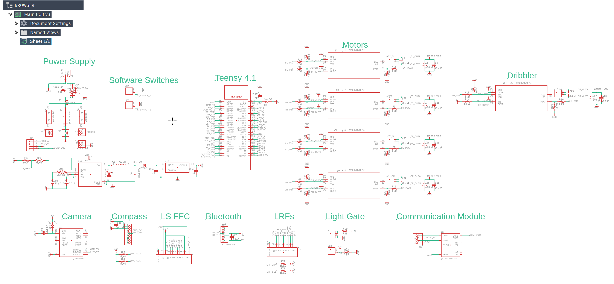
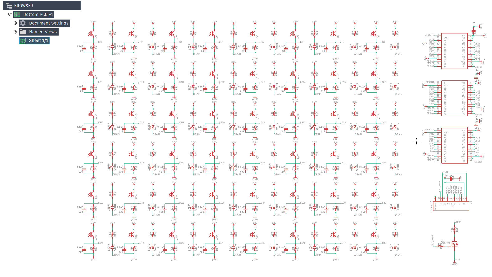

## PCB

*PCB of your robot*

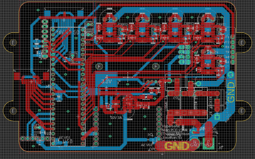
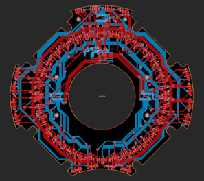

## Electronics Innovation

*Electronics Innovations*

Our greatest source of pride is the dual-ring light sensor PCB with PWM brightness control. The board features two concentric rings: an outer ring of 16 modules for early line detection and a full inner ring of 32 modules for precise line angle calculation. Each module pairs an LED and phototransistor — when passing over the white line, reflected light increases, spiking the phototransistor's output.
To read all 48 sensors efficiently, three 16-channel multiplexers reduce the pin requirement to just 4 digital and 3 analog pins on the Teensy 4.1, connected via a single FFC cable.
Our key innovation is MOSFET-based PWM brightness control. Previously, fixed LED brightness caused contrast issues — too bright saturated the phototransistors; too dim lost the line entirely. We added an AO3404 N-channel MOSFET with its gate driven by a Teensy PWM pin, source to GND, and drain to the LED cathodes. This lets us tune brightness in software instantly, maximising contrast between the dark field and white line under any venue lighting.
During debugging, cold solder joints on the FFC connectors caused two multiplexer select signals to fail. Oscilloscope probing confirmed the Teensy outputs were correct, isolating the fault to the joints. Reflowing with flux resolved the issue.
Finally, our line angle algorithm was upgraded from vector averaging — which reacted too slowly at the boundary — to a cluster-based approach, producing sharper angle changes when the robot exits the field.

## Circuit Photos

*Photo of your circuit boards highlights*

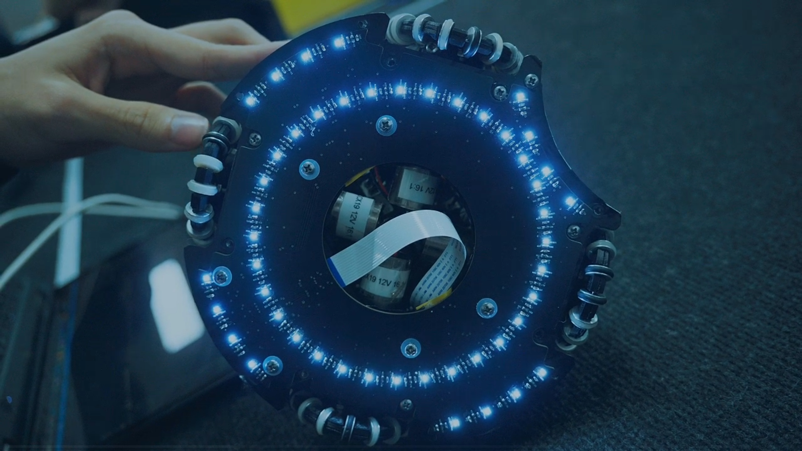
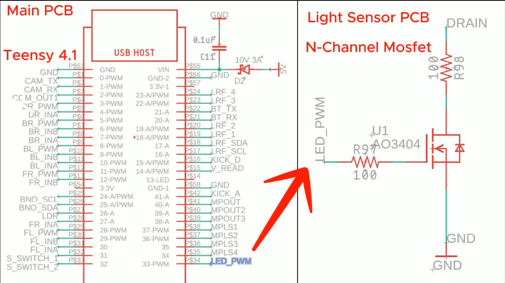
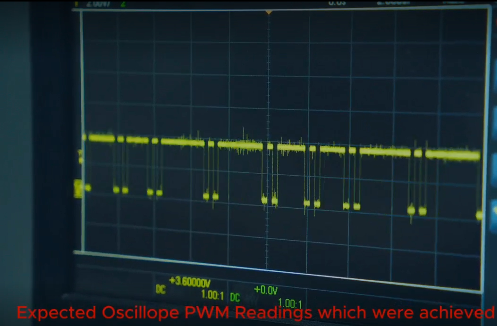
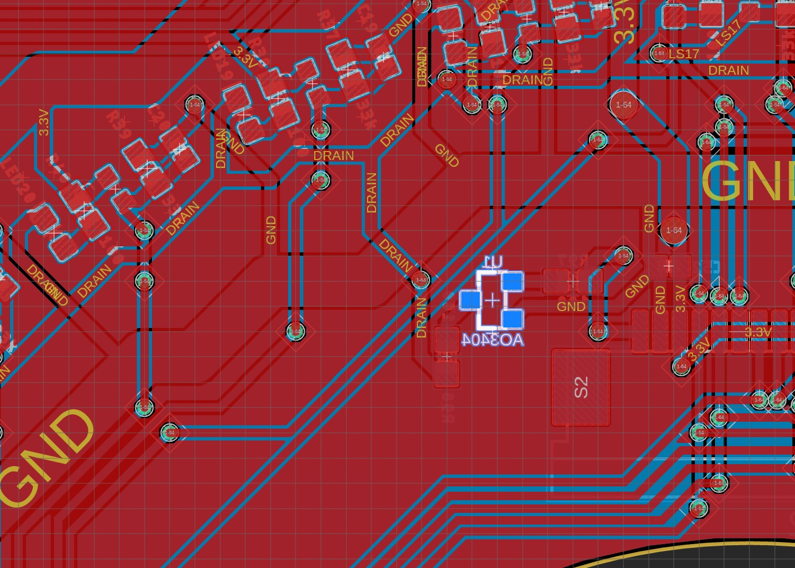
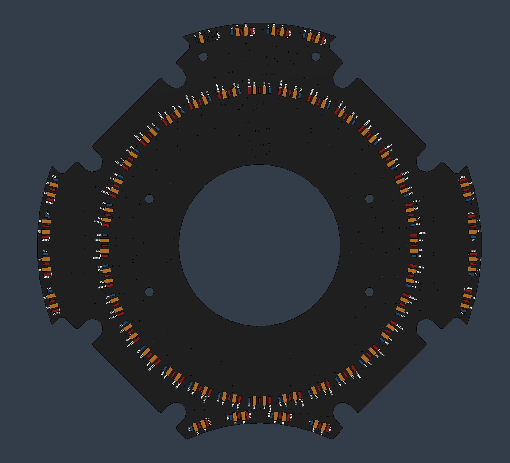

## Ball Detection Method

*How do you find where the ball is? How do you read the data from the ball detection sensors and/or camera?*

We use an OpenMV N6 with VGA resolution cropped to 400x400 pixels to track blobs through LAB thresholds, finding their x- and y-coordinates. Because they range from 0-400, we send each value each over two bytes through UART to the Teensy, with two start bytes (255) to ensure correct data when read from the Teensy.

## Ball Catch Algorithm

*How does your algorithm work to catch the ball? Is there a difference between your robots in how they move towards the ball? Explain the differences.*

Our attacker orbit algorithm uses a ball angle offset and a distance scale function to calculate movement angle and speed. Once the ball is in the capture zone, the robot surges towards the goal, pushing the ball.

## Positioning Algorithm

*How do you use your sensors in your algorithm to find your position inside the field and how do you use that position to move your robots around?*

We are yet to fully implement a localisation system. However, if we did, we would use our camera to find the goal angles and distances to estimate robot position. For increased accuracy, we are looking to add a LRF PCB on top of the mirror mount in the future for accurate wall distances. We could then make a coordinate system on the field for more accurate and smooth movement.

## Line Algorithm

*How does your robot find the lines to stay inside the field? What algorithms do you use to avoid going out of bounds?*

In setup, we read all phototransistors and add a set threshold to find each sensor’s white threshold. In game, sensors above the white thresholds are grouped into clusters, whose midpoint angles are used to calculate the line angle. The outer ring gives early detection, while the inner ring is prioritised due to its circular shape increasing line angle accuracy (see GitHub repository).

## Goal Algorithm

*What algorithms do you use to score goals? How do you use your kicker and dribbler to handle the ball?*

On our final robot design, we didn't account for a kicker nor a dribbler due to time constraints. However, if we had both, we would consider using the dribbler to control and hide the ball from the opposition defender. Additionally, we would test kicking whenever the goal area is larger than a certain threshold. Currently, we rely on momentum and the attacker orbit algorithm to score goals.

## Defense Algorithm

*What algorithms do you use to avoid the opponent team scoring? How do your robots defend your own goal?*

Our defender stays on the line and moves along the line to be positioned in between the ball and the goal. The movement values are calculated using horizontal and vertical PIDs, where the horizontal PID takes the input of the ball angle and the setpoint of 0, and the vertical PID uses the line position and goal distance. If the ball is too close, the defender will surge towards the ball.

## Robot Communication

*Do your robots communicate with each other? How do you use this communication to your advantage?*

We have not yet implemented Bluetooth-based switching, but the main PCB is designed to support a Bluetooth module. Our current plan is to implement a simple switching case where the attacker and the defender swap roles whenever the ball enters the defender’s capture zone. This tactic would enable the defender to quickly score when the opposition attacker is out of position.

## Software Innovation

*Software Innovations*

The largest software innovation is line avoidance. We use a double ring layout to provide both early line detection and accurate line angle readings; the partial outer ring was ignored if the inner ring saw the line. We also calculate line width by finding the perpendicular distance from the robot to the line chord, allowing the robot to change its speed depending on how far it is over the line.

## GitHub Link

*GitHub link*

https://github.com/jonathansu-bbc/Open_Legends_2026

## BOM

*Bill of Materials (BOM)*

[https://drive.google.com/open?id=1DBRIb2dQG7muhOzz01MgkR_s1v8nN6si](https://drive.google.com/open?id=1DBRIb2dQG7muhOzz01MgkR_s1v8nN6si)

## Cost

*How much did it cost you to build your robots?*

2500 USD

## Funding

*How did you gathered the funds to build the robots?*

100% school

## Affordability

*How affordable was it to compete in RoboCupJunior Soccer?*

4

## Answer Check

*Have you checked all of your answers?*

Yes!

## Publication Consent

*We publish TDPs and posters during or after the competition as described in the beginning*

Yes, we acknowledge everything submitted in the above form can be published.

