## Timestamp

*Tijdstempel*

28-6-2026 5:51:11

## Email Address

*E-mailadres*

jeter0918@gmail.com

## TDP File

*TDP File Upload (Not required)*

## Team Name

*What is your team's name?*

PLAY ONE

## League

*What league do you participate in?*

IR League

## Country

*Where are you from?*

Taiwan

## Contact

*If other teams have questions about your robot, now or in the future, what email address(es) can we publish along with this document for people to reach you?

(You can put in multiple email addresses, like multiple team members, an email for the whole team or both. Feel free to share other ways of communication like Discord handles)*

yj.chen.working@gmail.com

## Social Media

*Team Social Media Links (if you have any)*

www.fhrobotronics.com

## Team Photo

*Upload a photo of your whole team with your mentor and robots

Note: This is not mandatory and will be published along with your TDP if you choose to upload something*

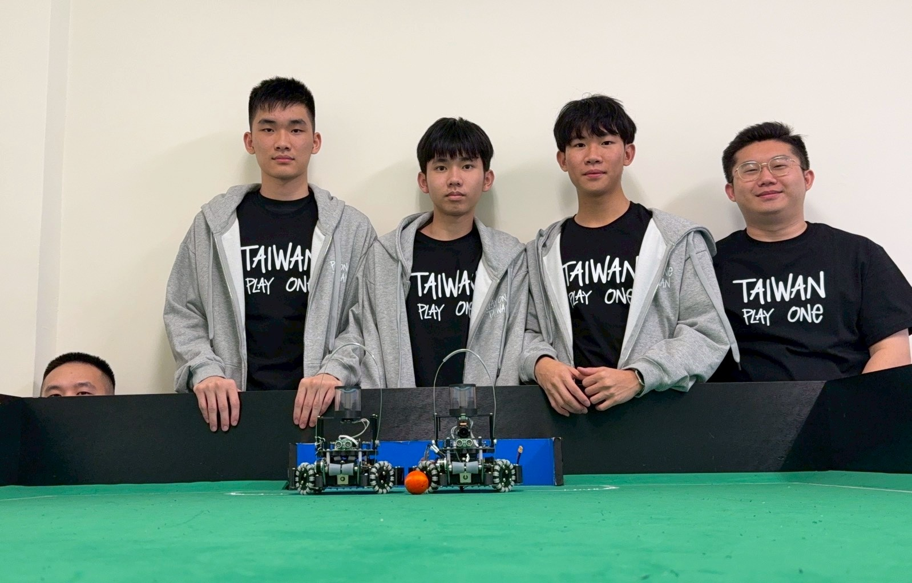

## Members & Roles

*What are the names of the team members and their role(s)?*

Jeter:Hardware development
Tommy:Software development
Flash:Software development

## Meeting Frequency

*How often did your team meet?
(e.g. 90 minutes once per week or a day every weekend.)*

Twice a week, 10 hours each time.

## Meeting Place

*Where did you meet to work on your robot?
(e.g. a robotics room at school, at some other place, one of your homes, school library etc.)*

Studio

## Start Date

*When did your team start working on this year's robot?*

May

## Past Competitions

*Which RoboCupJunior competitions have you competed in and in which leagues?*

Taiwan open 2025:: Lightweight League
Asia-Pacific open 2025: Lightweight League
Korea open 2026:: Lightweight League
Taiwan open 2026:: Lightweight League

## Mentor Contribution

*Which parts of your work received the most contribution from your mentor?*

Our mentor helped optimize our defense strategy algorithms, refining the robot's positioning and reaction logic to protect the goal.

## Workload Management

*How did you manage the workload?*

We communicated through a LINE group and planed the schedule used a Google Sheets.We  used GitHub for code.

## AI Tools

*Which AI tools did you use?*

We utilized Codex for code debugging.

## Robot1 Overall

*Robot 1 Overall View*

## Robot1 Front

*Robot 1 Front view*

## Robot1 Back

*Robot 1 Back view*

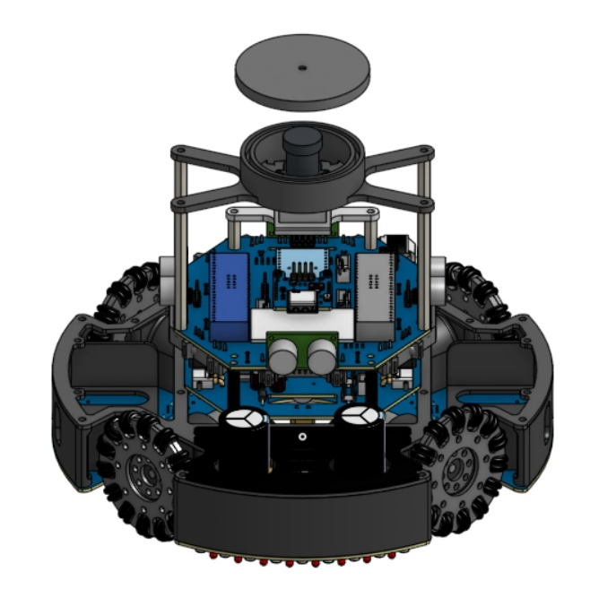

## Robot1 Top

*Robot 1 Top View*

## Robot1 Bottom

*Robot 1 Bottom View*

## Robot1 Right

*Robot 1 Right View*

## Robot1 Left

*Robot 1 Left View*

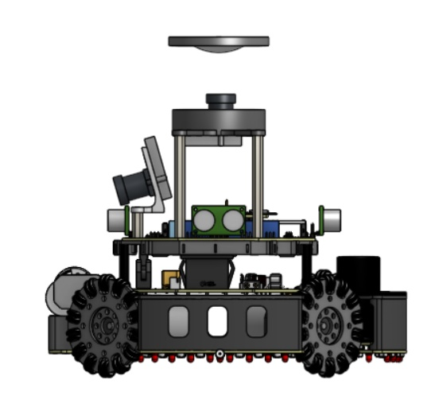

## Robot2 Overall

*Robot 2 Overall View*

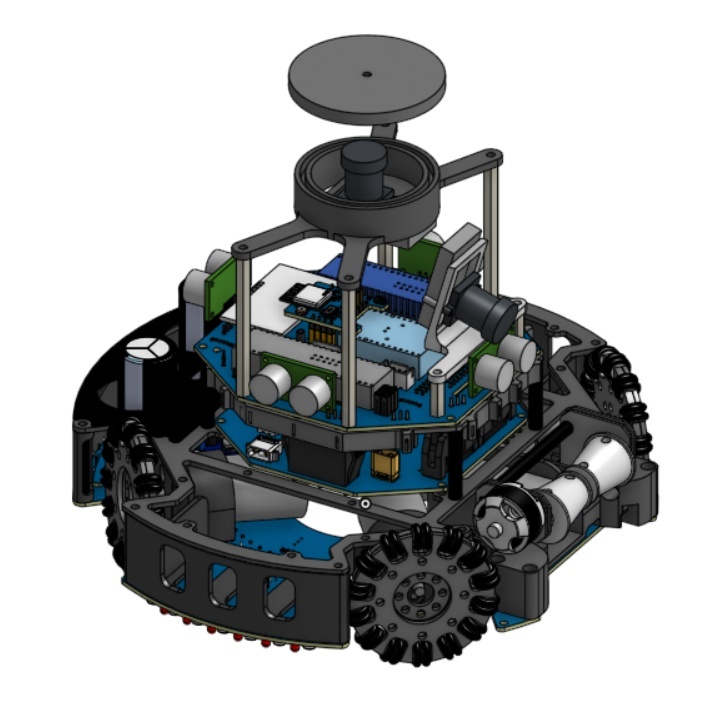

## Robot2 Front

*Robot 2 Front view*

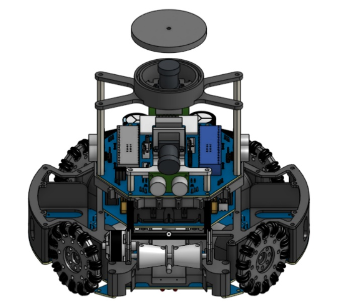

## Robot2 Back

*Robot 2 Back view*

## Robot2 Top

*Robot 2 Top View*

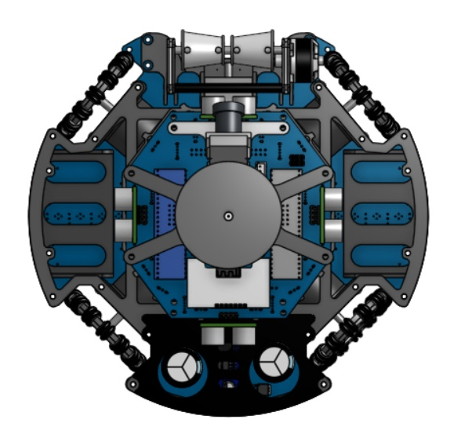

## Robot2 Bottom

*Robot 2 Bottom View*

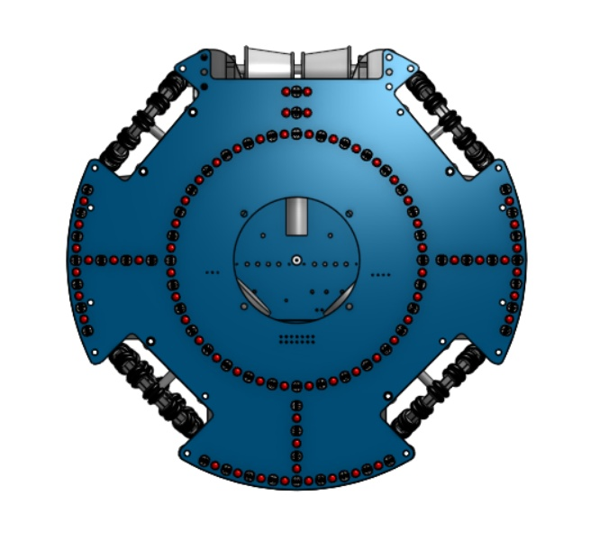

## Robot2 Right

*Robot 2 Right View*

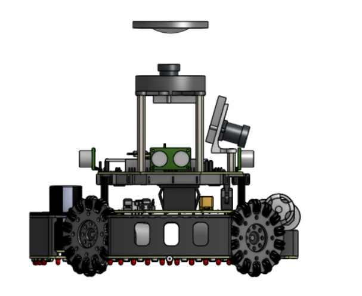

## Robot2 Left

*Robot 2 Left View*

## Mechanical Design

*How did you design the mechanical parts of your robots?*

We used Onshape to design the robot, benchmarking top teams and our past data. To ensure match reliability, we focused on size rules (within 22x22 cm), stability (lowering center of mass), and modular layout for quick repairs. For improvements, we updated the fixed intake to an active, movable mechanism with dynamic joints to absorb impact, and added infrared sensors inside the mechanism to achieve precise, real-time closed-loop ball detection.

## Build Method

*How did you build your design?*

We used 3D printed parts and outsourced plate cutting to www.fhrobotronics.com. We used JLCPCB for PCB manufacturing. During assembly, we adjusted CAD tolerances for smooth bearing fit and rerouted wires to avoid mechanical interference.

## Motors & Reason

*How many motors have you used and why?*

We used 4 motors with 4 custom omni wheels for 360-degree holonomic movement. We designed our own wheels to optimize roller friction and maximize grip. Motor parts used: Maxon DC motors (Part No. 343194), details match our BOM.

## Kicker Design

*If your robot has a kicker, explain how you designed and built the mechanics of the kicker*

We used an off-the-shelf solenoid kicker mounted in a custom 3D printed frame. The plunger is triggered via an external high-voltage capacitor circuit for maximum impact force, and a mechanical spring ensures instant automatic reset after firing.

## Dribbler Design

*If your robot has a dribbler, explain how you designed and built the mechanics of the dribbler.*

We designed an active dribbler using a motor-driven roller wrapped in a high-friction silicone sleeve to spin and stabilize the ball. It features a movable suspension mechanism to absorb impacts, and built-in infrared sensors for real-time ball detection.

## CAD Files

*CAD design files*

https://github.com/bcchen0705/CAD

## Mechanical Innovation

*Mechanical Innovation*

We are most proud of our active, movable ball-capturing mechanism. Instead of using a fixed frame, we engineered dynamic joints with a flexible suspension system that adjusts its angle on the fly to absorb impacts and prevent the ball from bouncing away. Integrated with internal infrared sensors, this setup enables instant closed-loop feedback for ultra-precise, real-time ball control during high-speed maneuvers.

## Mechanical Photos

*Photos of your mechanical designs highlights*

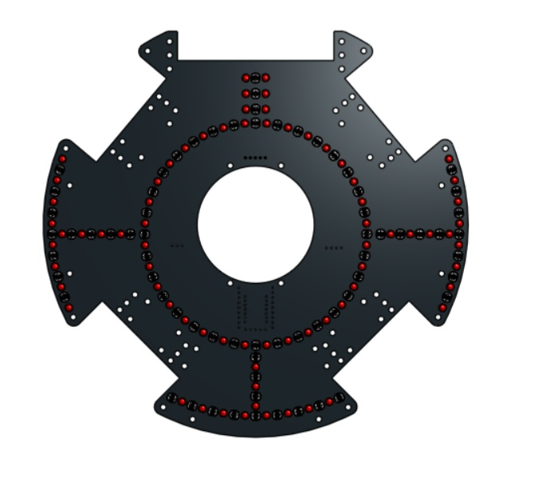
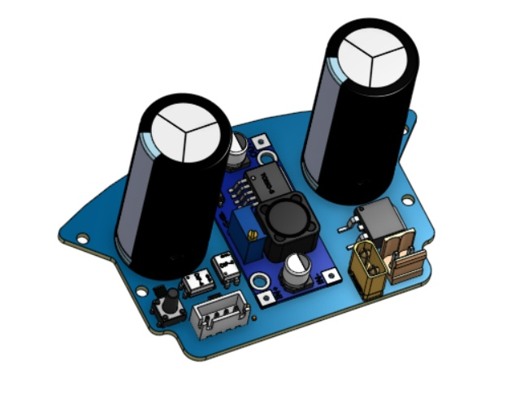
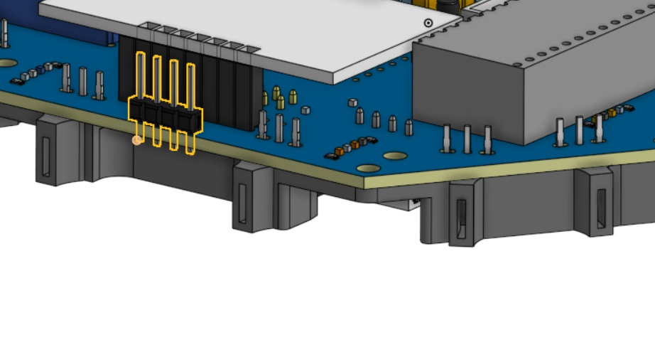
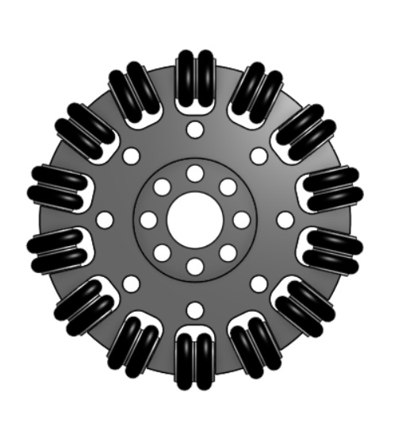
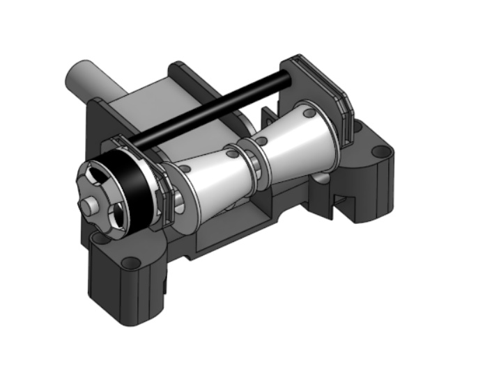

## Electronics Block Diagram

*Provide us with a block diagram of your robot's electronics*

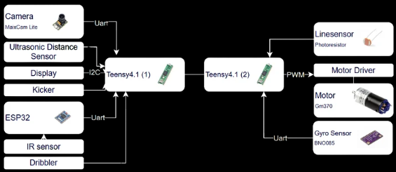

## Power Circuit

*How does your power circuits work?*

Our robot uses two 12.6V batteries to isolate power. Battery 1 powers the main controller via a 5V buck converter. Battery 2 directly powers high-load components, including motors, the kicker module, and the ball-dribbler mechanism.

## Motor Drive Circuit

*How do you drive your motors? Explain the circuits you use for that*

Our robot uses an MD02 dual-channel motor driver with an H-bridge MOSFET architecture. Controlled via PWM/DIR/SLP pins from the microcontroller, it regulates speed and direction. The SLP (Sleep) pin enables control, allowing low-power standby or instant disabling for safety.

## Microcontroller & Reason

*What kind of micro controller or board do you use for your robot? Why did you decide to use this part for your robot? If you have more than 1 processor, explain each one separately.*

Our robot utilizes two Teensy 4.1 boards in a Master-Slave configuration, chosen for their 600 MHz processing speed and abundant I/O pins. The Master Teensy acts as the central hub, processing inputs from infrared sensors, dual cameras, and ultrasonic sensors. The Slave Teensy focuses entirely on detecting white lines and executing motor control based on navigation data received from the Master board.

## Motor Control

*How do you use your processor to move your motors?*

To move our motors, the Master Teensy first calculates the target movement vector based on all sensor data. It then transmits this navigation data to the Slave Teensy via serial communication.

## Ball Detection

*How does your ball detection sensors and/or camera[s] work?*

For ball detection, our robot combines infrared sensors and a vision camera. For long-range tracking, TSSP4038 IR receivers detect the ball's pulsed IR signal, allowing the robot to locate and approach it quickly. Once close, the robot switches to a vision camera that identifies the ball's orange color and shape. This camera data is used to execute precise orbit and dribbling maneuvers.

## Line Detection

*How does your line detection circuits work?*

Our line detection system uses 32 pairs of photoresistors (3.3V) and LEDs (5V). Analog data is routed through CD74HC4067 multiplexers to save pins, serializing the readings for the Slave Teensy to perform real-time white line detection.

## Navigation/Position Sensors

*What sensors do you use for navigation and how are these sensors connected to your processor? What sensors do you use to find your position in the field? What about the direction your robot faces?*

For positioning, our robot uses an omni mirror camera system to detect angles and distances to goals for precise field coordinates. This is complemented by HC-SR04 ultrasonic sensors for wall distances and a BNO085 IMU to track heading. All connect to the Master Teensy: the BNO085 via I2C/SPI, ultrasonic sensors via digital GPIO, and the omni mirror via a serial (UART) interface.

## Kicker Circuit

*How do you drive your kicker system? How does the circuit make the kicker work?*

Our kicker system runs on an independent circuit. It steps up 12V power to 48V using a boost converter to charge the capacitors. To kick, the Master Teensy sends a digital signal that triggers a fast-switching circuit, instantly discharging the 48V energy into the solenoid.

## Dribbler Circuit

*How does your dribbler system work? What components and circuits did you use to drive it?*

Our dribbler system uses an 1806 BLDC motor to control the ball, powered directly from the power board. Its electronic speed controller (ESC) receives a PWM control signal from the Master Teensy to activate, spin, and regulate the motor's speed for optimal ball handling.

## Schematics

*Schematics of your robot*

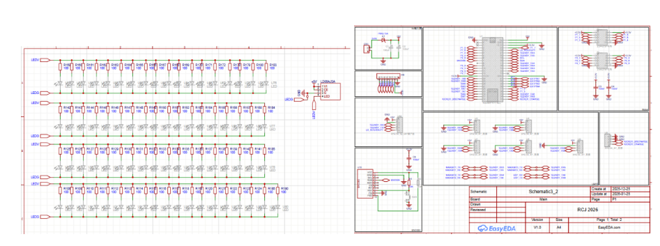

## PCB

*PCB of your robot*

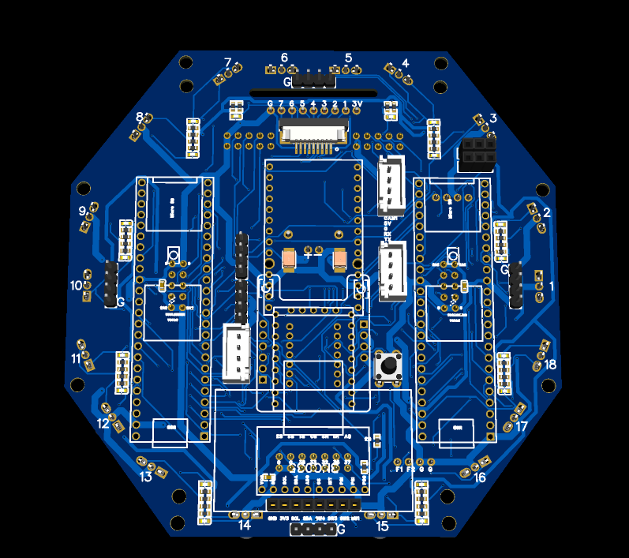
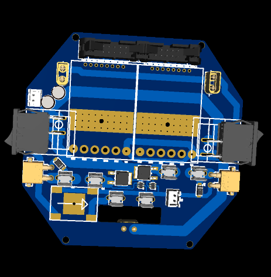
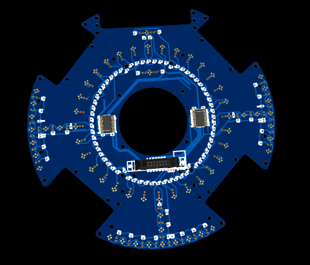

## Electronics Innovation

*Electronics Innovations*

A major technical innovation of our robot is the implementation of a dual-circuit power isolation architecture that completely separates the sensitive logic control system from the high-current actuator electronics.

In traditional single-battery setups, heavy motor loads, kicker discharges, and dribbler accelerations frequently cause massive voltage drops (brownouts) and electromagnetic interference (EMI), leading to microcontroller instability or sudden system resets.

To solve this, our design utilizes two independent 12.6V battery packs to achieve absolute electrical isolation. The first battery serves as the logic power supply, dropping safely to 5V via a high-efficiency buck converter to provide clean, stable power exclusively for the Master and Slave Teensy boards and their sensor networks. The second battery operates on a dedicated high-load circuit, delivering raw, un-regulated power directly to the MD02 motor drivers, the 48V kicker boost converter, and the 1806 BLDC dribbler ESC.

This hardware-level separation ensures that high-frequency switching noise and sudden current spikes from the actuators never propagate back into the processing logic. The result is a highly resilient, noise-immune system capable of executing high-speed maneuvers and rapid kicking sequences with zero risk of processor brownouts or control loop latency.

## Circuit Photos

*Photo of your circuit boards highlights*

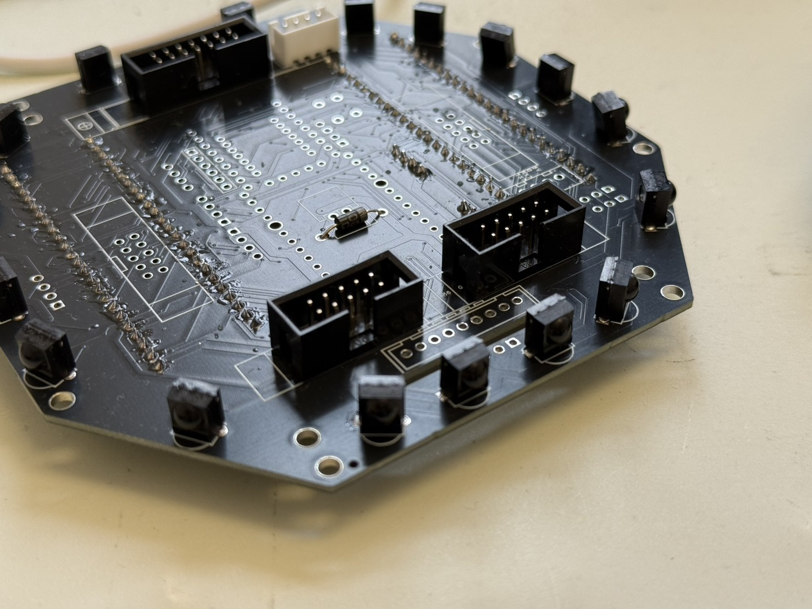
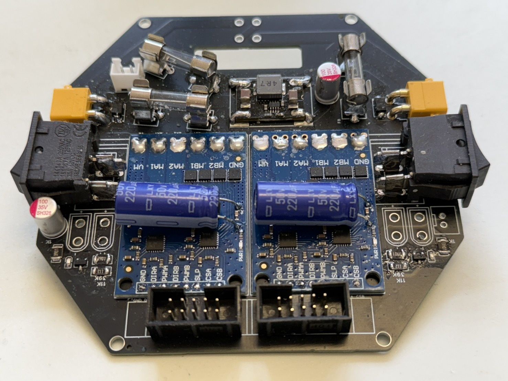
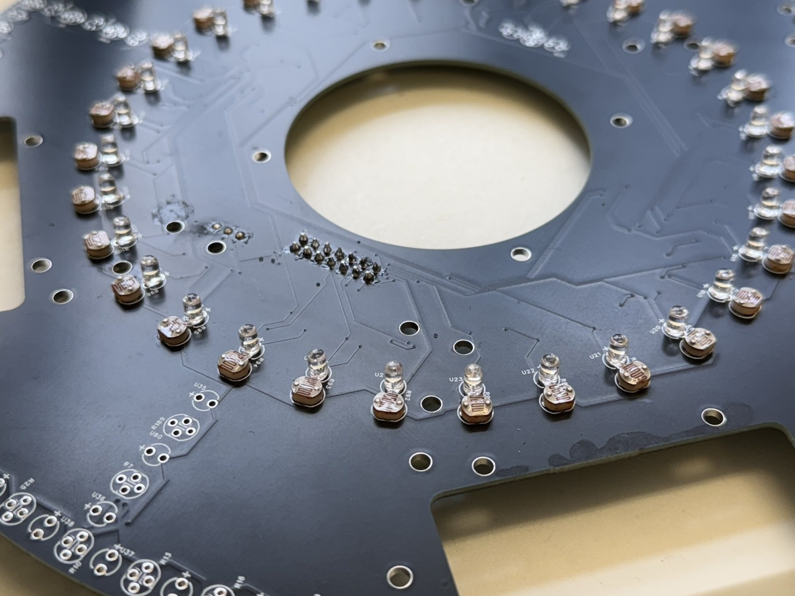

## Ball Detection Method

*How do you find where the ball is? How do you read the data from the ball detection sensors and/or camera?*

To locate the ball, the TSSP4038 infrared sensors capture pulsed IR signals, which are pre-processed by an ESP32 microcontroller and transmitted to the Master Teensy via UART serial communication. Simultaneously, for close-range tracking, a MaixCam vision camera detects the orange ball and transmits the processed coordinate data directly to the Master Teensy via a separate UART interface.

## Ball Catch Algorithm

*How does your algorithm work to catch the ball? Is there a difference between your robots in how they move towards the ball? Explain the differences.*

Our algorithm calculates the optimal intercept path using the ball's distance and angle. The Striker uses an orbiting algorithm to loop behind the ball and push it toward the opponent's goal, while the Goalie uses linear tracking to move sideways, staying between the ball and our goal to block shots.

## Positioning Algorithm

*How do you use your sensors in your algorithm to find your position inside the field and how do you use that position to move your robots around?*

Our localization algorithm utilizes the omni mirror system to detect the angles and distances to both goals, converting these visual landmarks into a precise X and Y coordinate system of the field. We use these coordinates to track our exact position in real-time, primarily utilizing this data to trigger out-of-bounds containment and ensure the robot stays within safe playing boundaries.

## Line Algorithm

*How does your robot find the lines to stay inside the field? What algorithms do you use to avoid going out of bounds?*

Our robot tracks white boundary lines using a photoresistor array. Our out-of-bounds avoidance algorithm is based on vector addition: when multiple sensors detect a line, the system aggregates their positions as vectors, calculates the net resultant angle, and commands the robot to move in the exact opposite vector direction to safely back away.

## Goal Algorithm

*What algorithms do you use to score goals? How do you use your kicker and dribbler to handle the ball?*

Our goal-scoring algorithm relies on a dedicated front-facing camera to locate the opponent's goal. Once the robot successfully secures possession of the ball, the algorithm immediately calculates the angle to the target goal, commands the robot to rotate and face the goal, and initiates a high-speed sprint straight toward it to execute a powerful shot.

## Defense Algorithm

*What algorithms do you use to avoid the opponent team scoring? How do your robots defend your own goal?*

Our Goalie uses a linear tracking algorithm, shifting laterally to stay between the ball and our net to block shots. Meanwhile, the Striker acts as the first line of defense, orbiting to cut off opponent angles and strip possession. To ensure stability, the system fuses omni mirror and ultrasonic data to keep the Goalie perfectly positioned without colliding with the posts.

## Robot Communication

*Do your robots communicate with each other? How do you use this communication to your advantage?*

We don't have communication.

## Software Innovation

*Software Innovations*

I am most proud of our Vector-Based Out-of-Bounds Avoidance Algorithm. When the photoresistor array detects the boundary line, it maps the triggered sensors as spatial vectors to calculate a net resultant vector, commanding the robot to back away in the exact opposite direction. This eliminates boundary stalling and allows the robot to retreat smoothly while keeping its front face locked onto the ball for instant counter-attacks.

## GitHub Link

*GitHub link*

https://github.com/bcchen0705/Teensy4.1-RCJ2026

## BOM

*Bill of Materials (BOM)*

[https://drive.google.com/open?id=1FBT4mtcbueDbLBuSWBaw9vElKo_82exb](https://drive.google.com/open?id=1FBT4mtcbueDbLBuSWBaw9vElKo_82exb)

## Cost

*How much did it cost you to build your robots?*

Robots (cost of components that are in your robots right now): 30,000 TWD each

Experiments (failed builds, broken hardware etc.): 150,000 TWD

Environment (fields, balls, etc.): 15,000 TWD

1 TWD = 0.0314 USD

## Funding

*How did you gathered the funds to build the robots?*

10% sponsors

90% parents

## Affordability

*How affordable was it to compete in RoboCupJunior Soccer?*

2

## Answer Check

*Have you checked all of your answers?*

Yes!

## Publication Consent

*We publish TDPs and posters during or after the competition as described in the beginning*

Yes, we acknowledge everything submitted in the above form can be published.

