## Timestamp

*Tijdstempel*

29-6-2026 0:49:08

## Email Address

*E-mailadres*

mauriciofuentesachus@gmail.com

## TDP File

*TDP File Upload (Not required)*

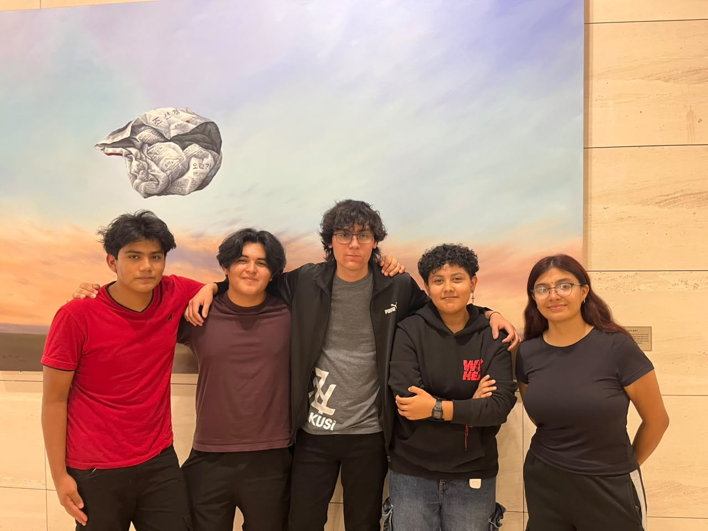

## Team Name

*What is your team's name?*

RC-UANL(AEPEX)

## League

*What league do you participate in?*

IR League

## Country

*Where are you from?*

México

## Contact

*If other teams have questions about your robot, now or in the future, what email address(es) can we publish along with this document for people to reach you?

(You can put in multiple email addresses, like multiple team members, an email for the whole team or both. Feel free to share other ways of communication like Discord handles)*

aepexrobots@gmail.com

## Social Media

*Team Social Media Links (if you have any)*

@aepex.robot

## Team Photo

*Upload a photo of your whole team with your mentor and robots

Note: This is not mandatory and will be published along with your TDP if you choose to upload something*

## Members & Roles

*What are the names of the team members and their role(s)?*

Mauricio García : Mechanic Design
Ana Jiménez : PCB Assembly and connections.
Omar González : Circuit, PCB design and programming.
Juan Santiago : Programming.

## Meeting Frequency

*How often did your team meet?
(e.g. 90 minutes once per week or a day every weekend.)*

4 days every week

## Meeting Place

*Where did you meet to work on your robot?
(e.g. a robotics room at school, at some other place, one of your homes, school library etc.)*

A robotics room at school and sometimes online in our homes

## Start Date

*When did your team start working on this year's robot?*

May 2026

## Past Competitions

*Which RoboCupJunior competitions have you competed in and in which leagues?*

Torneo Mexicano de Robótica 2025: Lightweight League
Torneo Mexicano de Robótica 2025: Open League
Torneo Mexicano de Robótica 2026: Lightweight League

## Mentor Contribution

*Which parts of your work received the most contribution from your mentor?*

N/A

## Workload Management

*How did you manage the workload?*

We communicated through a WhatsApp group and got together after school to assign tasks.

## AI Tools

*Which AI tools did you use?*

Deep Seek and Gemini

## Robot1 Overall

*Robot 1 Overall View*

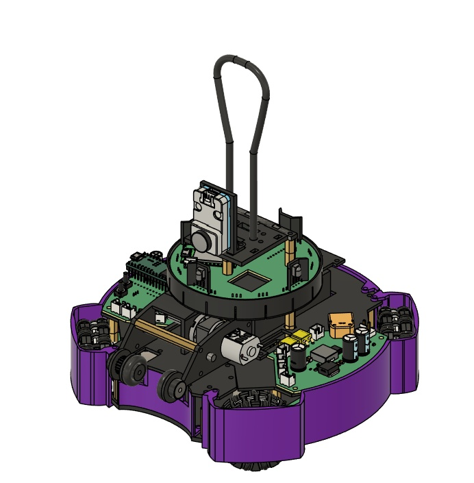

## Robot1 Front

*Robot 1 Front view*

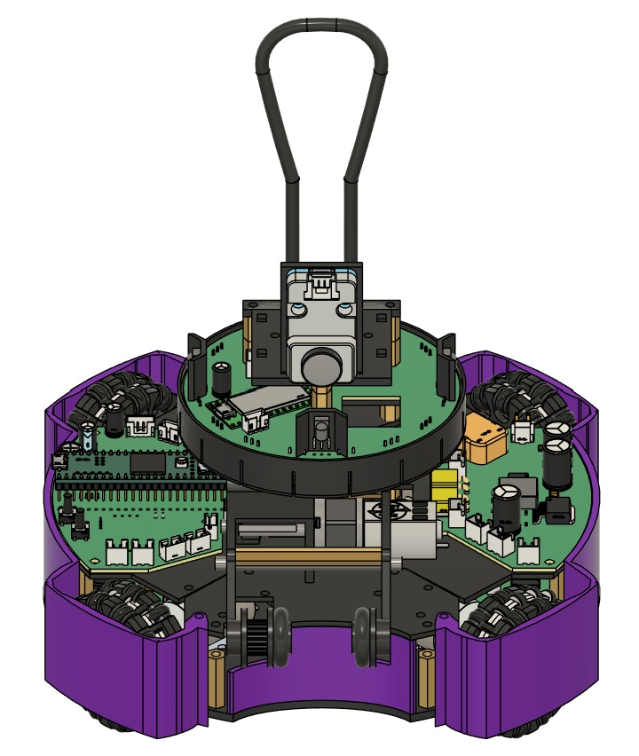

## Robot1 Back

*Robot 1 Back view*

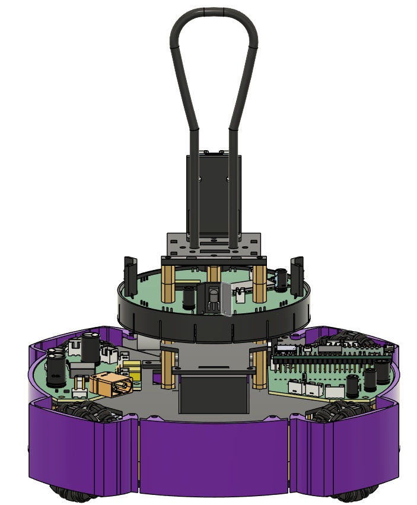

## Robot1 Top

*Robot 1 Top View*

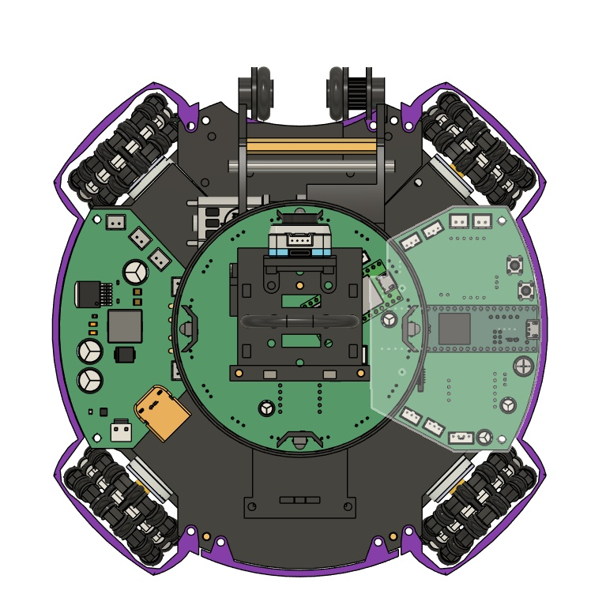

## Robot1 Bottom

*Robot 1 Bottom View*

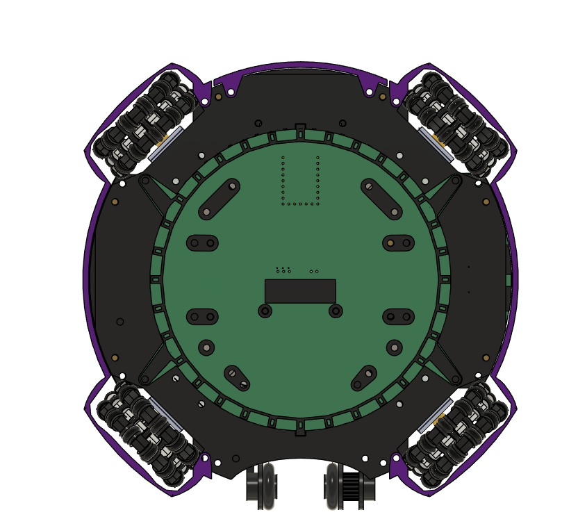

## Robot1 Right

*Robot 1 Right View*

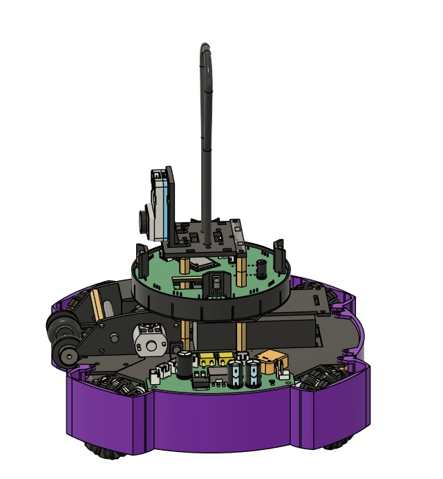

## Robot1 Left

*Robot 1 Left View*

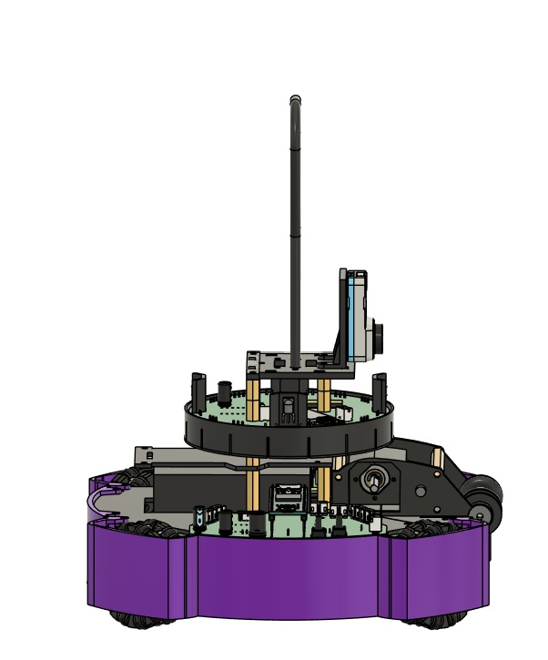

## Robot2 Overall

*Robot 2 Overall View*

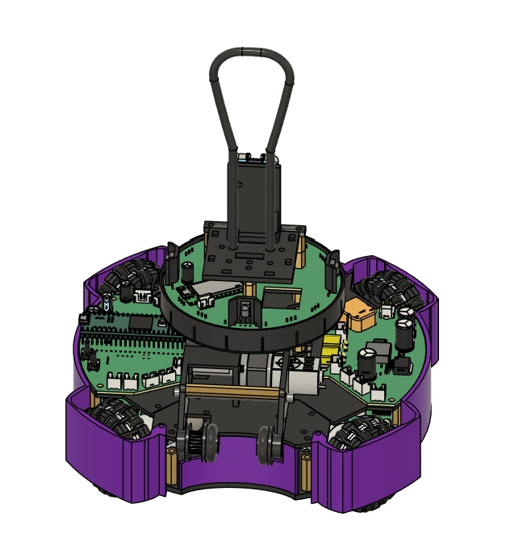

## Robot2 Front

*Robot 2 Front view*

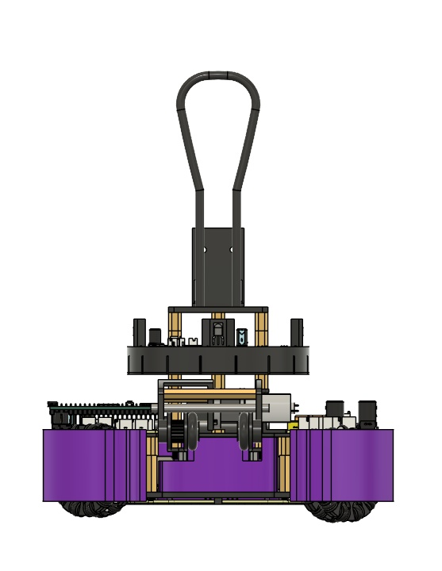

## Robot2 Back

*Robot 2 Back view*

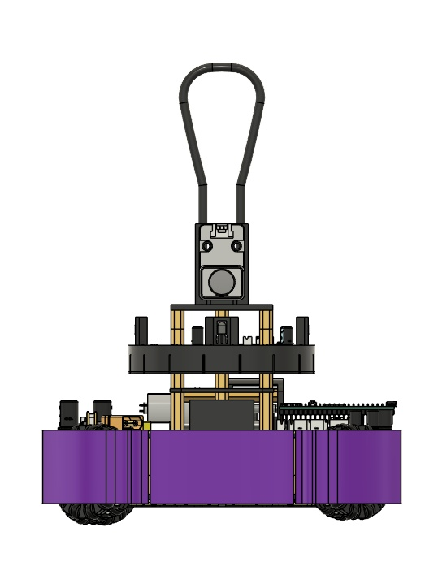

## Robot2 Top

*Robot 2 Top View*

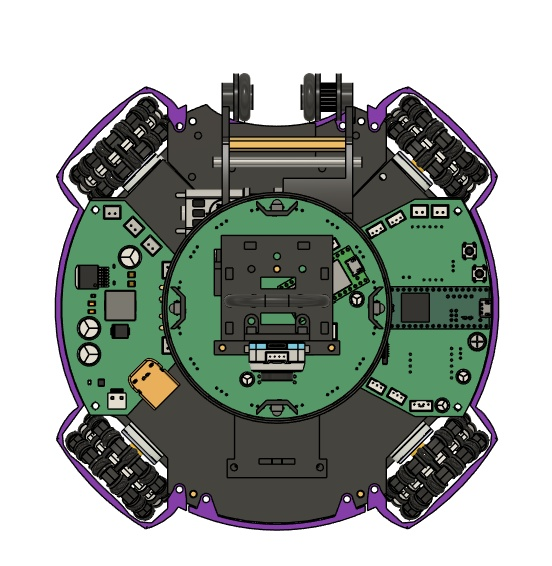

## Robot2 Bottom

*Robot 2 Bottom View*

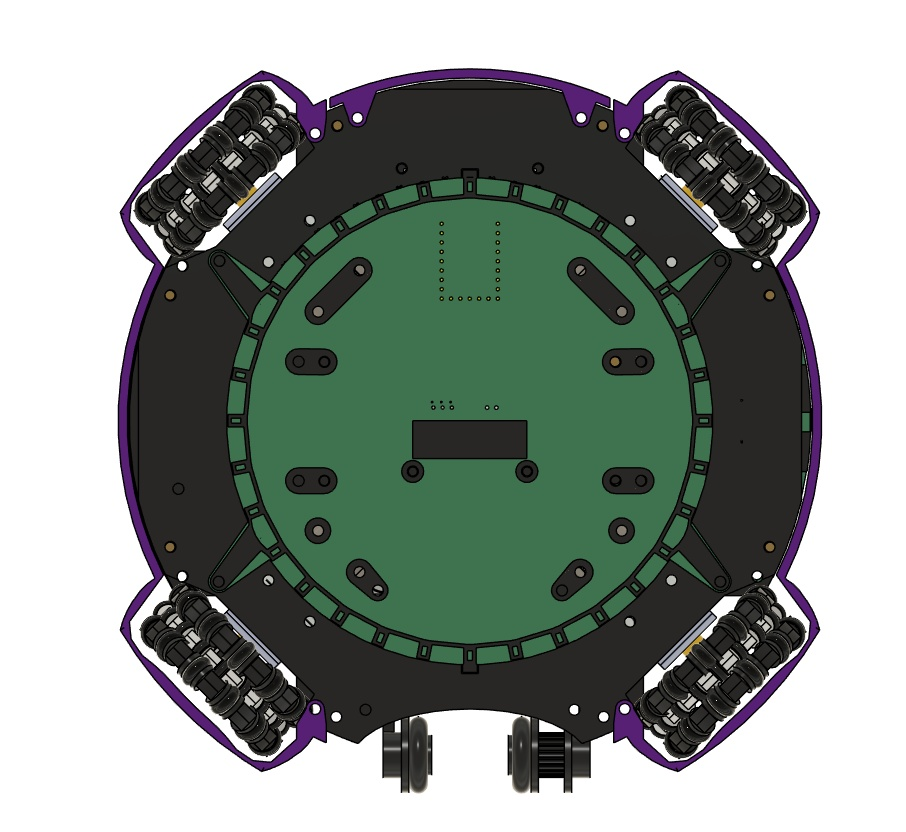

## Robot2 Right

*Robot 2 Right View*

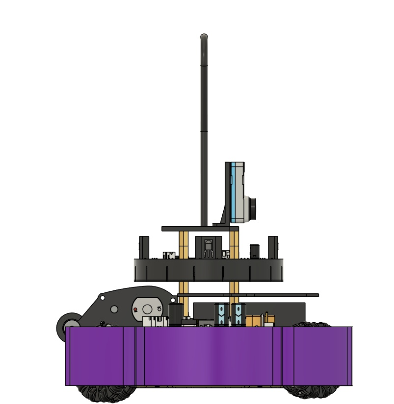

## Robot2 Left

*Robot 2 Left View*

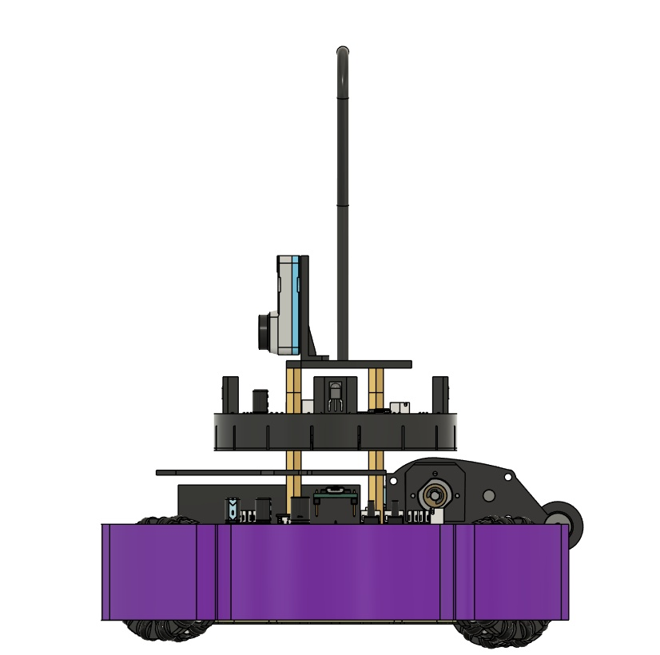

## Mechanical Design

*How did you design the mechanical parts of your robots?*

We used Fusion 360 and repositioned the lipo battery compartment to make room for the dribbler, added a new fourth level to house the camera, and created a new section for a flexible grip and the complete tire design.

## Build Method

*How did you build your design?*

We used a Bamboo Lab A1 Mini to print the chasis and wheels. And we had the PCBs made at JLCPCB.

## Motors & Reason

*How many motors have you used and why?*

10 in total, 5 on each robot, 4 for movement and one for the dribbler. We also made our own wheels based on the GTF Robots tires, but an additional row of small tires was added for better traction.

## Kicker Design

*If your robot has a kicker, explain how you designed and built the mechanics of the kicker*

N/A

## Dribbler Design

*If your robot has a dribbler, explain how you designed and built the mechanics of the dribbler.*

We first built a DC motor mount, extending it toward the gripping area where the rotation shaft was installed. We connected the motor and rotation shafts using a toothed belt with matching gears, and integrated a suspension system on both sides.

## CAD Files

*CAD design files*

## Mechanical Innovation

*Mechanical Innovation*

We designed an efficient oil extraction system, along with tires that offer greater traction and control.

## Mechanical Photos

*Photos of your mechanical designs highlights*

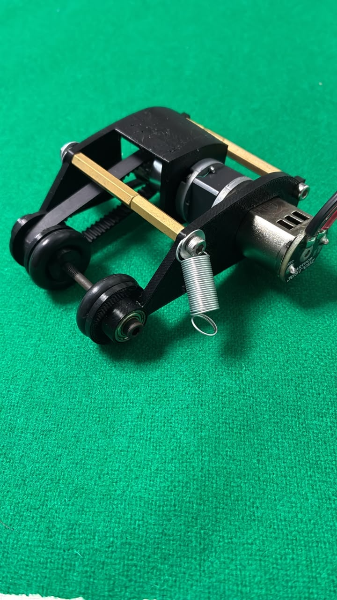
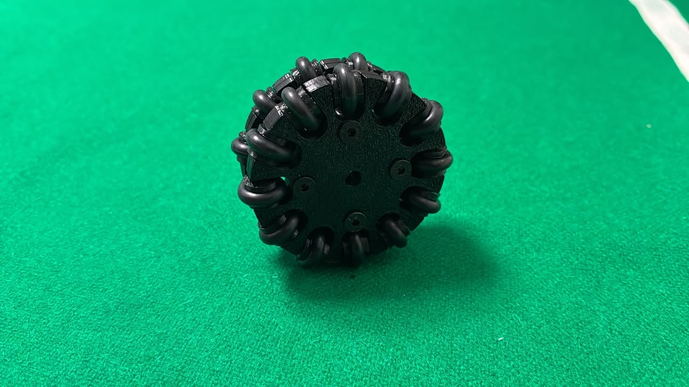

## Electronics Block Diagram

*Provide us with a block diagram of your robot's electronics*

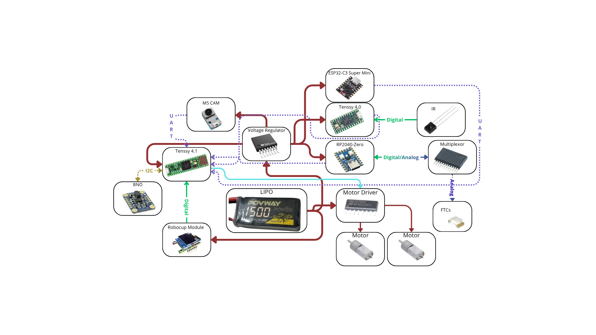

## Power Circuit

*How does your power circuits work?*

An 11.1V LiPo battery powers the motors, communication, and dribbler. An LM22678TJ regulator steps this down to a stable 5V for the microcontrollers and LEDs. Finally, integrated MCU regulators further step down the 5V to 3.3V to safely power the IR and light sensors.

## Motor Drive Circuit

*How do you drive your motors? Explain the circuits you use for that*

Each motor is controlled by the V1NH70701ASTR driver, which requires only three pins: one PWM pin and two pins for controlling the direction of rotation using digital signals.

## Microcontroller & Reason

*What kind of micro controller or board do you use for your robot? Why did you decide to use this part for your robot? If you have more than 1 processor, explain each one separately.*

Our robot distributes tasks across four specific microcontrollers. The main Teensy 4.1 processes decision-making and motor control, receiving data via UART from the other boards. For dedicated tasks, a Teensy 4.0 reads the IR sensors, an RP2040-Zero reads phototransistors through multiplexers, and an ESP32-C3 Super Mini handles Bluetooth communication.

## Motor Control

*How do you use your processor to move your motors?*

Motor control is based on proportional control. Using: float rad = _angle * PI / 180.0;

    float t1 = sin(rad + PI/4);
    float t2 = sin(rad - PI/4);
    float t3 = sin(rad + 3*PI/4);
    float t4 = sin(rad - 3*PI/4);

## Ball Detection

*How does your ball detection sensors and/or camera[s] work?*

The IR sensors (TSSP4038) have a built-in filter; when they detect a signal, the read pin changes from 1 to 0.

## Line Detection

*How does your line detection circuits work?*

The FTSCs are connected to 3.3V in series with a 10K-ohm resistor and a load resistor, where the emitter output of the phototransistor is connected to a multiplexer channel. The RP2040-Zero is responsible for configuring the multiplexer channel it wishes to read via an analog pin.

## Navigation/Position Sensors

*What sensors do you use for navigation and how are these sensors connected to your processor? What sensors do you use to find your position in the field? What about the direction your robot faces?*

N/A

## Kicker Circuit

*How do you drive your kicker system? How does the circuit make the kicker work?*

N/A

## Dribbler Circuit

*How does your dribbler system work? What components and circuits did you use to drive it?*

Our dribbler uses a DC motor to rotate a shaft that spins the ball in the opposite direction. It features a built-in suspension system that mechanically adapts to the ball's shape upon reception, pressing against it to maintain constant, stable control.

## Schematics

*Schematics of your robot*

## PCB

*PCB of your robot*

## Electronics Innovation

*Electronics Innovations*

Our power board features internal protections built into the regulator. Unlike other devices, we’ve managed to integrate everything onto a single board, reducing both space and weight.

## Circuit Photos

*Photo of your circuit boards highlights*

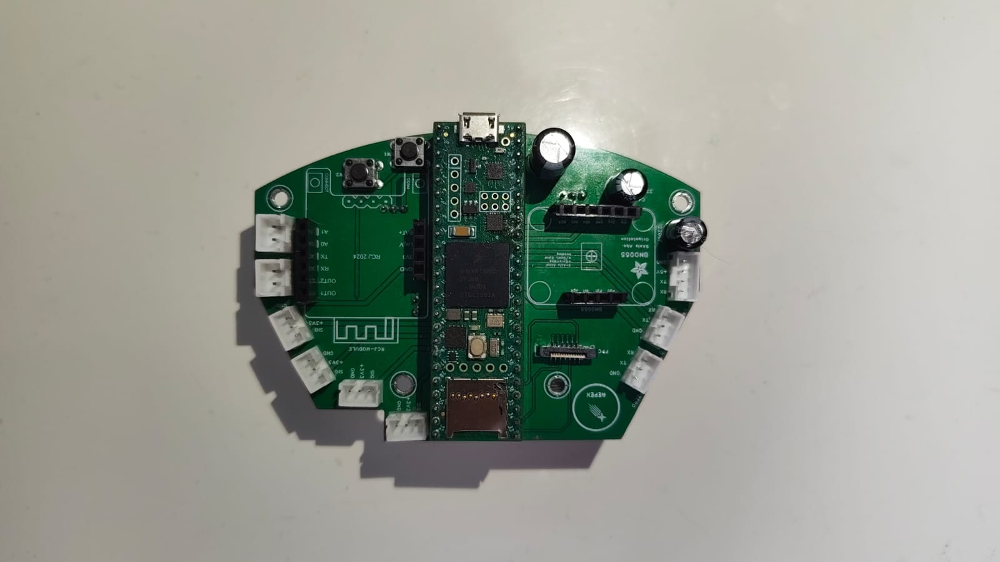
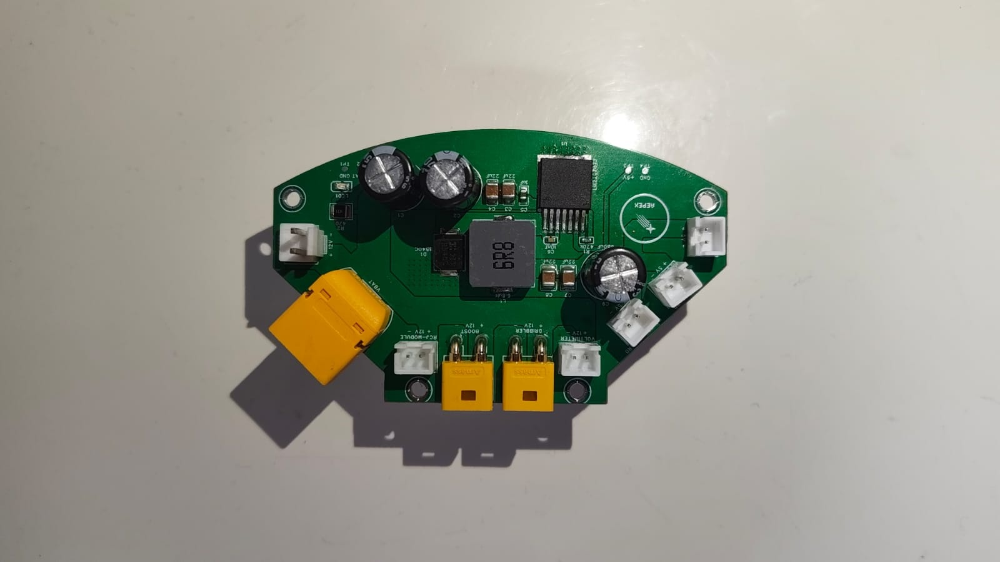
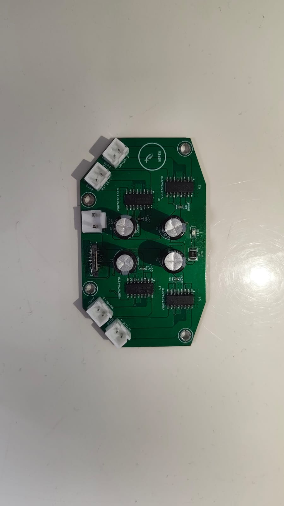

## Ball Detection Method

*How do you find where the ball is? How do you read the data from the ball detection sensors and/or camera?*

We filter out the noise from the IR sensors by selecting only the sensor with the highest reading and its four neighbors on either side. We associate each sensor with a vector to decompose it into X and Y components. Finally, we calculate the angle using the atan2 function and the magnitude using the Pythagorean theorem, obtaining an accurate resultant vector to locate the ball.

## Ball Catch Algorithm

*How does your algorithm work to catch the ball? Is there a difference between your robots in how they move towards the ball? Explain the differences.*

Based on the magnitude of the ball's vector, if the robot detects that the ball is very far away, it follows the ball in a straight line; however, if the vector's magnitude is strong, it moves tangentially to the ball until it aligns with the center of the robot's nozzle.

## Positioning Algorithm

*How do you use your sensors in your algorithm to find your position inside the field and how do you use that position to move your robots around?*

N/A

## Line Algorithm

*How does your robot find the lines to stay inside the field? What algorithms do you use to avoid going out of bounds?*

All light sensors on the board are read based on a prior calibration; if the reading exceeds a certain threshold, it is interpreted as detecting the white line and is associated with that sensor’s vector. This allows the system to calculate a line angle, which is sent via UART; once the data is received, the robot moves in the opposite direction.

## Goal Algorithm

*What algorithms do you use to score goals? How do you use your kicker and dribbler to handle the ball?*

We use vector calculus and a PID controller in conjunction with optical color sensors. The robot calculates vectors opposite to the ball's angle in order to circle around it and position itself. It then detects the color of the opposing goal to calculate the exact angle toward the center, while the PID controller corrects the robot's rotation in real time to ensure a direct and precise shot.

## Defense Algorithm

*What algorithms do you use to avoid the opponent team scoring? How do your robots defend your own goal?*

Our defense uses an algorithm based on the ball's relative position. The robot detects the goal line to use it as a reference line and calculates the ball's horizontal position in real time. This allows it to move sideways to block shooting angles, ensuring that it always remains between the ball and the goal quickly and efficiently.

## Robot Communication

*Do your robots communicate with each other? How do you use this communication to your advantage?*

Yes. They communicate via Bluetooth to prevent them from colliding if they both head for the ball. Also, when our robot goes out and the opposing team's robots do too, the goalkeeper will score a goal if it detects that the ball hasn't moved for a certain period of time.

## Software Innovation

*Software Innovations*

To manage a complex system with over a thousand lines of code, we implemented a library-based organizational structure. We decided to decouple the system by creating specific libraries for the physical components and consolidating all the behavioral logic into a single central file. This structure optimizes mental clarity when programming strategies and drastically reduces diagnostic time, allowing us to debug errors much more quickly and efficiently between matches.

## GitHub Link

*GitHub link*

## BOM

*Bill of Materials (BOM)*

[https://drive.google.com/open?id=1PL25TLwvgHTcuw5GFmQJx-9mDPOoz_eDTS29ESfpzdg](https://drive.google.com/open?id=1PL25TLwvgHTcuw5GFmQJx-9mDPOoz_eDTS29ESfpzdg)

## Cost

*How much did it cost you to build your robots?*

Robots (cost of components that are in your robots right now): 16, 609 Mexican Peso each
Experiments (failed builds, broken hardware etc.): 90,000 Mexican Peso
Environment (fields, balls, etc.) : 8,250 Mexican Peso
17.50 Mexican Peso = 1 USD

## Funding

*How did you gathered the funds to build the robots?*

100% parent

## Affordability

*How affordable was it to compete in RoboCupJunior Soccer?*

1

## Answer Check

*Have you checked all of your answers?*

Yes!

## Publication Consent

*We publish TDPs and posters during or after the competition as described in the beginning*

Yes, we acknowledge everything submitted in the above form can be published.

