## Timestamp

*Tijdstempel*

27-6-2026 10:55:52

## Email Address

*E-mailadres*

shirazibenyamin2@gmail.com

## TDP File

*TDP File Upload (Not required)*

## Team Name

*What is your team's name?*

RoboDanesh

## League

*What league do you participate in?*

IR League

## Country

*Where are you from?*

IRAN

## Contact

*If other teams have questions about your robot, now or in the future, what email address(es) can we publish along with this document for people to reach you?

(You can put in multiple email addresses, like multiple team members, an email for the whole team or both. Feel free to share other ways of communication like Discord handles)*

Robodaneshacademy@gmail.com

## Social Media

*Team Social Media Links (if you have any)*

RoboDanesh on instgram

## Team Photo

*Upload a photo of your whole team with your mentor and robots

Note: This is not mandatory and will be published along with your TDP if you choose to upload something*

## Members & Roles

*What are the names of the team members and their role(s)?*

Negar Hattami(Programmer)
Seyed Emad Montazeri (Programmer, Mechanical Design)
Ilia Moradikhah (Programmer)
Benyamin Andalib Shirazi (Electronics)

## Meeting Frequency

*How often did your team meet?
(e.g. 90 minutes once per week or a day every weekend.)*

Our team meets three days per week for four hours per session, with an additional weekly meeting to review progress and discuss future plans.

## Meeting Place

*Where did you meet to work on your robot?
(e.g. a robotics room at school, at some other place, one of your homes, school library etc.)*

Robo Danesh Institute

## Start Date

*When did your team start working on this year's robot?*

22/5/2025

## Past Competitions

*Which RoboCupJunior competitions have you competed in and in which leagues?*

IranOpen Junoir Soccor League 2023 LightWeight
IranOpen Junoir Soccor League 2024 LightWeight
IranOpen Junoir Soccor League 2024 OpenWeight
IranOpen Junoir Soccor League 2026 LightWeight 
RoboCupJunior 2024 OpenWeight Eindhoven, Netherlands

## Mentor Contribution

*Which parts of your work received the most contribution from your mentor?*

Our mentor guided key decisions, advised to use TD-Axis instead of cmps14, helped resolve sensor issues, debug connection between robots.

## Workload Management

*How did you manage the workload?*

We mostly used GitHub to connect with more people in robotics industry and for issues
We also used Telegram group for our schedule and tasks.

## AI Tools

*Which AI tools did you use?*

We used AI (ChatGpt, DeepSeek, ...) for solving code issues a few times.
and also we used AI for poster Ideas.

## Robot1 Overall

*Robot 1 Overall View*

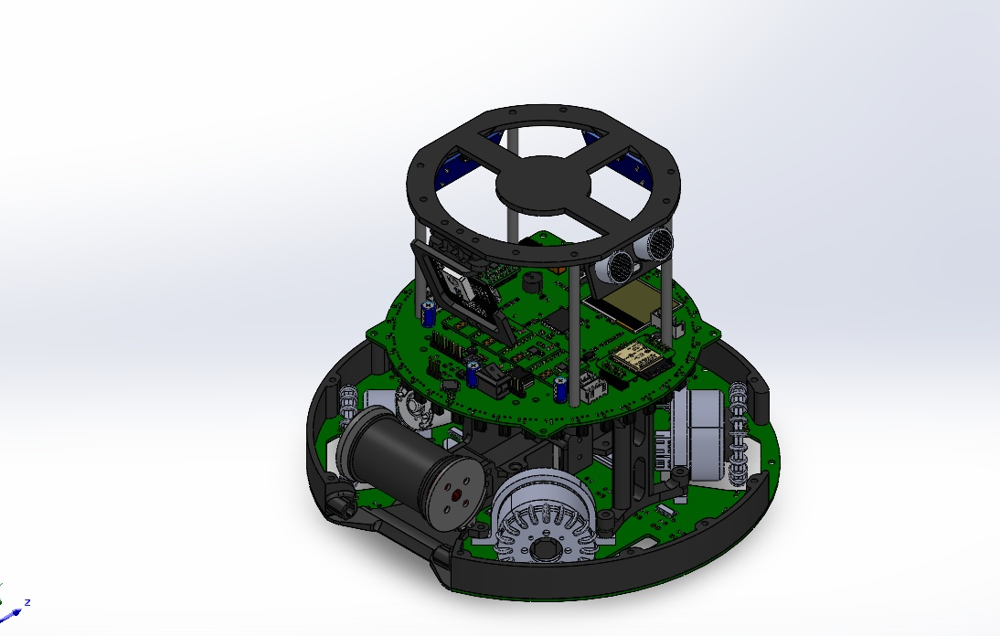

## Robot1 Front

*Robot 1 Front view*

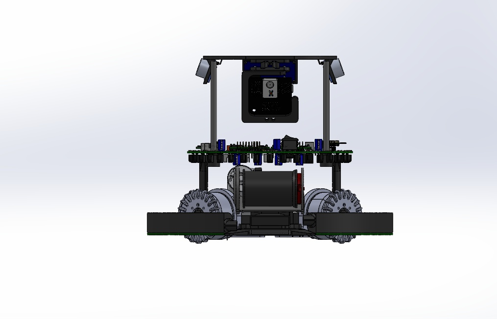

## Robot1 Back

*Robot 1 Back view*

## Robot1 Top

*Robot 1 Top View*

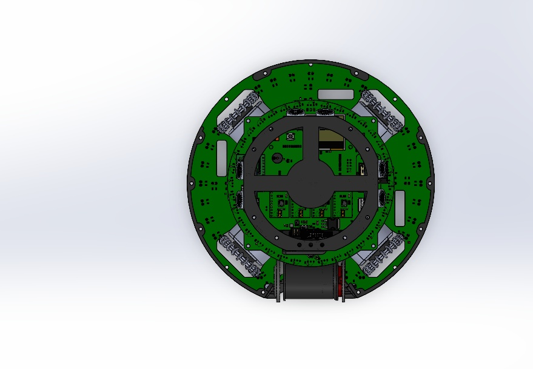

## Robot1 Bottom

*Robot 1 Bottom View*

## Robot1 Right

*Robot 1 Right View*

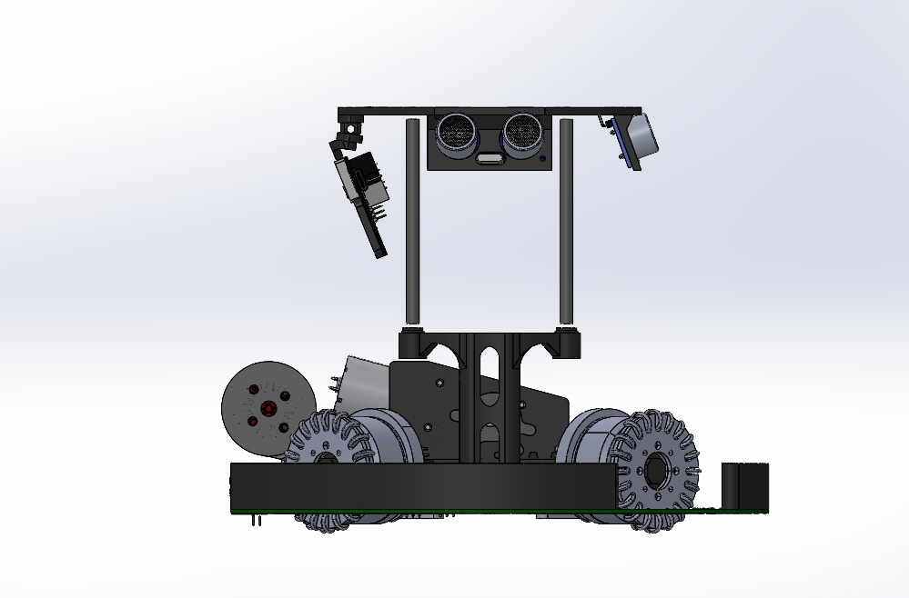

## Robot1 Left

*Robot 1 Left View*

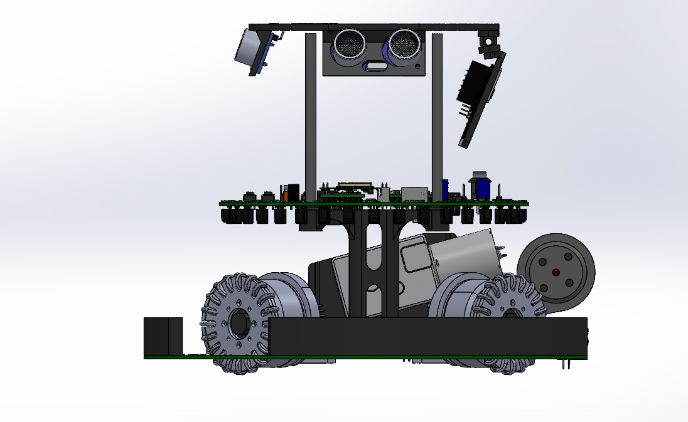

## Robot2 Overall

*Robot 2 Overall View*

## Robot2 Front

*Robot 2 Front view*

## Robot2 Back

*Robot 2 Back view*

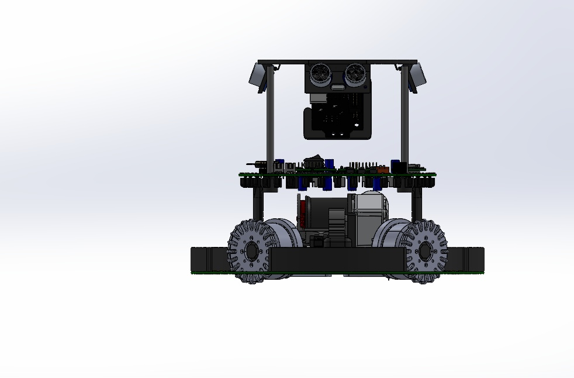

## Robot2 Top

*Robot 2 Top View*

## Robot2 Bottom

*Robot 2 Bottom View*

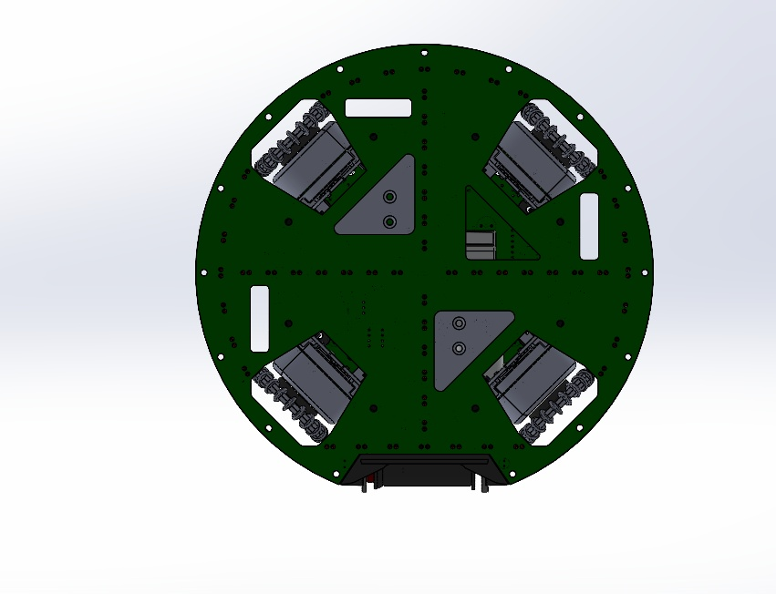

## Robot2 Right

*Robot 2 Right View*

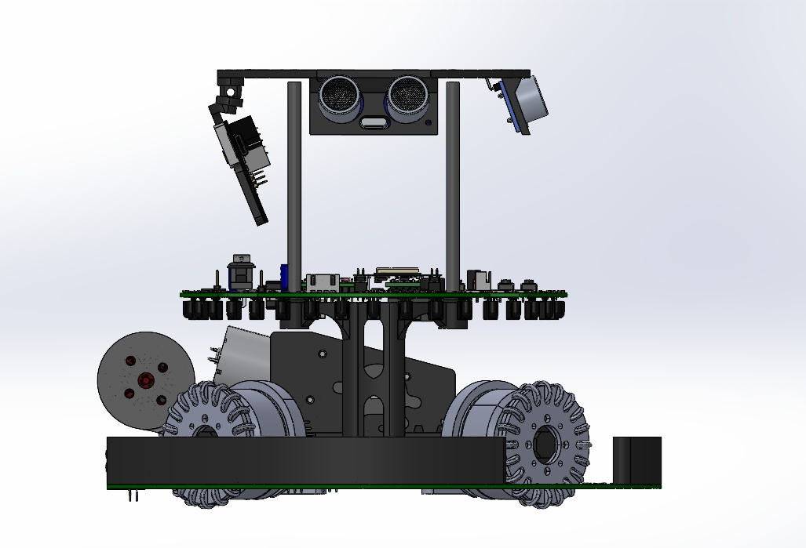

## Robot2 Left

*Robot 2 Left View*

## Mechanical Design

*How did you design the mechanical parts of your robots?*

We designed the robot using SolidWorks, developing initial concepts through internal ideation and refining them using resources such as YouTube and designs from other teams. These concepts were regularly discussed and evaluated during team meetings with our mentors. We iteratively improved key components, including the shooting mechanism and wheel design. Additionally, we developed a mechanical filter for the TSSP sensor to effectively reduce noise and enhance signal reliability.

## Build Method

*How did you build your design?*

We manufactured parts using a Bambu Lab 3D printer, optimizing slicing settings for strength and accuracy. Components were tested and refined, improving chassis, wheels, and shooting system while adjusting tolerances for reliable overall performance.

## Motors & Reason

*How many motors have you used and why?*

We used four brushless motors with eight wheels, with two wheels mounted on each motor, along with one motor for the shooter and one for the spin-back mechanism. The four-motor drivetrain enables omnidirectional movement and precise control across the field. The wheels were custom-designed in SolidWorks, inspired by omni-wheel concepts, ensuring smooth motion and stability.

## Kicker Design

*If your robot has a kicker, explain how you designed and built the mechanics of the kicker*

The kicker mechanism was designed in SolidWorks and 3D printed using a Bambu Lab printer with PLA material. For the first time we make kicker with spring and linear gear system , combined with a worm gear to provide torque and control, ensuring consistent and reliable kicking performance.

## Dribbler Design

*If your robot has a dribbler, explain how you designed and built the mechanics of the dribbler.*

The dribbler was designed in SolidWorks as a rotating cylindrical roller at the front of the robot. When the ball enters the dribbler area, it captures and controls it. The mechanism is powered by a DJI2212 920KV motor, providing sufficient speed and torque for consistent ball handling.

## CAD Files

*CAD design files*

https://grabcad.com/library/robodonesh-soccer_light-1

## Mechanical Innovation

*Mechanical Innovation*

Our key mechanical innovations include a custom wheel design optimized through extensive testing to achieve smooth, stable, and efficient movement across the field. We also developed an advanced dribbler capable of capturing balls even from corner positions without entering them, improving control and flexibility during play. Additionally, our kicker is not like others adn compeletly its new and its our biggest innovation in our robot,It is carefully work with the dribbler for better performance

## Mechanical Photos

*Photos of your mechanical designs highlights*

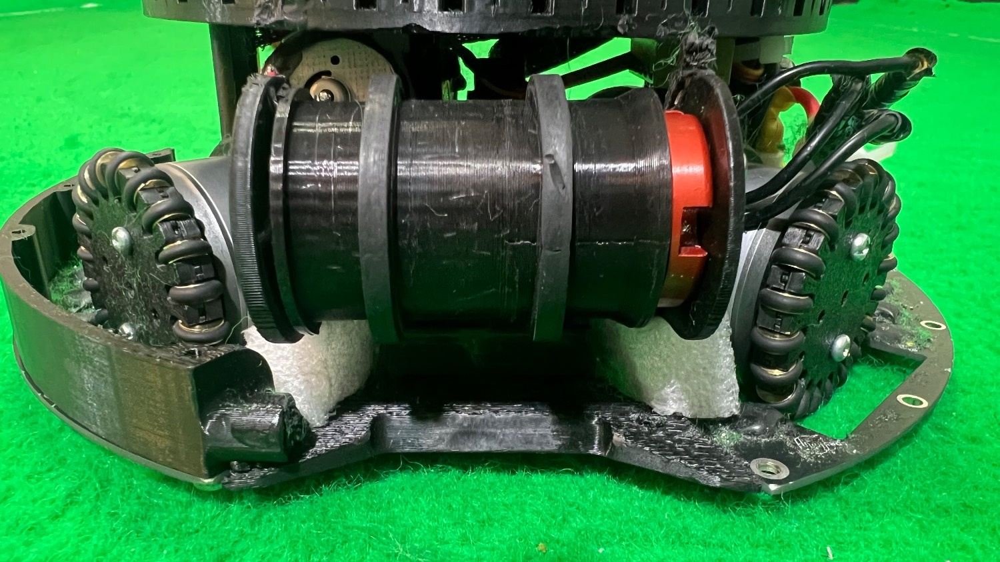
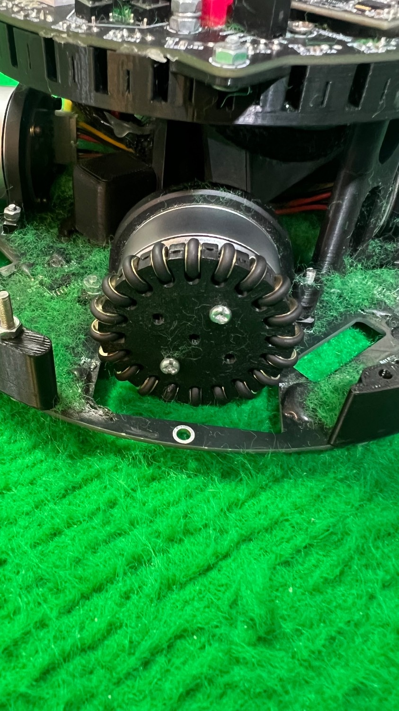
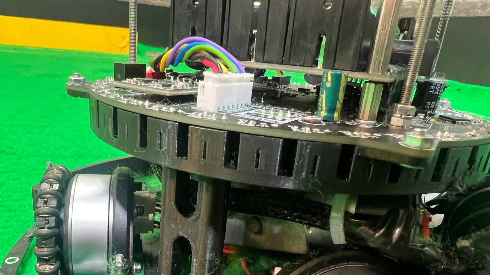
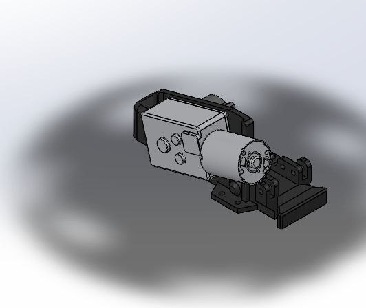
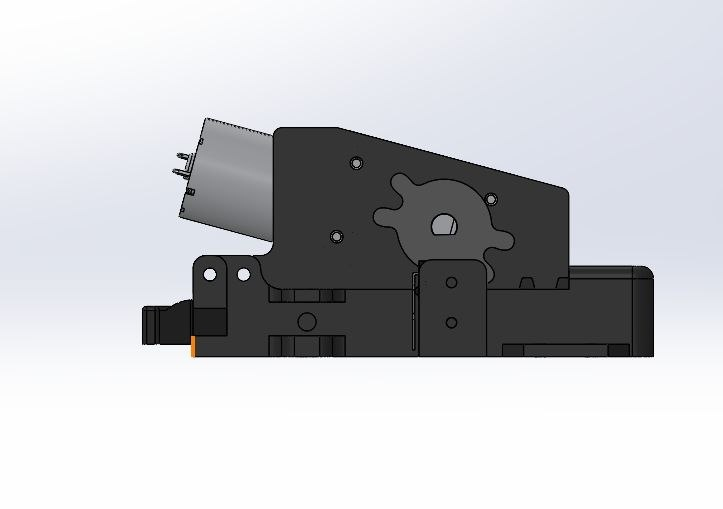

## Electronics Block Diagram

*Provide us with a block diagram of your robot's electronics*

[https://drive.google.com/open?id=1q0i9N8Zrlwd_WwBRg04C7qFs9mURtL8D](https://drive.google.com/open?id=1q0i9N8Zrlwd_WwBRg04C7qFs9mURtL8D)

## Power Circuit

*How does your power circuits work?*

Our robot uses a 12.6V battery (3 cell) as the main power source. This is regulated to 5V and 3.3V using voltage regulators to power components such as the TD-Axis, ESP32, STM32, and TSSP sensors,and line detection sensors ensuring stable and reliable operation.

## Motor Drive Circuit

*How do you drive your motors? Explain the circuits you use for that*

The motors are driven using RS485 protocol from the STM32 microcontroller to control speed.However the GTD35 driver is on it and  GTD35 motors run on a 12V supply and include integrated drivers, simplifying the circuit design precise motor control during operation.

## Microcontroller & Reason

*What kind of micro controller or board do you use for your robot? Why did you decide to use this part for your robot? If you have more than 1 processor, explain each one separately.*

The main microcontroller used in our robot is the ARM STM32F407VET6, chosen for its high processing speed, efficiency, and large number of I/O pins. Additionally, we use two extra STM32 units dedicated to sensors processing, each handling TSSP and line sensors separately to improve performance and reduce latency. For communication between robots, we use an ESP-32 Wroom module, selected for its reliable Wi-Fi capability and fast, low-noise data transmission between systems.

## Motor Control

*How do you use your processor to move your motors?*

The processor controls the motors using RS485 Protocol to send data to the driver motors and move the motors.

## Ball Detection

*How does your ball detection sensors and/or camera[s] work?*

Our robot uses TSSP sensors to detect the ball by identifying modulated infrared signals emitted at a specific frequency. The sensors are tuned to this frequency, allowing them to filter out ambient light and noise. By reading signal strength and direction from multiple sensors, the system determines the ball’s position relative to the robot, enabling accurate tracking and response during gameplay.

## Line Detection

*How does your line detection circuits work?*

Our line detection circuit uses phototransistor sensors to measure reflectivity differences between the green field and white lines. Each surface produces a different output value. We calculate a threshold, and if the reading is above it, it is green; if below, it is detected as a white line.

## Navigation/Position Sensors

*What sensors do you use for navigation and how are these sensors connected to your processor? What sensors do you use to find your position in the field? What about the direction your robot faces?*

Our robot uses ultrasonic sensors for navigation, with two on the sides and one at the back to detect obstacles and measure distance from field boundaries. These sensors are connected to the STM32, which processes their data. For positioning and orientation, we use the TD-Axis system, which provides directional data relative to the goal, allowing the robot to adjust its heading.

## Kicker Circuit

*How do you drive your kicker system? How does the circuit make the kicker work?*

The kicker system is run with just one pin in one direction allowing use maximum of power kicking force. It operates on a 12V power supply, with current ranging from 0.5A to 2A depending on load. The driver regulates power to the mechanism, ensuring consistent and reliable kicking performance.

## Dribbler Circuit

*How does your dribbler system work? What components and circuits did you use to drive it?*

The dribbler system uses a DJI2212 920KV motor to rotate the front roller and control the ball. It is driven by a 30A motor driver connected to the power supply. The driver is controlled using PWM signals, allowing precise speed adjustment for stable, consistent, and efficient ball handling.

## Schematics

*Schematics of your robot*

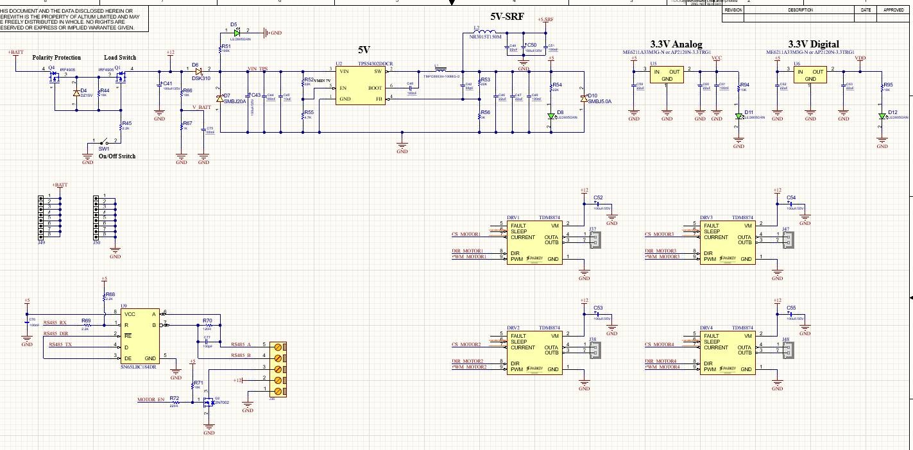
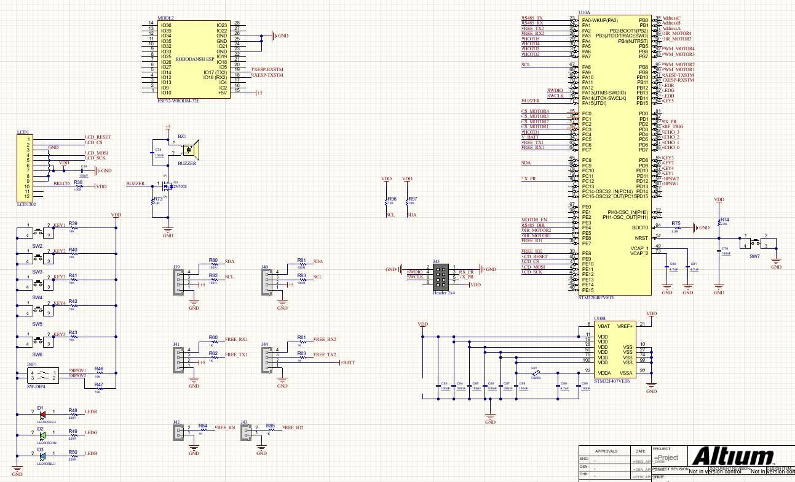
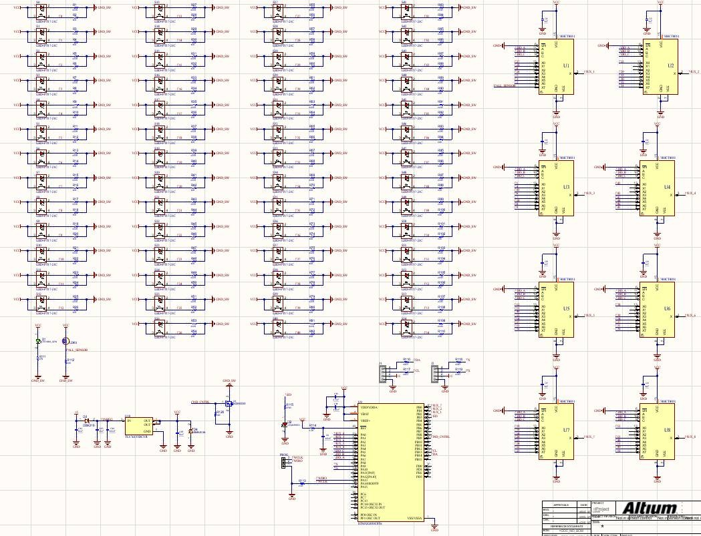
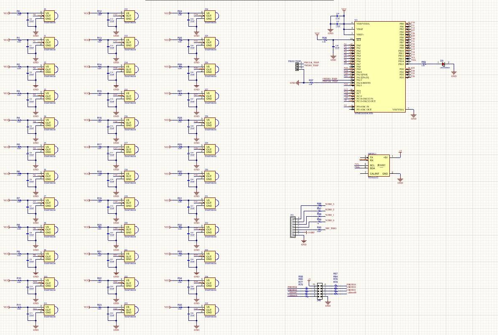

## PCB

*PCB of your robot*

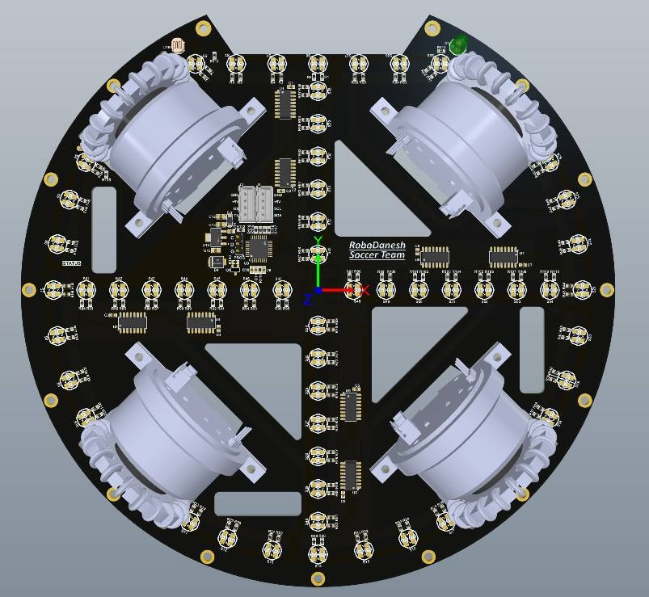
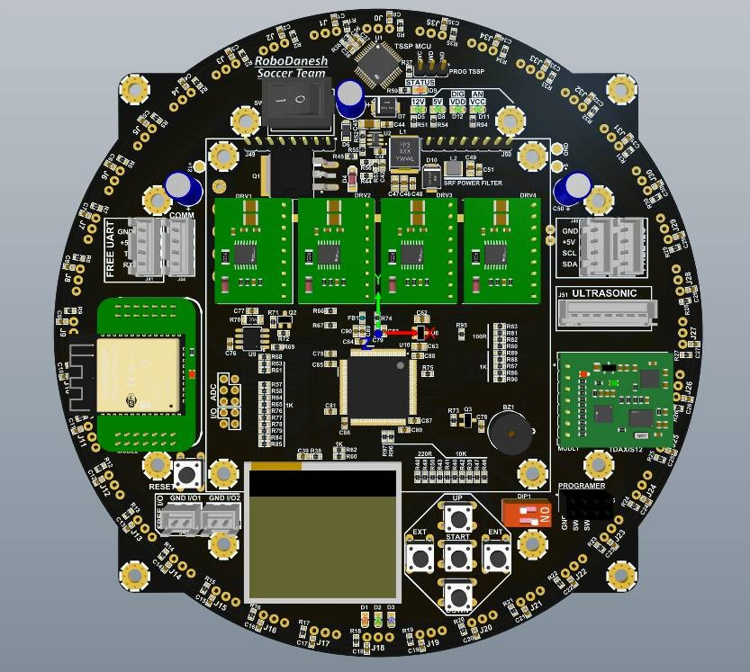
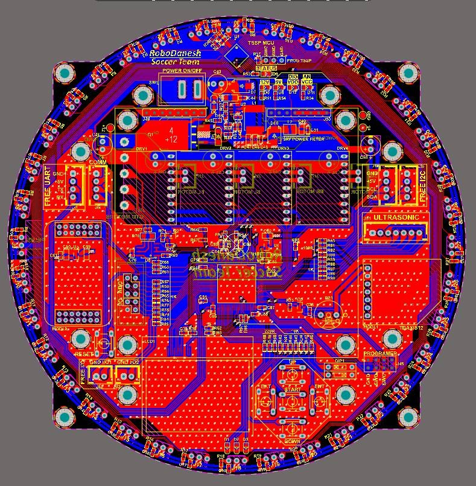
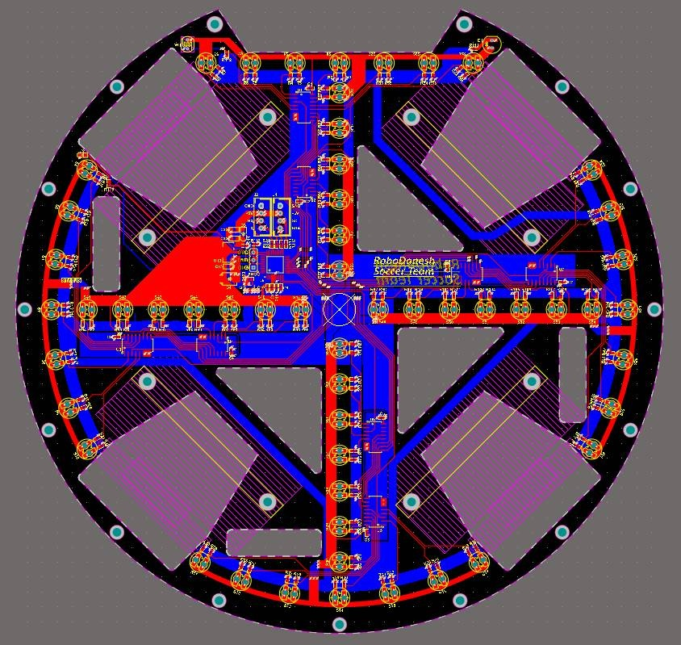

## Electronics Innovation

*Electronics Innovations*

One of our main electronics innovations is the use of three STM32 microcontrollers, allowing distributed processing for improved performance and reduced latency, especially for sensor handling. We also integrated an ESP-32 Wroom module for fast and reliable wireless communication between robots. Additionally, we designed a professional custom PCB, optimizing layout, power distribution, and signal integrity, which improved reliability, reduced noise, and made the overall system more compact and efficient.

## Circuit Photos

*Photo of your circuit boards highlights*

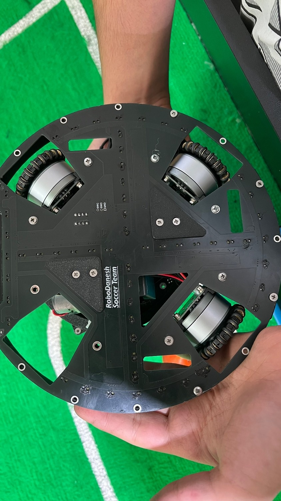
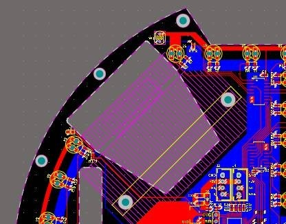
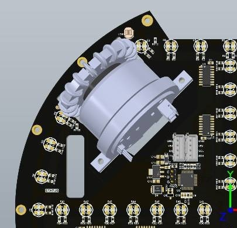
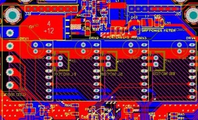

## Ball Detection Method

*How do you find where the ball is? How do you read the data from the ball detection sensors and/or camera?*

We use 36 TSSP58038 sensors arranged around the robot to detect the ball by receiving its modulated infrared signal at a specific frequency. The sensors are scanned in a timed cycle of 833 microseconds (1.2 kHz). When a sensor output goes low, it indicates detection of the ball signal. By analyzing active sensors, the system determines the ball direction and relative position for tracking.

## Ball Catch Algorithm

*How does your algorithm work to catch the ball? Is there a difference between your robots in how they move towards the ball? Explain the differences.*

Our algorithm uses TSSP sensors to detect the ball’s direction and distance. The attacking robot moves toward the ball and captures it using the dribbler. The defensive robot aligns itself between the ball and our goal to block shots. When control changes, robots switch roles dynamically. This coordination is enabled through ESP32 communication, allowing real-time data sharing and TeamWork.

## Positioning Algorithm

*How do you use your sensors in your algorithm to find your position inside the field and how do you use that position to move your robots around?*

We use three SRF05 ultrasonic sensors on the left, right, and back to measure distances from field walls. Data is sent to the STM32, which estimates position relative to boundaries. By combining this with orientation data, the robot adjusts motor outputs to maintain position and navigate accurately.

## Line Algorithm

*How does your robot find the lines to stay inside the field? What algorithms do you use to avoid going out of bounds?*

We use phototransistor sensors arranged in cross and circular patterns to detect field lines. These sensors sense changes in surface reflectivity when crossing white boundaries. They are divided into four regions (front, back, left, right). When a region detects a line, the algorithm identifies its direction and moves the robot away to stay in bounds.

## Goal Algorithm

*What algorithms do you use to score goals? How do you use your kicker and dribbler to handle the ball?*

Our scoring algorithm uses positional data to determine when the robot is close to the goal area. As the robot approaches the walls, it increases confidence that the ball is aligned with the goal opening. The dribbler maintains control of the ball while positioning, and once optimal alignment is detected, the kicker is activated to shoot the ball accurately toward the goal.

## Defense Algorithm

*What algorithms do you use to avoid the opponent team scoring? How do your robots defend your own goal?*

We use sensor-based algorithms to continuously track the ball’s position and movement. When the sensors detect that the ball is moving toward our goal, the robot quickly adjusts its position to intercept it. The defensive robot places itself between the ball and the goal, using controlled movement to block or clear the ball, preventing the opponent from scoring.

## Robot Communication

*Do your robots communicate with each other? How do you use this communication to your advantage?*

Yes, our robots communicate using ESP-32 modules. Each robot shares its distance to the ball with the other. Based on this data, they dynamically adjust their positions on the field. For example, the robot closer to the ball takes the attacking role, while the other switches to defense, improving teamwork and efficiency.

## Software Innovation

*Software Innovations*

One of our key algorithms is robot coordination and goal alignment. Using ESP-32 communication, robots share ball data and switch roles between attack and defense based on position. We also implemented vision-based goal detection, allowing the robot to automatically adjust its angle toward the goal. This improves teamwork, positioning, and shooting accuracy, increasing our chances of scoring.

## GitHub Link

*GitHub link*

https://github.com/soccerrobodanesh/soccer-robot-project

## BOM

*Bill of Materials (BOM)*

[https://drive.google.com/open?id=1rgKXrsRbw6x7C88FWIflDxJt8ldel7eM](https://drive.google.com/open?id=1rgKXrsRbw6x7C88FWIflDxJt8ldel7eM)

## Cost

*How much did it cost you to build your robots?*

Robots : 1200$ each
Experiments : 600$
Enviroment : 400$

## Funding

*How did you gathered the funds to build the robots?*

80% parents
20% RoboDanesh Academy

## Affordability

*How affordable was it to compete in RoboCupJunior Soccer?*

8

## Answer Check

*Have you checked all of your answers?*

Yes!

## Publication Consent

*We publish TDPs and posters during or after the competition as described in the beginning*

Yes, we acknowledge everything submitted in the above form can be published.

