## Timestamp

*Tijdstempel*

29-6-2026 3:46:30

## Email Address

*E-mailadres*

teamroboticus@gmail.com

## TDP File

*TDP File Upload (Not required)*

[https://drive.google.com/open?id=1ZzIQOWZdroe--StI_vyTHyAzHNhKaC1e](https://drive.google.com/open?id=1ZzIQOWZdroe--StI_vyTHyAzHNhKaC1e)

## Team Name

*What is your team's name?*

Roboticus

## League

*What league do you participate in?*

IR League

## Country

*Where are you from?*

The Netherlands

## Contact

*If other teams have questions about your robot, now or in the future, what email address(es) can we publish along with this document for people to reach you?

(You can put in multiple email addresses, like multiple team members, an email for the whole team or both. Feel free to share other ways of communication like Discord handles)*

info@teamroboticus.nl , please also check out our 2026 engineering journal for more details!

## Social Media

*Team Social Media Links (if you have any)*

https://linktr.ee/team_roboticus

## Team Photo

*Upload a photo of your whole team with your mentor and robots

Note: This is not mandatory and will be published along with your TDP if you choose to upload something*

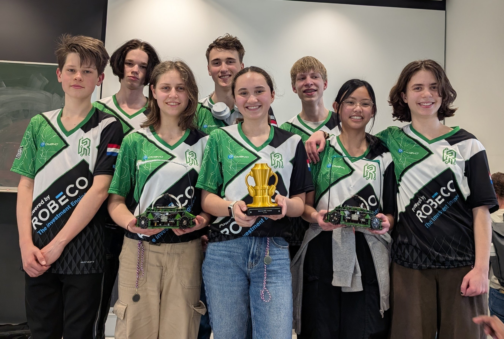

## Members & Roles

*What are the names of the team members and their role(s)?*

Ayisha Rensch: Software engineer
Bram Modderman: Mechanical Engineer
Lucy Stasiak: Electrical engineer
Micha van Houwelingen: Software engineer

## Meeting Frequency

*How often did your team meet?
(e.g. 90 minutes once per week or a day every weekend.)*

We meet every Saturday for 4 hours and continue working individually during the week, totaling about 4–15 hours per person.

## Meeting Place

*Where did you meet to work on your robot?
(e.g. a robotics room at school, at some other place, one of your homes, school library etc.)*

We meet at the robotics classroom at our school

## Start Date

*When did your team start working on this year's robot?*

September 2025

## Past Competitions

*Which RoboCupJunior competitions have you competed in and in which leagues?*

Dutch RobocupJunior 2024, Delft: Rescue
European championship 2024, Hannover: Rescue Entry
Dutch RobocupJunior 2025, Delft: Soccer Lightweight Entry
European championship 2025, Bari: Soccer Lightweight 2v2
German Open 2026, Cologne: Soccer IR 2v2

## Mentor Contribution

*Which parts of your work received the most contribution from your mentor?*

Our mentors encouraged us to work on research projects, it helped us structure big ambitions into smaller sub goals tied to realistic deadlines.

## Workload Management

*How did you manage the workload?*

This season we improved our workflow by turning goals into research projects with clear steps, owners and deadlines. This made tasks fairer across sections and greatly improved documentation, planning and overall efficiency.

## AI Tools

*Which AI tools did you use?*

We trained a YOLOv8 ML model using Roboflow with 600+ field images, letting our OpenMV N6 detect goals and walls without the need for calibration!

## Robot1 Overall

*Robot 1 Overall View*

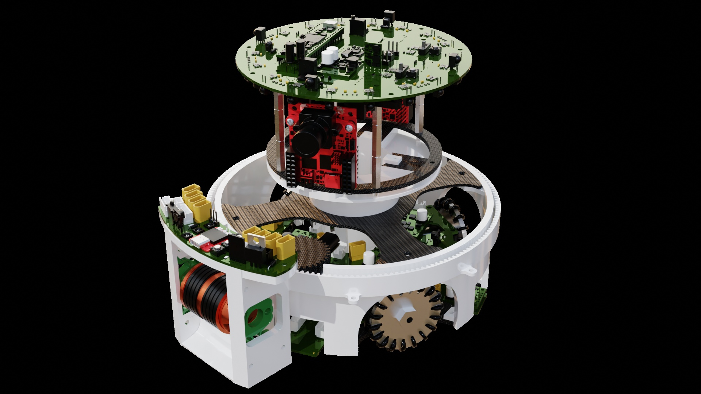

## Robot1 Front

*Robot 1 Front view*

[https://drive.google.com/open?id=1OXafzLys0tWXLjl4jiJevLfxUnt8TGDp](https://drive.google.com/open?id=1OXafzLys0tWXLjl4jiJevLfxUnt8TGDp)

## Robot1 Back

*Robot 1 Back view*

[https://drive.google.com/open?id=1es5hyVjxobWVC_gE9M8L_eX74-dKDHaE](https://drive.google.com/open?id=1es5hyVjxobWVC_gE9M8L_eX74-dKDHaE)

## Robot1 Top

*Robot 1 Top View*

[https://drive.google.com/open?id=16Pi3-Yv_kbbzznFmHNFuxC0BLi3Ri_3f](https://drive.google.com/open?id=16Pi3-Yv_kbbzznFmHNFuxC0BLi3Ri_3f)

## Robot1 Bottom

*Robot 1 Bottom View*

[https://drive.google.com/open?id=1AZnWWBqgPMO4KtM9v3t5s-E2YK9RlWy-](https://drive.google.com/open?id=1AZnWWBqgPMO4KtM9v3t5s-E2YK9RlWy-)

## Robot1 Right

*Robot 1 Right View*

[https://drive.google.com/open?id=19hcuR5VUsikpyrdhAxP9aWD1wNHDPcDp](https://drive.google.com/open?id=19hcuR5VUsikpyrdhAxP9aWD1wNHDPcDp)

## Robot1 Left

*Robot 1 Left View*

[https://drive.google.com/open?id=1xJrordbPbUeTdsUYqyHh5EdBf9qSFX-g](https://drive.google.com/open?id=1xJrordbPbUeTdsUYqyHh5EdBf9qSFX-g)

## Robot2 Overall

*Robot 2 Overall View*

## Robot2 Front

*Robot 2 Front view*

[https://drive.google.com/open?id=1_HjxS7sZkZ4dbV1RtKAViQHLH7E8mp5J](https://drive.google.com/open?id=1_HjxS7sZkZ4dbV1RtKAViQHLH7E8mp5J)

## Robot2 Back

*Robot 2 Back view*

[https://drive.google.com/open?id=1gueTLFKnjr6hhTEFB5d_i_w77OeniY2q](https://drive.google.com/open?id=1gueTLFKnjr6hhTEFB5d_i_w77OeniY2q)

## Robot2 Top

*Robot 2 Top View*

[https://drive.google.com/open?id=12b-AKIF24QN14TPC3zcHK_SFOAWSIJ5l](https://drive.google.com/open?id=12b-AKIF24QN14TPC3zcHK_SFOAWSIJ5l)

## Robot2 Bottom

*Robot 2 Bottom View*

[https://drive.google.com/open?id=1Na3Ft_i_Q00heo_CkbS6fNVHiBO8Dr7Y](https://drive.google.com/open?id=1Na3Ft_i_Q00heo_CkbS6fNVHiBO8Dr7Y)

## Robot2 Right

*Robot 2 Right View*

[https://drive.google.com/open?id=1OrOnxIIOHAWPyM90gBlKz2esGTos00aX](https://drive.google.com/open?id=1OrOnxIIOHAWPyM90gBlKz2esGTos00aX)

## Robot2 Left

*Robot 2 Left View*

[https://drive.google.com/open?id=1Aid9L-2UneYYbDC5e-PXCPoY2C0eDKfe](https://drive.google.com/open?id=1Aid9L-2UneYYbDC5e-PXCPoY2C0eDKfe)

## Mechanical Design

*How did you design the mechanical parts of your robots?*

The newly introduced rules created opportunities for new design approaches, so we designed a completely new robot around a 360° ball handler. The frame had to be smaller and lighter while still fitting the rotating mechanism, motors, sensors, batteries and PCBs. Using Onshape, we followed an iterative process, creating and testing over 100 robot and subsystem versions.

## Build Method

*How did you build your design?*

Parts were made using the best method for each function: 3D printing for complex shapes and quick prototypes, and waterjet or laser cutting for stronger, accurate structural parts. This resulted in a compact, lightweight and strong frame.

## Motors & Reason

*How many motors have you used and why?*

We use four Faulhaber 2214S006BXTR motors with gearboxes in a 90° omniwheel setup. Compared to a 3-motor 120° layout, this makes movement in all directions easier to code, reduces strain on the heading PID, and allows full-speed cardinal movement. The reliable high-RPM Faulhaber motors work well with our vector-based driving, line avoidance and tracking.

## Kicker Design

*If your robot has a kicker, explain how you designed and built the mechanics of the kicker*

Our robot has no separate kicker; the 360° dribbler also shoots. A bidirectional ESC lets the brushless motor reverse and spin faster to launch the ball. This keeps the robot compact, light and reliable by avoiding an extra solenoid, spring or kicker.

## Dribbler Design

*If your robot has a dribbler, explain how you designed and built the mechanics of the dribbler.*

Our 360° rotating dribbler needed to fit in only 4 cm, so it had to be compact, strong and impact-resistant. After 20+ iterations, we designed a holder that works as both hinge and spring, letting the rubber-covered motor flex on contact and return to position for better grip and ball control.

## CAD Files

*CAD design files*

https://grabcad.com/library/2v2-lightweight-robot-team-roboticus-vortex-1

## Mechanical Innovation

*Mechanical Innovation*

Our main mechanical innovation is the 360° rotating dribbler, which lets the robot control the ball without always turning its whole body. This required a smaller, lighter frame while still fitting all components. We designed custom rings, mounts and a compact 4 cm dribbler holder that works as both spring and hinge. After 100+ iterations in Onshape, 3D printing, waterjet and laser cutting, we built a strong, light and reliable robot.

## Mechanical Photos

*Photos of your mechanical designs highlights*

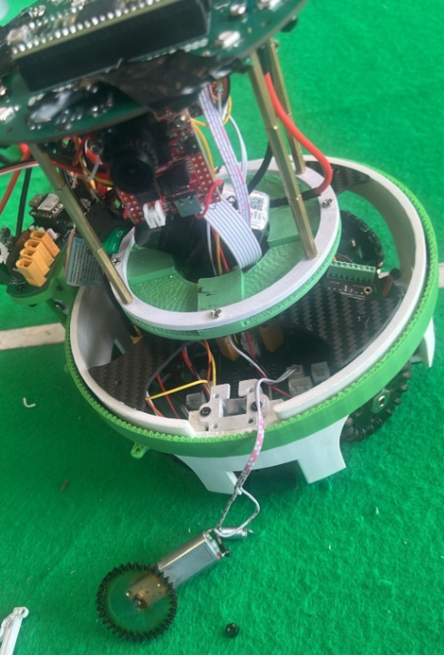
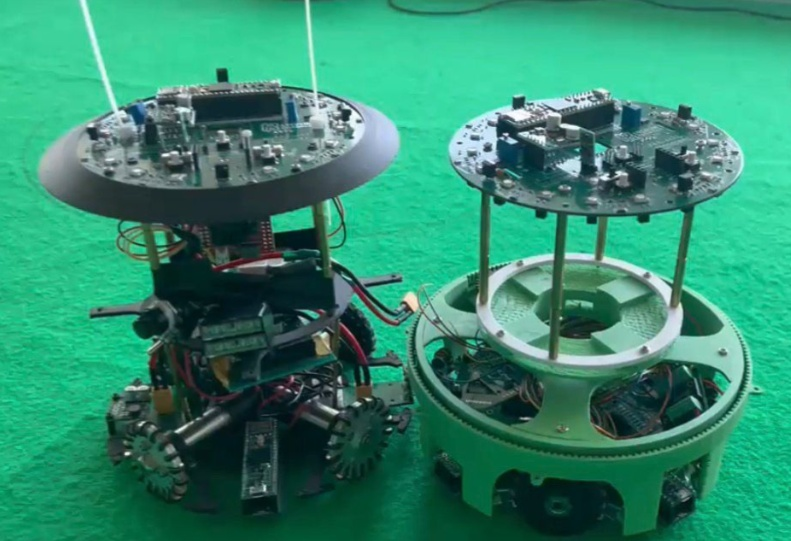
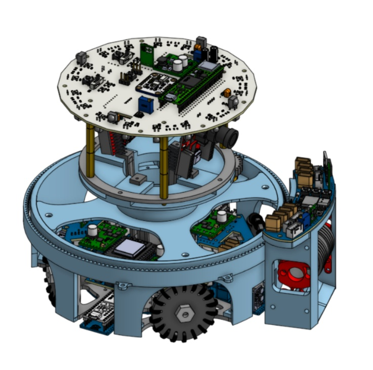
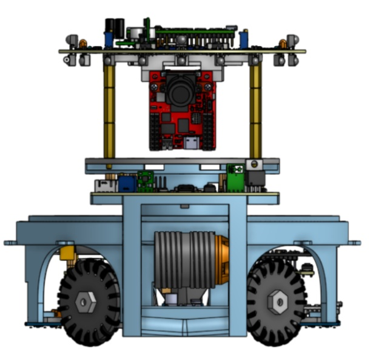
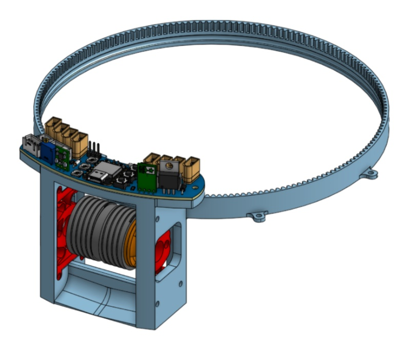

## Electronics Block Diagram

*Provide us with a block diagram of your robot's electronics*

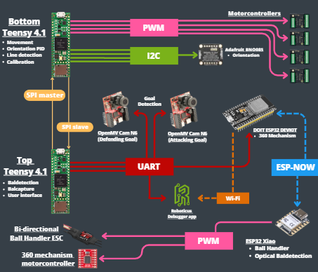

## Power Circuit

*How does your power circuits work?*

Our robot uses 3S 850mAh LiPo power systems. The main battery feeds the Power, Top and Bottom PCBs through a fuse, switch, 5V/3.3V regulators and PTC protection. These power the controllers, sensors, motors, LEDs and checks. The dribbler PCB has its own battery, fuse, switch and regulators.

## Motor Drive Circuit

*How do you drive your motors? Explain the circuits you use for that*

Our Power PCB supports Faulhaber SC1801S or Maxon/Pololu G2 motor setups. Both use 12V LiPo power and PWM from the bottom Teensy to drive, reverse or brake the motors. The SC1801S can run with only two pins, saving GPIO for sensors, and is tuned through Faulhaber Motion Manager.

## Microcontroller & Reason

*What kind of micro controller or board do you use for your robot? Why did you decide to use this part for your robot? If you have more than 1 processor, explain each one separately.*

Like last season, our robot uses two Teensys and two OpenMV N6 cameras, now expanded with an ESP32 and ESP32-C3 for wireless 360° dribbler control via ESP-NOW. The top Teensy gathers ball, camera and capture data, then sends it by SPI to the bottom Teensy. The bottom Teensy controls driving, line detection, orientation and status. The OpenMV N6 cams detect goals using our YOLOv8 ML model, while the ESP boards control the ball handling system.

## Motor Control

*How do you use your processor to move your motors?*

The bottom Teensy acts as the master controller. It receives ball, line, camera and orientation data, then calculates movement and drives four motor controllers. Our driveFunction uses X/Y direction, PID output, speed limits and a debug option to control smooth, corrected movement.

## Ball Detection

*How does your ball detection sensors and/or camera[s] work?*

Because the new IR ball uses a different frequency, we had to redesign our ball detection. After researching sensor options with ChatGPT, we tested TSSP4P38, TSSP58P38, BPV22NFL and our old TSSP4038. The photodiodes could detect distance but had short range, while the TSSP4038 could detect presence up to about 5 m. We therefore use 18 BPV22NFL photodiodes in a circle for ball direction and 4 TSSP4038 sensors to detect when the ball is outside their range. Check Engineering Journal for details.

## Line Detection

*How does your line detection circuits work?*

For line detection, red and white SMD LEDs illuminate the field while 32 TEMT6000X01 phototransistors measure reflection. White lines reflect more than green field, so the robot detects them clearly. A circular sensor layout with four arms and multiplexers gives fast, accurate line position data.

## Navigation/Position Sensors

*What sensors do you use for navigation and how are these sensors connected to your processor? What sensors do you use to find your position in the field? What about the direction your robot faces?*

Line detection has the highest priority. If phototransistors detect a white line, the robot moves away quickly (line avoidance mode) or tracks it (line tracking mode). Otherwise, it drives to the ball using IR data, rotates toward the goal by using two OpenMV cameras and the BNO085 orientation module. When the ball is captured, camera data and line data are used to move strategically.

## Kicker Circuit

*How do you drive your kicker system? How does the circuit make the kicker work?*

Our kicker system for this season is the same as our dribbler system, but the rotating direction of the brushless motor is reversed. Using a bi-directional ESC, we are able to both dribble or kick without having to perform hardware changes.

## Dribbler Circuit

*How does your dribbler system work? What components and circuits did you use to drive it?*

Our compact 360° dribbler uses a 3.5 cm brushless motor with a custom ESC to drive the rubber roller. An LED+phototransistor optically detects ball capture, while a geared motor rotates the outer ring. A magnetic encoder tracks the outer ring angle with respect to its starting position.

## Schematics

*Schematics of your robot*

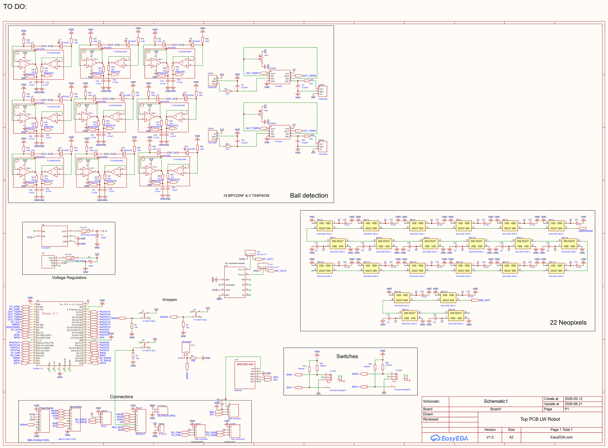
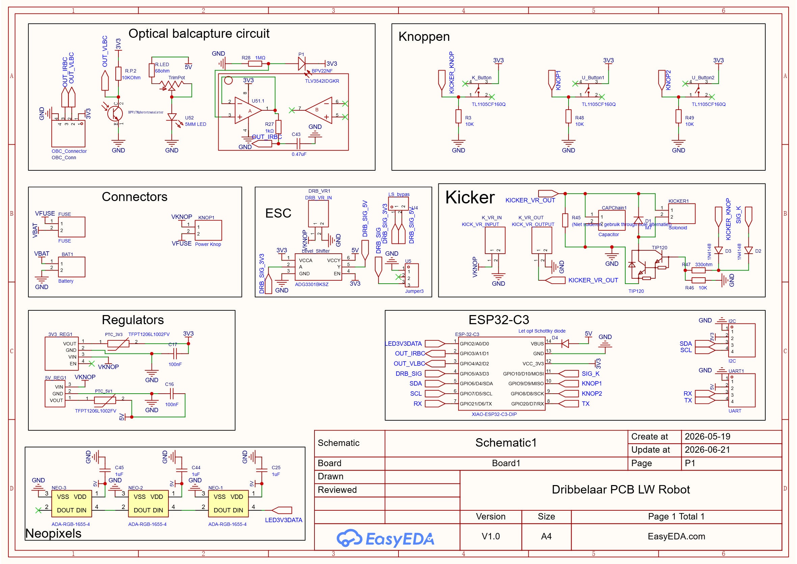
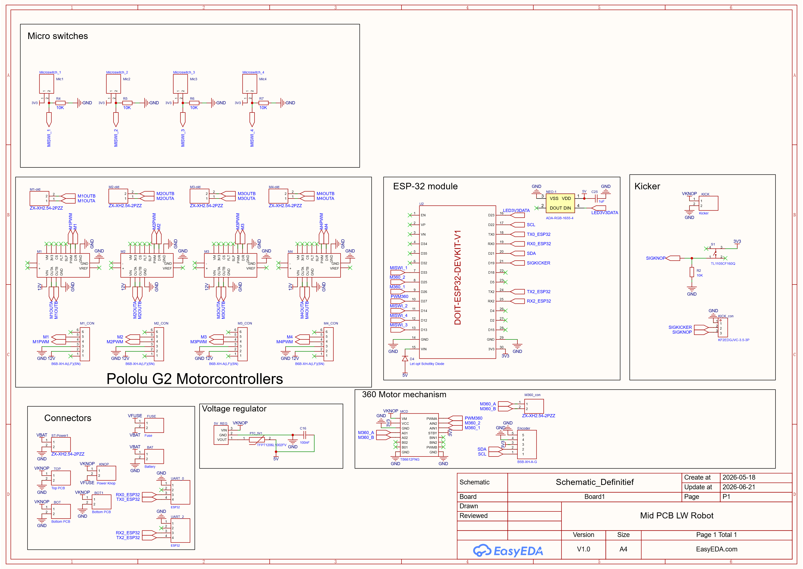
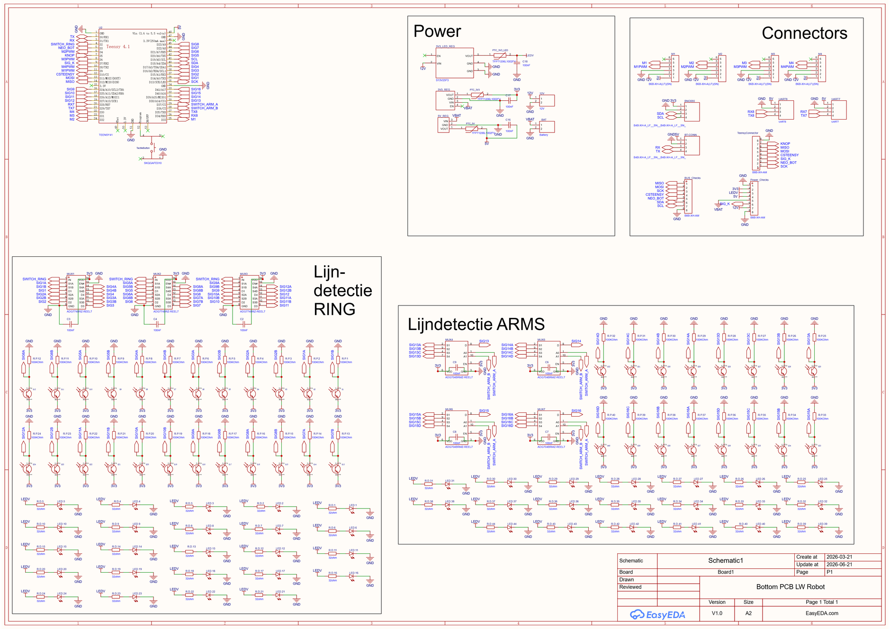

## PCB

*PCB of your robot*

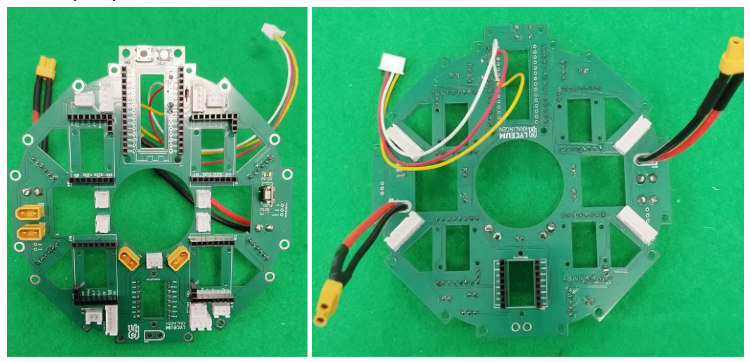
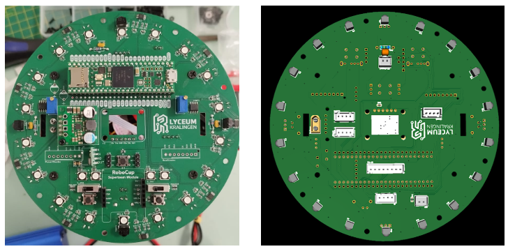
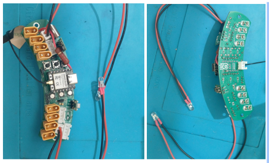
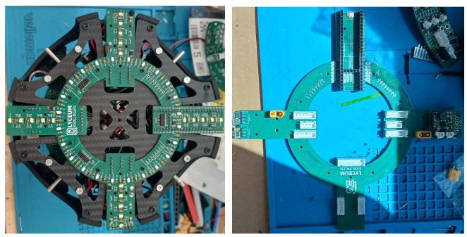

## Electronics Innovation

*Electronics Innovations*

On the top PCB, we are especially proud of the new ball detection circuit, it took extensive testing to find a suitable circuit. Our photodiode + IR Receiver setup ended to be the best solution for the criteria we set for the ball detection circuit. We heard from other teams that they were struggling to use the new ball's IR signal to determine range, and therefore switched to using camera's. We hope that our research project "Ball Detection" which can be found in our engineering journal will help teams to find a good IR-based method. It can be found here: https://docs.google.com/document/d/1whKqrJ2cp5LRSuYVyDUHGt6rSSK4ior7H_IQJOHPCY0/edit?tab=t.0#heading=h.oplt9pxm00m5 

Our mid PCB supports both brushless faulhaber motor controllers and our former brushed Pololu G1 motorcontrollers. This makes our drivetrain modular and backwards compatible with our old robots.

We used to use microswitches to detect if the ball was captured, but they broke easily due to collisions with other robots. This season our ball handling PCB features optical ball detection using a phototransistor and a bright LED. If the ball enters the capture zone, the Phototransistor will observe less light and the robot will know the ball is captured in combination with IR data.

We use very bright red LEDs to observe lines, the reason being RED + Green = Brownish (field) and RED + White = Pinkish. But this will cause problems with teams that use camera's for ball detection and aren't advanced enough to able to distinguish between a orange ball and red bleeding light from underneath our robot. For this reason we decided to use the red lights only for our ring array which is placed more central and use white LEDs for the outer arms that are closer to the edge of the robot.

## Circuit Photos

*Photo of your circuit boards highlights*

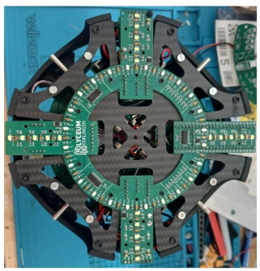
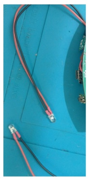
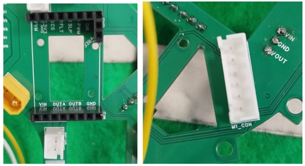
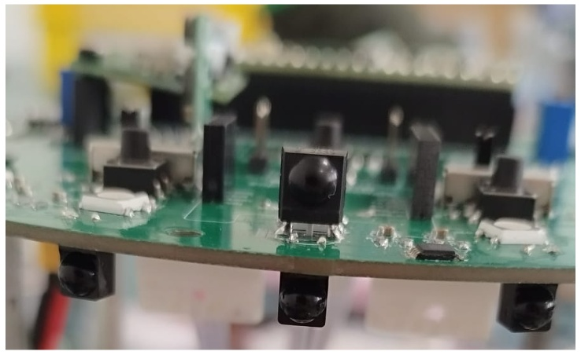

## Ball Detection Method

*How do you find where the ball is? How do you read the data from the ball detection sensors and/or camera?*

The top PCB uses 18 photodiodes in a circle to locate the ball. The software finds the strongest sensor value, compares it with nearby sensors, and slightly shifts the angle for smoother results. This adjusted angle is converted with sin/cos into X/Y ball coordinates. If the ball is outside photodiode range, TSSPs still give rough presence and direction. Check Engineering Journal for details.

## Ball Catch Algorithm

*How does your algorithm work to catch the ball? Is there a difference between your robots in how they move towards the ball? Explain the differences.*

The attacker algorithm depends on whether the 360° dribbler works as intended. If it does, the robot drives directly to the ball, only going around it when the ball is between our goal and robot to avoid own goals. Near the ball, it slows down and aims the dribbler with PID.  Our plan B is last year’s “go behind the ball” strategy. The defender now uses vectors to stay between the goal and ball.

## Positioning Algorithm

*How do you use your sensors in your algorithm to find your position inside the field and how do you use that position to move your robots around?*

We use the BNO085 IMU to measure robot orientation with rotation-vector data, from which the Teensy calculates yaw. This yaw is used by QuickPID to keep a stable heading, with angle unwrapping preventing 179°/-179° jumps. The OpenMV N6 cameras use our Roboflow AI model to detect goals and choose the target direction, while the BNO085 helps the robot stay aimed correctly.

## Line Algorithm

*How does your robot find the lines to stay inside the field? What algorithms do you use to avoid going out of bounds?*

The bottom PCB has four outward arms that place line sensors closer to the robot’s edge without increasing its size. This lets the robot detect white lines faster, giving software more time to react before the wheels cross the boundary. When a line is detected, sensor position and ball position are combined to choose the safest movement direction.

## Goal Algorithm

*What algorithms do you use to score goals? How do you use your kicker and dribbler to handle the ball?*

To save battery, the 360° dribbler only turns toward the ball when it is close enough to capture. After capture, the camera measures the goal angle to decide whether the robot is on the left or right side. It then drives along the corresponding sideline while turning the dribbler outward to protect the ball from the opponent. Near the goal, the dribbler aims and shoots.

## Defense Algorithm

*What algorithms do you use to avoid the opponent team scoring? How do your robots defend your own goal?*

Our defender uses vector-based line tracking to stay between the ball and our goal instead of hardcoded if-else logic. Line sensors give the line position and angle, while vectors calculate movement relative to the ball. This creates faster, smoother defence with less overshooting. We also made a custom Python/Arduino visualization tool to see which sensors trigger on the line.

## Robot Communication

*Do your robots communicate with each other? How do you use this communication to your advantage?*

Our robots are capable to communicate with each other using two HC-05 bluetooth modules which are pre-linked, but we haven't tested it yet because of lack of time and it being a lower priority. We hope to experiment with it during the competition.

## Software Innovation

*Software Innovations*

This year we improved every major part of our software: dribbler and ball control, code architecture, calibrationless BNO085 setup, Bluetooth, ESP-NOW, Wi-Fi, wireless debugging, AI camera vision, and a vector-based defender. We are most proud of the 360° dribbler control, which required extensive testing with PID, magnets and motors. We also rewrote the ball-following algorithm and full codebase structure to make the system easier to implement and tune. Check out our Github repo for details!

## GitHub Link

*GitHub link*

https://github.com/TeamRoboticus

## BOM

*Bill of Materials (BOM)*

[https://drive.google.com/open?id=1pigxXALG3cMIvOrWg9sYLsT0tLYNe5rl](https://drive.google.com/open?id=1pigxXALG3cMIvOrWg9sYLsT0tLYNe5rl)

## Cost

*How much did it cost you to build your robots?*

2x Robots: 1572,74 EURO
Experiments/Research: 1300 EURO (estimate)
Environment: 900 EURO (estimate)

## Funding

*How did you gathered the funds to build the robots?*

78% sponsors
22% school

Through years of sponsorship work, we cut robot costs by 78% this season and gained access to better parts!

## Affordability

*How affordable was it to compete in RoboCupJunior Soccer?*

8

## Answer Check

*Have you checked all of your answers?*

Yes!

## Publication Consent

*We publish TDPs and posters during or after the competition as described in the beginning*

Yes, we acknowledge everything submitted in the above form can be published.

