## Timestamp

*Tijdstempel*

26-6-2026 22:12:51

## Email Address

*E-mailadres*

m.khakpoor1393@gmail.com

## TDP File

*TDP File Upload (Not required)*

## Team Name

*What is your team's name?*

Sadr United

## League

*What league do you participate in?*

Vision League

## Country

*Where are you from?*

IRAN

## Contact

*If other teams have questions about your robot, now or in the future, what email address(es) can we publish along with this document for people to reach you?

(You can put in multiple email addresses, like multiple team members, an email for the whole team or both. Feel free to share other ways of communication like Discord handles)*

m.khakpoor1393@gmail.com

## Social Media

*Team Social Media Links (if you have any)*

## Team Photo

*Upload a photo of your whole team with your mentor and robots

Note: This is not mandatory and will be published along with your TDP if you choose to upload something*

## Members & Roles

*What are the names of the team members and their role(s)?*

Radin Cheraghi: Programmer
Mohammad Taha Ahmadi: Electronic && Programmer
Mohammad Taha Mobini: Mechanic
Pirouz Monjezi: Mechanic

## Meeting Frequency

*How often did your team meet?
(e.g. 90 minutes once per week or a day every weekend.)*

We met twice a week for approximately 3 hours per meeting (about 6 hours per week in total).

## Meeting Place

*Where did you meet to work on your robot?
(e.g. a robotics room at school, at some other place, one of your homes, school library etc.)*

We worked in our high school's robotics workshop.

## Start Date

*When did your team start working on this year's robot?*

November 2025.

## Past Competitions

*Which RoboCupJunior competitions have you competed in and in which leagues?*

Our team has participated in several robotics competitions over the past few years, including Iran Open 2024 (Open League), Iran Open 2025 (Open League), RoboCup 2025 (Open League), and Iran Open 2026 (Open League). These competitions helped us improve our technical skills and gain valuable experience.

## Mentor Contribution

*Which parts of your work received the most contribution from your mentor?*

Our mentor supervised the project and mainly helped with Raspberry Pi–ATmega2560 communication and Raspberry Pi power issues.

## Workload Management

*How did you manage the workload?*

We managed the workload using a Telegram group with topic-based threads. Tasks were assigned to team members based on their roles, and progress was tracked through regular updates, discussions, and task reports within the group.

## AI Tools

*Which AI tools did you use?*

We used AI as a teacher for AI Hat and Hailo-8L, to understand CV docs, and to speed up debugging and improve code quality.

## Robot1 Overall

*Robot 1 Overall View*

## Robot1 Front

*Robot 1 Front view*

## Robot1 Back

*Robot 1 Back view*

## Robot1 Top

*Robot 1 Top View*

## Robot1 Bottom

*Robot 1 Bottom View*

## Robot1 Right

*Robot 1 Right View*

## Robot1 Left

*Robot 1 Left View*

## Robot2 Overall

*Robot 2 Overall View*

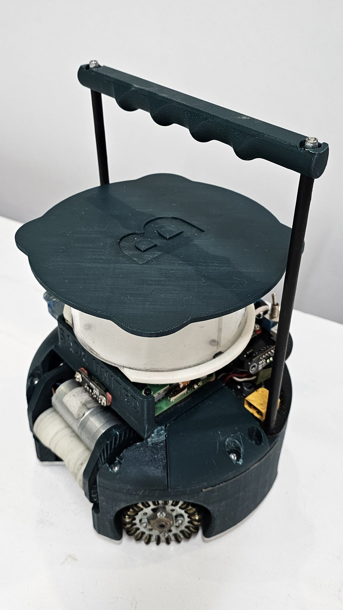

## Robot2 Front

*Robot 2 Front view*

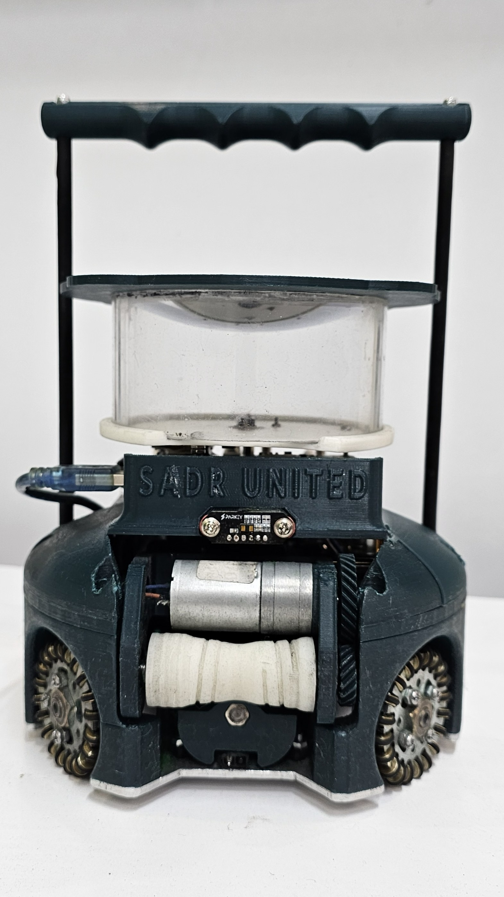

## Robot2 Back

*Robot 2 Back view*

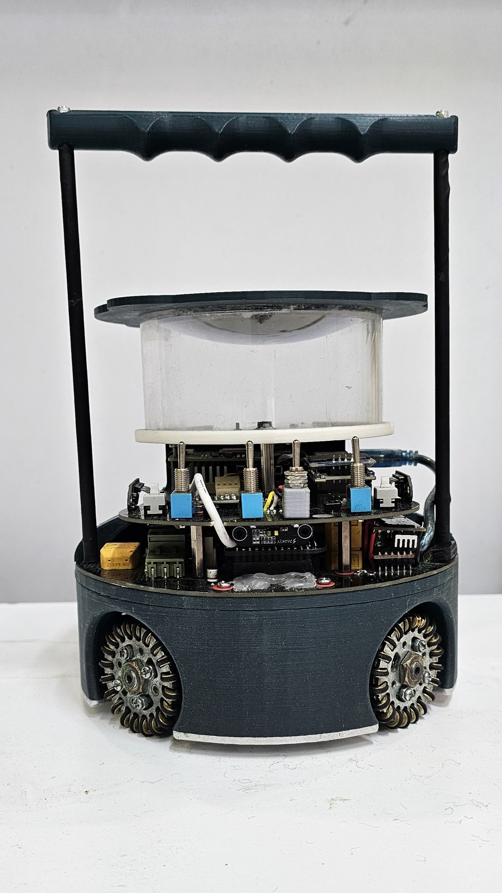

## Robot2 Top

*Robot 2 Top View*

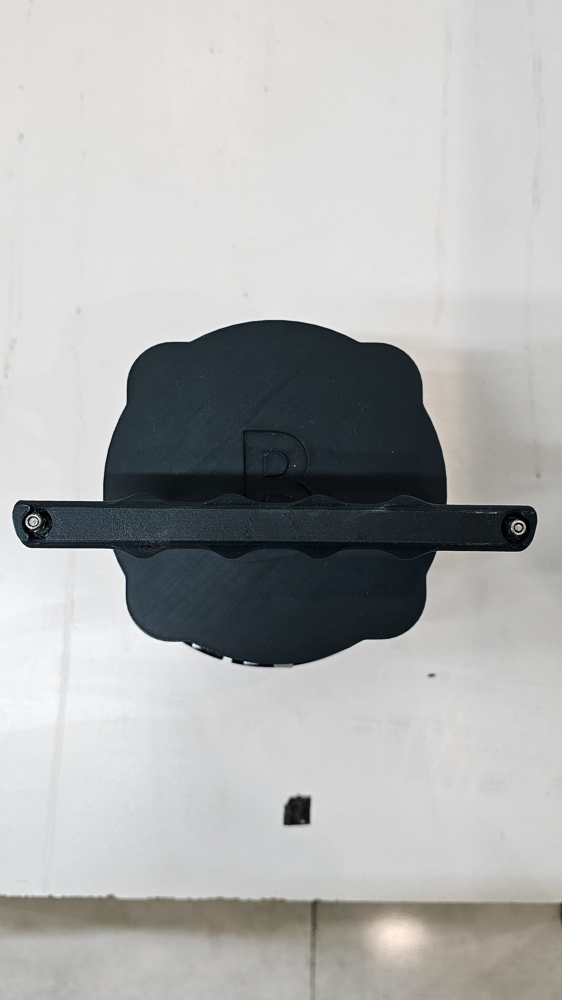

## Robot2 Bottom

*Robot 2 Bottom View*

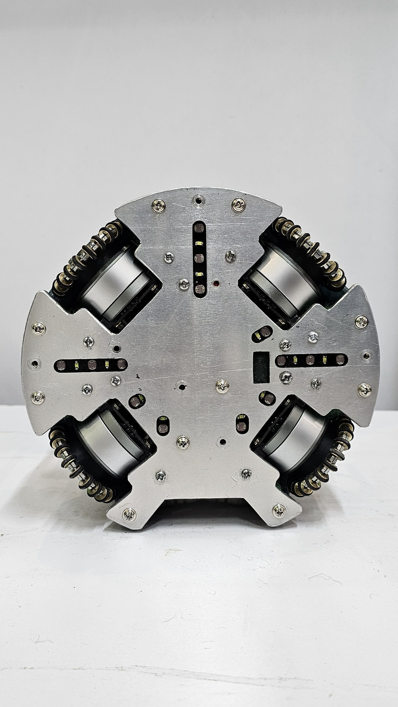

## Robot2 Right

*Robot 2 Right View*

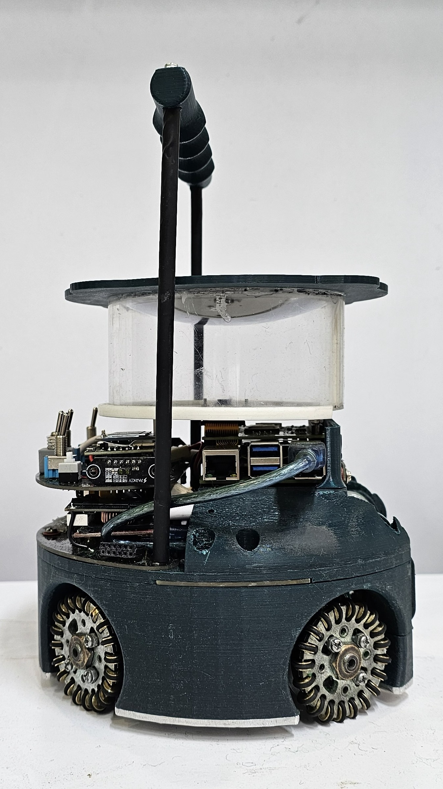

## Robot2 Left

*Robot 2 Left View*

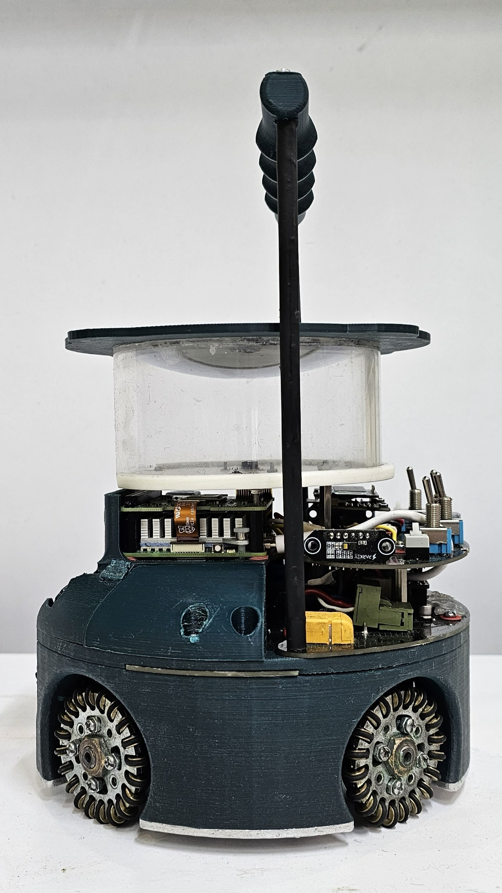

## Mechanical Design

*How did you design the mechanical parts of your robots?*

Using SolidWorks for 3D mechanical design over RoboCup seasons, we replaced the mechanical kicker with a solenoid system and redesigned the motor layout to widen the robot's front opening. This year, we focused on compact space optimization due to new components and designed a modular structure to simplify assembly and maintenance. We used an iterative process of prototyping, testing, and redesign until reaching the final optimized design.

## Build Method

*How did you build your design?*

We used 3D printing for mechanical parts and assembled them in-house. PCBs and the mirror system were produced by local companies. During assembly, we modified the design to fix fit issues and widened the intake for better ball handling.

## Motors & Reason

*How many motors have you used and why?*

We use four GTD-35 brushless motors for omnidirectional movement. Their angles were optimized (improved from a previous 45° layout) to increase maneuverability and intake performance. We also adjusted the front motor angles to widen the ball intake and upgraded the dribbler motor for higher speed and better ball control.

## Kicker Design

*If your robot has a kicker, explain how you designed and built the mechanics of the kicker*

We replaced our mechanical kicker with a solenoid-based system for higher power and reliability. It is controlled by a custom PCB. Due to its large size, we redesigned the internal layout to integrate it efficiently within the robot.

## Dribbler Design

*If your robot has a dribbler, explain how you designed and built the mechanics of the dribbler.*

Our dribbler uses a silicone roller driven by a ZGA25 motor through 3D-printed gears. We upgraded from a 500 RPM motor to a 1000 RPM motor and changed the gear ratio to increase roller speed, improving ball control, retention, and dribbling performance.

## CAD Files

*CAD design files*

https://github.com/mamali-1382/Sadr-United-2026.git

## Mechanical Innovation

*Mechanical Innovation*

Our main mechanical innovation is a redesigned solenoid kicker system. We replaced the previous mechanical kicker with a solenoid to increase shot power, speed, and reliability. The mounting structure was redesigned to ensure precise alignment with the center of the ball for consistent impact. The internal layout was also optimized to fit the solenoid while maintaining compactness and structural stability, improving overall scoring performance.

## Mechanical Photos

*Photos of your mechanical designs highlights*

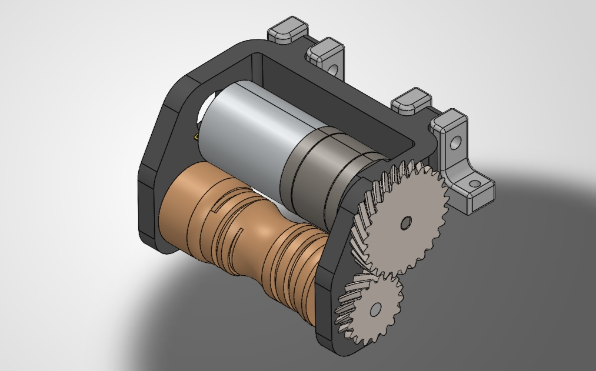
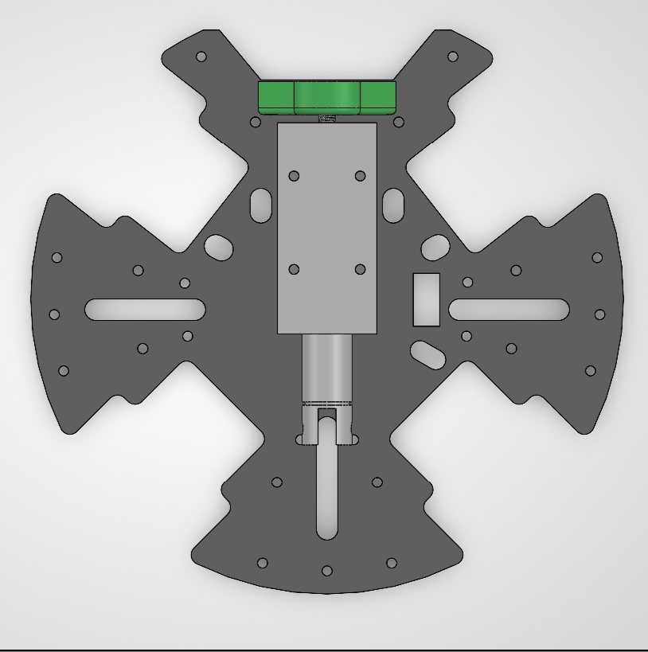

## Electronics Block Diagram

*Provide us with a block diagram of your robot's electronics*

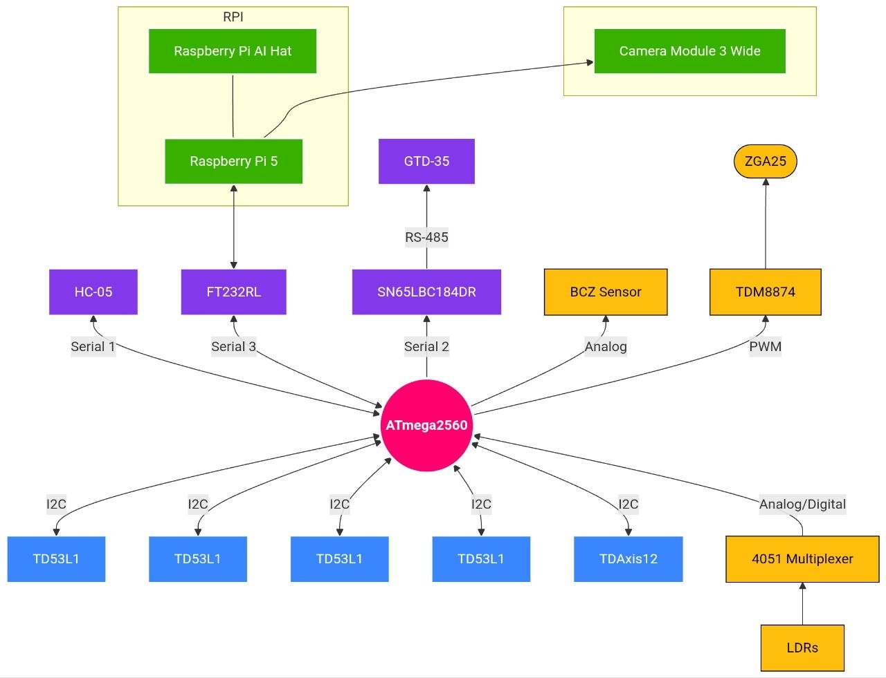

## Power Circuit

*How does your power circuits work?*

Our robot uses a 3-cell LiPo battery. Motors are powered directly from the battery with a protection circuit. A SKMW30F-05 buck converter provides stable 5V for electronics. The Raspberry Pi is powered via a USB PD 3.0 module with 5V 3A output for safe and reliable operation.

## Motor Drive Circuit

*How do you drive your motors? Explain the circuits you use for that*

Our motors are powered by 12V and have built-in drivers using RS-485 communication. Since RS-485 is not UART-compatible, we use an SN65LBC184DR transceiver to convert UART to differential signals, enabling reliable and noise-immune motor control.

## Microcontroller & Reason

*What kind of micro controller or board do you use for your robot? Why did you decide to use this part for your robot? If you have more than 1 processor, explain each one separately.*

We initially used the Arduino Mega 2560 because it met our I/O and functional requirements. However, its large size made integration difficult in our compact robot. Therefore, we switched to using the ATmega2560 microcontroller directly on a custom PCB, which reduced space usage and allowed us to fully customize the hardware layout for our system.

## Motor Control

*How do you use your processor to move your motors?*

We control motors using a continuous 0–360° movement system. The processor calculates the desired angle and uses trigonometry to set each motor’s speed. This replaces our previous 32-direction system and enables smoother omnidirectional movement, improving accuracy in tracking and positioning.

## Ball Detection

*How does your ball detection sensors and/or camera[s] work?*

We replaced Pixy CMUCam5 with a Raspberry Pi and Camera Module 3 due to low frame rate and unreliable data. We chose Pi over OpenMV and OV5640 for flexibility and processing power, and explored an AI Hat for faster object detection.

The Pi processes camera images to detect the ball and sends position data to the ATmega2560, which controls motor movement. We use a mirror-based 360° view and tested a second front camera, but the final system uses a single optimized vision pipeline.

## Line Detection

*How does your line detection circuits work?*

We use LDR sensors in a pull-up circuit for line detection. Each LDR is connected through a multiplexer to the ADC, allowing sequential reading. This improves accuracy and lets us determine exactly which part of the robot crosses the boundary line for better control.

## Navigation/Position Sensors

*What sensors do you use for navigation and how are these sensors connected to your processor? What sensors do you use to find your position in the field? What about the direction your robot faces?*

We use the TDAxis12 sensor module (MPU6050 + BNO055) for orientation and field direction using sensor fusion. It is connected via I2C to the processor. A TD53L1 distance sensor is used for positioning on the field. Together, these sensors provide robot orientation, position, and support role-based navigation for attackers and defenders.

## Kicker Circuit

*How do you drive your kicker system? How does the circuit make the kicker work?*

Our kicker uses a solenoid powered by an XL6009 boost converter with capacitor banks for peak current. An IRLZ44N MOSFET switches the solenoid via microcontroller control. A flyback diode protects the circuit from voltage spikes during turn-off, ensuring safe and reliable operation.

## Dribbler Circuit

*How does your dribbler system work? What components and circuits did you use to drive it?*

Our dribbler system uses a DRV8874 motor driver controlled by PWM signals from the microcontroller. This allows precise speed control of the motor, resulting in smooth and stable rotation of the dribbler for consistent ball handling and possession during matches.

## Schematics

*Schematics of your robot*

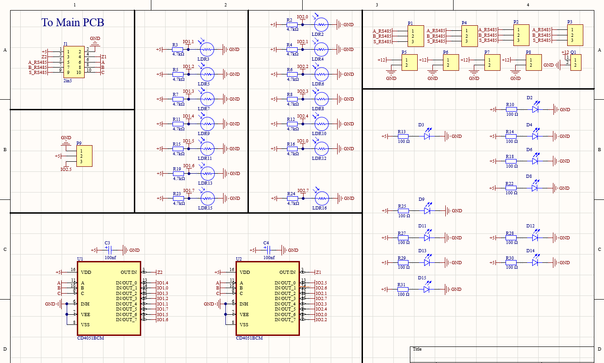
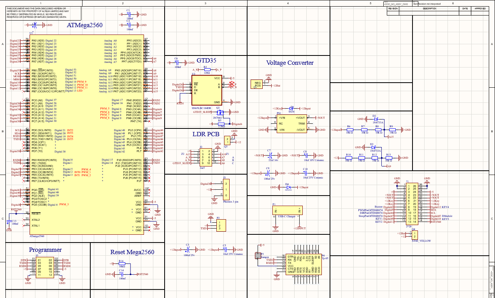
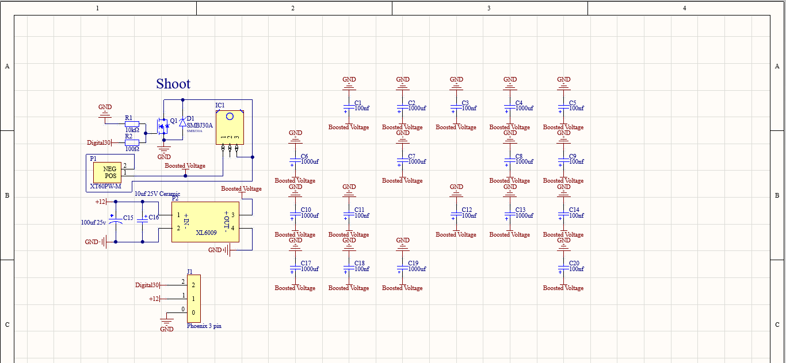
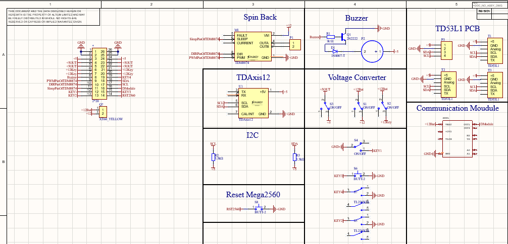

## PCB

*PCB of your robot*

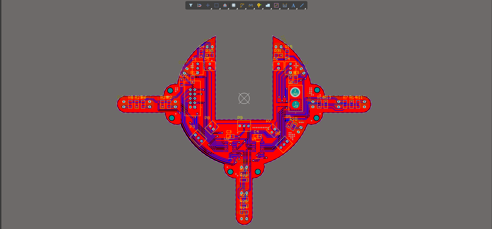
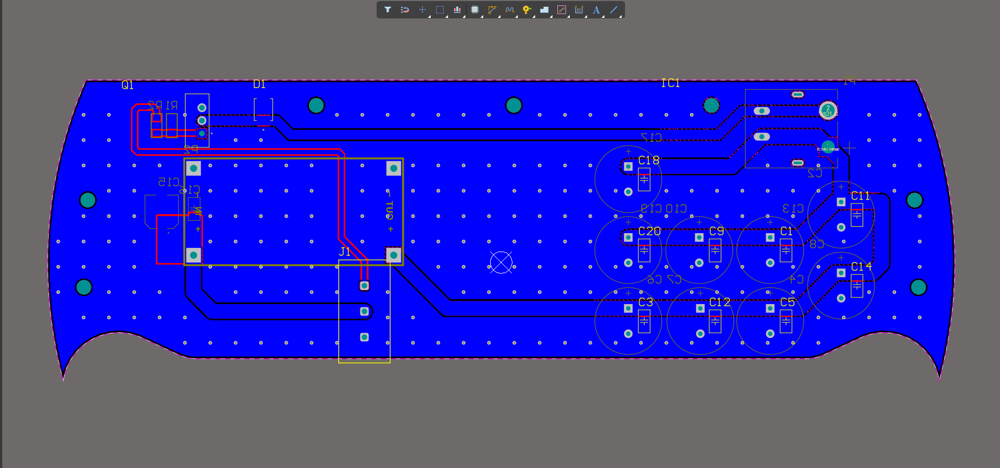
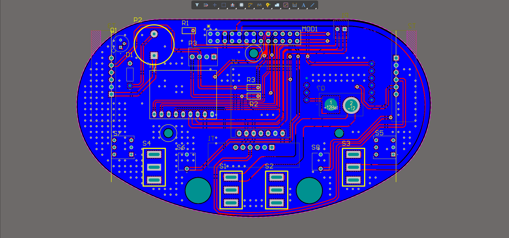
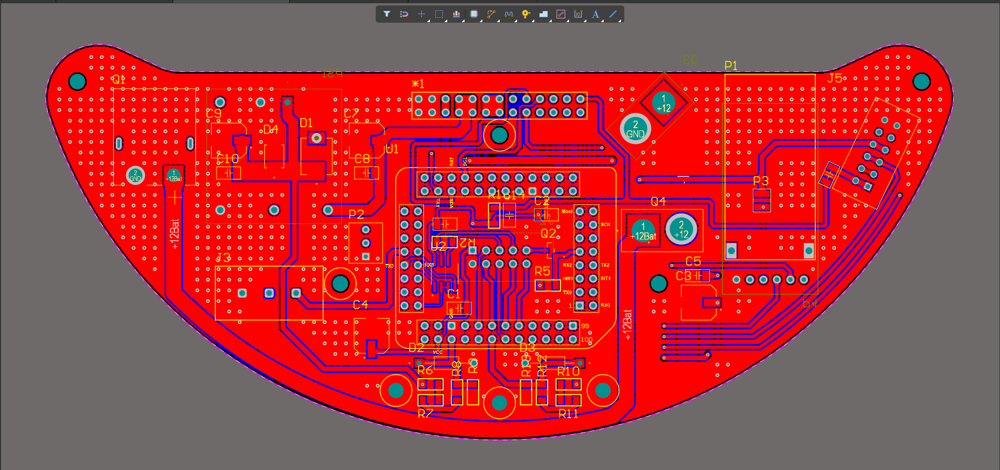

## Electronics Innovation

*Electronics Innovations*

One of our key electronics innovations is splitting the system into multiple dedicated PCBs due to space limitations inside the robot. This modular design also improves reliability by separating high-power circuits, such as the 48V kicker and drive system, from sensitive control and processing electronics, reducing electrical noise interference.
We addressed the challenge of inter-board communication by designing robust connectors and well-structured interfaces, ensuring stable and reliable data and power transfer between all modules.

## Circuit Photos

*Photo of your circuit boards highlights*

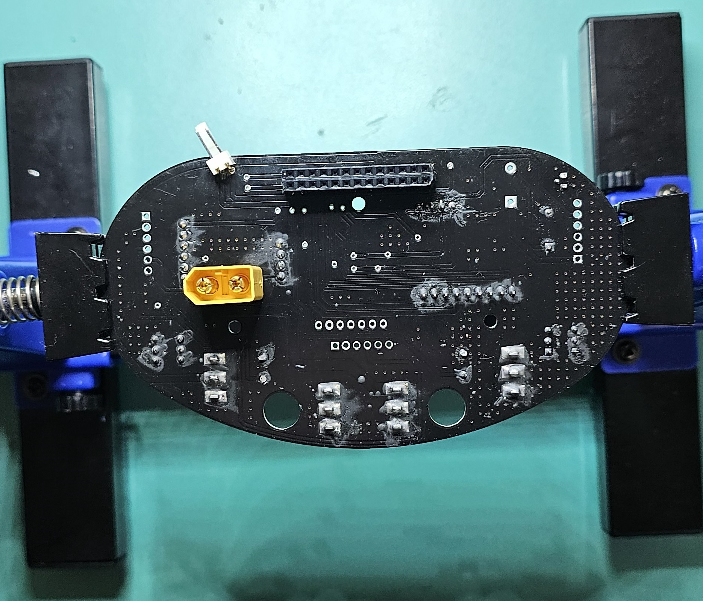
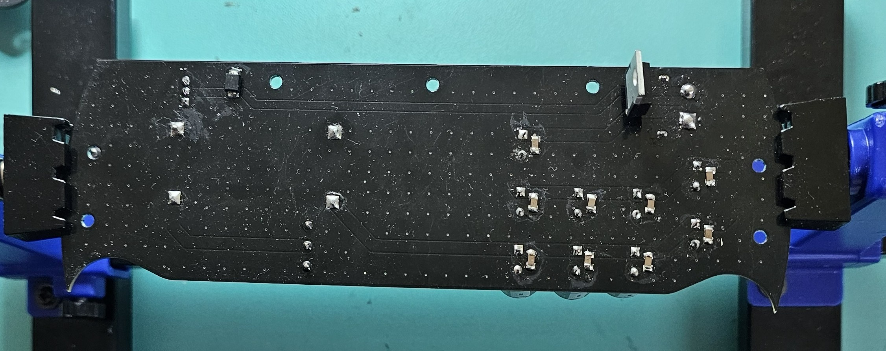
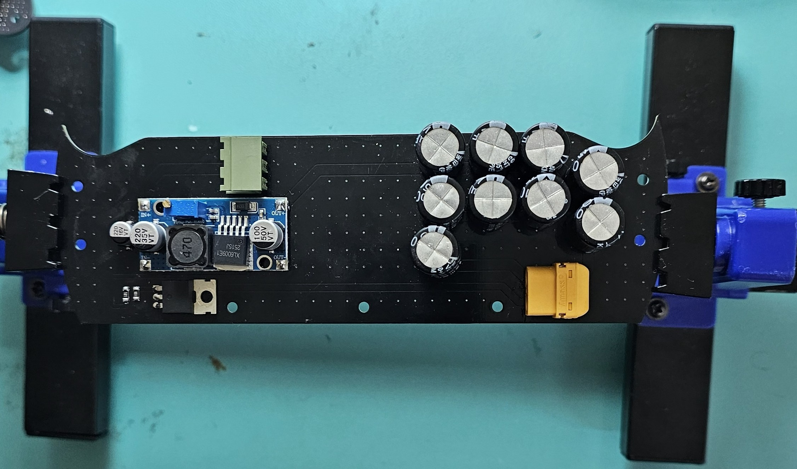
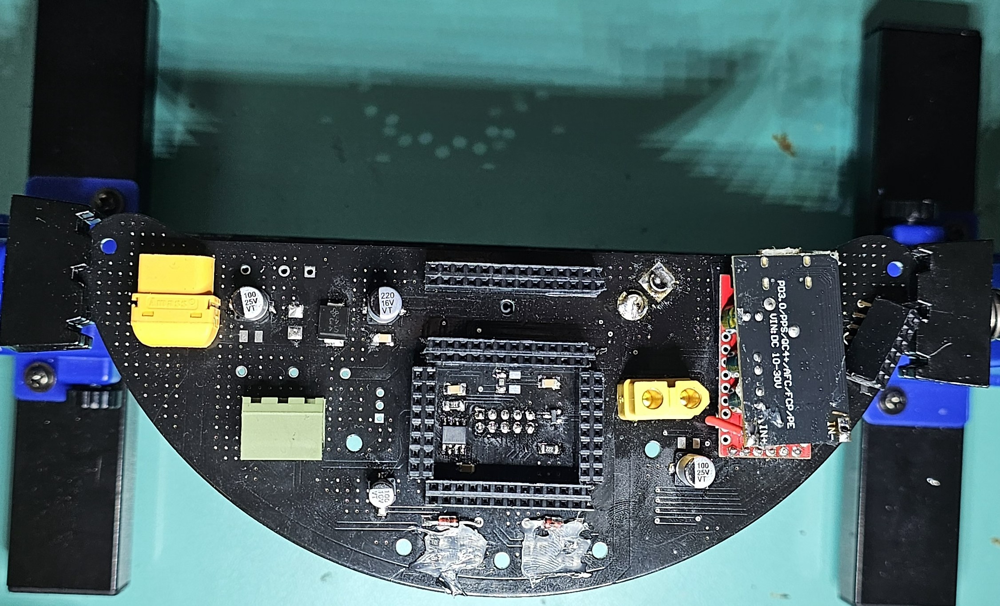
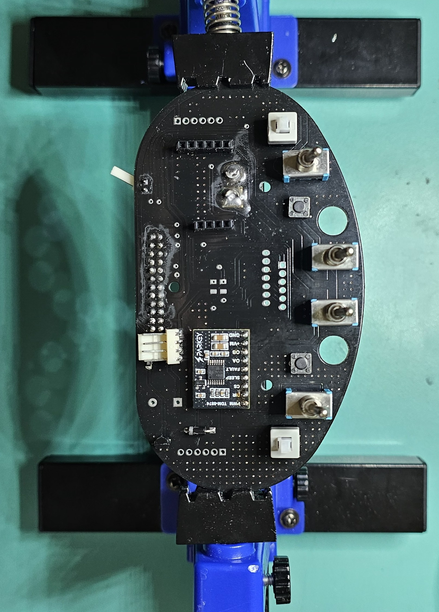

## Ball Detection Method

*How do you find where the ball is? How do you read the data from the ball detection sensors and/or camera?*

When the camera detects the ball, the Raspberry Pi calculates its X and Y coordinates and distance. This data is sent as a serial packet to the ATmega2560, which uses it to determine the ball’s position relative to the robot and adjust movement accordingly. We also tested a second camera to reduce blind spots, but currently use a single optimized camera system.

## Ball Catch Algorithm

*How does your algorithm work to catch the ball? Is there a difference between your robots in how they move towards the ball? Explain the differences.*

We use a single camera with a mirror for 360° vision, dividing the field into 32 sectors. The ball’s X,Y position is mapped to a sector, and the robot moves accordingly to bring the ball in front for capture. Both robots use the same algorithm, with identical behavior for approaching and collecting the ball.

## Positioning Algorithm

*How do you use your sensors in your algorithm to find your position inside the field and how do you use that position to move your robots around?*

We use distance sensors (front, back, left, right) and an IMU to estimate position and orientation. Distance values are compared to detect walls and field zones, while the IMU ensures correct heading. If misaligned, the robot first corrects its angle, then re-evaluates distances. Based on this fused data, it adjusts direction and position to stay inside the field and navigate to target zones.

## Line Algorithm

*How does your robot find the lines to stay inside the field? What algorithms do you use to avoid going out of bounds?*

We use LED-LDR pairs to detect boundary lines. Each LDR is connected individually for precise detection. To reduce processor load, LDRs are only read when a distance sensor detects proximity to the field edge. When sensor values cross a calibrated threshold, the robot immediately moves away from the detected side to stay inside the field.

## Goal Algorithm

*What algorithms do you use to score goals? How do you use your kicker and dribbler to handle the ball?*

We use three scoring algorithms: Direct Shot, Back Shot, and Square Shot. The robot selects the best strategy based on ball position, obstacles, and field location. The dribbler maintains ball possession while maneuvering, and the solenoid kicker is activated when the robot reaches a favorable shooting position, maximizing scoring opportunities.

## Defense Algorithm

*What algorithms do you use to avoid the opponent team scoring? How do your robots defend your own goal?*

Our robots communicate with each other and dynamically switch roles. When an opponent approaches our goal with the ball or takes a shot, the defending robot immediately detects the threat, switches to an attacking role, and moves at maximum speed to intercept or capture the ball before a scoring opportunity develops.

## Robot Communication

*Do your robots communicate with each other? How do you use this communication to your advantage?*

We use HC-05 Bluetooth modules for robot-to-robot communication. Each robot shares ball detection status and position to enable dynamic role assignment. If both see the ball, the closer robot becomes attacker; if only one sees it, it becomes attacker; if neither sees it, both switch to positioning mode to search and maintain field coverage.

## Software Innovation

*Software Innovations*

One of our main software innovations is a dynamic goal-scoring state machine. The robot analyzes ball and goal positions, obstacle distances, field position, and orientation to select the best scoring strategy in real time. By calculating relative angles between the robot, ball, and goal, it can perform advanced tactics such as back shots and angle-based scoring, improving adaptability and increasing scoring opportunities during matches.

## GitHub Link

*GitHub link*

https://github.com/mamali-1382/Sadr-United-2026.git

## BOM

*Bill of Materials (BOM)*

[https://drive.google.com/open?id=1ECo4NBYPTbrXImJ2QAOS6yyTgkkaSkNO](https://drive.google.com/open?id=1ECo4NBYPTbrXImJ2QAOS6yyTgkkaSkNO)

## Cost

*How much did it cost you to build your robots?*

Robots: 2000 each 
Experiments: 600 USD 
Environment: 100 USD

## Funding

*How did you gathered the funds to build the robots?*

10% school 90% parents

## Affordability

*How affordable was it to compete in RoboCupJunior Soccer?*

4

## Answer Check

*Have you checked all of your answers?*

Yes!

## Publication Consent

*We publish TDPs and posters during or after the competition as described in the beginning*

Yes, we acknowledge everything submitted in the above form can be published.

