## Timestamp

*Tijdstempel*

29-6-2026 6:42:31

## Email Address

*E-mailadres*

chanutponthammalee@gmail.com

## TDP File

*TDP File Upload (Not required)*

## Team Name

*What is your team's name?*

TPA Thailand Soccer

## League

*What league do you participate in?*

Vision League

## Country

*Where are you from?*

Thailand

## Contact

*If other teams have questions about your robot, now or in the future, what email address(es) can we publish along with this document for people to reach you?

(You can put in multiple email addresses, like multiple team members, an email for the whole team or both. Feel free to share other ways of communication like Discord handles)*

chanutponthammalee@gmail.com
tutorv102@gmail.com

## Social Media

*Team Social Media Links (if you have any)*

## Team Photo

*Upload a photo of your whole team with your mentor and robots

Note: This is not mandatory and will be published along with your TDP if you choose to upload something*

## Members & Roles

*What are the names of the team members and their role(s)?*

Chanutpon Thammalee (Phai) : Circuit , Robot design and Programming
Anooyud Siriwachirakul (Tutor) : Programming

## Meeting Frequency

*How often did your team meet?
(e.g. 90 minutes once per week or a day every weekend.)*

We met after school for about 1–2 hours per day.

## Meeting Place

*Where did you meet to work on your robot?
(e.g. a robotics room at school, at some other place, one of your homes, school library etc.)*

We met and worked on our robot in the robotics room at school.

## Start Date

*When did your team start working on this year's robot?*

We started in the first week of June 2026.

## Past Competitions

*Which RoboCupJunior competitions have you competed in and in which leagues?*

This is our first time competing in RoboCupJunior Soccer Vision League. We had about one month to prepare, with only one full practice day. The rest of the time was spent on trial-and-error development of the robot design and electronic circuits, including testing and improving both hardware and control systems.

## Mentor Contribution

*Which parts of your work received the most contribution from your mentor?*

Our mentor helped with parts selection and budget planning. Most design and testing were done by the team.

## Workload Management

*How did you manage the workload?*

We divided work into software, electronics, and mechanical tasks. We used GrabCAD to share 3D models and Discord for communication and coordination, helping us stay organized and work efficiently.

## AI Tools

*Which AI tools did you use?*

I used ChatGPT to research electronic circuits, GPIO functions, pin compatibility, and hardware connections for our robot.

## Robot1 Overall

*Robot 1 Overall View*

## Robot1 Front

*Robot 1 Front view*

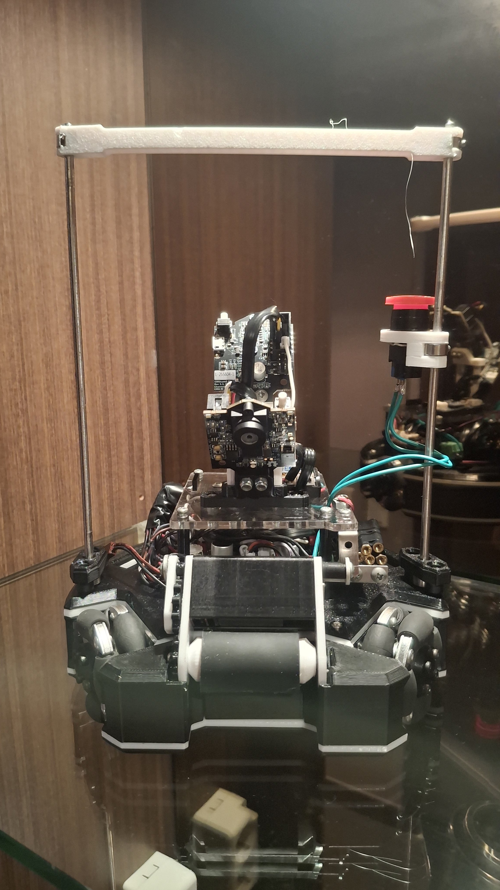

## Robot1 Back

*Robot 1 Back view*

## Robot1 Top

*Robot 1 Top View*

## Robot1 Bottom

*Robot 1 Bottom View*

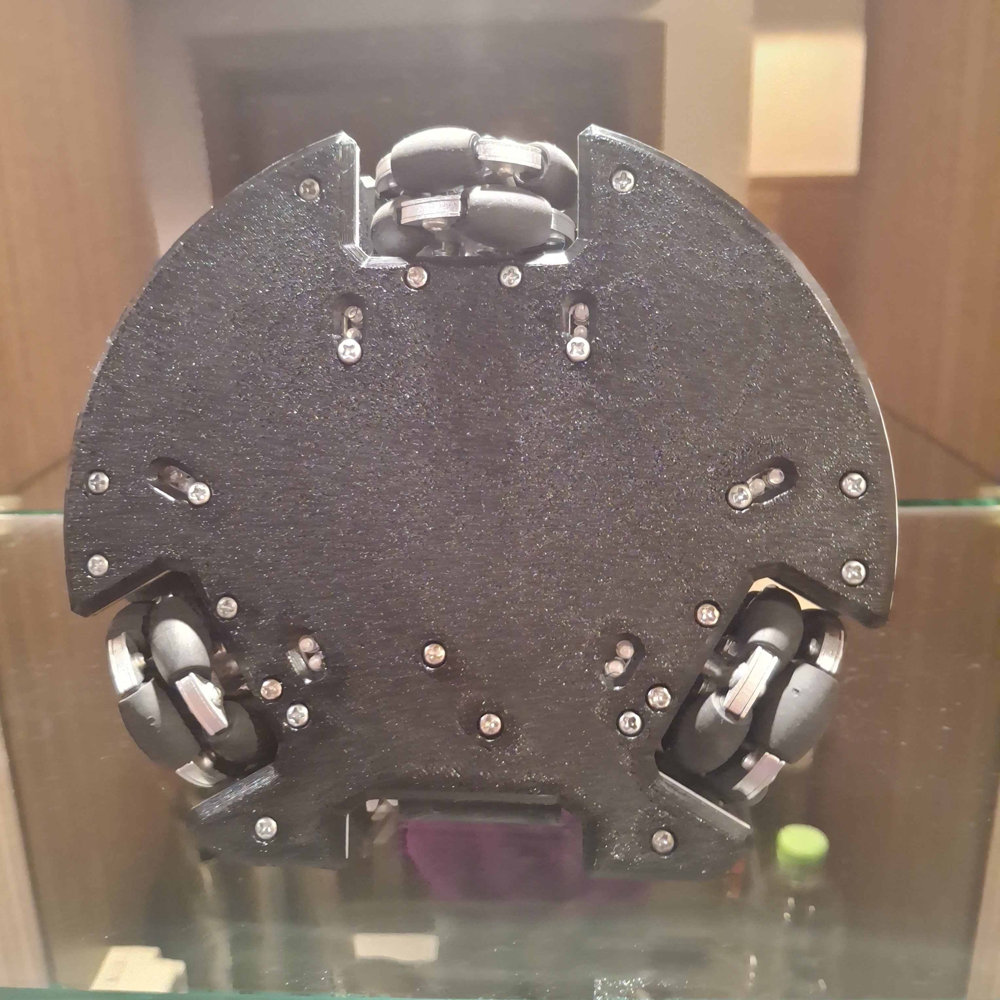

## Robot1 Right

*Robot 1 Right View*

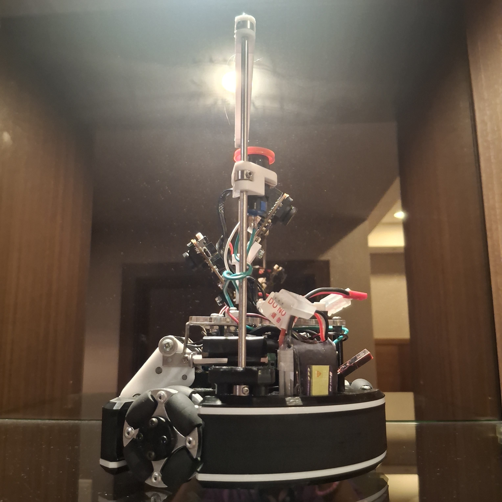

## Robot1 Left

*Robot 1 Left View*

## Robot2 Overall

*Robot 2 Overall View*

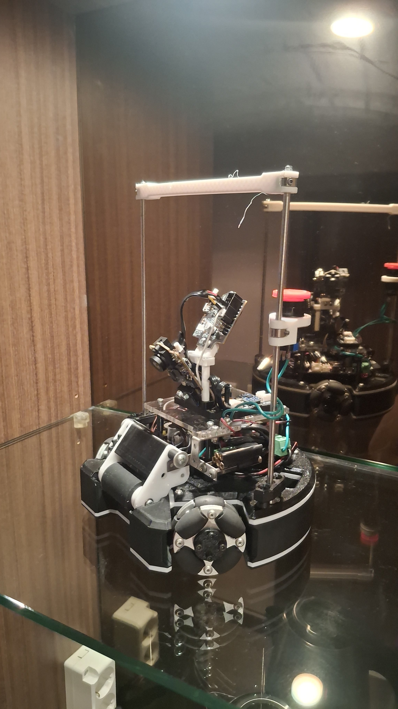

## Robot2 Front

*Robot 2 Front view*

## Robot2 Back

*Robot 2 Back view*

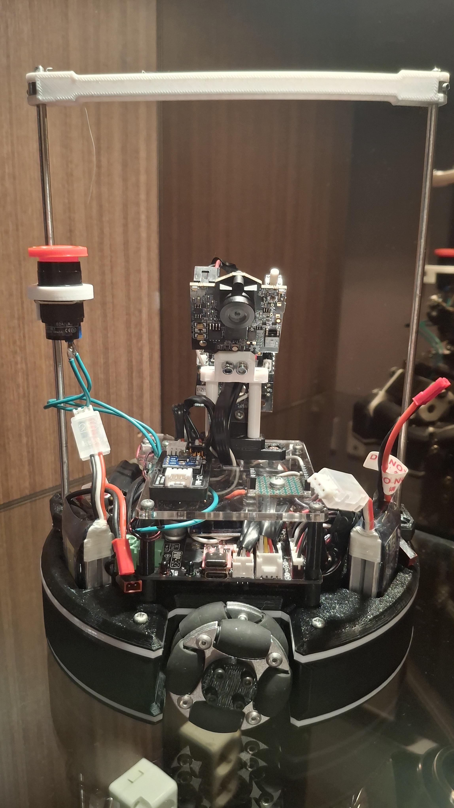

## Robot2 Top

*Robot 2 Top View*

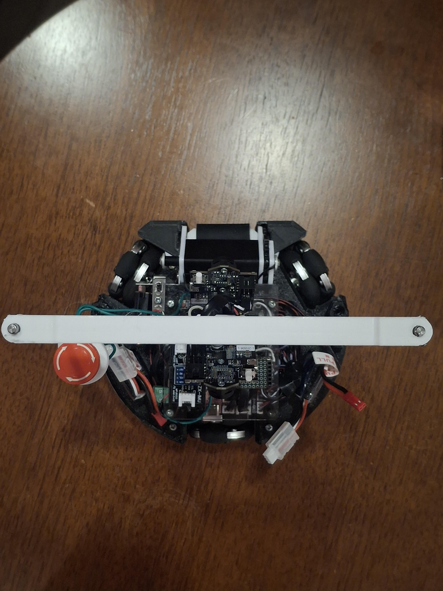

## Robot2 Bottom

*Robot 2 Bottom View*

## Robot2 Right

*Robot 2 Right View*

## Robot2 Left

*Robot 2 Left View*

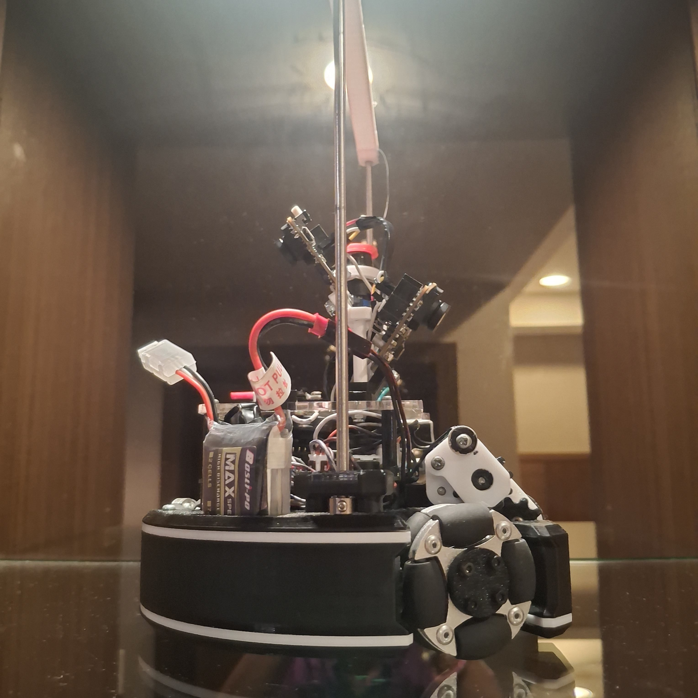

## Mechanical Design

*How did you design the mechanical parts of your robots?*

We designed our robot using **SolidWorks**. Our goal was to use parts that are easy to find and assemble because we had only one month to prepare. We kept the robot lightweight so the motors could provide good performance. We chose the Pixy2.1 camera for its wide field of view and easy PC setup, but did not use a dome mirror because its image resolution was not high enough. In the future, we plan to improve the shooting power and use a higher-resolution camera with a dome mirror.

## Build Method

*How did you build your design?*

We used a **Bambu Lab P1S** 3D printer and a laser cutter to build our robot. We made all parts ourselves without external services. In the future, we plan to use stronger, lighter materials to improve durability and performance.

## Motors & Reason

*How many motors have you used and why?*

We use 3 J-Sumo 6V 750rpm 26:1 DC motors for a 3-wheel drive system. This design was chosen because the previous 4-wheel setup had contact issues with the ground. The 3-wheel system improves stability, traction, and movement control.

## Kicker Design

*If your robot has a kicker, explain how you designed and built the mechanics of the kicker*

We used a **JF-0826B 6V 20N solenoid** as our kicker. It is driven through a motor driver to provide sufficient current while protecting the controller from high current draw. This design makes the kicker reliable and easy to control.

## Dribbler Design

*If your robot has a dribbler, explain how you designed and built the mechanics of the dribbler.*

We designed the **dribbler mechanism** with a vertically adjustable contact plate. When the ball enters, the mechanism moves upward to improve ball retention. A **limit switch** detects when the ball is captured, enabling reliable ball possession detection.

## CAD Files

*CAD design files*

https://grabcad.com/library/soccer-vision-tpa-thailand-soccer-1

## Mechanical Innovation

*Mechanical Innovation*

Our proudest innovation is the **dribbler mechanism**. We designed a vertically adjustable contact plate that moves upward when the ball enters, improving ball retention and control. A **limit switch** is integrated into the mechanism to detect ball possession, providing reliable feedback for autonomous control. This design improves both ball handling and gameplay performance while keeping the mechanism simple and reliable.

## Mechanical Photos

*Photos of your mechanical designs highlights*

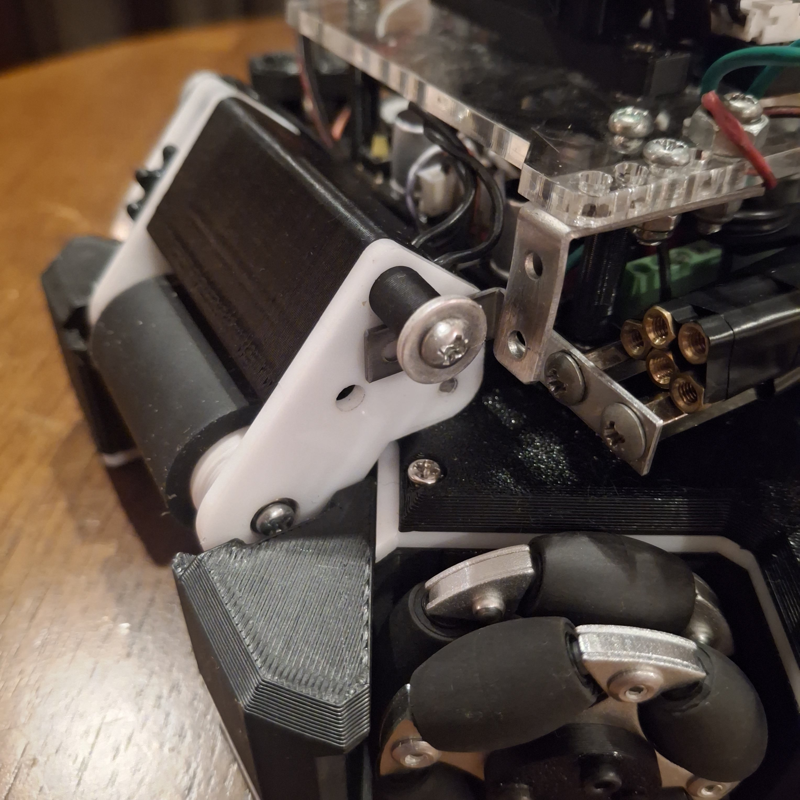
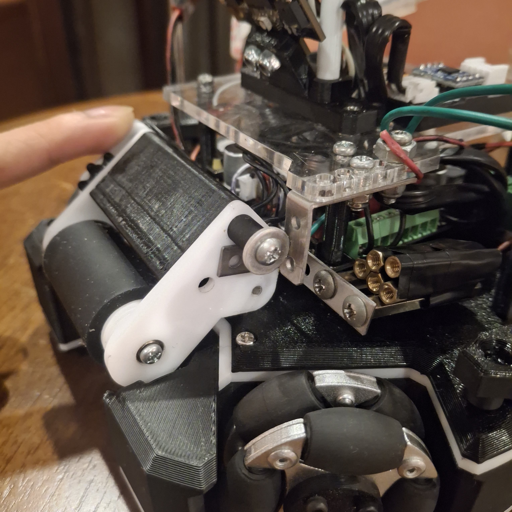

## Electronics Block Diagram

*Provide us with a block diagram of your robot's electronics*

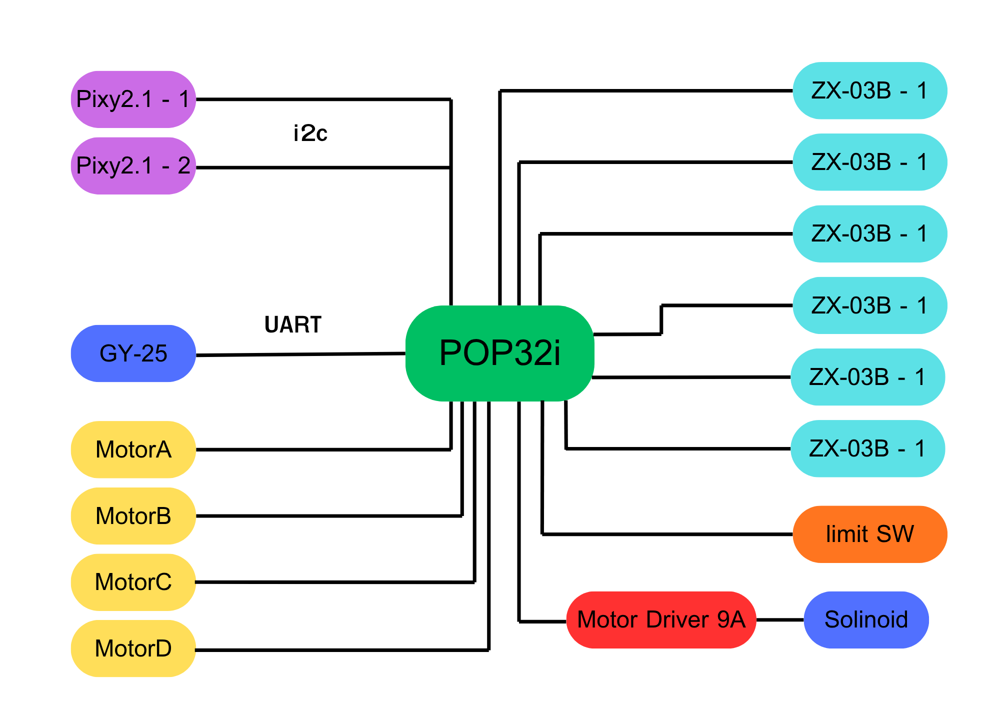

## Power Circuit

*How does your power circuits work?*

Our robot uses a 2-cell LiPo battery (7.4V) for motors and actuators. The POP32i runs on 3.3V logic, regulated internally from the main supply. This provides stable control for sensors and communication while keeping high power for the motor system.

## Motor Drive Circuit

*How do you drive your motors? Explain the circuits you use for that*

We use the POP32i, which combines a microcontroller and motor drivers on one board. The microcontroller processes sensor data and generates PWM signals, while the built-in drivers control the DC motors. This reduces wiring, saves space, and improves reliability.

## Microcontroller & Reason

*What kind of micro controller or board do you use for your robot? Why did you decide to use this part for your robot? If you have more than 1 processor, explain each one separately.*

Our robot uses a POP32i as the main controller because it combines a microcontroller and motor drivers on one board, reducing wiring and saving space. It processes sensor data, controls the motors, and handles the robot’s decision-making. We also use an STM32F103 as a dedicated processor for reading two Pixy2 cameras, allowing image processing to run independently and reducing the workload on the main controller.

## Motor Control

*How do you use your processor to move your motors?*

The processor reads sensor data, calculates the required movement, and generates PWM signals for each motor. These signals are sent to the built-in motor drivers, which control the speed and direction of the motors, allowing smooth and accurate robot movement.

## Ball Detection

*How does your ball detection sensors and/or camera[s] work?*

Our robot uses two Pixy2 cameras for ball detection. Each camera detects the ball by color and sends its position to an STM32 processor through I2C. Since side blind spots still exist, the robot remembers the ball’s last detected direction and rotates toward it when the ball is lost, allowing the cameras to quickly reacquire the target.

## Line Detection

*How does your line detection circuits work?*

Our robot uses six ZX-03B line sensors. Each sensor has an infrared LED and a receiver. The reflected light changes between the green field and the white line. The processor reads all sensors and moves the robot away based on which sensor detects the line.

## Navigation/Position Sensors

*What sensors do you use for navigation and how are these sensors connected to your processor? What sensors do you use to find your position in the field? What about the direction your robot faces?*

Our robot uses a GY-25 sensor to measure its yaw angle. The GY-25 processes the yaw internally and sends the heading to the POP32i through UART. For field positioning, we use two Pixy2.1 cameras to measure the distance to the goal, which serves as a reference for estimating the robot’s position.

## Kicker Circuit

*How do you drive your kicker system? How does the circuit make the kicker work?*

A 2-cell LiPo powers a 6V 20N JF-0826B solenoid through a Prikthai motor driver. IN1 is LOW, IN2 is HIGH, and the POP32i controls only the PWM pin (PB0). This reduces wiring and saves GPIO pins.

## Dribbler Circuit

*How does your dribbler system work? What components and circuits did you use to drive it?*

The POP32i drives a 6V 750RPM J Sumo motor, which powers a silicone-coated roller through a 1:1 gear set. When the ball lifts the contact plate, it activates a limit switch. The robot then detects ball possession and switches to its dribbling or shooting strategy.

## Schematics

*Schematics of your robot*

## PCB

*PCB of your robot*

## Electronics Innovation

*Electronics Innovations*

We are most proud of our integrated electronics design using the POP32i, which combines motor control and logic processing in one board. We use PWM control for precise driving of motors and a solenoid kicker system driven through a motor driver circuit. A limit switch is used to detect ball possession when the dribbler lifts on contact. In addition, the system supports firmware updates via SWD, allowing fast debugging and code optimization. This integration improves performance, reliability, and development flexibility during competitions.

## Circuit Photos

*Photo of your circuit boards highlights*

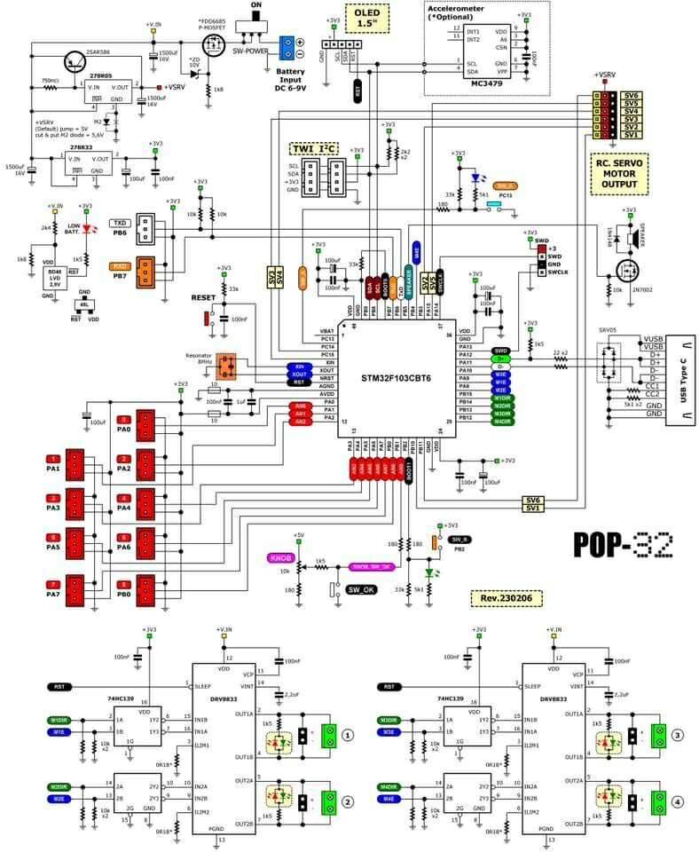

## Ball Detection Method

*How do you find where the ball is? How do you read the data from the ball detection sensors and/or camera?*

We use two Pixy2.1 cameras for ball detection. Each camera detects the ball using color tracking and sends its position data (x, y and size) to the POP32i via I2C. The processor reads this data continuously and combines both camera inputs to estimate the ball’s direction and distance. When the ball is lost, the robot uses the last known position to rotate and quickly reacquire the target.

## Ball Catch Algorithm

*How does your algorithm work to catch the ball? Is there a difference between your robots in how they move towards the ball? Explain the differences.*

Robot 1 uses the ball’s x and y coordinates to calculate distance using the Pythagorean theorem for forward motion with PID control. It also converts position into an angle for another PID loop to control rotation and sliding toward the ball.

Robot 2 is a goalkeeper, so it only uses the ball’s X-axis position. It moves left and right to stay aligned with the ball and block the goal.

## Positioning Algorithm

*How do you use your sensors in your algorithm to find your position inside the field and how do you use that position to move your robots around?*

Our robot estimates its position using two Pixy2.1 cameras for ball and goal distance, and a GY-25 sensor for yaw. The POP32i combines these inputs to determine direction and orientation. This information is used in the algorithm to guide movement, such as approaching the ball, aligning with the goal, and repositioning using PID control.

## Line Algorithm

*How does your robot find the lines to stay inside the field? What algorithms do you use to avoid going out of bounds?*

Our robot uses six ZX-03B IR sensors to detect the white boundary lines. The sensors measure reflected infrared light and the POP32i reads them continuously. When a line is detected, the robot uses simple threshold logic and immediately moves away in the opposite direction to avoid leaving the field while maintaining smooth motion control.

## Goal Algorithm

*What algorithms do you use to score goals? How do you use your kicker and dribbler to handle the ball?*

Our scoring algorithm uses the dribbler to secure the ball and confirm possession with a limit switch. The robot then carries the ball toward the goal using PID control while adjusting its position for a better shooting angle. When aligned with the goal, it activates the kicker to shoot accurately.

## Defense Algorithm

*What algorithms do you use to avoid the opponent team scoring? How do your robots defend your own goal?*

Our defensive algorithm focuses on protecting the goal area when the robot is inside the penalty zone. The goalkeeper uses the ball’s X-axis position to move left and right to block shots. When the field robot is in the penalty area, it positions itself between the ball and the goal using PID control for fast reaction. Line sensors ensure the robot stays inside the field while defending.

## Robot Communication

*Do your robots communicate with each other? How do you use this communication to your advantage?*

Currently, our robots do not communicate with each other. However, in the future, we plan to implement communication so the goalkeeper robot can switch roles and become the main attacker when it gains ball possession. This will allow better teamwork and more flexible game strategies.

## Software Innovation

*Software Innovations*

We developed a position-based attacking algorithm that selects different movement strategies based on the robot’s location after gaining ball possession. From long range, the robot drives quickly toward the goal center, then performs a fast left or right dodge before shooting, making it difficult for the goalkeeper to predict. Near the goal, it moves around the defender, spins rapidly, and shoots. This strategy minimizes collisions, improves ball control, and increases our scoring chances.

## GitHub Link

*GitHub link*

https://github.com/chanutpon/Software---TPA-Thailand-Soccer-2026---one-night-miracle.git

## BOM

*Bill of Materials (BOM)*

[https://drive.google.com/open?id=1jJSSaTG3fcdtIPoF3Ng29bgkMaKBJHwP](https://drive.google.com/open?id=1jJSSaTG3fcdtIPoF3Ng29bgkMaKBJHwP)

## Cost

*How much did it cost you to build your robots?*

Robots (final components): 39264 THB
Experiments (trial and error): 8984 THB
Environment (tools and materials): 1,000 THB

1 USD ≈ 36 THB

## Funding

*How did you gathered the funds to build the robots?*

70% school
30% mentor

## Affordability

*How affordable was it to compete in RoboCupJunior Soccer?*

8

## Answer Check

*Have you checked all of your answers?*

Yes!

## Publication Consent

*We publish TDPs and posters during or after the competition as described in the beginning*

Yes, we acknowledge everything submitted in the above form can be published.

