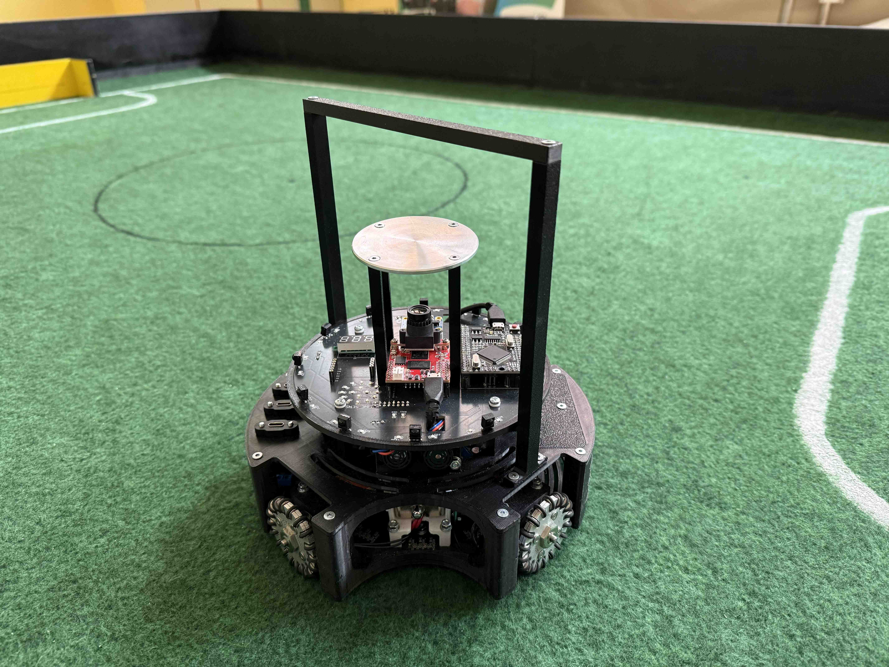
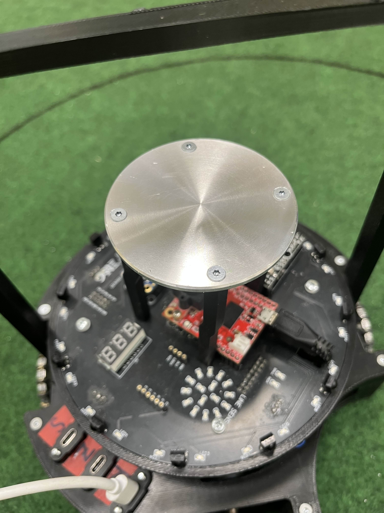
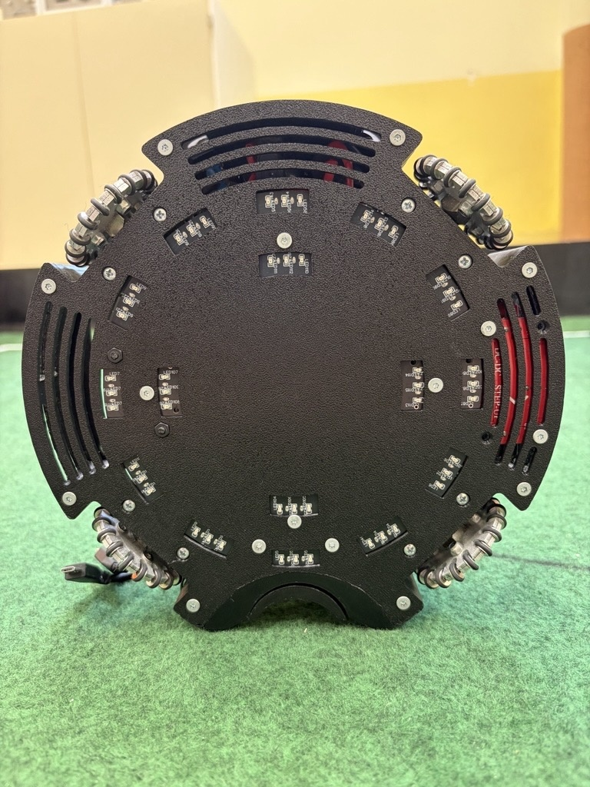
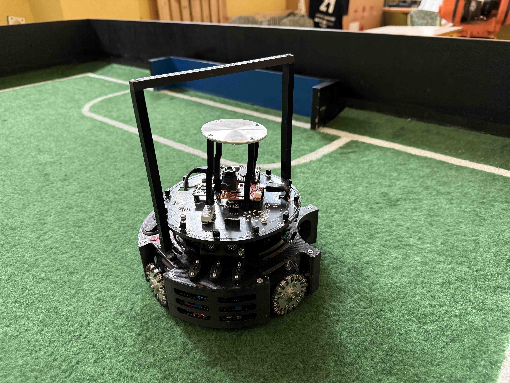
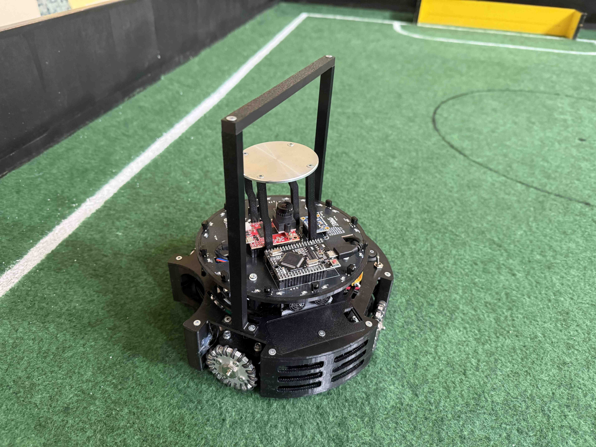
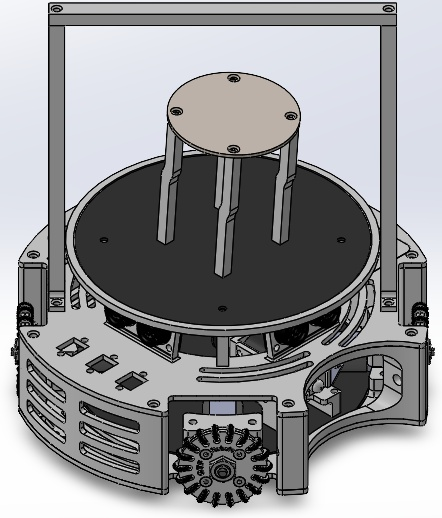
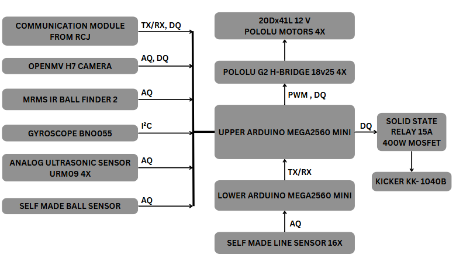
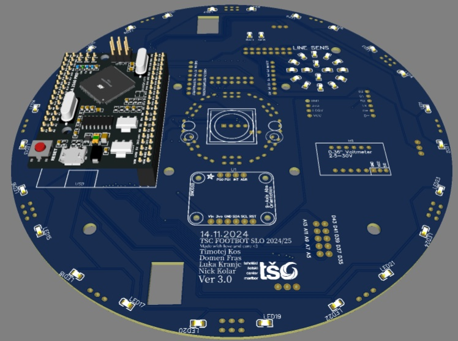

## Timestamp

*Tijdstempel*

22-6-2026 18:19:01

## Email Address

*E-mailadres*

oilijevec@gmail.com

## TDP File

*TDP File Upload (Not required)*

## Team Name

*What is your team's name?*

TSC FootBot

## League

*What league do you participate in?*

IR League

## Country

*Where are you from?*

Slovenia

## Contact

*If other teams have questions about your robot, now or in the future, what email address(es) can we publish along with this document for people to reach you?

(You can put in multiple email addresses, like multiple team members, an email for the whole team or both. Feel free to share other ways of communication like Discord handles)*

tian.crncic@dijak.tscmb.si

## Social Media

*Team Social Media Links (if you have any)*

https://www.instagram.com/tscfootbot/

## Team Photo

*Upload a photo of your whole team with your mentor and robots

Note: This is not mandatory and will be published along with your TDP if you choose to upload something*

## Members & Roles

*What are the names of the team members and their role(s)?*

Nik Črnčič: Team captain, 3D modeler;
Oskar Ilijevec: Mechanical engineer;
Tian Črnčič: Electrical engineer;
Timotej Anton Radanović: PCB designer and main programer;

## Meeting Frequency

*How often did your team meet?
(e.g. 90 minutes once per week or a day every weekend.)*

every two days

## Meeting Place

*Where did you meet to work on your robot?
(e.g. a robotics room at school, at some other place, one of your homes, school library etc.)*

In school

## Start Date

*When did your team start working on this year's robot?*

half a year ago

## Past Competitions

*Which RoboCupJunior competitions have you competed in and in which leagues?*

European Championship 2025: Lightweight League
European Championship 2026: Lightweight League
World Championship 2025: Lightweight League
World Championship 2024: Lightweight League
European Championship 2023: Lightweight League
European Championship 2024: Lightweight League

## Mentor Contribution

*Which parts of your work received the most contribution from your mentor?*

Part supply, technical support.

## Workload Management

*How did you manage the workload?*

Teams by Microsoft and discord

## AI Tools

*Which AI tools did you use?*

Claude and Chat GPT

## Robot1 Overall

*Robot 1 Overall View*

## Robot1 Front

*Robot 1 Front view*

## Robot1 Back

*Robot 1 Back view*

## Robot1 Top

*Robot 1 Top View*

## Robot1 Bottom

*Robot 1 Bottom View*

## Robot1 Right

*Robot 1 Right View*

## Robot1 Left

*Robot 1 Left View*

## Robot2 Overall

*Robot 2 Overall View*

## Robot2 Front

*Robot 2 Front view*

## Robot2 Back

*Robot 2 Back view*

## Robot2 Top

*Robot 2 Top View*

## Robot2 Bottom

*Robot 2 Bottom View*

## Robot2 Right

*Robot 2 Right View*

## Robot2 Left

*Robot 2 Left View*

## Mechanical Design

*How did you design the mechanical parts of your robots?*

Solidworks. We made a design that is the most sutable.

## Build Method

*How did you build your design?*

3D printer and CNC lathe center with fanuc control.

## Motors & Reason

*How many motors have you used and why?*

4 motors for every wheel one. The combination with omni wheels and angled 45 degrees from center.

## Kicker Design

*If your robot has a kicker, explain how you designed and built the mechanics of the kicker*

We have bought a soleonid and design a kicker part that is touching the ball.

## Dribbler Design

*If your robot has a dribbler, explain how you designed and built the mechanics of the dribbler.*

## CAD Files

*CAD design files*

## Mechanical Innovation

*Mechanical Innovation*

Kicker design

## Mechanical Photos

*Photos of your mechanical designs highlights*

## Electronics Block Diagram

*Provide us with a block diagram of your robot's electronics*

## Power Circuit

*How does your power circuits work?*

Our robot has a 11.1 battery pack that is regulated to 5V for our Arduino and used directly by the motor drivers and boost converter for 36V for kicker

## Motor Drive Circuit

*How do you drive your motors? Explain the circuits you use for that*

With polulu high current motor drivers

## Microcontroller & Reason

*What kind of micro controller or board do you use for your robot? Why did you decide to use this part for your robot? If you have more than 1 processor, explain each one separately.*

I have two mega 2650 pro mini one main upper and one

## Motor Control

*How do you use your processor to move your motors?*

We use PWM signal from TTL.

## Ball Detection

*How does your ball detection sensors and/or camera[s] work?*

Ball detection sensor is analog and camera is for goal orientation

## Line Detection

*How does your line detection circuits work?*

With leds and foto-transistors

## Navigation/Position Sensors

*What sensors do you use for navigation and how are these sensors connected to your processor? What sensors do you use to find your position in the field? What about the direction your robot faces?*

We use adafruit bno055

## Kicker Circuit

*How do you drive your kicker system? How does the circuit make the kicker work?*

We use the mosfet with digital signal from processor

## Dribbler Circuit

*How does your dribbler system work? What components and circuits did you use to drive it?*

## Schematics

*Schematics of your robot*

## PCB

*PCB of your robot*

## Electronics Innovation

*Electronics Innovations*

We are very proud of our new pcb

## Circuit Photos

*Photo of your circuit boards highlights*

[https://drive.google.com/open?id=1eiBEymXeaFqCGvXfmbv-N8HWwrd9-VxO](https://drive.google.com/open?id=1eiBEymXeaFqCGvXfmbv-N8HWwrd9-VxO)

## Ball Detection Method

*How do you find where the ball is? How do you read the data from the ball detection sensors and/or camera?*

We use the analog signal from ir sensor and map the values from -180 to 180 degrees

## Ball Catch Algorithm

*How does your algorithm work to catch the ball? Is there a difference between your robots in how they move towards the ball? Explain the differences.*

The robot takes the shorthest path to the ball

## Positioning Algorithm

*How do you use your sensors in your algorithm to find your position inside the field and how do you use that position to move your robots around?*

We use ultrasonic sensors and ball sensor and also 360 camera and with a program in c++ we implement that so all works together

## Line Algorithm

*How does your robot find the lines to stay inside the field? What algorithms do you use to avoid going out of bounds?*

We use the analog value from line sensors and with trashold with millis we move the robot to play field

## Goal Algorithm

*What algorithms do you use to score goals? How do you use your kicker and dribbler to handle the ball?*

We only use the kicker and as soon as the ball is in front of robot the kicker kicks the ball

## Defense Algorithm

*What algorithms do you use to avoid the opponent team scoring? How do your robots defend your own goal?*

We have a defender that is always at goal

## Robot Communication

*Do your robots communicate with each other? How do you use this communication to your advantage?*

## Software Innovation

*Software Innovations*

We are very proud of line sensor algorithm so that we do not go out of bounds every time

## GitHub Link

*GitHub link*

## BOM

*Bill of Materials (BOM)*

[https://drive.google.com/open?id=1YmOloerXIDdzRyk5NDuh0JTzV32Ji_Tw](https://drive.google.com/open?id=1YmOloerXIDdzRyk5NDuh0JTzV32Ji_Tw)

## Cost

*How much did it cost you to build your robots?*

Robots (cost of all components for each robot): 1000 Euro = 1142,80 US Dollars

## Funding

*How did you gathered the funds to build the robots?*

30% Sponsors 70% School

## Affordability

*How affordable was it to compete in RoboCupJunior Soccer?*

10

## Answer Check

*Have you checked all of your answers?*

Yes!

## Publication Consent

*We publish TDPs and posters during or after the competition as described in the beginning*

Yes, we acknowledge everything submitted in the above form can be published.

