## Timestamp

*Tijdstempel*

28-6-2026 17:53:37

## Email Address

*E-mailadres*

guoyueyang09@gmail.com

## TDP File

*TDP File Upload (Not required)*

## Team Name

*What is your team's name?*

Team goggles

## League

*What league do you participate in?*

IR League

## Country

*Where are you from?*

Singapore

## Contact

*If other teams have questions about your robot, now or in the future, what email address(es) can we publish along with this document for people to reach you?

(You can put in multiple email addresses, like multiple team members, an email for the whole team or both. Feel free to share other ways of communication like Discord handles)*

Guo_Yueyang09@gmail.com
jovelynnk@gmail.com
zixiqin1@gmail.com
ckc.zachary08@gmail.com

## Social Media

*Team Social Media Links (if you have any)*

## Team Photo

*Upload a photo of your whole team with your mentor and robots

Note: This is not mandatory and will be published along with your TDP if you choose to upload something*

## Members & Roles

*What are the names of the team members and their role(s)?*

Zachary Choy: Team Leader + Software
Qin Zixi: Software
Jovelynn Kung: Hardware
Guo Yueyang: Hardware

## Meeting Frequency

*How often did your team meet?
(e.g. 90 minutes once per week or a day every weekend.)*

During the off-season, our team met once or twice a week, however as the competition season approached, we met every day to prepare for it.

## Meeting Place

*Where did you meet to work on your robot?
(e.g. a robotics room at school, at some other place, one of your homes, school library etc.)*

at school, venue for the school’s robotics club

## Start Date

*When did your team start working on this year's robot?*

July 2025

## Past Competitions

*Which RoboCupJunior competitions have you competed in and in which leagues?*

RoboCupJunior Singapore Open 2026: Vision League
RoboCup Junior Singapore Rescue , 2023, 2024, 2025
RoboCup Junior Singapore Open 2025: Vision League

## Mentor Contribution

*Which parts of your work received the most contribution from your mentor?*

No mentor

## Workload Management

*How did you manage the workload?*

We used a Whatsapp group chat for communication and had a Notion to note down tasks and for organisation

## AI Tools

*Which AI tools did you use?*

We used tools like Claude Code and GitHub Copilot to help write and debug code.

## Robot1 Overall

*Robot 1 Overall View*

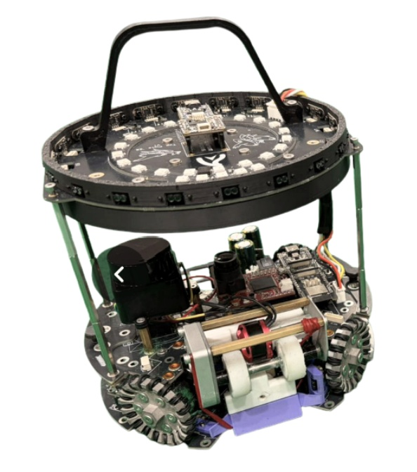

## Robot1 Front

*Robot 1 Front view*

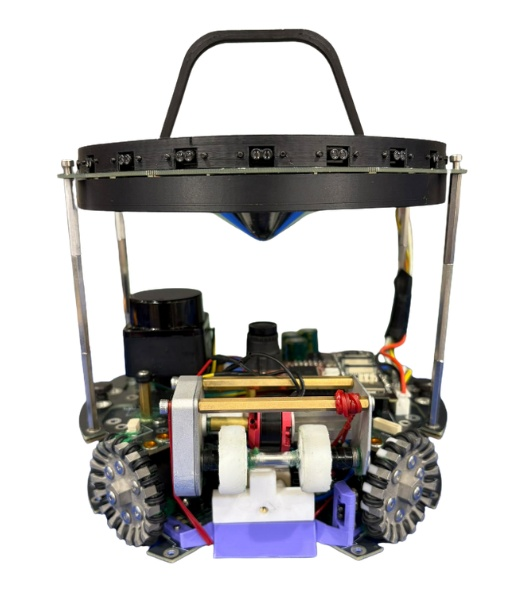

## Robot1 Back

*Robot 1 Back view*

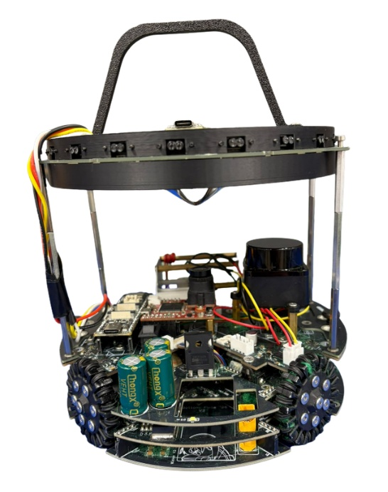

## Robot1 Top

*Robot 1 Top View*

## Robot1 Bottom

*Robot 1 Bottom View*

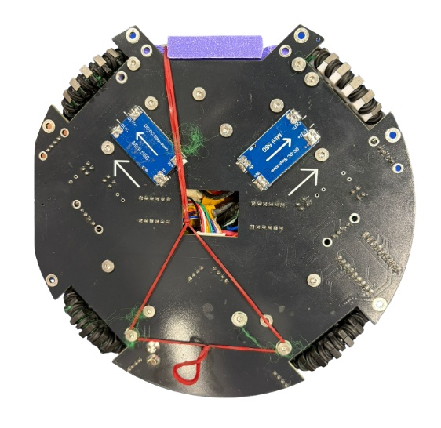

## Robot1 Right

*Robot 1 Right View*

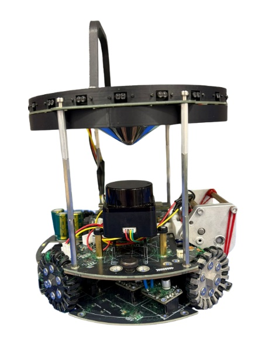

## Robot1 Left

*Robot 1 Left View*

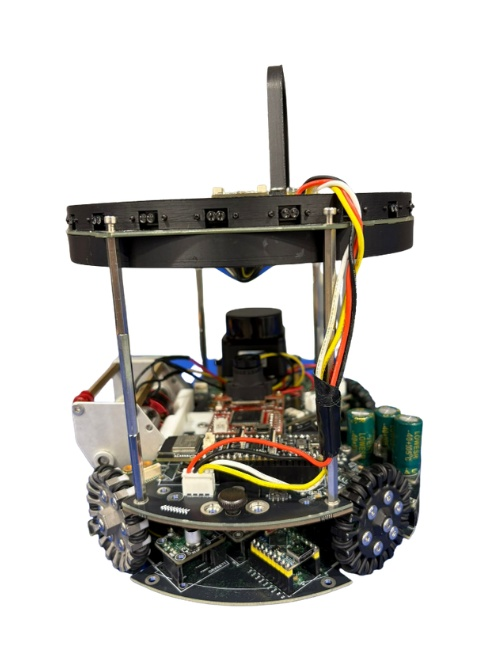

## Robot2 Overall

*Robot 2 Overall View*

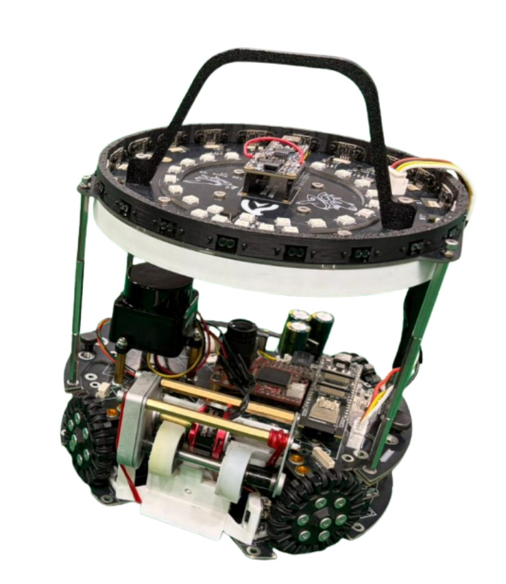

## Robot2 Front

*Robot 2 Front view*

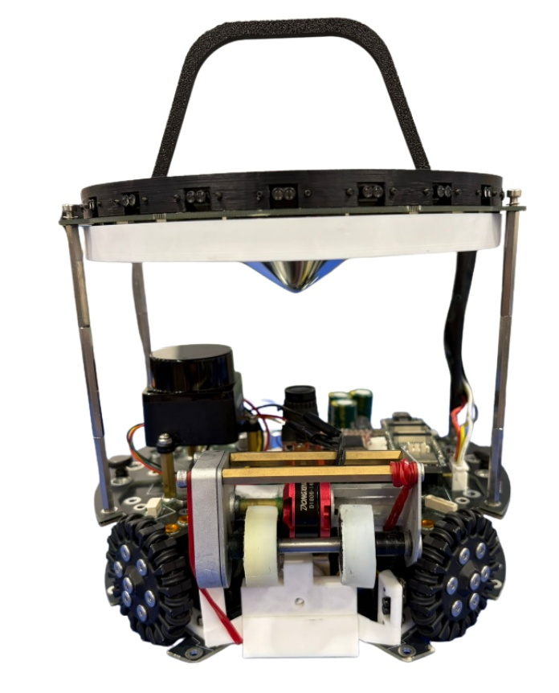

## Robot2 Back

*Robot 2 Back view*

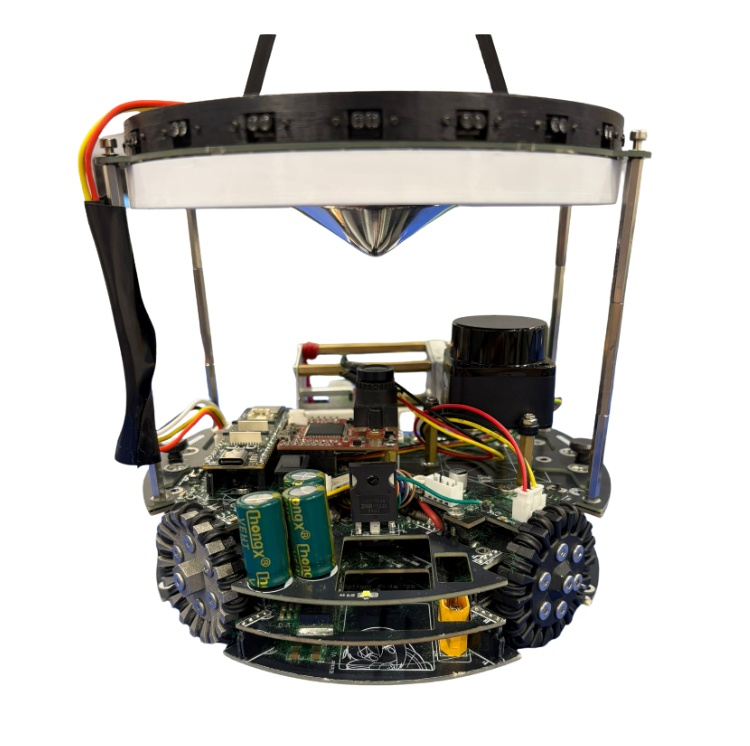

## Robot2 Top

*Robot 2 Top View*

## Robot2 Bottom

*Robot 2 Bottom View*

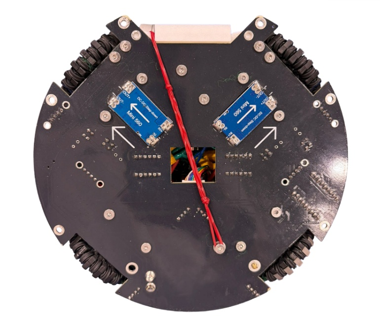

## Robot2 Right

*Robot 2 Right View*

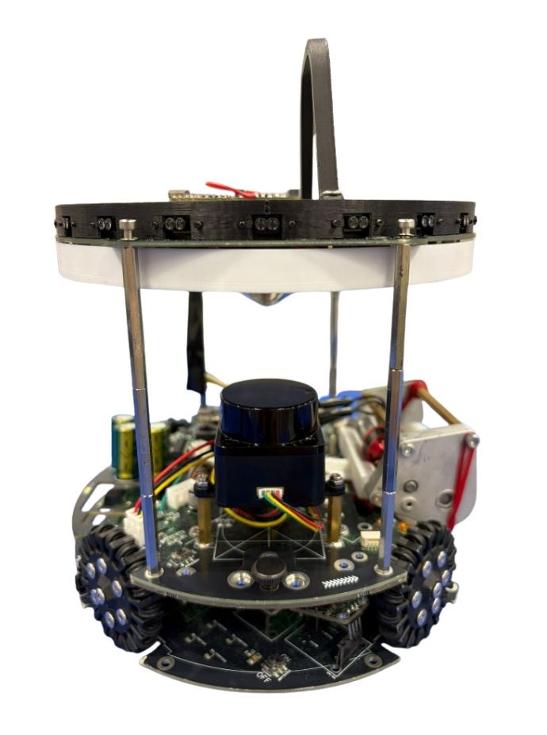

## Robot2 Left

*Robot 2 Left View*

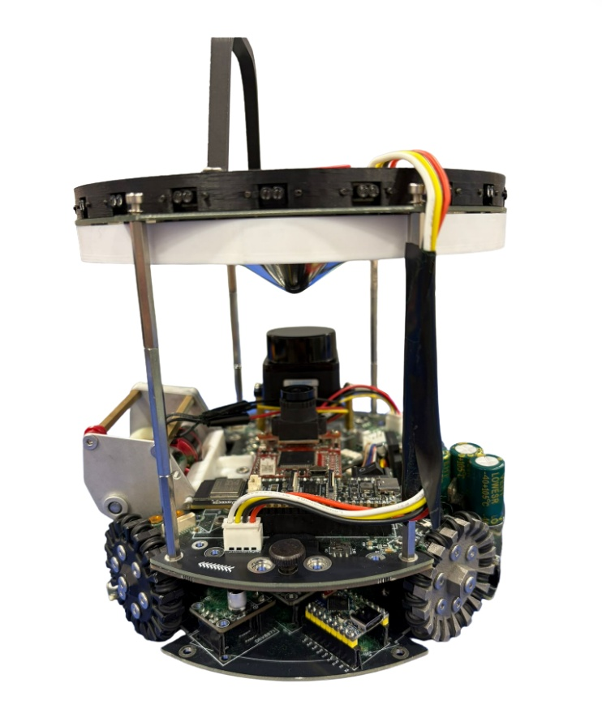

## Mechanical Design

*How did you design the mechanical parts of your robots?*

We used Autodesk Fusion 360 to design custom 3D-printed components, including the dribbler pivot and LiDAR ring mount. Building on our seniors' design, we adapted the parts to better suit our robot while meeting competition size constraints. We also lengthened the dribbler pivot and added a support structure, improving its stability and enabling the dribbler to achieve more consistent possession and control of the ball.

## Build Method

*How did you build your design?*

We used Bambu Studio to 3D print custom parts and sourced additional components from JLCPCB, JLCCNC, and JLCMC. We manually polished a blurry, unpolished concave mirror, improving its reflectivity and enabling more accurate ball detection.

## Motors & Reason

*How many motors have you used and why?*

Our robot is powered by four JMP-BE-3560 motors, selected for their ability to provide high torque and precise control while maintaining fast acceleration. Using four independently driven motors also enables omnidirectional movement, allowing the robot to maneuver quickly and efficiently across the soccer field.

## Kicker Design

*If your robot has a kicker, explain how you designed and built the mechanics of the kicker*

Our robot uses a solenoid-powered kicker to deliver a rapid and consistent striking force. When activated, the solenoid drives a metal plunger forward to propel the ball. A 3D-printed kick plate increases the contact area with the ball, improving kicking consistency and scoring opportunities.

## Dribbler Design

*If your robot has a dribbler, explain how you designed and built the mechanics of the dribbler.*

Inspired by Hwa Chong's Transcendence team, our dribbler uses a brushless motor and a 1:4 gearbox to drive silicone-moulded rollers at 300 RPM. The rollers generate backspin, allowing the robot to securely gain and maintain possession while positioning the ball for passing or kicking.

## CAD Files

*CAD design files*

https://drive.google.com/drive/folders/1M3xxk1bmFT21_hoh5iaL_IX9OmxzHXVS?usp=share_link

## Mechanical Innovation

*Mechanical Innovation*

We are most proud of our 360° LiDAR ring, which consists of 20 LiDAR sensors mounted on the robot's top plate for localization. Using a rotating calipers algorithm, it accurately measures distances to the field boundaries. Even when some sensors are obstructed by other robots, the system maintains reliable positioning. This enables precise navigation, prevents the robot from going out of bounds, and supports accurate shooting and defensive positioning.

## Mechanical Photos

*Photos of your mechanical designs highlights*

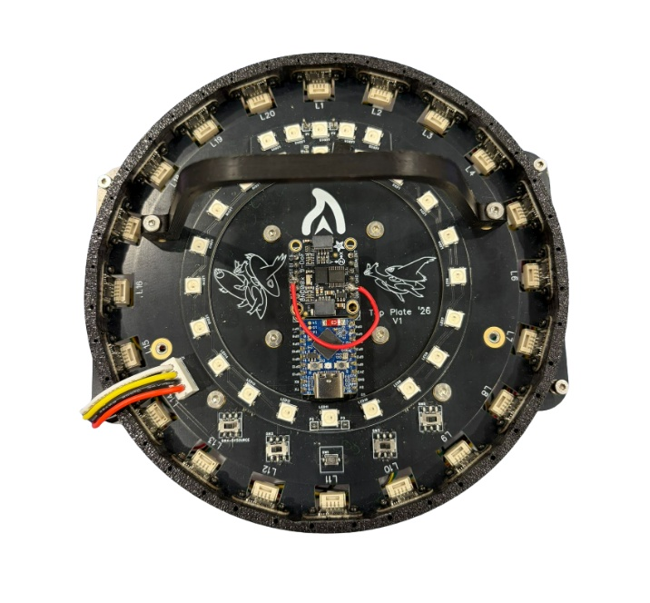
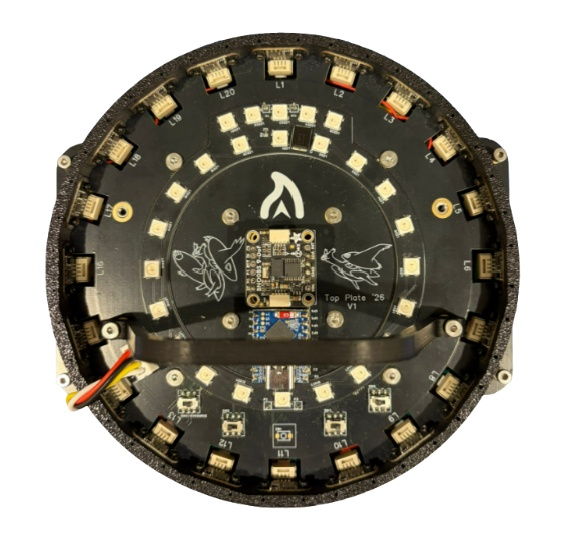

## Electronics Block Diagram

*Provide us with a block diagram of your robot's electronics*

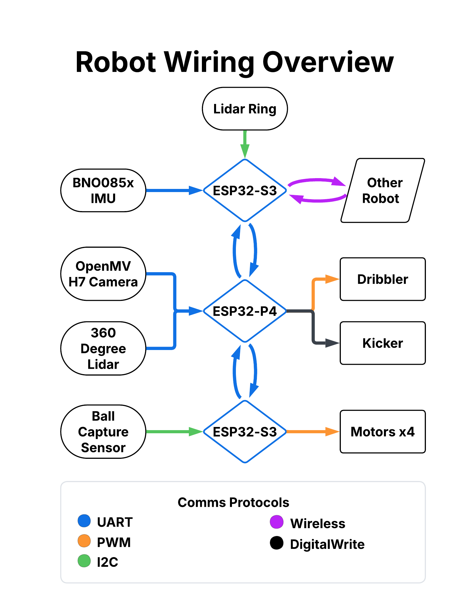

## Power Circuit

*How does your power circuits work?*

Our robot uses 3S lithium polymer batteries that have a nominal voltage of 11.1V, but we usually use it between 12.6V (fully charged) and 11.5V for consistency. There are two buck converters, one down to 5V and the other down to 3.3V, for different microcontrollers and sensors.

## Motor Drive Circuit

*How do you drive your motors? Explain the circuits you use for that*

We use 4 DRV8871 motor drivers, which are commercially available and affordable motor drivers. We use them to supply up to 12V from the battery to the motors. They are controlled using PWM signals from the ESP32-S3 on the bottom PCB.

## Microcontroller & Reason

*What kind of micro controller or board do you use for your robot? Why did you decide to use this part for your robot? If you have more than 1 processor, explain each one separately.*

We use an ESP32-P4-WIFI6 on the main PCB (the middle PCB). We chose it as it has four usable hardware UART controllers, which allows us to use the UART protocol to connect to our other boards (top, bottom and OpenMV). It is also a powerful and modern (less than 1 year since release) microcontroller. On the top and bottom PCBs, we use an ESP32-S3-Zero on each, as they are cheap, adequately fast, and have 2.4GHz wireless communication built-in which we use for bot-to-bot communication.

## Motor Control

*How do you use your processor to move your motors?*

An ESP32-S3 sends PWM signals to four DRV8871 motor drivers, which control the motors via XT30 connectors. We calibrated the motors by balancing opposite wheel pairs at different speeds, determining compensation values to improve movement accuracy and consistency.

## Ball Detection

*How does your ball detection sensors and/or camera[s] work?*

We use an OpenMV Cam H7 R2 pointing at a distortion-free mirror. We use the find_blobs() function in OpenMV’s MicroPython to find an orange blob in the image according to a threshold.

## Line Detection

*How does your line detection circuits work?*

We don’t detect the lines at all. We just use our highly accurate and reliable LiDAR-based localisation system to find out where we are on the field.

## Navigation/Position Sensors

*What sensors do you use for navigation and how are these sensors connected to your processor? What sensors do you use to find your position in the field? What about the direction your robot faces?*

A BNO085 IMU on the top PCB tracks the robot's rotation about its vertical axis. The ESP32-S3 reads the IMU data (via UART) and transmits it, together with LiDAR-based localization data, to the ESP32-P4 on the middle PCB. The ESP32-P4 uses PID control to maintain the robot's intended heading, enabling stable and accurate navigation.

## Kicker Circuit

*How do you drive your kicker system? How does the circuit make the kicker work?*

We use a solenoid, and the kicker is connected to the kick plate.

## Dribbler Circuit

*How does your dribbler system work? What components and circuits did you use to drive it?*

Our dribbler silicone rollers are connected to 4 gears, with gear ratio 1:4, which is then connected to the brushless motor we use. We use rubber bands as extensions to keep the dribbler in place

## Schematics

*Schematics of your robot*

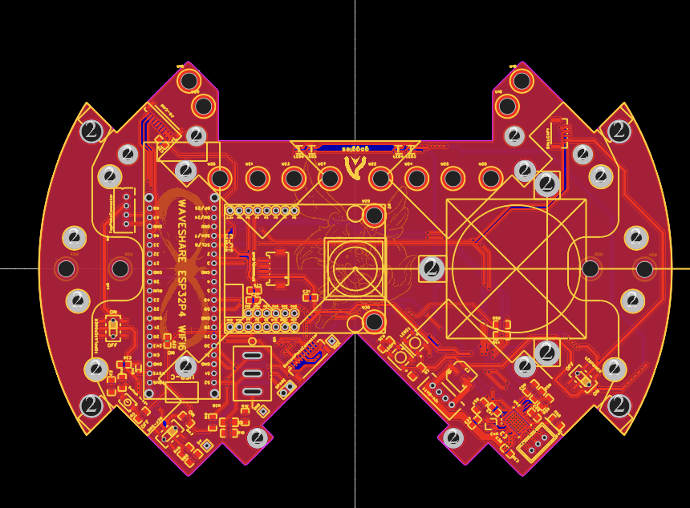

## PCB

*PCB of your robot*

## Electronics Innovation

*Electronics Innovations*

Our custom 360° LiDAR ring uses 20 sensors to localize the robot by measuring distances to the field boundaries. A rotating calipers algorithm provides accurate positioning even when some sensors are blocked, enabling reliable navigation, precise positioning, and preventing the robot from going out of bounds.

## Circuit Photos

*Photo of your circuit boards highlights*

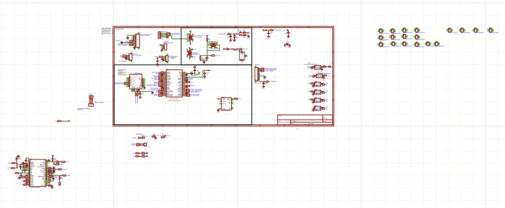
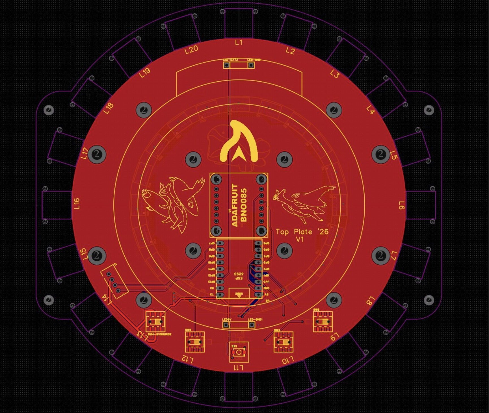

## Ball Detection Method

*How do you find where the ball is? How do you read the data from the ball detection sensors and/or camera?*

A camera mounted beneath a convex mirror captures a 360° view of the field in a single image. The robot detects the ball using colour filtering and blob detection, then estimates its distance from the robot based on its pixel position in the camera frame. This information is sent to the main microcontroller for navigation and ball tracking.

## Ball Catch Algorithm

*How does your algorithm work to catch the ball? Is there a difference between your robots in how they move towards the ball? Explain the differences.*

The robot captures the ball by driving towards it while simultaneously rotating to face its direction. As it approaches, the robot slows down for greater accuracy and further reduces its speed when the heading differs significantly from the ball's direction, prioritizing alignment. Once the ball-capture LiDAR sensor is triggered, the robot transitions to the shooting stage.

## Positioning Algorithm

*How do you use your sensors in your algorithm to find your position inside the field and how do you use that position to move your robots around?*

A ring of 20 time-of-flight LiDAR sensors measures distances to the field walls for localization. The readings are processed into a point cloud, from which the robot's position is calculated. Combined with IMU heading data, this provides accurate localization, while PID controllers use the position to navigate precisely to target locations across the field.

## Line Algorithm

*How does your robot find the lines to stay inside the field? What algorithms do you use to avoid going out of bounds?*

LiDAR-based localization keeps the robot within the field boundaries. As the robot nears a boundary, a speed limit is applied based on its distance from the line. If exceeded, the commanded speed is reduced proportionally. At the boundary, a corrective velocity away from the wall is applied, preventing the robot from moving out of bounds.

## Goal Algorithm

*What algorithms do you use to score goals? How do you use your kicker and dribbler to handle the ball?*

The striker captures the ball with its dribbler, then carries it toward the opponent's goal while avoiding defenders and maintaining alignment for stable ball control. Once within shooting range, it identifies an open gap in the goal, aims accordingly, and uses its solenoid kicker to shoot. The dribbler ensures secure possession throughout the process.

## Defense Algorithm

*What algorithms do you use to avoid the opponent team scoring? How do your robots defend your own goal?*

The goalkeeper positions itself between the ball and the goal to minimize the visible scoring angle. If a direct path risks contacting the ball, it safely navigates around it instead. When the ball is not visible, it tracks the nearest opponent. If the ball remains stationary in its half, the goalkeeper switches to capture mode and secures possession.

## Robot Communication

*Do your robots communicate with each other? How do you use this communication to your advantage?*

## Software Innovation

*Software Innovations*

The localisation of the bot comms.

## GitHub Link

*GitHub link*

## BOM

*Bill of Materials (BOM)*

[https://drive.google.com/open?id=1hmEcXfWGcGhXaoyInc8J8rWcptKdoFPu2mu-3uru70o](https://drive.google.com/open?id=1hmEcXfWGcGhXaoyInc8J8rWcptKdoFPu2mu-3uru70o)

## Cost

*How much did it cost you to build your robots?*

600 Euro

## Funding

*How did you gathered the funds to build the robots?*

We mostly bought the parts on our own first and then get reimbursed by the school

## Affordability

*How affordable was it to compete in RoboCupJunior Soccer?*

4

## Answer Check

*Have you checked all of your answers?*

Yes!

## Publication Consent

*We publish TDPs and posters during or after the competition as described in the beginning*

Yes, we acknowledge everything submitted in the above form can be published.

