## Timestamp

*Tijdstempel*

28-6-2026 18:18:56

## Email Address

*E-mailadres*

ivan.perko007@gmail.com

## TDP File

*TDP File Upload (Not required)*

## Team Name

*What is your team's name?*

ZG-AP Robotics

## League

*What league do you participate in?*

Vision League

## Country

*Where are you from?*

Croatia

## Contact

*If other teams have questions about your robot, now or in the future, what email address(es) can we publish along with this document for people to reach you?

(You can put in multiple email addresses, like multiple team members, an email for the whole team or both. Feel free to share other ways of communication like Discord handles)*

ivan.perko007@gmail.com, fprikratki@gmail.com

## Social Media

*Team Social Media Links (if you have any)*

Instagram - Zg-ap robotics

## Team Photo

*Upload a photo of your whole team with your mentor and robots

Note: This is not mandatory and will be published along with your TDP if you choose to upload something*

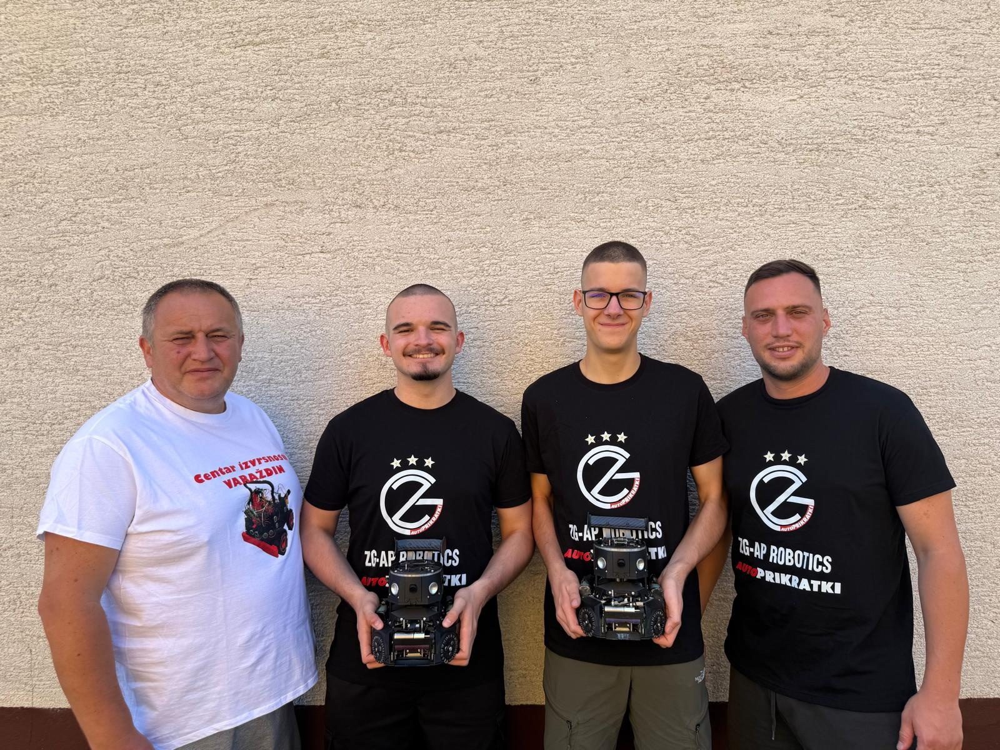

## Members & Roles

*What are the names of the team members and their role(s)?*

Ivan Perko: Team Captain, Lead Programmer, Electrical Design
Franko Prikratki: Mechanical Design, Materials and Manufacturing, DJ

## Meeting Frequency

*How often did your team meet?
(e.g. 90 minutes once per week or a day every weekend.)*

We met every weekend and worked during the week

## Meeting Place

*Where did you meet to work on your robot?
(e.g. a robotics room at school, at some other place, one of your homes, school library etc.)*

We met at the robotics club in school.

## Start Date

*When did your team start working on this year's robot?*

October 2025

## Past Competitions

*Which RoboCupJunior competitions have you competed in and in which leagues?*

European Championship 2023: 1v1 Soccer Entry Standard Kit
World Championship 2023: Lightweight League
European Championship 2024: Lightweight League
World Championship 2024: Lightweight League
Robocup Americas 2025: Lightweight League
European Championship 2025: Lightweight League/Open League
World Championship 2025: Lightweight League/Open League
RCAP 2025: Lightweight League/Open League
Domestic competition 2025: Open League

## Mentor Contribution

*Which parts of your work received the most contribution from your mentor?*

Our mentor helped mostly in the theoretical aspect such as planning and strategy.

## Workload Management

*How did you manage the workload?*

We communicated through a WhatsApp group and assigned tasks among ourselves. At the end of each week, we would meet to combine and test everything we had completed.

## AI Tools

*Which AI tools did you use?*

We used ChatGPT and Perplexity

## Robot1 Overall

*Robot 1 Overall View*

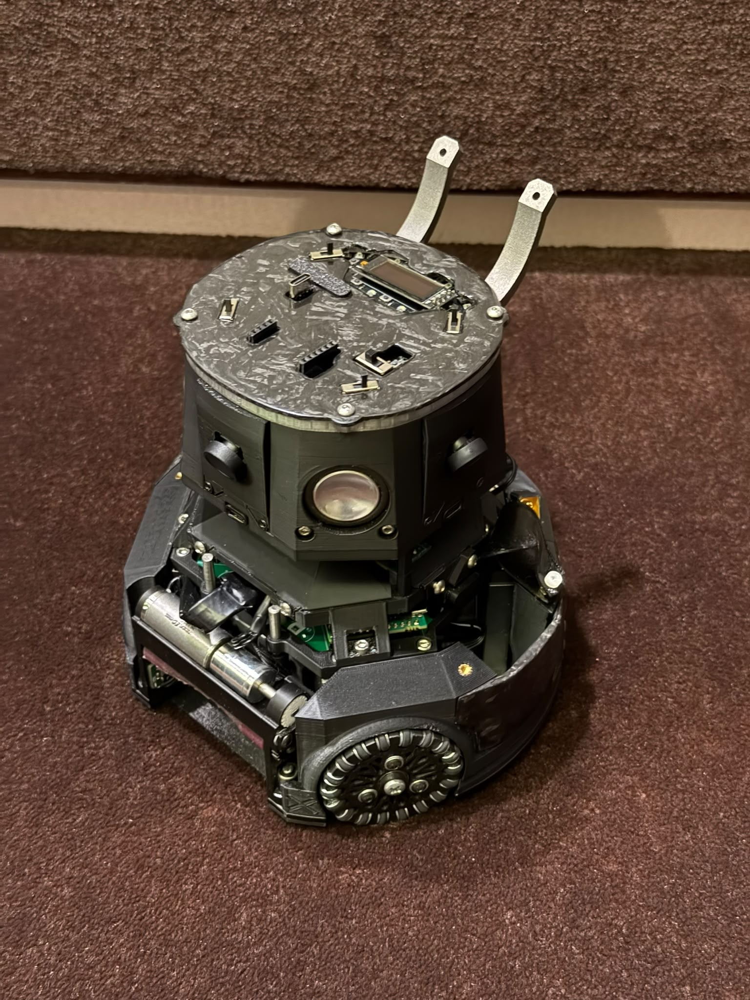

## Robot1 Front

*Robot 1 Front view*

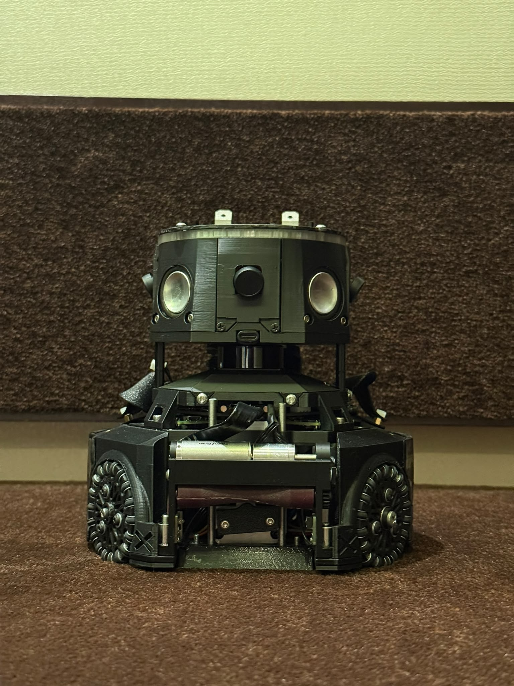

## Robot1 Back

*Robot 1 Back view*

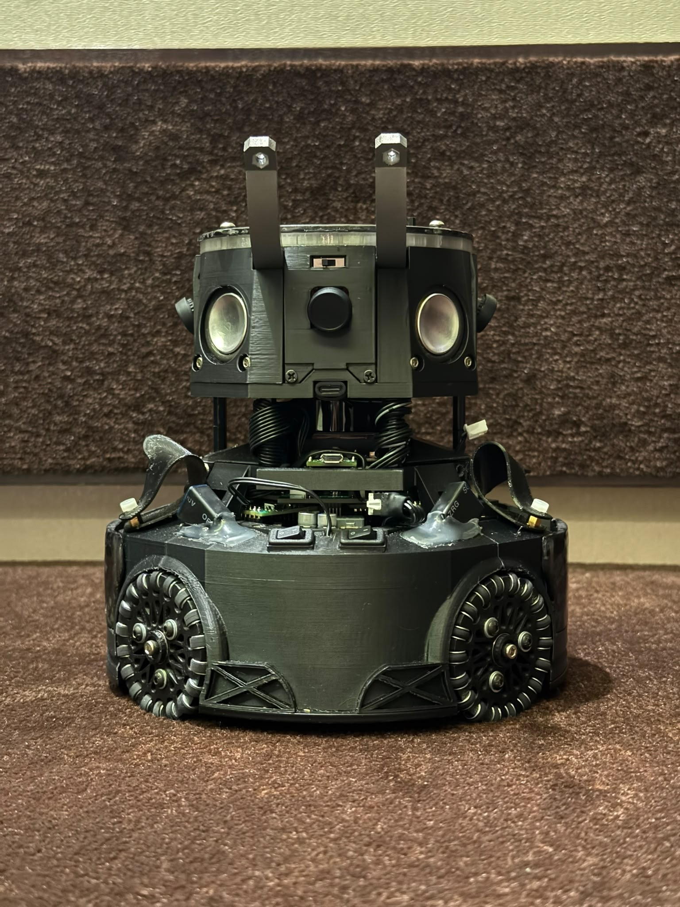

## Robot1 Top

*Robot 1 Top View*

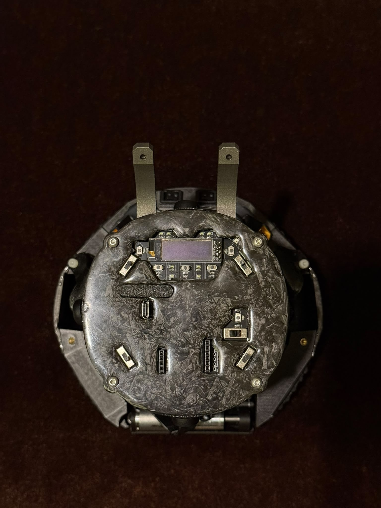

## Robot1 Bottom

*Robot 1 Bottom View*

## Robot1 Right

*Robot 1 Right View*

## Robot1 Left

*Robot 1 Left View*

## Robot2 Overall

*Robot 2 Overall View*

## Robot2 Front

*Robot 2 Front view*

## Robot2 Back

*Robot 2 Back view*

## Robot2 Top

*Robot 2 Top View*

## Robot2 Bottom

*Robot 2 Bottom View*

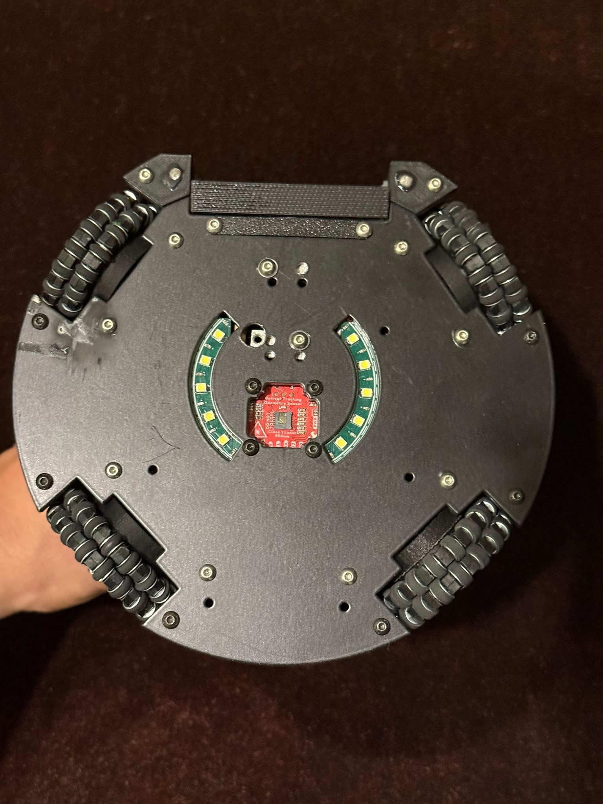

## Robot2 Right

*Robot 2 Right View*

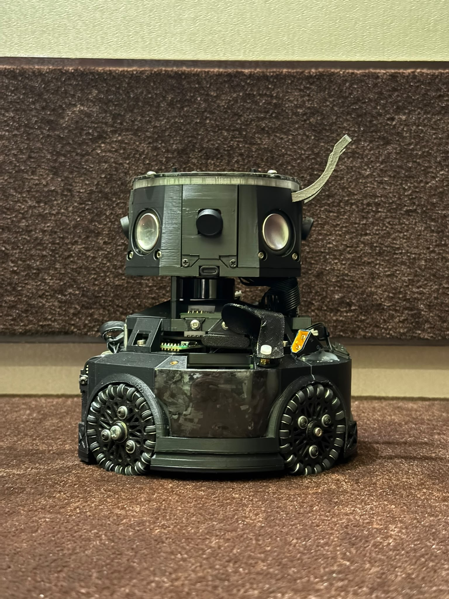

## Robot2 Left

*Robot 2 Left View*

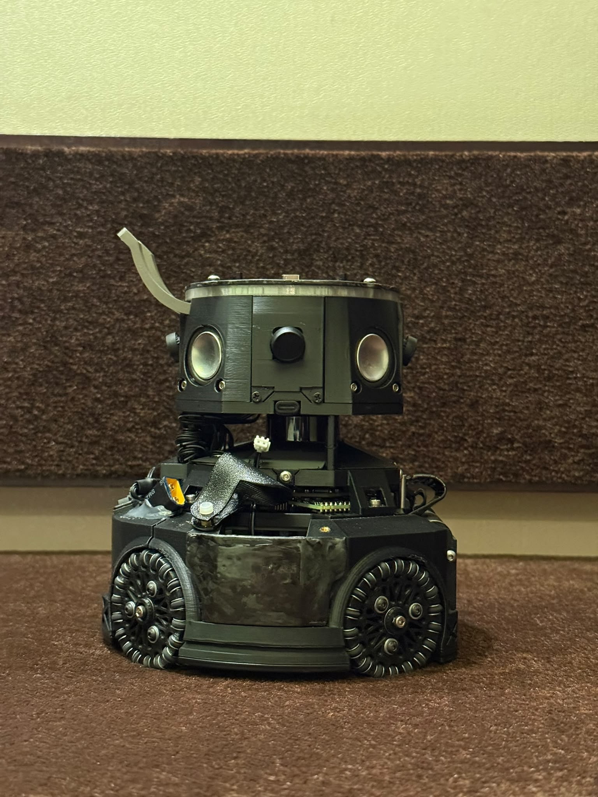

## Mechanical Design

*How did you design the mechanical parts of your robots?*

For the robot’s mechanical parts we used Fusion 360 and SolidWorks, iterating on an older design to improve performance, such as increasing space for the kicker and lowering the center of gravity. We aimed to use metals like aluminum and steel, but limited machining options in Croatia allowed only two aluminum motor holders and two steel chassis. Most design iterations focused on adjusting wheel rods for a precise fit with motor holders and bearings.

## Build Method

*How did you build your design?*

The robot was built using multiple methods. Bambu Lab P1S and X1C printers produced 3D parts and PAHT-CF gears. Precision components were CNC machined. The steel chassis was laser cut and coated, while PCBs were made and assembled by JLCPCB.

## Motors & Reason

*How many motors have you used and why?*

The robot uses a 4-wheel omni drive with a custom layout—rear motors at 90° and front at 120°—providing space for the dribbler and kicker without losing agility. Inspired by SSL designs, it balances speed and maneuverability. Wheels use 3D printed layers with rubber rollers and washers for smooth, durable rotation. Motors are Maxon EC 45 flat (30 W), driven by ESCON 24/2 controllers.

## Kicker Design

*If your robot has a kicker, explain how you designed and built the mechanics of the kicker*

Our kicker uses a PETG core inside an aluminum frame, with 1 mm enamelled copper wire wound in 4 turns. The plunger and spring were reused. The frame is assembled with brass spacers and M3 screws, while a threaded aluminum shaft slides along a PETG guide for stability.

## Dribbler Design

*If your robot has a dribbler, explain how you designed and built the mechanics of the dribbler.*

The dribbler, developed over six months and inspired by SSL designs, uses a PETG body with a 1:1 gear system and PAHT-CF gears. A silicone roller centers the ball, while a four-rod suspension with linear bearings allows vertical movement for impact absorption and consistent contact.

## CAD Files

*CAD design files*

https://github.com/BorutPatcev/ZG24_Robotics

## Mechanical Innovation

*Mechanical Innovation*

This year, we are most proud of our mechanical design, PCBs, and vision system. By lowering the motors and introducing a new inner gear system, we reduced the center of gravity, greatly improving stability and performance at high speeds. The aluminum–PETG gear setup and metal motor holders created more space for the kicker and electronics. We upgraded to OpenMV AE3 cameras and replaced Teensy boards with STM32, enabling cleaner, more compact PCB designs.

## Mechanical Photos

*Photos of your mechanical designs highlights*

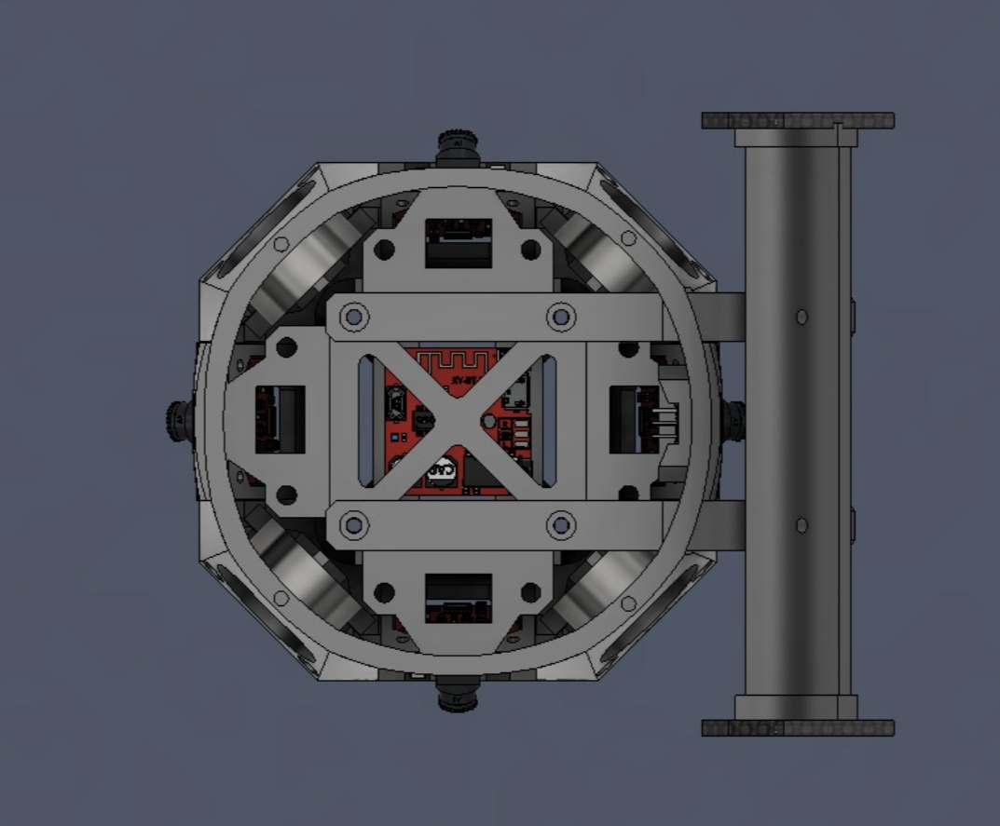
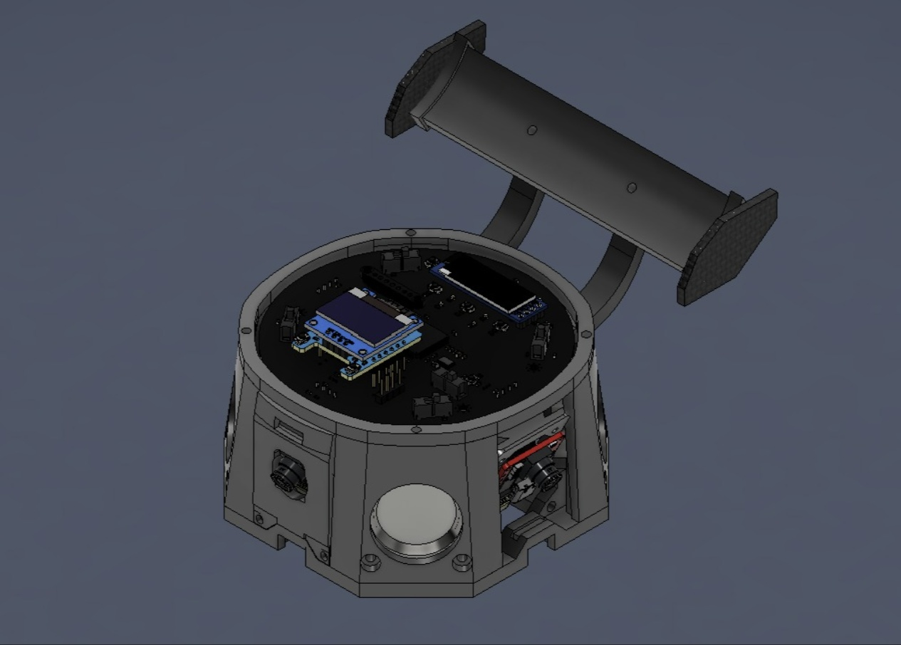
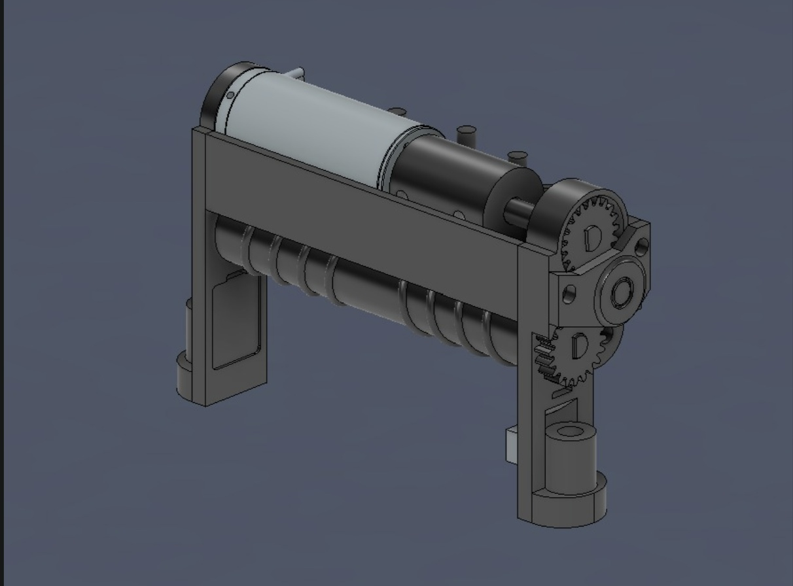
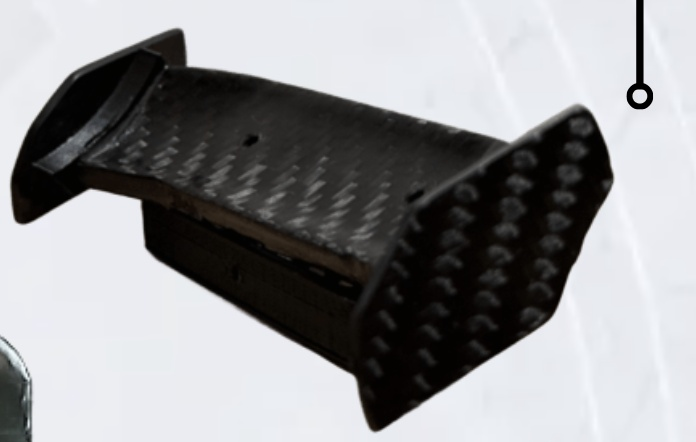

## Electronics Block Diagram

*Provide us with a block diagram of your robot's electronics*

[https://drive.google.com/open?id=1eWqu3TE9sBuWk9fM3GM98hxvKTQmKrBE](https://drive.google.com/open?id=1eWqu3TE9sBuWk9fM3GM98hxvKTQmKrBE)

## Power Circuit

*How does your power circuits work?*

The robot operates on 48V, 24V, 5V, and 3.3V rails. Two 3S LiPos in series supply 24V to the motor driver PCB, which powers motors and steps down to 5V and 3.3V. The kicker PCB boosts 24V to 48V, while other systems use 5V and 3.3V.

## Motor Drive Circuit

*How do you drive your motors? Explain the circuits you use for that*

We use: ESCON Module 24/2, 2/6 A, 10–24 VDC, PN: 466023 with closed loop control built in.

## Microcontroller & Reason

*What kind of micro controller or board do you use for your robot? Why did you decide to use this part for your robot? If you have more than 1 processor, explain each one separately.*

The robot uses five microcontrollers distributed across three PCBs. An STM32G4 on the Line/Kicker board manages line sensors, odometry, and the kicker system. A second STM32G4 on the main PCB processes 360° LiDAR data and performs localization, forwarding results to a Teensy 4.0, which handles movement and the main control loop. An STM32H7 on the top interface PCB processes and fuses data from four cameras to track the ball and estimate its position.

## Motor Control

*How do you use your processor to move your motors?*

Robot movement uses a universal go() function with speed, angle, and rotation inputs. Motor speeds are calculated, scaled if limits are exceeded, and ramped for smooth motion. Final values are sent via 12-bit PWM to ESCON drivers, which handle closed-loop control.

## Ball Detection

*How does your ball detection sensors and/or camera[s] work?*

Ball detection is performed using four OpenMV AE3 cameras positioned at 90° intervals. Each camera runs an optimized blob detection algorithm with a restricted ROI and carefully tuned parameters to maximize performance, achieving around 100 FPS. Data is transmitted via UART to an STM32H7, which performs camera fusion by combining overlapping detections and refining ball and goal position estimates before sending the final data to the Teensy.

## Line Detection

*How does your line detection circuits work?*

Line detection uses 12 ALS-PT19 sensors in a circular array with LEDs, multiplexed via CD4051 and read by an STM32G4. When a line is detected, data is sent to the Teensy, which uses odometry to drive back toward the field center, improving reliability and allowing slight out-of-bounds reach.

## Navigation/Position Sensors

*What sensors do you use for navigation and how are these sensors connected to your processor? What sensors do you use to find your position in the field? What about the direction your robot faces?*

The Robot uses a SparkFun OTOS odometry sensor, a 360° LiDAR with STM32G4, and a BNO055 IMU. Odometry gives accurate XY tracking but drifts at high speeds and is relative to the start. LiDAR provides absolute position using field boundaries, but is less reliable during fast motion. Combined, they ensure stable localization. IMUs are compared to reduce drift and improve heading accuracy.

## Kicker Circuit

*How do you drive your kicker system? How does the circuit make the kicker work?*

The kicker uses a boost and discharge stage. An LM51551 boosts 24V to 48V and charges four 2200µF capacitors. A high-power NMOS then discharges into a solenoid for the kick. All is on one PCB with the line sensors.

## Dribbler Circuit

*How does your dribbler system work? What components and circuits did you use to drive it?*

The dribbler uses a Maxon EC-max 16 (8W) motor driven by an ESCON 24/2. A 1:1 PAHT-CF gear set spins a silicone roller at ~12,000 RPM. A linear suspension with four bearings allows vertical movement for better ball control. An IR light barrier detects ball capture reliably with reduced noise.

## Schematics

*Schematics of your robot*

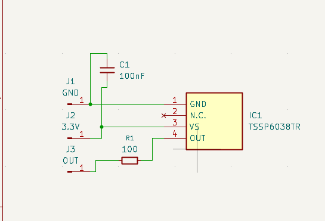
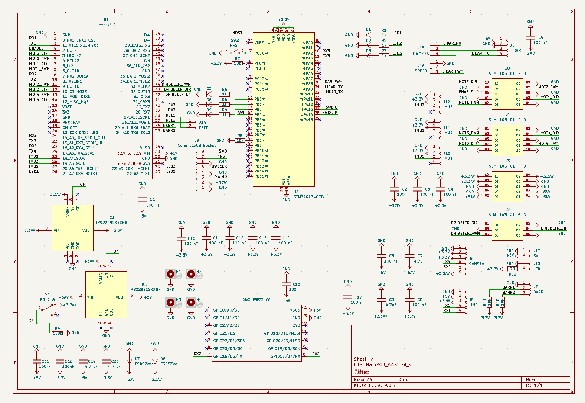
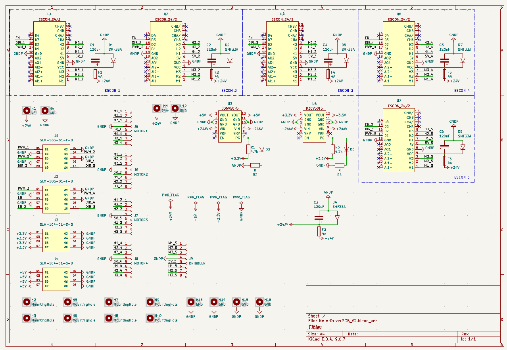
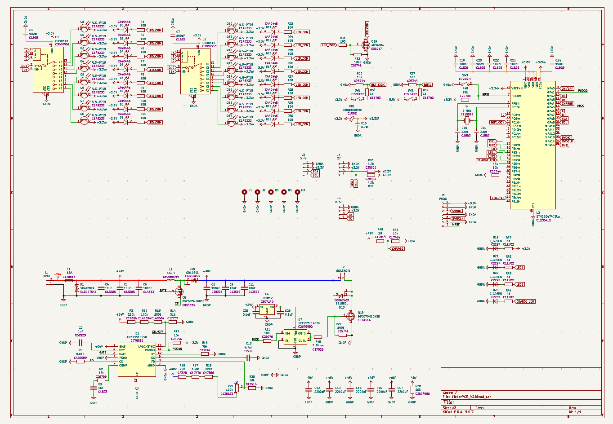

## PCB

*PCB of your robot*

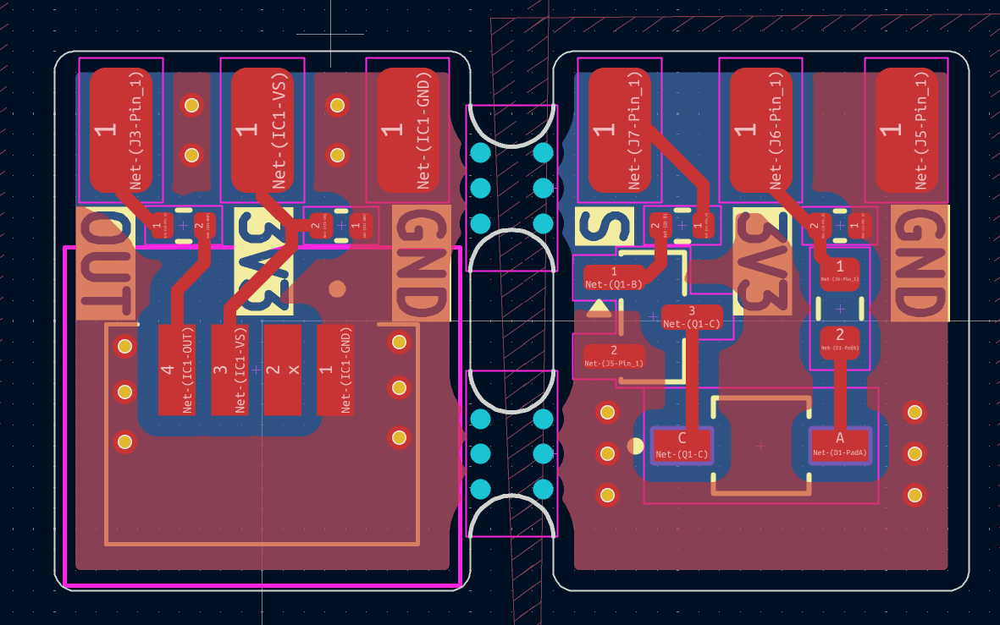
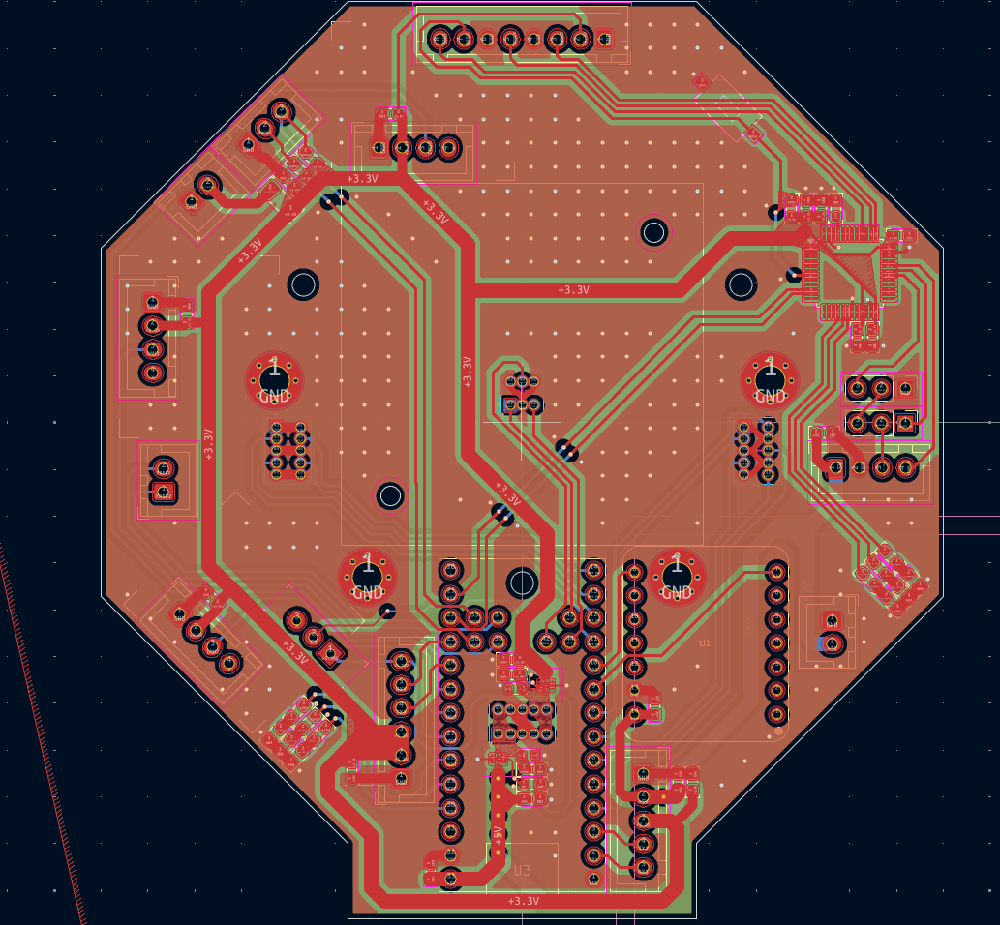
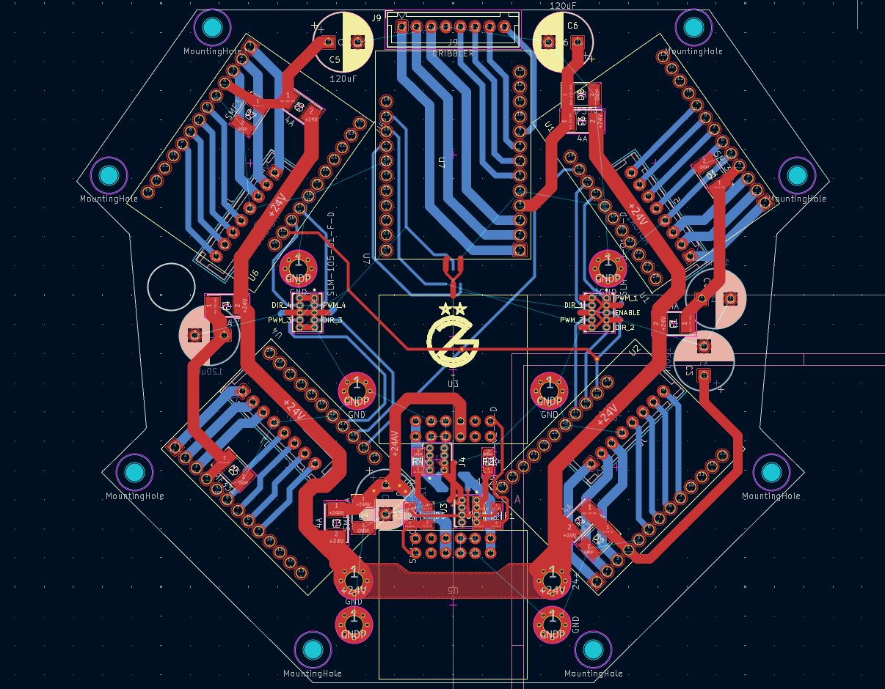
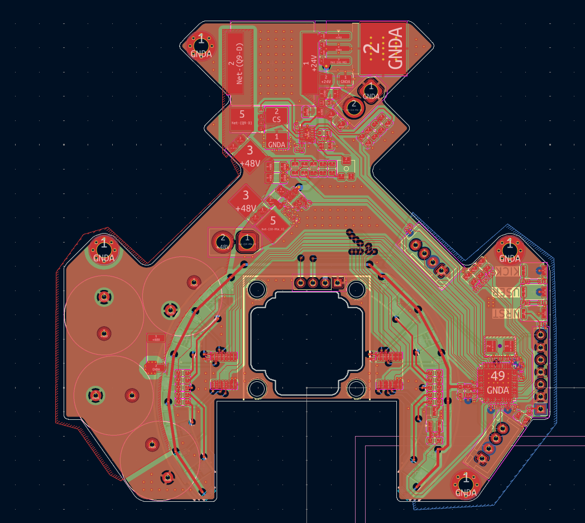

## Electronics Innovation

*Electronics Innovations*

We are particularly proud of our STM32-based PCBs. This year marked our transition from the Teensy 4.0 microcontrollers we had used in previous seasons to STM32 microcontrollers. The switch enabled us to develop more advanced, feature-rich, and professionally designed PCBs, significantly improving both the functionality and overall quality of our electronics.

## Circuit Photos

*Photo of your circuit boards highlights*

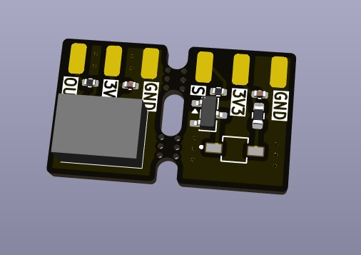
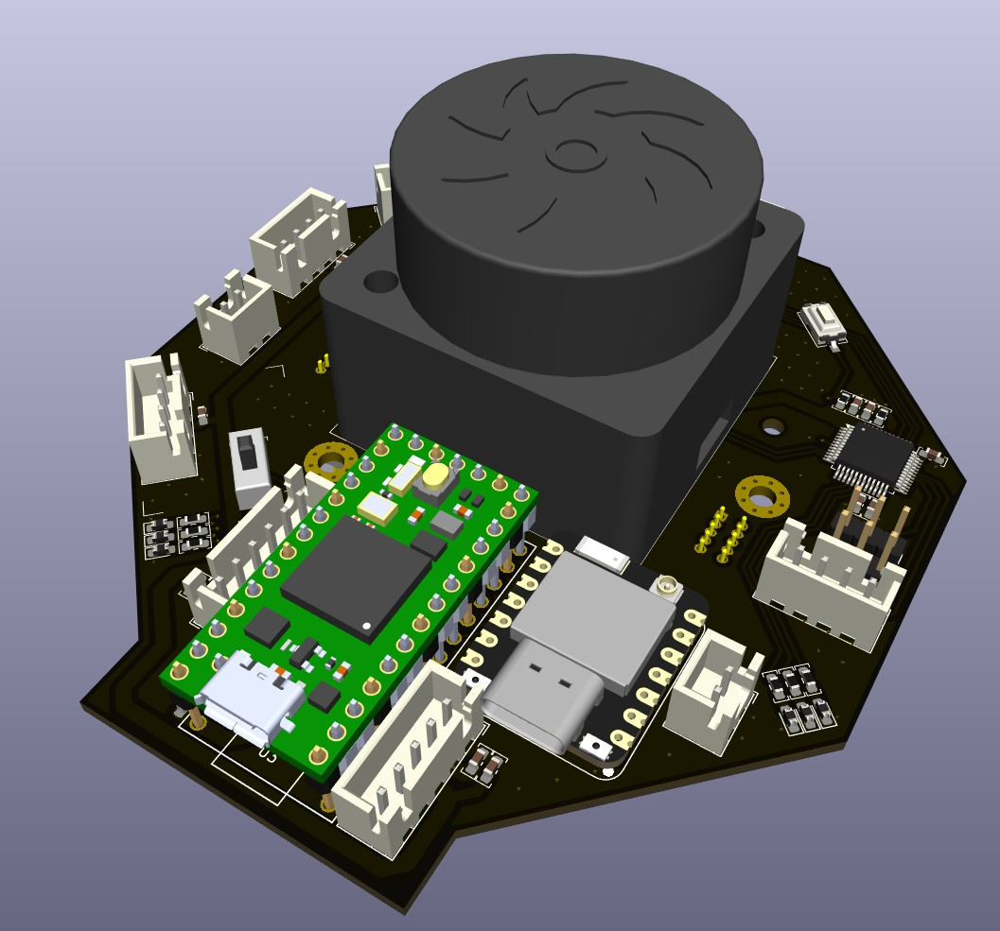
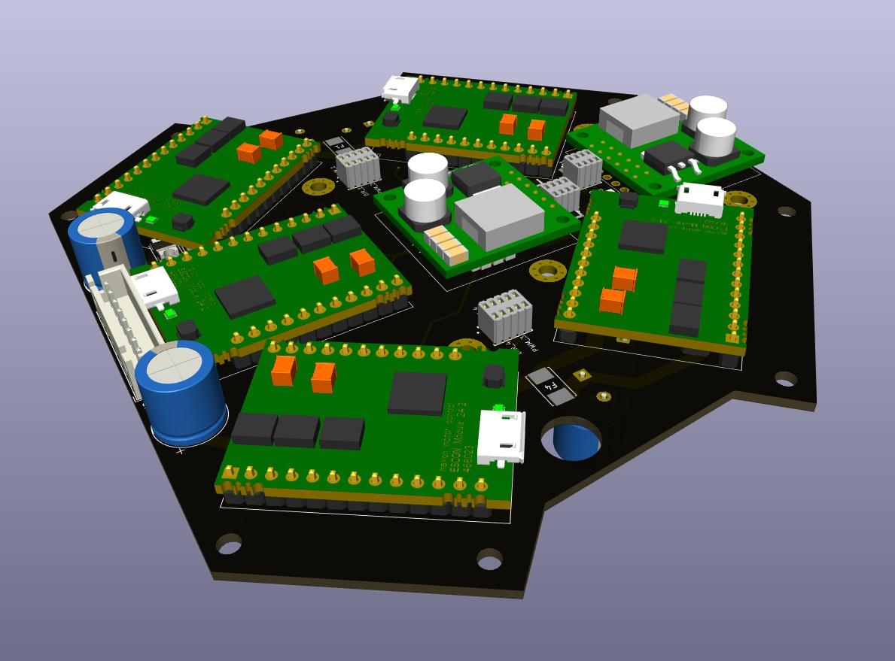
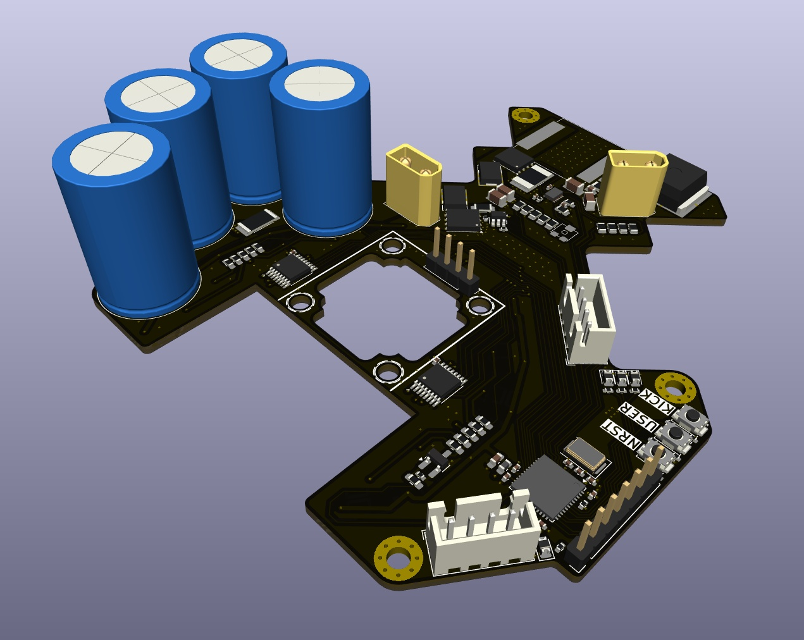

## Ball Detection Method

*How do you find where the ball is? How do you read the data from the ball detection sensors and/or camera?*

We use a 360° four-camera system to detect the ball. Each camera runs blob detection and sends the ball’s X/Y coordinates via UART to the STM32H7. The STM32 identifies the source camera, applies angle correction, and estimates the ball’s position using data from one or more cameras. This ensures accurate real-time localization for movement and decision-making

## Ball Catch Algorithm

*How does your algorithm work to catch the ball? Is there a difference between your robots in how they move towards the ball? Explain the differences.*

The robot uses a switch-case structure. When it doesn't have the ball, it enters a searching state, scanning the field with its 360° vision. Once the ball is detected, it navigates toward it. As it approaches, the dribbler is activated to capture the ball efficiently. This ensures a quick transition from detection to possession for responsive gameplay.

## Positioning Algorithm

*How do you use your sensors in your algorithm to find your position inside the field and how do you use that position to move your robots around?*

Using odometry and LIDAR, the robot always knows its position relative to the field center. When line sensors detect a boundary, it immediately drives toward the center. In some cases, LIDAR alone is used to measure wall distance—if too close, the robot assumes it's near a line and adjusts. This simple dual-method approach ensures reliable field containment with minimal sensor dependency.

## Line Algorithm

*How does your robot find the lines to stay inside the field? What algorithms do you use to avoid going out of bounds?*

The robot has a Line PCB that has 12 ambient light ALS-PT19 sensors and a set of bright LEDs in between them. The bright lines reflect the light, and the dark green carpet doesn't, and that's how the stm32 detect if there is a line underneath the robot.

## Goal Algorithm

*What algorithms do you use to score goals? How do you use your kicker and dribbler to handle the ball?*

The robot adapts its goal-scoring based on where it captures the ball: Center of the field → Straight kick with basic aiming. Sidelines → Drags the ball toward the opponent’s goal or performs a spin kick if close. Opponent’s side (goal/front/corners) → Activates dribbler, aligns, and shoots directly. This flexible logic ensures effective scoring from any field position.

## Defense Algorithm

*What algorithms do you use to avoid the opponent team scoring? How do your robots defend your own goal?*

When the ball isn’t visible, the goalie waits just outside the penalty area while scanning the field. Once the ball is detected, it tracks it in an arc in the shape of the goal area. LIDAR detects opponents hiding the ball, allowing the goalie to quickly block hidden-ball tactics. This enables both reactive and proactive defense.

## Robot Communication

*Do your robots communicate with each other? How do you use this communication to your advantage?*

Our robots use Seeed XIAO ESP32-C6 modules with ESP-NOW to exchange presence, state, and ball position via UART. Based on this, they dynamically switch roles between goalkeeper and attacker. Ball position data will soon enable one robot to guide the other when the ball is hidden, laying the groundwork for advanced teamwork.

## Software Innovation

*Software Innovations*

In the software area, the robot's strategy and playstyle is having the same principle, to be as simple and as effective as possible. The major software improvement would be offloading the main CPU to the sub MCUs, improving the overall speed of the robots decisions. Each MCU has a smaller task to do, and the main MCU only does the big decision making. Also, the LiDAR navigation algorithm is a piece of software we are most proud of this year, since it is the first time we are using the LIDAR.

## GitHub Link

*GitHub link*

https://github.com/BorutPatcev/ZG24_Robotics

## BOM

*Bill of Materials (BOM)*

[https://drive.google.com/open?id=1H5uNARs-bwIAn_bSiZBS9cnZltHaeYJr](https://drive.google.com/open?id=1H5uNARs-bwIAn_bSiZBS9cnZltHaeYJr)

## Cost

*How much did it cost you to build your robots?*

2515 EUR per robot, 500 EUR trial and error, 1000 EUR environment. 1 EUR = 1.138 USD

## Funding

*How did you gathered the funds to build the robots?*

90% Sponsors, 10% parents

## Affordability

*How affordable was it to compete in RoboCupJunior Soccer?*

4

## Answer Check

*Have you checked all of your answers?*

Yes!

## Publication Consent

*We publish TDPs and posters during or after the competition as described in the beginning*

Yes, we acknowledge everything submitted in the above form can be published.

